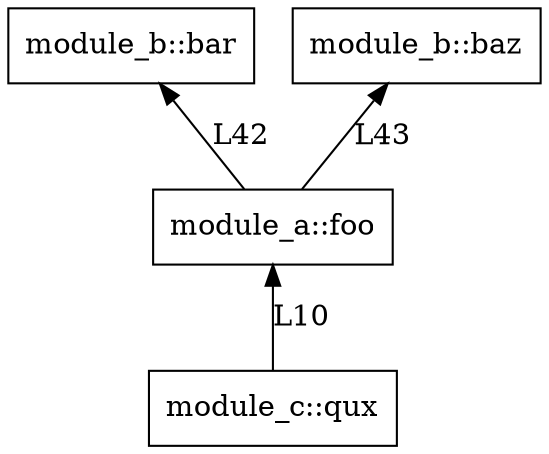
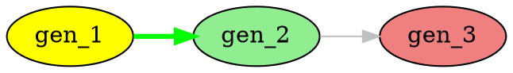

# Graphviz Integration Plan — Touring v30.3.0

> **Created**: 2026-04-30 | **Status**: PLANNED | **Author**: TACO Wave | **Priority**: L4+
> **Analysis Source**: `https://gitlab.com/graphviz/graphviz/` + Touring codebase survey (9+ crates com petgraph)

---

## 1. Resumo Executivo

**Objetivo**: Integrar capacidades de visualização Graphviz/DOT no Touring para transformar grafos internos (call graphs, wiring graphs, ACO graphs) em saídas visuais SVG/PNG/DOT.

**Motivação**: Touring usa `petgraph` em 9+ crates para estruturas de grafos, mas **não tem capacidade de visualização nativa**. Graphviz oferece:
- 10 algoritmos de layout (dot, neato, fdp, sfdp, circo, twopi, patchwork, osage, nop, nop2)
- Linguagem DOT para serialização declarativa
- API C rica com atributos em 3 níveis (grafo, nó, aresta)
- Output SVG/PNG/JSON via gvc

**Arquitetura proposta**: Criar 2 novos crates + extending 3 crates existentes:

```
touring-graph-core/          # Core traits e types (NOVO)
touring-graph-viz/          # Visualização DOT (NOVO)  
touring-learning/            # Extender MutableGeneratorGraph (EXISTENTE)
touring-ast/                # Extender CallGraph (EXISTENTE)
touring-hooks/              # Extender WiringGraph (EXISTENTE)
```

---

## 2. Deliverables

### D1 — `touring-graph-core` crate (NEW)

**Escopo**: Tipos core para grafos com atributos.

| Arquivo | Conteúdo |
|---------|----------|
| `src/lib.rs` | Module exports |
| `src/error.rs` | `GraphVizError`, `DotParseError`, `LayoutError` |
| `src/attributes.rs` | `NodeAttributes`, `EdgeAttributes`, `GraphAttributes` |
| `src/layout.rs` | `LayoutEngine` enum (Dot, Neato, Fdp, Sfdp, Circo, Twopi, Patchwork, Osage, Nop, Nop2) |
| `src/cluster.rs` | `DotCluster`, `Rank` enum |

**Dependencies**: `serde`, `thiserror`

**T-shirt**: M

#### `src/attributes.rs` — Tipos de Atributo

```rust
// Dot node shapes
#[derive(Debug, Clone, Copy, PartialEq, Eq, Serialize, Deserialize)]
pub enum Shape {
    Box, Diamond, Ellipse, Circle, PlainText,
    Triangle, InvTriangle, Pentagon, Hexagon, Septagon, Octagon,
}

#[derive(Debug, Clone, Copy, PartialEq, Eq, Serialize, Deserialize)]
pub enum ArrowType {
    Normal, Inv, Dot, InvDot, Diamond, InvDiamond, Tee, None,
}

#[derive(Debug, Clone, Default, Serialize, Deserialize)]
pub struct NodeAttributes {
    pub label: Option<String>,
    pub shape: Option<Shape>,
    pub color: Option<String>,
    pub fillcolor: Option<String>,
    pub fontname: Option<String>,
    pub fontsize: Option<u32>,
    pub style: Option<String>,
    pub tooltip: Option<String>,
    pub url: Option<String>,
}

#[derive(Debug, Clone, Default, Serialize, Deserialize)]
pub struct EdgeAttributes {
    pub label: Option<String>,
    pub color: Option<String>,
    pub style: Option<String>,
    pub weight: Option<f64>,
    pub arrowhead: Option<ArrowType>,
    pub arrowtail: Option<ArrowType>,
}

#[derive(Debug, Clone, Default, Serialize, Deserialize)]
pub struct GraphAttributes {
    pub rankdir: Option<RankDir>,
    pub splines: Option<Splines>,
    pub nodesep: Option<f64>,
    pub ranksep: Option<f64>,
    pub compound: Option<bool>,
    pub bgcolor: Option<String>,
    pub fontname: Option<String>,
    pub fontsize: Option<u32>,
    pub node_attrs: NodeAttributes,
    pub edge_attrs: EdgeAttributes,
}
```

#### `src/cluster.rs` — Clustering

```rust
#[derive(Debug, Clone, Serialize, Deserialize)]
pub struct DotCluster {
    pub name: String,
    pub label: Option<String>,
    pub color: Option<String>,
    pub style: Option<String>,
    pub nodes: Vec<String>,
    pub subgraphs: Vec<DotCluster>,
    pub rank: Option<Rank>,
}

#[derive(Debug, Clone, Copy, PartialEq, Eq, Serialize, Deserialize)]
pub enum Rank {
    Same,
    Source,
    Sink,
    Min,
    Max,
}
```

---

### D2 — `touring-graph-viz` crate (NEW)

**Escopo**: Serialização DOT e renderização.

| Arquivo | Conteúdo |
|---------|----------|
| `src/lib.rs` | Module exports + re-exports de touring-graph-core |
| `src/dot_export.rs` | `DotExport` trait + implementações para CallGraph, MutableGeneratorGraph, WiringGraph |
| `src/dot_escape.rs` | DOT string escaping utilities |
| `src/layout_cli.rs` | Graphviz CLI wrapper (opcional, requer `graphviz` binário) |
| `src/svg_renderer.rs` | SVG generation helpers |

**Dependencies**: `touring-graph-core`, `touring-learning`, `touring-ast`, `touring-hooks`

**T-shirt**: L

#### `src/dot_export.rs` — Trait Central

```rust
use touring_graph_core::{GraphAttributes, NodeAttributes, EdgeAttributes};

pub trait DotExport {
    fn to_dot(&self) -> String;
    fn to_dot_with_attrs(&self, attrs: &GraphAttributes) -> String;
}

impl DotExport for CallGraph {
    fn to_dot(&self) -> String {
        // digraph com nós = funções, edges = calls
        // nós com shape=box, cor por file
    }
}

impl DotExport for MutableGeneratorGraph {
    fn to_dot(&self) -> String {
        // digraph com nós = generators
        // cor por execution_status (pending=yellow, done=green, failed=red)
    }
}
```

#### `src/layout_cli.rs` — Graphviz CLI Wrapper

```rust
#[derive(Debug, Clone)]
pub struct GraphVizCli {
    bin_path: PathBuf,
}

impl GraphVizCli {
    pub fn new() -> Option<Self> {
        which("dot").ok().map(|bin_path| Self { bin_path })
    }

    pub fn render_svg(&self, dot: &str, layout: LayoutEngine) -> Result<String> {
        let output = Command::new(&self.bin_path)
            .args(["-K", layout.to_dot_key(), "-Tsvg"])
            .stdin(Stdio::piped())
            .stdout(Stdio::capture())
            .output()?;
        Ok(String::from_utf8_lossy(&output.stdout).into_owned())
    }

    pub fn render_png(&self, dot: &str, layout: LayoutEngine) -> Result<Vec<u8>> {
        // Similar
    }
}
```

---

### D3 — Extender `CallGraph` em `touring-ast` (EXISTING)

**Arquivo**: `crates/touring-ast/src/call_graph.rs`

**Changes**:
1. Adicionar `use touring_graph_viz::DotExport;`
2. Implementar `DotExport` para `CallGraph`
3. Adicionar método `to_dot()` em `impl CallGraph`

**T-shirt**: S

```rust
impl DotExport for CallGraph {
    fn to_dot(&self) -> String {
        let mut s = String::from("digraph callgraph {\n");
        s.push_str("  rankdir=BT;\n");
        s.push_str("  node [shape=box];\n");

        // Group by file for coloring
        let mut files: HashSet<&str> = HashSet::new();
        for site in &self.sites {
            // Extract file from caller (format: "file::function")
            if let Some(file) = site.caller.split("::").next() {
                files.insert(file);
            }
        }

        for site in &self.sites {
            let caller_escaped = escape_dot(&site.caller);
            let callee_escaped = escape_dot(&site.callee);
            s.push_str(&format!(
                "  \"{}\" -> \"{}\" [label=\"L{}\"];\n",
                caller_escaped, callee_escaped, site.line
            ));
        }

        s.push_str("}\n");
        s
    }
}
```

---

### D4 — Extender `MutableGeneratorGraph` em `touring-learning` (EXISTING)

**Arquivo**: `crates/touring-learning/src/aco/graph.rs`

**Changes**:
1. Adicionar `use touring_graph_viz::DotExport;`
2. Implementar `DotExport` para `MutableGeneratorGraph`
3. Usar `execution_status` para cores (pending=yellow, done=green, failed=red, running=lightblue)
4. Usar `pheromone` para edge weight/opacity

**T-shirt**: S

---

### D5 — Extender `WiringGraph` em `touring-hooks` (EXISTING)

**Arquivo**: `crates/touring-hooks/src/wiring.rs`

**Changes**:
1. Adicionar `use touring_graph_viz::DotExport;`
2. Implementar `DotExport` para `WiringGraph`
3. Usar `ModuleWiringStatus` para cores (wired=green, orphan=red, partial=orange)

**T-shirt**: S

---

### D6 — CLI `touring graph` commands (NEW)

**Arquivo**: `crates/touring-server/src/cli/graph_viz.rs` (ou em `touring-hooks`)

**Commands**:

| Command | Description |
|---------|-------------|
| `touring graph call-graph <target>` | Generate DOT from CallGraph |
| `touring graph wiring [--module <name>]` | Generate DOT from WiringGraph |
| `touring graph generator [--status <status>]` | Generate DOT from MutableGeneratorGraph |
| `touring graph visualize --layout <dot\|neato\|circo>` | Render to SVG via Graphviz CLI |
| `touring graph export --format <dot\|json>` | Export graph in specified format |

**T-shirt**: M

---

### D7 — E2E Tests

**Testes Required**:

| Test | Location | Coverage |
|------|----------|----------|
| `test_call_graph_to_dot` | `touring-ast/tests/dot_export.rs` | Verifica DOT output válido |
| `test_generator_graph_to_dot` | `touring-learning/tests/dot_export.rs` | Verifica status colors |
| `test_wiring_graph_to_dot` | `touring-hooks/tests/dot_export.rs` | Verifica orphan highlighting |
| `test_dot_escape_handles_special_chars` | `touring-graph-viz/tests/` | Strings especiais em node IDs |
| `test_graphviz_cli_svg_generation` | `touring-graph-viz/tests/` | CLI wrapper (requires graphviz) |
| `test_layout_engines` | `touring-graph-viz/tests/` | Testa dot, neato, circo output |

**T-shirt**: M

---

### D8 — Documentação

**Arquivos**:
- `docs/graphviz-integration.md` — Overview da integração
- `docs/dot-language-reference.md` — Referência DOT para usuários
- Update `SKILL.md` com novo comando `touring graph`

**T-shirt**: S

---

## 3. Dependências e Grafo de Dependência

```
D1 (touring-graph-core)
    └── Nenhuma dependência interna (pure)

D2 (touring-graph-viz)
    ├── D1 (touring-graph-core)
    ├── touring-learning (para MutableGeneratorGraph)
    ├── touring-ast (para CallGraph)
    └── touring-hooks (para WiringGraph)

D3 (touring-ast extensor)
    ├── D1
    └── D2 (para trait DotExport)

D4 (touring-learning extensor)
    ├── D1
    └── D2 (para trait DotExport)

D5 (touring-hooks extensor)
    ├── D1
    └── D2 (para trait DotExport)

D6 (CLI commands)
    └── D2 (touring-graph-viz)

D7 (Tests)
    ├── D2
    ├── D3
    ├── D4
    └── D5

D8 (Docs)
    └── Todos
```

**Ordem de implementação**: D1 → D2 → D3 → D4 → D5 → D6 → D7 → D8

---

## 4. Timeline e Estimativas

| Deliverable | T-shirt | Dependencies | Sequência |
|-------------|---------|--------------|-----------|
| D1: touring-graph-core | M | None | 1 |
| D2: touring-graph-viz | L | D1 | 2 |
| D3: touring-ast extender | S | D1, D2 | 3 |
| D4: touring-learning extender | S | D1, D2 | 3 (parallel with D3) |
| D5: touring-hooks extender | S | D1, D2 | 3 (parallel with D3, D4) |
| D6: CLI commands | M | D2 | 4 |
| D7: E2E tests | M | D2, D3, D4, D5 | 5 |
| D8: Documentation | S | All | 6 |

**Total estimado**: ~3-4 dias de engenharia

---

## 5. Validação e Gates

### Gate D1: Core types compile
```bash
cargo check -p touring-graph-core
```

### Gate D2: Viz crate compiles
```bash
cargo check -p touring-graph-viz
```

### Gate D3-D5: All extenders compile
```bash
cargo check -p touring-ast -p touring-learning -p touring-hooks
```

### Gate D6: CLI commands work
```bash
touring graph --help
```

### Gate D7: All tests pass
```bash
cargo test -p touring-graph-viz
cargo test -p touring-ast -- dot
cargo test -p touring-learning -- dot
cargo test -p touring-hooks -- dot
```

### Gate D8: Docs exist and are accurate
```bash
# Verify docs/ contains graphviz-integration.md
ls docs/graphviz*.md
```

---

## 6. Riscos e Mitigações

| Risk | Probability | Impact | Mitigation |
|------|-------------|--------|------------|
| Graphviz CLI não instalado | Medium | Low | CLI é opcional; fallbacks para DOT export |
| DOT escaping complex | Medium | Medium | Usar `escape_dot()` helper; test-driven |
| petgraph API instável | Low | Medium | Abstrair acesso interno; usar only public API |
| Performance com grandes grafos | Medium | Low | Streaming para DOT > 10k nodes |
| Conflicts com existing wiring | Low | High | Testar em branch separado primeiro |

---

## 7. Feature Flags

```toml
# touring-graph-viz/Cargo.toml
[features]
default = []
graphviz-cli = ["dep:which", "dep:assert_cmd"]
```

---

## 8. Output Examples

### CallGraph → DOT


### MutableGeneratorGraph → DOT (with colors)


### WiringGraph → DOT (with clusters)
```dot
digraph wiring {
  subgraph cluster_touring-ast {
    label="touring-ast";
    color=blue;
    "CallGraph" [fillcolor=lightgreen];
    "ModuleTree" [fillcolor=lightgreen];
  }

  subgraph cluster_touring-learning {
    label="touring-learning";
    color=red;
    "MutableGeneratorGraph" [fillcolor=lightcoral];
  }

  "CallGraph" -> "ModuleTree" [style=dashed];
}
```

---

## 9. Arquitetura Detalhada

```
touring-graph-core/
├── Cargo.toml
└── src/
    ├── lib.rs              # pub use {attributes::*, layout::*, cluster::*, error::*};
    ├── error.rs            # GraphVizError enum
    ├── attributes.rs       # Node/Edge/Graph attributes
    ├── layout.rs           # LayoutEngine enum
    └── cluster.rs          # DotCluster, Rank

touring-graph-viz/
├── Cargo.toml
└── src/
    ├── lib.rs              # pub use dot_export::*; re-exports from touring-graph-core
    ├── dot_export.rs      # DotExport trait + implementations
    ├── dot_escape.rs      # DOT string escaping
    ├── layout_cli.rs      # Graphviz CLI wrapper
    └── svg_renderer.rs    # SVG helpers

crates/touring-ast/src/
├── call_graph.rs          # + impl DotExport for CallGraph
└── lib.rs                # + pub use touring_graph_viz::DotExport;

crates/touring-learning/src/aco/
└── graph.rs               # + impl DotExport for MutableGeneratorGraph

crates/touring-hooks/src/
└── wiring.rs             # + impl DotExport for WiringGraph
```

---

## 10. Alternativas Consideradas

| Alternativa | Razão de Rejeição |
|-------------|-------------------|
| Usar `gvedit` crate direto | Não existe crate maduro; melhor criar wrapper sobre CLI |
| Integrar graphviz C library via FFI | C library binding é complexo; CLI é mais simples e opcional |
| Usar `petgraph`DOT export existente | petgraph não tem; precisamos custom |
| Apenas gerar JSON | DOT é mais útil para interoperabilidade com ferramentas externas |

---

## 11. Custo-Benefício

| Aspect | Antes | Depois |
|--------|-------|--------|
| Visualização de grafos | Nenhuma | SVG/PNG/DOT via Graphviz |
| Debug de call graphs | Texto | Visual SVG |
| Debug de ACO graphs | Logs | Visual colorido por status |
| Wiring inspection | CLI text | Visual clusters |
| Interoperabilidade | Nenhuma | DOT export padrão |

**ROI**: Alto — visualização é capability fundamental para debugging e documentação de arquiteturas complexas.

---

## 12. Checklist de Implementação

- [ ] D1: Create `touring-graph-core` crate with attributes, layout, cluster, error
- [ ] D2: Create `touring-graph-viz` crate with DotExport trait and implementations
- [ ] D3: Implement `DotExport` for `CallGraph` in touring-ast
- [ ] D4: Implement `DotExport` for `MutableGeneratorGraph` in touring-learning
- [ ] D5: Implement `DotExport` for `WiringGraph` in touring-hooks
- [ ] D6: Add `touring graph` CLI commands
- [ ] D7: Add E2E tests for all DotExport implementations
- [ ] D8: Document integration in docs/
- [ ] All: Add to workspace Cargo.toml
- [ ] All: Run `cargo check --workspace`
- [ ] All: Run full test suite
