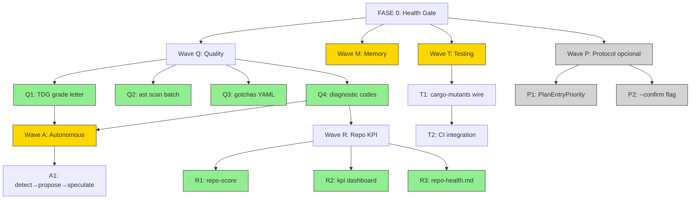

# Plano de Implementação — Waves Q + R + M + A + T + P

**Data**: 2026-04-24
**Autor**: TACO (Claude Code) sob autoridade de Gabriel Gadea
**Origem**: análise de PMAT 3.15.0 + agentic-coding-protocol 0.0.11 + ast-grep 0.42.1 + rs-hack 0.5.3
**Status**: PLANO — aguarda autorização Gabriel para execução
**Escopo**: 6 waves, 13 subtasks
**Estimativa total**: 22-34 dias sequencial / 12-18 dias com paralelismo
**Risco global**: BAIXO-MÉDIO (Wave A é alto-risco; Wave P é opcional)

---

## 0. Sumário Executivo

| Wave | Objetivo | Subtasks | Dias | ROI | Risco | Bloqueio |
|------|----------|----------|------|-----|-------|----------|
| **Q** | Quality intelligence | Q1, Q2, Q3, Q4 | 4-6 | ALTO | BAIXO | — |
| **R** | Repository KPI dashboard | R1, R2, R3 | 3-5 | ALTO | BAIXO | depende de Q4 (códigos) |
| **M** | Memory retrieval upgrade | M1, M2 | 2-4 | MÉDIO | BAIXO | — |
| **A** | Autonomous detect-propose loop | A1 | 5-7 | ALTO | ALTO | depende de Q1+Q4; **requer aprovação Gabriel** |
| **T** | Mutation testing wire | T1, T2 | 5-7 | MÉDIO | MÉDIO | — |
| **P** | Protocol extensions | P1, P2 | 3-5 | BAIXO | BAIXO | OPCIONAL |

**Princípio de execução**: Q+M+T podem rodar em paralelo (independentes). R depende de Q4. A depende de Q1+Q4. P é opcional e pode ser deferido indefinidamente.

**Hard constraints (CLAUDE.md)**:
- ZERO comandos git autônomos (Hard Rule #11)
- POTENCIALIZAR sempre (Regra #0) — nenhuma redução de escopo, orphan symbols devem ser wired
- Falhas loud, recuperação rápida (Princípio #5)
- 6 quality gates obrigatórios (Functional, Robust, Readable, Documented, Secure, No Regression)

---

## 1. DAG de Dependências



---

## 2. FASE 0 — Health Gate (Pré-Requisito)

**TODOS os waves DEVEM passar este gate antes de iniciar:**

```bash
cd /home/gabrielgadea/.claude/rust

# Gate 1: Compilation
cargo check --workspace 2>&1 | grep "^error\[" | wc -l
# Esperado: 0

# Gate 2: Daemon health
touring doctor -j | jq '.[] | select(.status != "ok")'
# Esperado: vazio (todos status=ok)

# Gate 3: Test baseline
cargo nextest run --profile ci --workspace 2>&1 | tail -5
# Esperado: 5100+ passed, 0 failed

# Gate 4: Wiring baseline
touring wiring orphans -j | jq '.orphan_count'
# Esperado: anota baseline (pode aumentar mas precisa justificar)

# Gate 5: Diagnostic codes baseline
touring status -j | jq '.gate_metrics | {pre_edit, query_cache_hit_ratio, rkyv_dispatch_count}'
# Esperado: ratio >= 0.5, dispatch > 0
```

**Se algum gate falhar**: STOP. Diagnose root cause. Não prosseguir.

---

## 3. Wave Q — Quality Intelligence (4-6 dias)

### Q1 — TDG Grade Letter (1.5 dias)

**Objetivo**: Adicionar grade letter (A+, A, B+, B, C+, C, D, F) ao output de `touring ast meta` baseado em fórmula composta de 6 dimensões ortogonais.

**Inspiração**: PMAT TDG (complexity, coverage, duplication, churn, entropy, fault annotations) → adaptado para Touring stack atual.

**Baseline atual** (verificado via scout):
- `crates/touring-ast/src/quality.rs` — `QualityReport { passes(threshold), summary() }`
- `crates/touring-analysis/src/quality/` — submódulos: `antipatterns`, `complexity`, `error_coverage`, `rust_semantic`, `security`, `test_proxy`, `unwrap_audit`
- `cli_ast_meta` em `crates/touring-hooks/src/cli_handlers.rs:4468`

**6 Dimensões (mapping Touring↔TDG)**:

| TDG (PMAT) | Touring equivalente | Source |
|------------|---------------------|--------|
| Complexity | `complexity::ComplexityMetrics` (CC + Halstead V/D/E) | `touring-analysis::quality::complexity` |
| Coverage | `error_coverage::ErrorCoverageReport` | `touring-analysis::quality::error_coverage` |
| Duplication | (NEW) `duplication_score` via `incremental_pipeline::content_hash` clusters | `touring-ast::incremental_pipeline` |
| Churn | (NEW) git log frequency over 90 days | `touring-hooks::evolution` |
| Entropy | `RustQualitySignals::semantic_complexity` | `touring-analysis::quality::rust_semantic` |
| Antipatterns | `antipatterns::AntiPatternHit` weighted | `touring-analysis::quality::antipatterns` |

**Entregáveis**:

1. **Novo módulo** `crates/touring-analysis/src/quality/tdg.rs`:
   ```rust
   pub struct TdgReport {
       pub complexity: f32,    // [0, 1] — normalized CC + Halstead
       pub coverage: f32,       // [0, 1]
       pub duplication: f32,    // [0, 1] — 1.0 = no dupes
       pub churn: f32,          // [0, 1] — 1.0 = stable
       pub entropy: f32,        // [0, 1]
       pub antipatterns: f32,   // [0, 1] — 1.0 = clean
       pub composite: f32,      // weighted average
       pub grade: TdgGrade,     // A+ to F
   }

   pub enum TdgGrade {
       APlus,   // composite >= 0.95
       A,       // [0.90, 0.95)
       BPlus,   // [0.85, 0.90)
       B,       // [0.80, 0.85)
       CPlus,   // [0.75, 0.80)
       C,       // [0.70, 0.75)
       D,       // [0.60, 0.70)
       F,       // < 0.60
   }

   impl TdgReport {
       pub fn from_file(path: &Path) -> Result<Self>;
       pub fn from_components(c: f32, cov: f32, d: f32, ch: f32, e: f32, ap: f32) -> Self;
       pub fn grade_letter(&self) -> &'static str;
       pub fn human_summary(&self) -> String;
   }
   ```

2. **Wiring em `cli_ast_meta`**: novo campo `tdg` no JSON output quando `--depth summary` ou `--depth full`.
   ```json
   {
     "file": "...",
     "language": "rust",
     "tdg": {
       "grade": "B+",
       "composite": 0.87,
       "complexity": 0.82,
       "coverage": 0.91,
       "duplication": 1.0,
       "churn": 0.78,
       "entropy": 0.85,
       "antipatterns": 0.95
     }
   }
   ```

3. **CLI flag** `touring ast meta <file> --grade-only` retorna apenas `{file, grade}` para integração rápida (uso pelo skill TIER 1).

4. **Atualizar SKILL.md** seção FILE METADATA FIRST com tabela de ações por grade:
   ```
   | Grade | Ação recomendada |
   |-------|------------------|
   | A+, A | Edit livre |
   | B+, B | Edit OK, considerar refactor leve |
   | C+, C | Edit cauteloso, planejar mitigação |
   | D | STOP — refactor antes de edit |
   | F | STOP — análise arquitetural primeiro |
   ```

**Critérios de aceitação**:
- [ ] `crates/touring-analysis/src/quality/tdg.rs` criado, 6 dimensões implementadas
- [ ] `cli_ast_meta` retorna campo `tdg` em JSON
- [ ] `touring ast meta <file> --grade-only` funciona
- [ ] 12+ tests unitários (1 por grade × edge cases)
- [ ] 3+ rstest parametric cases para grade boundaries
- [ ] SKILL.md atualizado
- [ ] Backward compat: clientes sem `tdg` field continuam funcionando

**Risco**:
- **Churn dimension** depende de `git log` — Hard Rule #11 proíbe git autônomo. **Mitigação**: usar `touring memory recall` sobre eventos `edit_count` em FileKnowledgeDB (já tracked) ao invés de `git log`.
- **Duplication clustering** pode ser custoso — usar `incremental_pipeline::content_hash` que já existe (cache).

**Esforço**: 1.5 dias (1 engineer)

---

### Q2 — touring ast scan (Batch ast-grep YAML rules) (1 dia)

**Objetivo**: Adicionar comando `touring ast scan` para lintar múltiplos arquivos via YAML rules estilo ast-grep.

**Baseline atual** (verificado):
- `touring-ast-polyglot` JÁ usa `ast_grep_core::{AstGrep, Pattern, NodeMatch, StrDoc}` via library API (não subprocess)
- `ast_grep_language::SupportLang` já wired
- `cli_ast_grep` em `cli_handlers_polyglot.rs:34` — single file, single pattern
- **Gap**: batch multi-file + YAML rule loader

**Entregáveis**:

1. **Novo módulo** `crates/touring-ast-polyglot/src/scan.rs`:
   ```rust
   #[derive(Debug, Deserialize)]
   pub struct YamlRule {
       pub id: String,
       pub language: String,
       pub pattern: String,
       pub message: String,
       pub severity: Severity,
       pub fix: Option<String>,
       pub note: Option<String>,
   }

   pub struct ScanReport {
       pub files_scanned: usize,
       pub rules_applied: usize,
       pub matches: Vec<RuleMatch>,
       pub elapsed_ms: u128,
   }

   pub struct RuleMatch {
       pub rule_id: String,
       pub file_path: PathBuf,
       pub line: u32,
       pub col: u32,
       pub matched_text: String,
       pub severity: Severity,
       pub suggested_fix: Option<String>,
   }

   pub fn load_rules<P: AsRef<Path>>(rules_dir: P) -> Result<Vec<YamlRule>>;
   pub fn scan_files(files: &[PathBuf], rules: &[YamlRule]) -> ScanReport;
   pub fn scan_workspace(root: &Path, rules: &[YamlRule], lang_filter: Option<Lang>) -> ScanReport;
   ```

2. **Novo handler** `cli_ast_scan` em `cli_handlers_polyglot.rs`:
   ```rust
   pub fn cli_ast_scan(rt: &mut HookRuntime, payload: &serde_json::Value) -> String {
       // payload: {rules_dir, root?, files?, lang?, format: "json"|"sarif"}
       // returns ScanReport JSON
   }
   ```

3. **Novo CLI subcommand** em `crates/touring-server/src/cli/ast.rs`:
   ```bash
   touring ast scan --rules <dir> [--root <path>] [--lang rust] [--top 100] [-j]
   touring ast scan --rules <dir> --files file1.rs,file2.rs [-j]
   touring ast scan --rules <dir> --format sarif > report.sarif  # CI integration
   ```

4. **Bundle de regras inicial** em `~/.claude/rust/docs/scan-rules/`:
   - `unwrap-in-prod.yaml` — `unwrap()` outside test modules
   - `panic-in-prod.yaml` — `panic!()` outside test modules
   - `console-log.yaml` — `console.log()` em TS/JS production
   - `print-in-prod.yaml` — `print()` em Python production
   - `hardcoded-secret.yaml` — strings com pattern de secrets (limited regex)

5. **SARIF output** para integração com GitHub Code Scanning + IDEs.

**Critérios de aceitação**:
- [ ] `scan_files` + `scan_workspace` implementados
- [ ] `cli_ast_scan` handler wired no `hook_registry`
- [ ] CLI `touring ast scan --rules <dir>` funcional
- [ ] 5 regras YAML iniciais bundle
- [ ] SARIF output válido (validar com `sarif-tools`)
- [ ] 8+ tests unitários (rule load + scan + sarif)
- [ ] Performance: <2s para 1000 arquivos com 10 regras (P95)

**Risco**:
- **YAML schema drift** vs ast-grep upstream — pinning ast-grep-core version + schema validation
- **False positives** em padrões muito amplos — começar com whitelist conservadora

**Esforço**: 1 dia (1 engineer)

---

### Q3 — Gotchas DB → YAML Rule Library (1-1.5 dias)

**Objetivo**: Migrar `gotcha_db` SQLite para fonte-de-verdade YAML versionada em git, mantendo SQLite como cache de lookup rápido.

**Baseline atual** (verificado):
- `gotcha_db` é componente em `knowledge_db` (linha 1190 de cli_handlers.rs)
- Handlers: `cli_gotcha_list`, `cli_gotcha_add`, `cli_gotcha_match`, `cli_gotcha_stats`
- 4 endpoints CLI atuais

**Entregáveis**:

1. **Diretório canônico** `~/.claude/rust/docs/gotchas/`:
   ```
   gotchas/
   ├── README.md                    # explica formato
   ├── _schema.json                 # JSON schema dos YAMLs
   ├── rust/
   │   ├── unwrap-in-prod.yaml
   │   ├── async-recursion.yaml
   │   └── tokio-block-on.yaml
   ├── python/
   │   ├── mutable-default-arg.yaml
   │   └── bare-except.yaml
   ├── typescript/
   │   └── any-type.yaml
   └── multi-lang/
       └── hardcoded-secret.yaml
   ```

2. **YAML Schema** (cada arquivo):
   ```yaml
   id: rust:unwrap-in-prod
   version: "1.0.0"
   language: rust
   severity: high
   pattern: |
     $X.unwrap()
   pattern_not: |
     // tests:
     #[cfg(test)]
   message: |
     unwrap() in production code can panic. Use ? or .expect() with context.
   resolution: |
     Replace with `.context("...")?` or `.unwrap_or_default()`.
   metadata:
     introduced: 2026-04-24
     references:
       - https://doc.rust-lang.org/std/result/enum.Result.html#method.unwrap
   ```

3. **Loader** em `crates/touring-hooks/src/gotcha_loader.rs`:
   ```rust
   pub fn load_yaml_gotchas<P: AsRef<Path>>(dir: P) -> Result<Vec<GotchaRule>>;
   pub fn sync_to_sqlite(rt: &mut HookRuntime, rules: &[GotchaRule]) -> Result<usize>;
   pub fn yaml_dir_hash(dir: &Path) -> Result<String>;  // for cache invalidation
   ```

4. **Sync command**:
   ```bash
   touring gotcha sync [--dir <yaml-dir>]
   # Carrega YAML files, popula SQLite cache, retorna count.
   # Default dir: ~/.claude/rust/docs/gotchas/
   ```

5. **Backward compat**: `cli_gotcha_add` continua funcionando MAS marca entry como `source=manual` (vs `source=yaml`). `cli_gotcha_list` retorna ambas.

6. **Init/bootstrap**: `touring gotcha init` exporta SQLite atual → YAML files (one-shot migration).

**Critérios de aceitação**:
- [ ] `~/.claude/rust/docs/gotchas/` criado com 6+ YAML files (3 langs)
- [ ] `_schema.json` valida cada YAML
- [ ] `touring gotcha sync` popula SQLite a partir de YAMLs
- [ ] `touring gotcha init` exporta SQLite → YAML (migration one-shot)
- [ ] `cli_gotcha_match` consulta cache SQLite (mesma performance)
- [ ] 6+ tests unitários (load + validate + sync + bootstrap)
- [ ] CI gate: `touring gotcha sync --dry-run` valida schema antes de merge

**Risco**:
- **Race condition** entre YAML edit e SQLite sync — hash-based invalidation
- **Schema evolution** futuro — embedar `version: "1.0.0"` em cada YAML

**Esforço**: 1-1.5 dias (1 engineer)

---

### Q4 — Diagnostic Codes Unification (1 dia)

**Objetivo**: Espalhar padrão RFC-codes (THSF Fase 8 RFC-001 §5.3) para todos os subsistemas Touring: Wiring (W-100..W-199), Quality (Q-200..Q-299), Blast (B-300..B-399), Generator (G-400..G-499), Memory (M-500..M-599).

**Baseline atual**:
- THSF tem 35 diagnostic codes em RFC-001..RFC-004
- `ManifestError.code` + `to_diagnostic()` já funciona (THSF Fase 8 cross-audit)
- `tools/holon/holon.py` consume diagnostic codes
- **Gap**: Touring core (wiring, quality, blast, generator, memory) NÃO tem codes padronizados

**Entregáveis**:

1. **RFC novo** `~/.claude/rust/docs/touring/RFC-100-diagnostic-codes.md`:
   - Range allocations: W-100..W-199, Q-200..Q-299, B-300..B-399, G-400..G-499, M-500..M-599
   - Format: `{prefix}-{number} [{severity}]: {message}`
   - Severity levels: error, warning, info, hint
   - Compatibility com Rust Cxxxx, TS TSxxxx, OWASP Top10

2. **Diagnostic codes table inicial** (~25 codes):
   ```
   W-100 [error]: orphan pub symbol — no consumers found
   W-101 [warning]: low integration score (<0.5) — consider rewiring
   W-102 [info]: cross-feature dependency added
   W-110 [error]: dependency cycle detected
   W-120 [warning]: stale wiring — re-index recommended

   Q-200 [warning]: quality_score below threshold (0.5)
   Q-201 [error]: TDG grade F detected
   Q-202 [warning]: TDG grade D detected
   Q-210 [warning]: regression streak (>=3) on file
   Q-220 [info]: improvement streak detected

   B-300 [warning]: blast radius >10 — high impact change
   B-301 [error]: blast radius >50 — refactor required first
   B-310 [info]: blast injection in pre-edit hook

   G-400 [warning]: VGP failed — symbol not found
   G-401 [error]: shadow validate score <0.8
   G-410 [info]: speculative validation passed

   M-500 [warning]: memory recall returned 0 results
   M-510 [info]: TF-IDF retriever activated
   ```

3. **Rust trait** `DiagnosticCode`:
   ```rust
   pub trait DiagnosticCode {
       fn code(&self) -> &'static str;          // "W-100"
       fn severity(&self) -> Severity;
       fn message(&self) -> String;
       fn to_diagnostic(&self) -> Diagnostic;   // unified format
   }

   #[derive(Serialize, Deserialize)]
   pub struct Diagnostic {
       pub code: String,
       pub severity: String,
       pub message: String,
       pub file: Option<PathBuf>,
       pub line: Option<u32>,
       pub help: Option<String>,
   }
   ```

4. **Implementar trait** em:
   - `WiringError` (touring-hooks/src/wiring.rs)
   - `QualityError` / `TdgReport` (touring-analysis/src/quality)
   - `BlastError` (touring-ast/src/wiring.rs)
   - `GeneratorError` (touring-generator/src/error.rs)
   - `MemoryError` (touring-hooks/src/memory.rs)

5. **CLI flag** `--diagnostics` em comandos relevantes:
   ```bash
   touring wiring orphans --diagnostics -j
   # Adds diagnostic codes to each entry: {symbol, file, code: "W-100", severity, message}

   touring ast meta <file> --diagnostics -j
   # TDG grade D returns diagnostic Q-202 with file context
   ```

6. **Skill update**: `~/.claude/skills/Touring/SKILL.md` ganha tabela de codes de referência.

**Critérios de aceitação**:
- [ ] RFC-100 escrito e validado
- [ ] Trait `DiagnosticCode` implementado em 5 subsistemas
- [ ] 25+ codes alocados e implementados
- [ ] CLI flag `--diagnostics` em 3+ comandos
- [ ] 10+ tests unitários (cada subsistema retorna code correto)
- [ ] SKILL.md atualizado com tabela
- [ ] JSON output stable: `{code, severity, message, file?, line?, help?}`

**Risco**:
- **Range exhaustion** futuro — reservar -900..-999 para futuras categorias
- **Breaking change** para clientes que esperam strings sem code — adicionar como ADDITIVE field

**Esforço**: 1 dia (1 engineer)

---

### Wave Q — Cronograma Sugerido

```
Day 1 — Q1 start (TDG grade letter, design + tests)
Day 2 — Q1 finish + Q2 start (ast scan)
Day 3 — Q2 finish + Q3 start (gotchas YAML)
Day 4 — Q3 finish + Q4 start (diagnostic codes)
Day 5 — Q4 finish + integration tests
Day 6 — Wave Q cross-audit + SKILL.md update + memory store lessons
```

**Paralelismo possível** (3 engineers): Q1 + Q2 + Q3 day 1-2, Q4 day 3, audit day 4. **Total: 4 dias.**

---

## 4. Wave R — Repository KPI Dashboard (3-5 dias)

**Bloqueio**: depende de Q4 (diagnostic codes para categorização padronizada).

### R1 — touring repo-score -j (1.5 dias)

**Objetivo**: KPI executivo agregado em 11 categorias, score 0-289 estilo PMAT Repository Score.

**11 Categorias propostas** (adaptado para Touring):

| # | Categoria | Métrica fonte | Pontos máx |
|---|-----------|---------------|------------|
| 1 | Architecture | wiring orphan_count + module_score | 30 |
| 2 | Testing | nextest pass count + coverage% | 30 |
| 3 | Documentation | rustdoc coverage + SKILL.md presence | 20 |
| 4 | Security | cargo-deny status + unwrap_audit + security antipatterns | 30 |
| 5 | Performance | P99 guards status + bench delta | 20 |
| 6 | Maintainability | TDG grade distribution (% A/B/C/D/F) | 30 |
| 7 | Observability | gate_metrics counters + tracing coverage | 20 |
| 8 | Supply Chain | cargo-deny + machete unused deps | 20 |
| 9 | Dependencies | dep count + outdated crates | 20 |
| 10 | Gotchas | open gotcha count + resolution rate | 20 |
| 11 | RL Convergence | learning ema_reward stability | 29 |
| | **Total** | | **289** |

**Entregáveis**:

1. **Novo handler** `cli_repo_score` em `cli_handlers.rs`:
   ```rust
   pub fn cli_repo_score(rt: &mut HookRuntime, _payload: &Value) -> String
   ```

2. **Novo CLI**:
   ```bash
   touring repo-score [-j] [--category <name>] [--threshold N]
   # Sem args: dashboard humano
   # -j: JSON estruturado
   # --category architecture: detalha apenas 1 categoria
   # --threshold 200: exit 1 se score < 200
   ```

3. **Output JSON**:
   ```json
   {
     "total_score": 247,
     "max_score": 289,
     "percentage": 85.5,
     "grade": "B+",
     "categories": {
       "architecture": {"score": 27, "max": 30, "details": {...}},
       "testing": {"score": 28, "max": 30, "details": {...}},
       ...
     },
     "diagnostics": [
       {"code": "W-101", "severity": "warning", "message": "..."}
     ]
   }
   ```

4. **Categorias delegadas** a sub-handlers existentes:
   - `architecture` ← `cli_wiring_status`
   - `testing` ← parse de `cargo nextest --list-tests` + cached coverage
   - `security` ← `cli_unwrap_audit` + `cargo deny check`
   - `gotchas` ← `cli_gotcha_stats`
   - `rl_convergence` ← `cli_learning_status`

**Critérios de aceitação**:
- [ ] 11 categorias implementadas
- [ ] `touring repo-score -j` retorna JSON válido
- [ ] `touring repo-score --threshold 200` exit code corresto (0/1)
- [ ] 5+ tests unitários
- [ ] Performance: <3s para análise completa (P95)

**Esforço**: 1.5 dias

---

### R2 — touring kpi -j (Falsifiable Commitments Dashboard) (1 dia)

**Objetivo**: Dashboard versionado de KPIs com thresholds públicos, estilo PMAT "Falsifiable Commitments Table".

**Entregáveis**:

1. **Diretório** `~/.claude/rust/docs/kpi/`:
   ```
   kpi/
   ├── README.md
   ├── commitments.yaml         # source of truth dos thresholds
   ├── 2026-04/                 # snapshots mensais
   │   └── 2026-04-24.json
   └── trends/
       └── trend-30d.json
   ```

2. **commitments.yaml** (versionado):
   ```yaml
   commitments:
     - id: kpi.test.coverage
       name: "Line coverage"
       threshold: 0.75
       direction: gte
       source: "cargo llvm-cov --workspace"

     - id: kpi.test.count
       name: "Test count"
       threshold: 5100
       direction: gte
       source: "cargo nextest --list-tests | wc -l"

     - id: kpi.cache.hit_ratio
       name: "Query cache hit ratio"
       threshold: 0.5
       direction: gte
       source: "touring gate-metrics -j .query_cache_hit_ratio"

     - id: kpi.p99.blast_timeout
       name: "Blast P99 guard"
       threshold: 0
       direction: eq
       source: "touring gate-metrics -j .blast_timeout_count"

     - id: kpi.p99.mcts_deadlock
       name: "MCTS deadlock detection"
       threshold: 0
       direction: eq
       source: "touring gate-metrics -j .mcts_shadow_deadlock_detected_count"

     - id: kpi.wiring.orphans
       name: "Orphan symbols"
       threshold: 100
       direction: lte
       source: "touring wiring orphans -j .orphan_count"

     - id: kpi.rl.ema_reward
       name: "RL EMA reward"
       threshold: 0.2
       direction: gte
       source: "touring learning status -j .ema_reward"
   ```

3. **Novo handler** `cli_kpi`:
   ```bash
   touring kpi [-j] [--check] [--snapshot]
   # Sem flag: dashboard humano
   # --check: exit 1 se algum commitment falha
   # --snapshot: persist em docs/kpi/YYYY-MM/YYYY-MM-DD.json
   ```

4. **JSON output**:
   ```json
   {
     "snapshot_date": "2026-04-24",
     "commitments": [
       {
         "id": "kpi.test.coverage",
         "name": "Line coverage",
         "threshold": 0.75,
         "actual": 0.823,
         "status": "PASS",
         "delta_from_prev": 0.012
       }
     ],
     "summary": {
       "total": 7,
       "passed": 6,
       "failed": 1,
       "regressions": 0
     }
   }
   ```

**Critérios de aceitação**:
- [ ] `commitments.yaml` schema validated
- [ ] `cli_kpi` handler wired
- [ ] Snapshot persistence funciona
- [ ] Trend computation de 30 dias
- [ ] 5+ tests unitários
- [ ] CI gate: `touring kpi --check` no `run_full_audit.sh`

**Esforço**: 1 dia

---

### R3 — docs/repo-health.md (Auto-Gerado) (0.5-1 dia)

**Objetivo**: Markdown executivo consumível por Gabriel sem precisar ler JSON, atualizado por trigger manual ou cron-style.

**Entregáveis**:

1. **Template** `~/.claude/rust/docs/repo-health-template.md`:
   ```markdown
   # Repository Health — {{date}}

   **Score**: {{total}}/{{max}} ({{percentage}}%) — Grade **{{grade}}**

   ## Top-Line Metrics
   {{#each commitments}}
   - {{name}}: {{actual}} {{status_emoji}} (threshold: {{threshold}})
   {{/each}}

   ## Categories
   {{#each categories}}
   ### {{name}} — {{score}}/{{max}}
   {{details}}
   {{/each}}

   ## Diagnostics
   {{#each diagnostics}}
   - **{{code}}** [{{severity}}]: {{message}}
   {{/each}}

   ## Trend (30 days)
   {{trend_chart_ascii}}

   ---
   *Auto-generated by `touring repo-health`. Last update: {{timestamp}}*
   ```

2. **Novo handler** `cli_repo_health`:
   ```bash
   touring repo-health [--output <path>] [--format md|html]
   # Default output: ~/.claude/rust/docs/repo-health.md
   # Combina repo-score + kpi
   ```

3. **ASCII trend chart** (sem deps externas):
   ```
   Score Trend (30d):
   289 ┤
   280 ┤      ╭─╮
   270 ┤     ╱   ╰╮
   260 ┤────╯     ╰─
   250 ┤
       └──────────────
       30d   15d   now
   ```

4. **Telegram notification** (já existe bot): `touring repo-health --notify-telegram` envia summary.

**Critérios de aceitação**:
- [ ] Template renderizado corretamente
- [ ] ASCII chart funcional para 30+ data points
- [ ] `touring repo-health` gera markdown legível
- [ ] Integration test: render completo sem erros
- [ ] Opcional: `--notify-telegram` envia via bot existente

**Esforço**: 0.5-1 dia

---

### Wave R — Cronograma Sugerido

```
Day 1 — R1 start
Day 2 — R1 finish + R2 start
Day 3 — R2 finish + R3 start
Day 4 — R3 finish + integration tests + cross-audit
Day 5 — Buffer / SKILL update / memory store
```

---

## 5. Wave M — Memory Retrieval Upgrade (2-4 dias)

### M1 — TF-IDF Retriever sobre git log (1.5 dias)

**Objetivo**: Adicionar 3º retriever (TF-IDF sobre commit messages) paralelo aos 2 existentes (FTS5 keyword + cosine semantic).

**IMPORTANTE**: Hard Rule #11 proíbe git autônomo PARA MUTAÇÕES. Read-only `git log` está permitido (não muta state).

**Entregáveis**:

1. **Novo módulo** `crates/touring-hooks/src/memory/tfidf_retriever.rs`:
   ```rust
   pub struct TfidfRetriever {
       vocab: HashMap<String, usize>,
       idf: Vec<f32>,
       documents: Vec<TfidfDoc>,
   }

   pub struct TfidfDoc {
       pub commit_hash: String,
       pub timestamp: i64,
       pub message: String,
       pub author: String,
       pub tfidf_vector: Vec<f32>,
       pub files_touched: Vec<PathBuf>,
   }

   impl TfidfRetriever {
       pub fn build_from_git_log(workspace: &Path, max_commits: usize) -> Result<Self>;
       pub fn search(&self, query: &str, top_k: usize) -> Vec<(TfidfDoc, f32)>;
       pub fn refresh_incremental(&mut self, since: &str) -> Result<usize>;
   }
   ```

2. **Cache persistente** em `~/.claude/rust/.touring-cache/tfidf-index.bin` (rkyv):
   - Build inicial pode demorar 30-60s para 10k commits
   - Refresh incremental: <2s

3. **Integration em `cli_memory_recall`**:
   ```rust
   // Antes:
   let fts_results = fts5_retriever.search(query);
   let cosine_results = cosine_retriever.search(query);
   
   // Depois (M2 fará fusion):
   let fts_results = fts5_retriever.search(query);
   let cosine_results = cosine_retriever.search(query);
   let tfidf_results = tfidf_retriever.search(query);
   ```

4. **Novo CLI** (opcional para debugging):
   ```bash
   touring memory recall "query" --retrievers fts,cosine,tfidf -j
   touring memory tfidf-rebuild
   touring memory tfidf-status
   ```

**Critérios de aceitação**:
- [ ] TfidfRetriever build/search funcionando
- [ ] Cache persistente rkyv
- [ ] Refresh incremental
- [ ] 8+ tests unitários (build + search + refresh + edge cases)
- [ ] Performance: <100ms search (P95)
- [ ] Integration em memory recall sem regressão

**Risco**:
- **Workspaces sem git** — fallback gracioso (TfidfRetriever vazio, retriever pulado)
- **git log read-only** — usar `Command::new("git").arg("log")` sem mutação

**Esforço**: 1.5 dias

---

### M2 — RRF Fusion no memory recall (1 dia)

**Objetivo**: Reciprocal Rank Fusion combina rankings dos 3 retrievers (FTS5, cosine, TF-IDF) em 1 ranking final.

**Algoritmo RRF**:
```
RRF_score(doc) = Σ (1 / (k + rank_i(doc)))
```
onde `k=60` (constant padrão Cormack et al. 2009) e `rank_i` é o rank do doc no retriever i.

**Entregáveis**:

1. **Novo módulo** `crates/touring-hooks/src/memory/rrf_fusion.rs`:
   ```rust
   pub struct RrfFusion {
       k: f32,
       weights: HashMap<RetrieverId, f32>,
   }

   pub enum RetrieverId {
       Fts5,
       Cosine,
       Tfidf,
   }

   impl RrfFusion {
       pub fn new(k: f32) -> Self;
       pub fn with_weights(mut self, weights: HashMap<RetrieverId, f32>) -> Self;
       pub fn fuse(&self, rankings: HashMap<RetrieverId, Vec<(MemoryDoc, f32)>>) -> Vec<(MemoryDoc, f32)>;
   }
   ```

2. **Integration em `cli_memory_recall`**:
   ```rust
   let fts = retriever_fts.search(query, 50);
   let cosine = retriever_cosine.search(query, 50);
   let tfidf = retriever_tfidf.search(query, 50);

   let fused = RrfFusion::new(60.0)
       .fuse(hashmap! {
           Fts5 => fts,
           Cosine => cosine,
           Tfidf => tfidf,
       });

   fused.into_iter().take(top_k).collect()
   ```

3. **Configurable weights** via env var `TOURING_RRF_WEIGHTS`:
   ```bash
   TOURING_RRF_WEIGHTS="fts=1.0,cosine=1.5,tfidf=0.8" touring memory recall "..."
   ```

4. **Telemetry**: 3 novos counters em gate-metrics:
   - `memory_rrf_fusion_count`
   - `memory_rrf_avg_overlap` — quantos docs aparecem em ≥2 retrievers
   - `memory_rrf_unique_per_retriever`

**Critérios de aceitação**:
- [ ] RrfFusion implementado + 5+ tests unitários
- [ ] Integration em memory recall sem breaking change
- [ ] Weights configuráveis via env var
- [ ] 3 counters em gate-metrics
- [ ] Performance: fusion <10ms para 50+50+50 docs (P99)
- [ ] A/B comparison test: RRF retrieval >= 90% relevance vs FTS5 alone

**Esforço**: 1 dia

---

### Wave M — Cronograma

```
Day 1 — M1 start (TfidfRetriever)
Day 2 — M1 finish (cache + tests)
Day 3 — M2 start + finish (RRF)
Day 4 — Integration test + cross-audit + memory store
```

---

## 6. Wave A — Autonomous Detect-Propose Loop (5-7 dias) ⚠️ HIGH-RISK

**⚠️ CRÍTICO**: Wave A só inicia APÓS aprovação explícita de Gabriel. Hard Rule #11 (sem git) + autoridade Gabriel sobre ações materiais.

**Bloqueio**: depende de Q1 (TDG grade) + Q4 (diagnostic codes para classificação de findings).

### A1 — Detect → Propose → Speculate Cycle (5-7 dias)

**Objetivo**: Loop autônomo que detecta issues (orphan + quality<0.5 + errors) → propõe fix via touring-generator → valida via shadow validate → APRESENTA proposta a Gabriel via Telegram. **NUNCA aplica edit autônomo. NUNCA commit.**

**Princípio operacional**:
```
DETECT → PROPOSE → SPECULATE → PRESENT → (Gabriel decide)
                                     ↓
                            (manual apply by Gabriel ou via skill)
```

**Entregáveis**:

1. **Novo crate** `touring-autopilot` (isolado, opt-in via feature `autopilot`):
   ```rust
   pub struct AutopilotEngine {
       config: AutopilotConfig,
       generator: GeneratorClient,
       speculator: ShadowValidator,
       notifier: TelegramNotifier,
   }

   pub struct AutopilotConfig {
       pub enabled: bool,
       pub detect_interval_min: u32,        // default: 60
       pub max_proposals_per_run: u32,      // default: 3
       pub min_speculate_score: f32,         // default: 0.85
       pub require_human_approval: bool,     // ALWAYS TRUE
       pub presentation_channel: String,     // "telegram" | "memory" | "diary"
   }

   pub enum DetectionTrigger {
       OrphanSymbol { symbol: String, file: PathBuf },
       LowQuality { file: PathBuf, grade: TdgGrade },
       Error { diagnostic: Diagnostic },
   }

   pub enum Proposal {
       WireOrphan { symbol: String, suggested_consumer: PathBuf, generator_plan: GeneratorPlan },
       RefactorLowQuality { file: PathBuf, current_grade: TdgGrade, target_grade: TdgGrade, generator_plan: GeneratorPlan },
       FixDiagnostic { diagnostic: Diagnostic, generator_plan: GeneratorPlan },
   }

   pub struct ProposalReport {
       pub proposal: Proposal,
       pub speculate_score: f32,
       pub blast_radius: u32,
       pub diff_preview: String,
       pub approval_token: String,  // Gabriel usa este token para aprovar
   }
   ```

2. **CLI**:
   ```bash
   touring autopilot status                   # mostra config + last run
   touring autopilot detect [--limit N]       # SOMENTE detect, sem propose
   touring autopilot run [--dry-run]          # full cycle, dry-run por padrão
   touring autopilot propose <trigger_id>     # gera proposal específico
   touring autopilot approve <token>          # marcar approval (não aplica)
   touring autopilot list-pending             # lista proposals aguardando approval
   ```

3. **Hard safety constraints** (testados):
   - [ ] **NUNCA** chamar `git` (bloqueado em compile-time via grep ou linter custom)
   - [ ] **NUNCA** chamar `Edit`/`Write` tool sem `approval_token` válido
   - [ ] **NUNCA** propor para arquivos com `blast_radius > 50` sem flag `--allow-large-blast`
   - [ ] **SEMPRE** persistir proposal em `~/.claude/rust/.touring-cache/proposals/<token>.json`
   - [ ] **SEMPRE** notificar Gabriel via Telegram bot
   - [ ] **CIRCUIT BREAKER**: 3 propostas rejeitadas em sequência → autopilot HALT por 24h

4. **Telegram presentation format**:
   ```
   🤖 Touring Autopilot — Proposta {{token}}
   
   Trigger: {{trigger_type}} ({{diagnostic_code}})
   File: {{file}}
   Current grade: {{current_grade}}
   Speculate score: {{score}}/1.0
   Blast radius: {{blast}}
   
   Diff preview (50 lines):
   ```diff
   {{diff}}
   ```
   
   Para aprovar: `/touring-approve {{token}}`
   Para rejeitar: `/touring-reject {{token}} <razão>`
   ```

5. **systemd timer opcional** (Gabriel decide):
   ```
   touring-autopilot.timer (every 60min, --dry-run)
   ```

6. **Integration tests** críticos:
   - [ ] Test: `autopilot run` SEM approval token NUNCA modifica arquivo
   - [ ] Test: bloqueio de comando git
   - [ ] Test: circuit breaker dispara após 3 rejections
   - [ ] Test: telegram notification fires
   - [ ] Test: proposal persistence + recovery

**Critérios de aceitação**:
- [ ] crate `touring-autopilot` compila + clippy 0
- [ ] Hard safety tests passam (5+)
- [ ] CLI funcional (5+ subcomandos)
- [ ] Telegram bot integration (reuse existente)
- [ ] Approval workflow E2E test
- [ ] Circuit breaker funcional
- [ ] **Aprovação explícita Gabriel para enable em produção**

**Risco** (HIGH):
- Falsos positivos podem propor mudanças destrutivas — mitigado por approval token + dry-run default
- Telegram bot pode falhar — fallback para `~/.claude/notifications/`
- LinUCB router pode aprender rewards errados — autopilot NÃO injeta reward até Gabriel aprovar

**Esforço**: 5-7 dias (1 engineer full focus)

---

## 7. Wave T — Mutation Testing (5-7 dias)

### T1 — cargo-mutants Wire (3-4 dias)

**Objetivo**: Wire `cargo-mutants` (mutation testing) como TIER 4 quality gate.

**Sobre cargo-mutants**:
- Maduro (1.x), Rust-puro
- Funciona via `cargo mutants` — gera mutações AST e roda tests para cada
- Output: % de mutantes "killed" (detectados pelos tests)
- Threshold típico: 80%+

**Entregáveis**:

1. **Wrapper** `crates/touring-hooks/src/mutation_test.rs`:
   ```rust
   pub struct MutationConfig {
       pub workspace: PathBuf,
       pub package: Option<String>,
       pub timeout_secs: u32,         // per mutant test
       pub jobs: u32,                  // parallel jobs
       pub threshold: f32,              // kill rate threshold
   }

   pub struct MutationReport {
       pub mutants_total: u32,
       pub mutants_killed: u32,
       pub mutants_survived: u32,
       pub mutants_timeout: u32,
       pub kill_rate: f32,
       pub elapsed_secs: u64,
       pub passed_threshold: bool,
   }

   pub fn run_mutation_test(config: &MutationConfig) -> Result<MutationReport>;
   pub fn parse_cargo_mutants_output(stdout: &str) -> Result<MutationReport>;
   ```

2. **CLI**:
   ```bash
   touring mutation-test [--package <p>] [--threshold 80] [--timeout 120]
   touring mutation-test --json
   ```

3. **Cache** em `~/.claude/rust/.touring-cache/mutation-test/<package>.json`:
   - Hash do source + dep tree → skip se inalterado
   - Stale após 7 dias

4. **Integration** com `repo-score` (R1): mutation_kill_rate alimenta categoria `Testing`.

5. **Performance optimizations**:
   - `--jobs $(nproc)` por default
   - `--timeout 60` per mutant default (evita hang)
   - Skip files alterados há <1h (em desenvolvimento ativo)

**Critérios de aceitação**:
- [ ] `cargo install cargo-mutants` documentado em SETUP.md
- [ ] Wrapper funciona end-to-end
- [ ] Cache funcional
- [ ] CLI subcommand funcional
- [ ] 5+ tests unitários (parser + cache + integration)
- [ ] Mock test para CI sem `cargo-mutants` instalado

**Risco**:
- **Tempo de execução**: mutation testing é LENTO. 5100 tests × N mutants pode levar horas. Mitigação: running parcial via `--package` e cache.
- **False positives**: alguns mutantes equivalentes (semanticamente idênticos). cargo-mutants v25+ tem detection.

**Esforço**: 3-4 dias

---

### T2 — CI Integration (2-3 dias)

**Objetivo**: Integrar mutation-test em `docs/ci-template.yml` + `run_full_audit.sh` como gate opcional (warn-only inicialmente).

**Entregáveis**:

1. **Update** `docs/ci-template.yml`:
   ```yaml
   mutation:
     name: mutation-test (advisory)
     runs-on: ubuntu-latest
     needs: test
     # NOTE: advisory only inicialmente. Promover para required após
     # 30 dias de baseline estável.
     continue-on-error: true
     timeout-minutes: 60
     steps:
       - uses: actions/checkout@v4
       - uses: dtolnay/rust-toolchain@stable
       - uses: Swatinem/rust-cache@v2
       - uses: taiki-e/install-action@v2
         with:
           tool: cargo-mutants@25
       - name: Run mutation test (sample)
         run: |
           touring mutation-test --package touring-ast --threshold 70 --timeout 120
       - name: Upload report
         if: always()
         uses: actions/upload-artifact@v4
         with:
           name: mutation-report
           path: mutation-report.json
   ```

2. **Update** `~/.claude/tools/holon/tests/run_full_audit.sh`:
   ```bash
   gate "mutation test (touring-ast)" \
       bash -c "touring mutation-test --package touring-ast --threshold 70 --json"
   ```

3. **Threshold ramp-up**:
   - Week 1-2: 50% (baseline)
   - Week 3-4: 65%
   - Month 2: 75%
   - Month 3: 80% (target)

4. **Documentation**:
   - `~/.claude/rust/docs/mutation-testing.md` — playbook
   - Update SKILL.md TIER 4 com `touring mutation-test`

**Critérios de aceitação**:
- [ ] CI template actualizado, sintaticamente válido
- [ ] `run_full_audit.sh` com novo gate
- [ ] Documentation completa
- [ ] Baseline measured + recorded em commitments.yaml (R2)

**Risco**:
- **CI timeout**: mutation test pode estourar 60min. Mitigação: scope reduzido inicial (1 package).

**Esforço**: 2-3 dias

---

## 8. Wave P — Protocol Extensions (3-5 dias) [OPCIONAL]

### P1 — PlanEntryPriority em touring decompose (1-2 dias)

**Objetivo**: Adicionar campo `priority` em `touring decompose`, alinhado com ACP `PlanEntryPriority`.

**Baseline**:
- `cli_handlers_decompose.rs` + `hook_decompose_bridge.rs` existem
- `--cila-level=N` já é proxy de complexidade
- `--origin=<val>` já é provenance

**Entregáveis**:

1. **Schema migration** SQLite:
   ```sql
   ALTER TABLE decompose_subtasks ADD COLUMN priority TEXT DEFAULT 'normal';
   -- valid values: 'high', 'normal', 'low'
   ```

2. **CLI flag**:
   ```bash
   touring decompose create intent "..." --priority high
   touring decompose add <task> sub_1 "..." --priority high
   touring decompose update <task> sub_1 in_progress --priority high
   ```

3. **Schedule-aware ready**:
   ```bash
   touring decompose ready [task_id] --by-priority
   # Returns: high → normal → low order
   ```

4. **MCP tool update**: `touring_decompose` aceita `priority` field.

**Critérios de aceitação**:
- [ ] Migration SQL funciona (idempotente)
- [ ] CLI flags funcionais
- [ ] `--by-priority` ordena corretamente
- [ ] MCP tool aceita field
- [ ] Backward compat: tasks sem priority assumem 'normal'
- [ ] 4+ tests

**Esforço**: 1-2 dias

---

### P2 — --confirm Flag em holon invoke (1-2 dias)

**Objetivo**: Adicionar opt-in human-in-loop confirmation em `holon invoke` para holons com side-effects.

**Baseline**:
- `holon invoke <holon> <capability> '{...}'` existe
- Atualmente roda direto sem confirmação

**Entregáveis**:

1. **Update** `~/.claude/tools/holon/holon` Python script:
   ```python
   def invoke_capability(target, cap, args, confirm=False, ...):
       if confirm:
           preview = render_preview(target, cap, args)
           print(preview, file=sys.stderr)
           response = input("Apply? [y/N]: ")
           if response.lower() != 'y':
               return {"status": "aborted_by_user"}
       return _invoke_cli(target, cap, args, ...)
   ```

2. **Manifest declaration**:
   ```toml
   # .holon/manifest.toml
   [holon.offers.capabilities.write-file]
   schema = "schemas/write-file.json"
   adapter_cmd = "python3 .holon/adapters/write_file.py"
   side_effects = "filesystem"   # NEW: triggers --confirm warning
   ```

3. **Auto-confirm** se:
   - `side_effects` campo ausente OU `"none"`/`"readonly"`
   - `--no-confirm` flag passada explicitamente
   - Stdin não é TTY (CI mode)

4. **CLI**:
   ```bash
   holon invoke konverter convert-file '{...}' --confirm
   holon invoke konverter convert-file '{...}' --no-confirm  # bypass
   ```

**Critérios de aceitação**:
- [ ] `--confirm` flag funcional
- [ ] Manifest `side_effects` field documentado em RFC-001 update
- [ ] Auto-confirm para side_effects=none/readonly
- [ ] CI mode (stdin not TTY) auto-confirms com warning em stderr
- [ ] 5+ tests (com mock stdin)

**Esforço**: 1-2 dias

---

## 9. Cronograma Consolidado (3 cenários)

### Cenário A — Sequential (1 engineer)

```
Week 1: Wave Q (4-6 dias)
Week 2: Wave R (3-5 dias)
Week 3: Wave M (2-4 dias) + Wave T (5-7 dias) [parallel se possível]
Week 4: Wave A (5-7 dias) [aguarda aprovação Gabriel]
Week 5: Wave P (3-5 dias) [opcional]

Total: 22-34 dias
```

### Cenário B — Parallel (3 engineers)

```
Week 1:
  E1: Q1 + Q2
  E2: Q3 + Q4
  E3: M1 + M2

Week 2:
  E1: R1 + R2 + R3
  E2: T1 + T2
  E3: P1 + P2 (opcional)

Week 3:
  Todos: Wave A (após Gabriel aprovar) — pair programming dado risco

Total: 12-18 dias
```

### Cenário C — Conservative (priorizar Q+R apenas, defer A/T/P)

```
Week 1: Wave Q (4-6 dias)
Week 2: Wave R (3-5 dias)

Total: 7-11 dias
Entrega: 7 subtasks (Q1-Q4 + R1-R3) — máximo ROI imediato
```

---

## 10. Riscos & Mitigações

| Risco | Probabilidade | Impacto | Mitigação |
|-------|---------------|---------|-----------|
| Q1 churn dimension precisa git | ALTA | MÉDIO | Usar FileKnowledgeDB edit_count ao invés de git log |
| Q2 false positives em rules | MÉDIA | BAIXO | Rules conservadoras inicialmente, refinar incrementalmente |
| Q3 race condition YAML↔SQLite | BAIXA | MÉDIO | Hash-based invalidation + lock file |
| Q4 breaking change em clientes | MÉDIA | ALTO | Codes como ADDITIVE field, manter strings antigas |
| R1 categorias subjetivas | ALTA | BAIXO | Revisar pesos com Gabriel após primeira execução |
| R2 commitments arbitrários | MÉDIA | MÉDIO | Versionar commitments.yaml; deprecation policy |
| M1 cargo workspace sem git | BAIXA | BAIXO | Fallback gracioso (TfidfRetriever vazio) |
| M2 RRF k=60 sub-ótimo | MÉDIA | BAIXO | Tuneable via env var |
| **A1 destruição autônoma** | **MÉDIA** | **CRÍTICO** | Hard safety constraints + approval token + circuit breaker + Telegram presentation |
| T1 mutation test lento | ALTA | MÉDIO | Cache + scope reduzido + advisory-only inicialmente |
| T2 CI timeout | MÉDIA | MÉDIO | `continue-on-error: true` + 60min timeout |
| P1 schema migration fail | BAIXA | BAIXO | `IF NOT EXISTS` + rollback test |
| P2 --confirm bloqueia CI | BAIXA | MÉDIO | Auto-confirm em non-TTY |

---

## 11. Critérios de Sucesso (Gates Globais)

**Após CADA wave**, executar:

```bash
# Gate 1: Compilation
cargo check --workspace
# Esperado: 0 errors

# Gate 2: Clippy
cargo clippy --workspace --all-targets -- -D warnings
# Esperado: 0 warnings

# Gate 3: Tests
cargo nextest run --profile ci --workspace
# Esperado: 5100+ tests, 0 failed

# Gate 4: Touring health
touring doctor -j | jq '.[] | select(.status != "ok")'
# Esperado: vazio

# Gate 5: Wiring
touring wiring orphans -j | jq '.orphan_count'
# Esperado: count <= baseline + 5 (tolerance)

# Gate 6: KPI
touring kpi --check
# Esperado: exit 0

# Gate 7: Audit
bash ~/.claude/tools/holon/tests/run_full_audit.sh
# Esperado: 22/22 PASS (ou novo baseline)

# Gate 8: SKILL.md updated
diff ~/.claude/skills/Touring/SKILL.md{,_pre_wave}
# Esperado: changes refletem nova feature

# Gate 9: Memory store lessons
touring memory recall "wave:Q completed"
# Esperado: entry persistida

# Gate 10: Documentation
ls ~/.claude/rust/docs/2026-04-*-wave-*-completion.md
# Esperado: report criado
```

**Composite gate**: 10/10 PASS = wave aceito. <10 PASS = re-roll fase específica.

---

## 12. Checklist por Wave

### Wave Q
- [ ] Q1: TDG report struct + 6 dimensions + grade letter
- [ ] Q1: Wired em cli_ast_meta JSON output
- [ ] Q1: 12+ tests + SKILL.md updated
- [ ] Q2: scan.rs module + scan_files/scan_workspace
- [ ] Q2: cli_ast_scan handler + CLI subcommand
- [ ] Q2: 5 YAML rules iniciais bundle
- [ ] Q2: SARIF output + 8+ tests
- [ ] Q3: ~/.claude/rust/docs/gotchas/ com 6+ YAMLs
- [ ] Q3: gotcha_loader.rs + sync command + init bootstrap
- [ ] Q3: 6+ tests + backward compat
- [ ] Q4: RFC-100 escrito
- [ ] Q4: Trait DiagnosticCode em 5 subsistemas
- [ ] Q4: 25+ codes alocados + --diagnostics flag
- [ ] Q4: 10+ tests + SKILL.md table
- [ ] **Wave Q completion report**: docs/2026-04-XX-wave-Q-completion.md

### Wave R
- [ ] R1: cli_repo_score + 11 categorias + JSON output
- [ ] R1: --threshold flag + 5+ tests
- [ ] R2: docs/kpi/commitments.yaml
- [ ] R2: cli_kpi handler + snapshot persistence
- [ ] R2: --check + trend computation + 5+ tests
- [ ] R3: docs/repo-health-template.md
- [ ] R3: cli_repo_health + ASCII trend chart
- [ ] R3: Telegram notification opcional
- [ ] **Wave R completion report**

### Wave M
- [ ] M1: TfidfRetriever + cache rkyv + refresh
- [ ] M1: 8+ tests + performance <100ms P95
- [ ] M2: RrfFusion + integration em memory recall
- [ ] M2: Configurable weights + 3 counters + 5+ tests
- [ ] M2: A/B comparison test
- [ ] **Wave M completion report**

### Wave A (após aprovação Gabriel)
- [ ] A1: crate touring-autopilot criado + feature gate
- [ ] A1: Hard safety constraints + 5+ safety tests
- [ ] A1: 5+ CLI subcommands
- [ ] A1: Telegram presentation funcional
- [ ] A1: Circuit breaker + dry-run default
- [ ] A1: Approval workflow E2E
- [ ] **Aprovação Gabriel para enable em produção**
- [ ] **Wave A completion report**

### Wave T
- [ ] T1: mutation_test.rs wrapper + parser
- [ ] T1: cli mutation-test subcommand + cache
- [ ] T1: 5+ tests + mock para CI
- [ ] T2: ci-template.yml updated
- [ ] T2: run_full_audit.sh new gate
- [ ] T2: Threshold ramp-up plan documented
- [ ] T2: docs/mutation-testing.md
- [ ] **Wave T completion report**

### Wave P (opcional)
- [ ] P1: SQL migration (idempotente)
- [ ] P1: --priority flag em decompose CLI
- [ ] P1: --by-priority em ready
- [ ] P1: MCP tool update + 4+ tests
- [ ] P2: holon --confirm flag
- [ ] P2: Manifest side_effects field + RFC-001 update
- [ ] P2: Auto-confirm logic + 5+ tests
- [ ] **Wave P completion report**

---

## 13. Lições Antecipadas (a confirmar após execução)

1. **TDG grade letter** vai exigir calibração — primeiros 100 arquivos provavelmente terão distribuição enviesada. Plano: ajustar pesos após semana 1 com feedback de Gabriel.

2. **YAML rules** podem proliferar rapidamente — estabelecer governance: pull request review obrigatório para `~/.claude/rust/docs/gotchas/` + `docs/scan-rules/`.

3. **RRF fusion k=60** é ponto de partida bibliográfico (Cormack 2009) — pode precisar tuning empírico. Coletar telemetry primeiros 30 dias.

4. **Autopilot** vai gerar muitas falsas oportunidades inicialmente — ramp-up cuidadoso com `--limit 1` na primeira semana.

5. **Mutation testing** vai expor testes fracos — não bloquear waves anteriores; tratar como descoberta.

6. **PMAT TDG paridade** não precisa ser 1:1 — Touring tem stack diferente (syn 2.0 + tantivy + LinUCB) que pode produzir grades MELHORES que PMAT. Não copiar cegamente.

---

## 14. Próximas Ações (após Gabriel aprovar)

1. **Decisão de cenário** (A/B/C): Gabriel escolhe cronograma
2. **Decisão de Wave A**: Autopilot é HIGH-RISK — requer YES/NO explícito
3. **FASE 0 health gate**: executar antes do Day 1
4. **`touring decompose create intent "Wave Q implementation" --cila-level=4 --priority=high`** — criar DAG real
5. **`touring memory store "plan:waves-Q-R-M-A-T-P:approved" "2026-04-24" --tier semantic`** — registrar approval
6. **TACO Phase 1 scout** delegado a `touring-scouter` antes de cada subtask

---

## 15. Referências

- [PMAT 3.15.0 docs.rs](https://docs.rs/pmat/latest/pmat/) — TDG, mutation testing, repo score, kaizen
- [agentic-coding-protocol 0.0.11](https://docs.rs/agentic-coding-protocol/latest/) — PlanEntry, confirmation workflow
- [ast-grep](https://ast-grep.github.io/) — YAML rules, scan command, structural search
- [Cormack, Clarke, Büttcher 2009 — Reciprocal Rank Fusion](https://plg.uwaterloo.ca/~gvcormac/cormacksigir09-rrf.pdf)
- [cargo-mutants](https://mutants.rs/) — mutation testing framework
- THSF docs:
  - `~/.claude/rust/docs/thsf/THSF-SPEC-v1.0.md`
  - `~/.claude/rust/docs/thsf/rfcs/RFC-001-manifest-schema.md` (template para diagnostic codes)
- Touring infra:
  - `~/.claude/skills/Touring/SKILL.md` v4.8.0
  - `~/.claude/CLAUDE.md` (TACO v6.2)
  - `~/.claude/rules/TACO-subagent.md`
  - `~/.claude/rules/VP-Scout.md`

---

**Status final do plano**: PRONTO PARA REVISÃO POR GABRIEL.

**Decisões pendentes**:
1. ✅ Aprovar este plano (sim/não/ajustes)
2. ✅ Escolher cenário de cronograma (A/B/C)
3. ✅ Aprovar/Rejeitar Wave A (autopilot — HIGH-RISK)
4. ✅ Confirmar dependências OK (Wave R depende de Q4, Wave A depende de Q1+Q4)
5. ✅ Definir quem implementa: TACO solo, ou delegar a touring-engineer subagents
