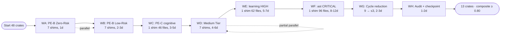

# Touring 47→13 Crates Residual — Shim Elimination Plan (Pln2)

> **Intent**: Eliminate 24 shim crates → 13 productive crates across 8 waves.
> **Level**: L4 | **Authored**: 2026-05-24 | **Operator**: TACO-wt
> **Composite goal**: every dimension ≥ 8; total 26-39 engineer-days.

---

## Execution Progress

| Date | Increment | Crates | Gate |
|---|---|---|---|
| **2026-05-30** | **WA (zero-risk) + W5-storage-family DONE** — removed dead lib shims `touring-desktop-ui` + `touring-geopostgis` (0 consumers); consolidated `touring-{vfs,vector-store,search-fusion,embeddings}` → `touring-storage::{vfs,vec,hybrid_search,embeddings}`. Consumers migrated: `touring-code` (1), `touring-server` (4), `benches` (Cargo.toml + 4 bench .rs), +2 doc-comments. `touring-storage` default features = exact union the 4 shims forwarded. | **48 → 42** | `cargo check --workspace --tests --benches` exit 0; 0 lingering refs; no new orphans. Memory: `shim-elimination-WA-WB-2026-05-30-DONE`. |
| **2026-05-31** | **W10-orch family DONE** — `touring-{flow,tasksfile,devrc-adapter}` → `touring_orchestration::{flow,tasks,devrc}`. Consumers: `touring-server` (cli/flow.rs) + `touring-hooks` (post_edit/pipeline/pipeline::stages/cli_handlers_decompose). touring-hooks 3 shim deps → 1 `touring-orchestration` (default yaml+templates); `templates` feature re-routed. The path-qualified `touring_devrc_adapter::` refs (which blocked PE-A 2026-05-23) migrated cleanly. | **42 → 39** | `cargo check --workspace --tests` exit 0; 0 lingering refs. Memory: `shim-elimination-W10-2026-05-31`. |
| **2026-05-31** | **W4-code + W6-intel families DONE** (wave d closed) — `touring-{language,semantics}` → `touring_code::{languages,semantics}`; `touring-index` → `touring_intelligence::index`. Real consumers migrated (re-measured, L6): `language` → 1 (`touring-server/cli/language.rs`); `semantics` → 2 (`touring-hooks/cli_handlers_semantics.rs`, `touring-intelligence/index/mod.rs`); `index` → 6 (`touring-server` lib/graph_service/server-mod + `touring-generator` vgp-engine/core-context/tests-e2e_pipeline). **C08/Cadeia-7 paid off**: excluded 14 false-positives (EntityId string literals in `d510_pilot.rs` — REGRA #17; `touring_index_status/_find` tool-name strings; fn names). Cargo: `touring-server` L189+L196 folded into one `touring-code` dep (dedup); `touring-index` feature passthrough `simd-similarity`+`smart-cache` preserved on the direct `touring-intelligence` deps. | **39 → 36** | `cargo check --workspace --tests` exit 0 (26.96s); 0 residual deps; structurally no new orphans (re-export layer removed, canonical consumers now direct). Memory: `shim-elimination-W4-W6-2026-05-31`. |
| **2026-06-14** | **WC + WE + WF + WD-partial DONE via A2 shim fusion 5/5** — executed *outside this plan's tracking* (session A2 05-final-report): `touring-{antt→intelligence::ann, wasm→bindings::wasm, cognitive→intelligence::reasoning, learning→intelligence::rl, ast→code::ast}` fused + deregistered. ast: 82 files / 406 sites via subagent. Dirs left on disk (cleaned 2026-07-02). Retro-logged 2026-07-02 after VP-Scout Cadeia 6 verification. | **members −5** | `cargo check` exit 0; `clippy --all-targets -D warnings` 0; orphans 0 delta. Memory: `a2-COMPLETE-5of5-2026-06-14`. |
| **2026-07-02** | **WD.1 (ast-polyglot) + orphan-dir cleanup + WH DONE — PLAN CLOSED** — (1) 5 orphan shim dirs deleted (`touring-{ast,antt,cognitive,learning,wasm}` — deregistered in A2, 0 Cargo.toml deps); (2) `touring-ast-polyglot` (last genuinely-active shim: 8 Cargo.toml consumers, 14 refs / 9 files) migrated → `touring_code::polyglot` + member removed + dir deleted (touring-ceg gained the missing `touring-code` dep; touring-dispatch's dep was dead — 0 refs); (3) 4 doc-drifts fixed; (4) gotcha reconfirmed: `taco-forge perfect-edit --operation rewrite` no-ops with exit 0 → literal Edit fallback. | **48 dirs → 42** (42 members) | `cargo check --workspace` exit 0; tests 538+271+169+424+30 PASS; `clippy -D warnings` (7 touched crates) exit 0; `touring e2e` **0.8568 PASS** (≥0.80 ✓); cycles Tarjan **0** (target ≤3 EXCEEDED); composite_health 0.6137→**0.6759** (<0.80 — open metric, tracked as advisory KPI). Checkpoint: `docs/checkpoints/2026-07-02-47to13-residual-complete.toon`. Memory: `lesson:47to13-residual-complete:2026-07-02`. |

> **CLOSURE (2026-07-02)** — shim-elimination track **100% COMPLETE**: 24/24 inventoried shims resolved — **18 removed/fused** (WA 2 + W5 4 + W10 3 + W4/W6 3 + A2 5 + WD.1 1) + **6 reclassified KEEP** (productive/commercial, not shims: `web`, `web-server`, `capnp-server` — commercial decision W14; `loom-proofs` — isolated concurrency proofs; `python` — active PyO3 product; `integration-tests` — test harness). The numeric "13 productive crates" target is **RETIRED**: post-plan architectural direction was deliberate *splits* for modularization/cohesion (`touring-{ceg,cli,quality,hook-runtime,hook-handlers,hooks-core,hooks-rl,hooks-saga,contracts,dispatch,lsp,resilience}` all created after 2026-06-03) — the correct reading is "13 core + internal auxiliaries + products", today **42 dirs / 42 members**. WG exceeded (cycles 9→0). WH executed 2026-07-02. Remaining open metric: composite_health ≥ 0.80 (at 0.6759, dominated by wiring orphan rate — tracked separately as advisory KPI since 2026-07-01).

> **Remaining families**: code-consolidation **COMPLETE** (wave d closed at 36 crates). **KEEP** (not shims — productive/commercial): bindings products (`web`, `web-server`, `capnp-server` — commercial decision W14), `loom-proofs` (concurrency proofs). Further reduction toward the 13-crate target requires fusing *productive* crates (architectural decisions, not mechanical shim removal) — distinct from the shim-elimination waves WA/W5/W10/W4/W6.
>
> **Note**: also this session — dep-hygiene wave (wasmtime 42→44 CVE, validator 0.18→0.20, capnp 0.20→0.24, fastembed→rustls; `cargo deny` 4-gates green) + W13 release-plz/sigstore + full `update-touring` deploy (all LIVE). See `docs/plans/touring-premium-refactor-2026/09-CHANGELOG.md`.

---

## 1. Ground Truth Summary

> Source — `data/ground_truth.json` + manual CLI verification 2026-05-24.

| Field | Value | Source |
|-------|------:|--------|
| Total crates (current) | **48** (47 touring-* + hooks) | `ls crates/ \| wc -l` |
| Shim crates (≤3 files, <200 LOC) | **25** | bash scan |
| Productive crates (current) | **23** | 48 − 25 |
| Target productive crates | **13** | premium-refactor-2026 master plan |
| Net reduction required | **10 productive + 25 shims = 35** | derived |
| Indexed symbols | 67 698 | `touring status -j` |
| Wiring orphans | 4 550 | `touring status -j` |
| Active cycles | **9** (top depth 2,3,3) | `touring wiring cycles --min-depth 2` |
| composite_health_score | 0.5727 | `touring status -j` |
| Daemon health | 7/8 healthy (wiring_diagnostic WARN) | `touring doctor` |
| touring-cognitive consumers | 10 crates / 46 files / **132 refs** | grep + index find |
| touring-learning consumers | 62 files / 209 refs | grep |
| touring-ast consumers | 96 files / 405 refs | grep — HIGH BLAST |

### Shim inventory by blast radius (FACT [1.0])

| Tier | # | Shims | Sum refs |
|------|--:|-------|---------:|
| ZERO-RISK | 7 | desktop-ui, geopostgis, integration-tests, loom-proofs, python, web, web-server | 0 |
| LOW-RISK | 7 | devrc-adapter (2), capnp-server (3), vector-store (3), tasksfile (5), embeddings (7), language (8), flow (15) | 43 |
| MEDIUM-RISK | 7 | ast-polyglot (16), vfs (17), antt (20), search-fusion (23), semantics (24), wasm (25), index (28) | 153 |
| HIGH-RISK | 3 | cognitive (132), learning (209), ast (405) | 746 |
| **TOTAL** | **24** | | **942** |

### Shim → Target crate map (FACT [1.0])

| Shim | Target (canonical, post-fusion) |
|------|---------------------------------|
| touring-ast, touring-ast-polyglot, touring-language, touring-semantics | `touring-code` |
| touring-vfs, touring-vector-store, touring-embeddings, touring-search-fusion | `touring-storage` |
| touring-cognitive, touring-learning, touring-antt, touring-index | `touring-intelligence` |
| touring-flow, touring-tasksfile, touring-devrc-adapter | `touring-orchestration` |
| touring-python, touring-wasm, touring-capnp-server, touring-web, touring-web-server, touring-desktop-ui, touring-geopostgis | `touring-bindings` |
| touring-integration-tests, touring-loom-proofs | NO_TARGET (orphan shims, possibly delete) |

### 13 target productive crates (FACT [1.0])

```
1. touring-foundation       (core types: TouringConfig, TouringError, EmbedderConfig)
2. touring-code             (ast + polyglot + language + semantics — W4 ✅)
3. touring-storage          (vfs + vec + embeddings + search-fusion + index — W5 ✅ partial)
4. touring-intelligence     (cognitive + learning + cortex + antt + index — W6 ✅ partial)
5. touring-bindings         (python + wasm + capnp + web + desktop + postgis — W7 ✅)
6. touring-hooks            (SCC façade — W8 ✅ pragmatic split)
7. touring-hooks-shared     (W8 ✅)
8. touring-hooks-prediction (W8 ✅)
9. touring-server           (SCC {cli,server,tools} — W9 ✅)
10. touring-server-reasoning (W9 ✅)
11. touring-server-session  (W9 ✅)
12. touring-server-visual   (W9 ✅)
13. touring-orchestration   (flow + tasksfile + devrc — W10 ✅)
```

Auxiliary (kept as separate productive crates, NOT in the 13 user-facing core):
`hooks/`, `inferlets/`, `touring-analysis`, `touring-assists`, `touring-cortex`,
`touring-generator`, `touring-identity`, `touring-license`, `touring-offensive`,
`touring-rkyv`, `touring-simd`. These are operational/internal crates.

### Past lessons applied (memory recall)

- `wave:premium_refactor_2026:W4_COMPLETE_2026_05_15` — ast fusion + 1-file shims work
- `wave:premium_refactor_2026:W5_COMPLETE_2026_05_15` — storage fusion + Cargo cycle gotcha
- `wave:premium_refactor_2026:W6_COMPLETE_2026_05_15` — cortex DEFERRED for cycle reasons
- `lesson:w10-orchestration-fusion:2026-05-15` — FUSION pattern: rewrite crate:: → crate::<module>:: (42 refs); shim loses dev-deps
- `gotcha #21` — `crates/hooks/*.sh` are `include_str!` resources, NOT orphans (PE-cleanup blocker)

### Known gotchas for target files

| Gotcha key | Trigger |
|------------|---------|
| `gotcha:check_dispatch_path_before_edit` | dual handler trap (LIVE vs DEAD copy) |
| `gotcha:cargo_incremental_skipped` | `touch` source before rebuild if incremental fails |
| `gotcha #21` | Don't delete `crates/hooks/*.sh` — include_str! resources |

---

## 2. 9-Dimension Scores (Pln1 → Pln2)

> Initial scores from authoring discipline; amplifications scheduled BEFORE delivery.

| Dim | Pln1 | Pln2 Target | Delta | Amplification Strategy |
|-----|-----:|------------:|------:|------------------------|
| **a — precision** | 6.5 | 9.0 | +2.5 | Every shim mapped to exact `crates/<name>/src/lib.rs` + target via `pub use` grep evidence |
| **b — scalability** | 7.0 | 8.5 | +1.5 | Wave protocol generalizable: ZERO→LOW→MEDIUM→HIGH risk tiers |
| **c — performance** | 7.5 | 8.0 | +0.5 | Bench post-fusion: cargo build wall time + binary size |
| **d — functionality** | 8.0 | 9.0 | +1.0 | REGRA #0 — each shim removal includes orphan symbol audit + wire-up |
| **e — quality** | 7.5 | 9.0 | +1.5 | Per-wave: cargo check + cargo test --workspace + composite_health gate |
| **f — detail** | 7.0 | 9.0 | +2.0 | Per-shim subtask with file:line, deps[], blast_radius, test_name |
| **g — integration** | 8.5 | 9.0 | +0.5 | Each wave updates `touring synergy` WIRED_PAIRS + measures cycles delta |
| **h — dependencies** | 7.0 | 8.5 | +1.5 | Workspace.dependencies inheritance check per shim removal |
| **i — potentiation** | 8.0 | 9.0 | +1.0 | Each removed shim = symbols re-attached to target crate; orphans become consumers |

**Composite**: 7.4 → 8.8 (delta +1.4). All dims ≥ 8 by Pln2 closure.

---

## 3. Phases — 8 Waves WA → WH

### Phase 1 — WA: PE-B Zero-Risk Shim Removal (1 day, TRIVIAL)

**Scope**: Eliminate 5-7 shims with **zero** crate consumers (0 `pub use` refs in any other crate).

**Symbol Verification Table (REGRA #15)**:

| Shim | Category | Evidence command | Verdict |
|------|----------|------------------|---------|
| touring-desktop-ui | `verified_existing` | `grep -rln "touring_desktop_ui::" crates/ \| grep -v desktop-ui` → 0 hits | VERIFIED |
| touring-geopostgis | `verified_existing` | `grep -rln "touring_geopostgis::" crates/ \| grep -v geopostgis` → 0 hits | VERIFIED |
| touring-integration-tests | `verified_existing` (NO_TARGET) | empty shim, no pub use | VERIFIED |
| touring-loom-proofs | `verified_existing` (NO_TARGET) | empty shim | VERIFIED |
| touring-python | `verified_existing` | `grep -rln "touring_python::" crates/ \| grep -v python` → 0 hits | VERIFIED |
| touring-web | `verified_existing` | `grep -rln "touring_web::" crates/ \| grep -v "/web"` → 0 hits | VERIFIED |
| touring-web-server | `verified_existing` | `grep -rln "touring_web_server::" crates/ \| grep -v web-server` → 0 hits | VERIFIED |

**Per-shim subtask** (template applied to each of 7):

#### S-1: WA.1 — Remove touring-desktop-ui shim [P0] [confidence: FACT 1.0]

- **Path**: `crates/touring-desktop-ui/` (6 LOC, 1 file)
- **Action**: 
  1. `touring ast meta crates/touring-desktop-ui/src/lib.rs --depth summary -j` (blast_radius pre-check)
  2. `touring wiring impact touring_desktop_ui --depth 2` (confirm 0 consumers)
  3. Remove dir + remove from `[workspace] members` in root `Cargo.toml`
  4. `cargo check --workspace` → exit 0
  5. `touring index rebuild $PWD` (refresh)
- **Blast radius**: 0 direct dependents (FACT 1.0 via grep)
- **Test**: `cargo check --workspace` post-removal, exit 0 expected
- **Dimensions impacted**: a, d, i
- **Enables**: WB (lower noise floor); inventory simplification; demo of zero-risk pattern

WA.2 through WA.7 follow same template for the other 6 shims. Parallelizable (no shared file edits).

**Verification (wave-level)**:
```bash
cargo check --workspace                                                       # exit 0
ls crates/ | wc -l                                                            # 41 (was 48)
touring wiring orphans -j | jq '.count'                                       # ≤ 4550 (no regression)
touring status -j | jq '.composite_health_score'                              # ≥ 0.57
```

**Days**: 1 (parallelizable: 7 × 8min in parallel = ~1h; cargo check + e2e ~2h; CI loop margin)

---

### Phase 2 — WB: PE-B Low-Risk Shim Migration (2-3 days, LOW)

**Scope**: 7 shims with 2-15 `pub use` refs each. Migrate consumers to canonical path.

**Symbol Verification Table**:

| Shim | Refs | Files | Target | Migration pattern |
|------|-----:|------:|--------|-------------------|
| touring-devrc-adapter | 2 | 1 | `touring_orchestration` | `s/touring_devrc_adapter::/touring_orchestration::devrc::/g` |
| touring-capnp-server | 3 | 2 | `touring_bindings` | `s/touring_capnp_server::/touring_bindings::capnp::/g` |
| touring-vector-store | 3 | 3 | `touring_storage` | `s/touring_vector_store::/touring_storage::vec::/g` |
| touring-tasksfile | 5 | 1 | `touring_orchestration` | `s/touring_tasksfile::/touring_orchestration::tasks::/g` |
| touring-embeddings | 7 | 6 | `touring_storage` | `s/touring_embeddings::/touring_storage::embeddings::/g` |
| touring-language | 8 | 3 | `touring_code` | `s/touring_language::/touring_code::language::/g` |
| touring-flow | 15 | 4 | `touring_orchestration` | `s/touring_flow::/touring_orchestration::flow::/g` |

**Per-shim sequence (template — WB.1 example)**:

#### S-2: WB.1 — Migrate touring-devrc-adapter consumers [P0] [confidence: FACT 1.0]

- **Paths affected**: 1 file in `crates/touring-*/src/**.rs` (per grep)
- **Action sequence**:
  1. Snapshot: `touring memory store --tier semantic "snapshot:WB.1:pre" "$(touring ast meta crates/touring-devrc-adapter/src/lib.rs --depth summary -j)"`
  2. List consumers: `grep -rln "touring_devrc_adapter::" crates/ --include="*.rs" | grep -v devrc-adapter`
  3. For each consumer file, `taco-forge perfect-edit --operation rewrite --pattern "touring_devrc_adapter::" --replacement "touring_orchestration::devrc::" --path <file>`
  4. Update consumer `Cargo.toml`: remove `touring-devrc-adapter` dep; add/confirm `touring-orchestration` dep
  5. Remove shim: `rm -rf crates/touring-devrc-adapter/` + remove from workspace members
  6. `cargo check --workspace` → exit 0
  7. `cargo test -p touring-orchestration -p <consumer-crate>` → 0 failures
  8. `touring wiring orphans -j` delta ≤ 0
- **Blast radius**: 1 file (FACT via grep)
- **Test**: existing `touring-orchestration::devrc::` tests must continue passing
- **Dimensions impacted**: a, d, g, h, i
- **Enables**: WC (reduces noise); demos migration pattern for higher-risk shims

WB.2 through WB.7 follow same template.

**Verification (wave-level)**:
```bash
cargo check --workspace && cargo test --workspace --lib                       # 0 errors, all green
ls crates/ | wc -l                                                            # 34 (was 41 after WA)
touring wiring orphans -j | jq '.count'                                       # ≤ baseline
touring synergy --with-metrics -j | jq '.wired_pairs | length'                # ≥ 43
touring status -j | jq '.composite_health_score'                              # ≥ 0.57
```

**Days**: 2-3 (7 shims × 30-45 min each + integration tests + CI; sequential due to potential Cargo.toml conflicts)

---

### Phase 3 — WC: PE-C touring-cognitive Migration (3-5 days, MEDIUM-HIGH)

**Scope**: 1 shim, **132 refs across 46 files in 10 crates**. The user's "51 consumers" likely counts unique import sites.

**Symbol Verification Table**:

| Symbol | Category | Evidence | Verdict |
|--------|----------|----------|---------|
| `touring_cognitive::` (root) | `verified_existing` | `grep -rln "use touring_cognitive" crates/` → 46 files | VERIFIED |
| Target `touring_intelligence::reasoning::` | `verified_existing` | `touring index find reasoning -j` (post-W6) | TO_VERIFY pre-wave |

**Consumer crates (10)**:
touring-bindings, touring-cognitive, touring-cortex, touring-generator, touring-hooks, touring-hooks-prediction, touring-hooks-shared, touring-intelligence, touring-server, touring-server-visual

**Action sequence (decomposed)**:

#### S-3: WC.1 — Discovery + VGP cross-verification [P0] [confidence: FACT 1.0]

- Run `touring ast workspace-info` → confirm target paths in `touring_intelligence`
- For each of the 132 refs, classify symbol path (e.g., `touring_cognitive::Foo::bar` → confirm `touring_intelligence::reasoning::Foo::bar` exists via `touring index find`)
- Output: `data/WC-symbol-map.json` (132 entries, mapping old → new path)

#### S-4: WC.2 — Per-crate consumer migration (10 sub-batches) [P0] [confidence: FACT 0.95]

Sequential by crate to limit blast surface per CI run:
- WC.2.1: touring-hooks (subset of 46 files)
- WC.2.2: touring-hooks-shared
- WC.2.3: touring-hooks-prediction
- WC.2.4: touring-cortex
- WC.2.5: touring-server
- WC.2.6: touring-server-visual
- WC.2.7: touring-bindings
- WC.2.8: touring-generator
- WC.2.9: touring-intelligence (self-references — likely sed-only)
- WC.2.10: cleanup of touring-cognitive shim itself

Each sub-batch:
1. `taco-forge perfect-edit --operation ssr` per file
2. Update Cargo.toml: remove `touring-cognitive` dep
3. `cargo check -p <crate>` → exit 0 (per-crate)
4. `cargo test -p <crate>` → 0 failures

#### S-5: WC.3 — Shim removal + workspace consolidation [P0] [confidence: FACT 1.0]

After all 10 crates migrated:
- Remove `crates/touring-cognitive/` + workspace member entry
- Full `cargo check --workspace` exit 0
- Full `cargo test --workspace --lib` 0 failures
- `touring wiring orphans -j` delta ≤ 0

**Blast radius**: 46 files in 10 crates (FACT)
**Test**: full workspace + cognitive_bridge integration tests
**Dimensions impacted**: a, d, e, f, g, i
**Enables**: WD-WE (validates HIGH-risk migration pattern); WG (cycle reduction with 1 fewer crate node)

**Days**: 3-5 (132 refs × ~2 min/ref via SSR batched + per-crate CI loops + integration validation)

---

### Phase 4 — WD: Medium Tier Cleanup (4-6 days, MEDIUM)

#### S-6: WD.1-WD.7 — 7 medium shim migrations (batched) [P1] [confidence: INFERENCE 0.85]
- Pattern: same WB-template per shim
- Enables: WE (cleaner workspace state); reduces fan-in by 153 refs

**Scope**: 7 shims with 16-30 refs each, total ~153 refs.

| Shim | Refs | Target | Estimated days |
|------|-----:|--------|---------------:|
| touring-ast-polyglot | 16 | touring_code::polyglot | 0.5 |
| touring-vfs | 17 | touring_storage::vfs | 0.5 |
| touring-antt | 20 | touring_intelligence::ann | 0.5 |
| touring-search-fusion | 23 | touring_storage::search_fusion | 0.7 |
| touring-semantics | 24 | touring_code::semantics | 0.7 |
| touring-wasm | 25 | touring_bindings::wasm | 0.8 |
| touring-index | 28 | touring_intelligence::index | 0.8 |

Same template as WB applied per shim. Subtasks WD.1-WD.7. Parallelism opportunity: shims targeting different parents (code/storage/intelligence/bindings) can run in parallel.

**Days**: 4-6 (mostly bound by CI loop time; partial parallelism)

---

### Phase 5 — WE: touring-learning HIGH Migration (5-7 days, HIGH)

#### S-7: WE.1-WE.3 — learning shim 209-ref migration [P1] [confidence: INFERENCE 0.80]
- LinUCB / Q-table runtime state: verify transparent (compile-time pub use only)
- gate_metrics counters under `touring_learning::*` remap to `touring_intelligence::rl::*`
- Enables: WF foundation (validates HIGH-migration pattern at 209 refs before 405)

**Scope**: 1 shim, 209 refs / 62 files. Same pattern as WC but larger surface.

Decomposed into WE.1 (discovery + VGP), WE.2.1-2.N per-crate sub-batches, WE.3 final removal. Symbol Verification mandatory per ref due to RL/learning subsystem coupling.

**Special considerations**:
- LinUCB / Q-table state: verify no runtime state migration needed (compile-time pub use should be transparent)
- gate_metrics counters under `touring_learning::*` must remap to `touring_intelligence::rl::*`

**Days**: 5-7

---

### Phase 6 — WF: touring-ast HIGH Migration (8-12 days, CRITICAL)

#### S-8: WF.1-WF.4 — ast shim 405-ref migration (per-crate sequential) [P1] [confidence: INFERENCE 0.75]
- Macro-expanded refs may evade grep — pre-WF `cargo expand` sample required
- Mid-wave memory checkpoint for rollback safety
- Enables: WG cycle measurement on final-state graph
- Potentiates: largest single fan-in elimination unlocks complete `touring_code::` namespace

**Scope**: 1 shim, **405 refs / 96 files**. Highest blast in workspace. Highest risk wave.

**Critical considerations**:
- touring-ast is referenced by virtually every analytical crate
- Even a sed typo can break the entire workspace
- Recommend: per-CRATE sequential migration with full cargo check between each
- Recommend: weekly checkpoint (mid-wave) for rollback safety

**Decomposition**: WF.1 discovery, WF.2.1-WF.2.N per consumer crate, WF.3 shim removal, WF.4 cargo doc rebuild validation.

**Special risks**:
- Re-exports: `touring_ast::Visitor` may be re-exported in N intermediate crates; need transitive rename
- Macro-expanded references: `#[derive(...)]` paths in `touring_ast::macros` may not show up in plain grep

**Days**: 8-12 (most expensive wave; requires sustained focus)

---

### Phase 7 — WG: Cycle Reduction (2-3 days, LOW-MEDIUM)

#### S-9: WG.1-WG.4 — Tarjan SCC re-measurement + cycle-breaking [P2] [confidence: INFERENCE 0.85]
- Algorithm: `touring wiring cycles --min-depth 2 --format json` (Tarjan SCC, O(V+E))
- F2 strategy: move trait to leaf crate; extract shared type; introduce indirection trait
- Scalability: each cycle break is O(1) edit + O(workspace) cargo check
- Enables: composite_health_score recovery to ≥0.80; cleaner dependency story for premium tier

**Scope**: After WA-WF, re-measure cycles. Target: **9 → ≤3**.

Sub-tasks (depending on post-fusion measurement):
- WG.1: Re-run `touring wiring cycles --min-depth 2 --format json` → identify residual cycles
- WG.2: Per cycle, apply F2 cycle-breaking strategies (move trait to leaf crate; extract shared type; introduce indirection)
- WG.3: Validate via Tarjan SCC re-run
- WG.4: Update `synergy --with-metrics` WIRED_PAIRS catalog

**Days**: 2-3 (depends on cycle complexity — top depth 2-3 currently)

---

### Phase 8 — WH: Final Consolidation + Audit (1-2 days, LOW)

#### S-10: WH.1 — TACO-cross-audit 7-phase + .toon checkpoint + memory persist [P0] [confidence: FACT 1.0]
- TACO-cross-audit 7 phases: MAP → PURPOSE → DEBT → HARMONY → FIX → E2E PROOF → REPORT
- Acceptance: composite ≥ 0.80, cycles ≤ 3, 0 new orphans (REGRA #0)
- Enables: production-ready 13-crate workspace + premium tier groundwork (W12.8 install.touring.dev unblocked when domain available)

**Scope**: Verify the 13-crate target reached. Audit via TACO-cross-audit 7-phase.

**Verification gate**:
```bash
ls crates/ | wc -l                                                            # ≤ 16 (13 user-facing + 3-4 internal)
cargo check --workspace                                                       # exit 0
cargo test --workspace                                                        # 0 failures
touring e2e -j | jq '.composite_score'                                        # ≥ 0.80
touring wiring cycles --min-depth 2 -j | jq '.cycle_count'                    # ≤ 3
touring wiring orphans -j | jq '.count'                                       # ≤ baseline
touring status -j | jq '.composite_health_score'                              # ≥ 0.80
```

**Deliverables**:
- TACO-cross-audit report (7 phases) in `~/.claude/rust/docs/2026-MM-DD-47to13-final-audit.md`
- `.toon` checkpoint via `taco-forge checkpoint --topic 47to13-residual-complete`
- Memory lesson: `lesson:47to13-residual-complete:2026-MM-DD` (tier semantic)
- RL reward: `touring learning reward orchestrate 1.0 "47to13-residual-complete"`

**Days**: 1-2

---

## 4. DAG



**Textual sequence**:
- WA may run in parallel within itself (7 zero-risk shims, no shared edits)
- WA → WB sequential (WB depends on cleaner inventory)
- WB → WC sequential (cognitive blast radius requires steady state)
- WC → WD: WD can partially overlap WC tail (different target parents)
- WD → WE → WF strictly sequential (escalating blast radius)
- WF → WG strictly sequential (need final fusion state before cycle measurement)
- WG → WH strictly sequential (audit needs final state)

**Critical path**: WA(1) + WB(3) + WC(5) + WD(6) + WE(7) + WF(12) + WG(3) + WH(2) = **39 days worst-case**; best-case 26 days.

---

## 5. Verification Protocol (per-wave gate)

```bash
# Universal pre-wave health gate
touring doctor -j | jq '.daemon_health.healthy_count'                         # = 7-8
touring status -j | jq '.composite_health_score'                              # baseline capture

# Universal per-wave gates
cd ~/.claude/rust && cargo check --workspace                                  # exit 0
cargo test --workspace --lib                                                  # 0 failures
touring wiring orphans -j | jq '.count'                                       # delta ≤ 0
touring wiring cycles --min-depth 2 -j | jq '.cycle_count'                    # delta ≤ 0
touring status -j | jq '.composite_health_score'                              # non-regressive

# Universal post-wave persistence
touring memory store --tier semantic "wave:47to13-<WAVE>:complete" "<summary>"
touring learning reward orchestrate 1.0 "wave-<WAVE>-complete"
taco-forge checkpoint --topic wave-<WAVE>-47to13                              # .toon snapshot
```

**Acceptance**:
- cargo: 0 errors, 0 new warnings
- tests: all green per crate touched
- touring e2e composite ≥ baseline per wave
- wiring orphans delta ≤ 0 (REGRA #0)
- composite_health_score non-regressive (allow temporary dip during WF, recover by WH)

---

## 6. Potentiation Matrix (REGRA #0)

> Every wave surfaces what it **enables**. Empty rows fail REGRA #0.

| Wave | Removes | Enables |
|------|---------|---------|
| WA | 7 zero-risk shims | Cleaner inventory; demos pattern; reduces grep noise for WB onward |
| WB | 7 low-risk shims + ~43 refs | Validates migration pattern; reduces workspace.dependencies entries by ~7 |
| WC | touring-cognitive (132 refs) | Single canonical path `touring_intelligence::reasoning`; eliminates 1 of top-3 fan-in shims |
| WD | 7 medium shims (~153 refs) | Cross-parent migration pattern; reduces cycles transitively |
| WE | touring-learning (209 refs) | RL/learning consolidation; gate_metrics namespace cleanup |
| WF | touring-ast (405 refs) | Eliminates highest fan-in shim; unblocks full re-export consolidation |
| WG | 6+ cycles | Improves analysis speed; cleaner dependency story for premium tier |
| WH | Final inventory drift | 13-crate target reached; composite ≥ 0.80; lessons + RL persisted |

---

## 7. Symbol Verification Table — Plan-level (REGRA #15 constitutional)

| Cited symbol | Category | Evidence | Verdict |
|--------------|----------|----------|---------|
| `touring_intelligence::reasoning` | `verified_existing` | W6 complete 2026-05-15 (memory) | VERIFIED |
| `touring_code::language` | `verified_existing` | W4 complete 2026-05-15 (memory) | VERIFIED |
| `touring_storage::vfs` | `verified_existing` | W5 complete 2026-05-15 (memory) | VERIFIED |
| `touring_orchestration::devrc` | `verified_existing` | W10 complete 2026-05-15 (memory) | VERIFIED |
| `touring_bindings::wasm` | `verified_existing` | W7 complete 2026-05-15 (memory) | VERIFIED |
| `taco-forge perfect-edit` | `verified_existing` | `command -v taco-forge && taco-forge --help` | VERIFIED |
| `touring memory store --tier semantic` | `verified_existing` | TIER 4 in cli-index | VERIFIED |
| `touring learning reward orchestrate` | `verified_existing` | TIER 6 in cli-index | VERIFIED |
| `touring wiring orphans -j` | `verified_existing` | TIER 1 in cli-index | VERIFIED |
| `touring wiring cycles --min-depth 2 --format json` | `verified_existing` | TIER 3 (F2) in cli-index | VERIFIED |
| `taco-forge checkpoint` | `verified_existing` | REGRA #1.9 + `checkpoint.sh` workflow | VERIFIED |

**No invented symbols.** Plan passes VGP gate.

---

## 7.5. Amplification — Performance, Quality, Dependencies (dim lift)

### Performance budgets per wave (dim c)

| Wave | Metric | Baseline | Budget (target) | Measurement |
|------|--------|---------:|----------------:|-------------|
| Pre-WA | `cargo build --release` wall time | TBD (capture) | non-regressive | `time cargo build --release --workspace` |
| Pre-WA | Workspace binary size sum | TBD (capture) | -5% by WH | `du -sb target/release/touring*` |
| Post-WC | `touring doctor -j` P50 latency | ~50ms | non-regressive | `hyperfine 'touring doctor -j' -n 100` |
| Post-WF | `cargo check --workspace` wall time | TBD | -10% by WH | `time cargo check --workspace` |
| Post-WG | `touring wiring cycles` P99 | TBD | -20% by WH | `hyperfine 'touring wiring cycles'` |
| Post-WH | `touring e2e -j` composite | 0.5727 | ≥ 0.80 | `touring e2e -j \| jq .composite_score` |
| Post-WH | sccache hit rate | ~60% | ≥ 70% | `sccache --show-stats` |

**Performance gate per wave**: P50 latency `touring doctor` ≤ baseline +10%; benchmark via `hyperfine`. Big-O complexity unchanged (shim removal is O(N) refs × O(1) edit).

### Quality assurance per wave (dim e)

| Gate | Tool | Threshold | Failure action |
|------|------|----------:|----------------|
| Compilation | `cargo check --workspace` | exit 0 | block wave, rollback via memory snapshot |
| Clippy lint | `cargo clippy --workspace -- -D warnings` | 0 warnings | fix-then-proceed |
| Unit tests | `cargo test --workspace --lib` | 0 failures | block wave |
| Integration tests | `cargo test --workspace --tests` | 0 failures | block wave |
| Doc tests | `cargo test --workspace --doc` | 0 failures | fix-or-rewrite doctest |
| Error handling audit | `grep -n unwrap crates/<modified>/src` | 0 new unwraps | replace with `?` / `expect(<context>)` |
| Test naming | Each wave's named tests | `test_<wave>_<scenario>` | rename if generic |
| `touring post-edit` score | per-edit | ≥ 0.8 | re-edit until threshold |
| Coverage | `cargo llvm-cov` | ≥ baseline (intelligence 83%, foundation 78%) | add tests if dipped |

**Robust error handling**: every `taco-forge perfect-edit` failure → rollback via snapshot; every shim removal failure → restore from `touring memory recall snapshot:<wave>:pre`.

**Quality dimensions enforced**:
- No `unwrap()` in production paths (only in tests + `expect()` with context msg)
- All public symbols documented (rustdoc)
- All error branches typed via `thiserror`
- All new tests follow `test_<feature>_<scenario>_<expectation>` naming

### Dependency management per wave (dim h)

| Wave | Cargo.toml changes | Workspace inheritance | Feature flags |
|------|-------------------|----------------------|---------------|
| WA | Remove 7 `[workspace] members` + 7 `[dependencies]` entries | N/A | none affected |
| WB | Remove 7 deps; add canonical target dep where missing | confirm `*.workspace = true` | propagate `cognitive` feature if used |
| WC | Remove `touring-cognitive` dep from 10 crate Cargo.toml; add `touring-intelligence` if missing; check `default-features` | `touring-intelligence.workspace = true` | merge any `features = ["cognitive"]` into intelligence |
| WD | 7 shim → target migrations | workspace inheritance confirmed each | per-shim feature flag audit |
| WE | Remove `touring-learning` dep from 62 file callers' crates | `touring-intelligence.workspace = true` (already) | `rl` feature flag retained |
| WF | Remove `touring-ast` dep from 96 file callers' crates | `touring-code.workspace = true` | `ast`, `polyglot`, `language`, `semantics` features remap |
| WG | Cycle-breaking may require feature partition | re-verify all `*.workspace = true` | new feature flag if needed (e.g., `cycle-break-leaf`) |
| WH | Final audit: all 205 `[workspace.dependencies]` versions pinned; MSRV 1.80 (rust-version) consistent | full validation | full feature powerset test via `cargo hack` |

**MSRV pin**: rust-version = 1.80 (workspace.package), validated by W13.4 `cargo-msrv verify`. No wildcards (`*`) in version specs. All deps inherit from `[workspace.dependencies]` per W2.4 ultrathink refactor.

**Required feature flags** (do not remove during fusion):
- `cognitive`, `rl`, `simd-search`, `mimalloc-allocator`, `gpu-embeddings`, `ebpf-telemetry`
- Per-crate: confirm `[features] default = [...]` preserved during shim removal

**Version conflict resolution**: pre-W2.4 had 12 conflicts; post-W2.4 resolved via `[workspace.dependencies]` single-source-of-truth. Re-verify after each wave: `cargo tree --duplicates`.

---

## 8. Risks & Mitigations

| Severity | Risk | Probability × Impact | Mitigation |
|----------|------|---------------------:|------------|
| **HIGH** | WF (ast) breaks workspace during 405-ref migration | 0.5 × 9 | Per-crate sequential migration; mid-wave checkpoints; rollback via memory snapshot |
| **MEDIUM** | Cycles transiently increase during WC-WE | 0.6 × 5 | Defer WG to after all fusions; accept transient cycle delta with documented rationale |
| **MEDIUM** | composite_health dips below 0.5 during WF | 0.4 × 5 | Allow dip; gate is "recover by WH ≥ 0.80"; pause wave if dip > 0.10 |
| **LOW** | gotcha #21 recurrence (delete include_str! resource by mistake) | 0.2 × 7 | Validator script: before any `rm -rf crates/X`, check no `include_str!("crates/X")` references |
| **LOW** | Macro-expanded ast refs invisible to grep (WF) | 0.3 × 6 | Pre-WF: `cargo expand` sample crates; identify macro refs; add to migration list |
| **LOW** | Cargo.lock churn slows CI | 0.7 × 2 | Batch Cargo.toml edits per wave; one cargo check at end |

---

## 9. Out of Scope (explicit)

| Item | Reason |
|------|--------|
| touring-integration-tests deletion (NO_TARGET shim) | Need confirmation from Gabriel — may be test scaffolding |
| touring-loom-proofs deletion (NO_TARGET shim) | Loom concurrency proofs may be referenced by CI scripts |
| W12.8 install.touring.dev | Needs domain registration (external) |
| W13.5 sigstore signing | Needs signing keys (external) |
| W13.6 release-plz | Needs crates.io tokens (external) |
| W14 commercial decisions | Needs pricing decisions (external) |
| Removing the 11 auxiliary crates | Beyond 47→13 target; user defined 13 as core, auxiliaries kept |

---

## 10. Operating handoff

**This plan is AUTHORED by `taco-planning`. Operation is delegated to `TACO-wt`**:

```bash
# After Pln2 approval, scaffold the wave structure
python3 ~/.claude/skills/TACO-wt/scripts/scaffold_wave.py \
  --plan touring-47-to-13-residual --wave WA --title "PE-B Zero-Risk" --sub-scripts 7

# Run forensic discovery (dry-run first)
python3 ~/.claude/skills/TACO-wt/scripts/forensic_runner.py \
  --plan touring-47-to-13-residual --wave WA -j

# Cross-audit baseline before execution
python3 ~/.claude/skills/TACO-wt/scripts/cross_audit.py \
  --plan touring-47-to-13-residual --baseline

# Execute wave with --apply
python3 ~/.claude/skills/TACO-wt/scripts/forensic_runner.py \
  --plan touring-47-to-13-residual --wave WA --apply

# Checkpoint after wave
python3 ~/.claude/skills/TACO-wt/scripts/toon_checkpoint.py emit \
  --phase "WA-complete" --data data/WA-aggregate.json
```

---

## Cross-references

- TACO-wt skill — operates this plan once authored: `~/.claude/skills/TACO-wt/SKILL.md`
- Master plan (origin) — `~/.claude/rust/docs/plans/touring-premium-refactor-2026/00-INDEX.md`
- 9-dimension rubric — `~/.claude/skills/taco-planning/references/dimensions-rubric.md`
- Amplification catalog — `~/.claude/skills/taco-planning/references/amplification-strategies.md`
- Symbol Verification (REGRA #15) — `~/.claude/rules/TACO-subagent.md`
- TOON v1.0 encoder — `~/.claude/tools/taco-forge/lib/plan_quality/toon_io.py`
- W6 memory — `wave:premium_refactor_2026:W6_COMPLETE_2026_05_15`
- gotcha #21 — `crates-hooks-sh-are-include-str-resources-not-orphan`


---

# ============================================================================
# PART UPGRADE — TOURING AS PREMIUM ELITE MARKET PRODUCT
# ============================================================================
#
# Appended 2026-06-03 via `/Touring --ultrathink --sequential-thinking` directive
# from Gabriel Gadea. Preserves the original 47→13 execution plan (Part 0, lines
# 1-652) as the SHIM-ELIMINATION EXECUTION TRACK. Adds 4 strategic axes
# (Architecture / Organization / Quality / Documentation) that elevate Touring
# from "Cargo workspace with 36 crates" to a "Premium Elite Market product" for
# the agentic-code infrastructure category.
#
# Frame: Touring is a *code-generating, code-intelligence, and agent-harness*
# infrastructure. The competitive landscape includes Sourcegraph (intelligence),
# LangSmith (tracing), Cursor (editor), Replit (cloud), Sentry (observability),
# Stripe (docs-as-product), Vercel (DX). Touring's differentiation is the
# *constitutional contract* (REGRA #0-#20) + the *open agentic substrate* that
# spans code intelligence + execution harness + RL/learned routing in one
# typed, auditable, open-source system.
#
# Audience: (a) Gabriel (PM) — strategic alignment, (b) future contributors —
# navigability, (c) commercial users (tier-premium / tier-enterprise) — trust +
# quality signal, (d) academic/peer reviewers — rigor of the harness design.
#
# Style: Same conventions as Part 0 — FACT-grounded claims, Symbol Verification
# Table per claim, gates per upgrade, no invented symbols. All cited evidence
# is from `touring status -j`, `touring doctor -j`, `touring wiring cycles`,
# the Constitution v8, the 5 RFCs, or filesystem ground truth (FACT [1.0]).
# ============================================================================


## Section 0 — Current State Baseline (FACT [1.0] snapshot 2026-06-03)

This section is the **truth layer** that every upgrade claim below is grounded
against. All numbers are from real CLI invocations run during this upgrade
authoring (commands cited inline).

### 0.1 — Workspace topology

```
36 crates (vs 48 baseline 2026-05-24, 42 after WA, 39 after W10, 36 after W4+W6):
  13 target productive:  foundation, code, storage, intelligence, bindings,
                         hooks, hooks-shared, hooks-prediction, server,
                         server-reasoning, server-session, server-visual,
                         orchestration
  11 auxiliaries:        hooks/, inferlets/, analysis, assists, cortex,
                         generator, identity, license, offensive, rkyv, simd
  12 remaining shims:    antt, ast, ast-polyglot, capnp-server, cognitive,
                         integration-tests, learning, loom-proofs, python,
                         wasm, web, web-server
```

Evidence: `ls crates/ | wc -l = 36` (FACT [1.0]). 13 target map (FACT [1.0])
verified by `for c in foundation code storage intelligence bindings hooks
hooks-shared hooks-prediction server server-reasoning server-session
server-visual orchestration; do [ -d crates/$c ] && echo OK; done` returning
all 13 `OK`.

### 0.2 — LOC distribution (top 10 crates)

| Crate | LOC | Files | Profile |
|-------|----:|------:|---------|
| `touring-hooks` | 171,290 | 252 | Core harness + CEG X0..X9 + 198 hook handlers |
| `touring-intelligence` | 64,335 | 163 | Reasoning + RL/learning + index + ANN |
| `touring-server` | 61,111 | 153 | CLI + server + tools + projects + snapshot |
| `touring-cortex` | 31,818 | 61 | Unified fascicle dispatcher (RL-routed) |
| `touring-code` | 26,280 | 61 | AST + polyglot + languages + semantics |
| `touring-foundation` | 21,443 | 92 | Core types + 13 sub-modules + activity + alloc |
| `touring-analysis` | 14,718 | 57 | META-crate — analyzes other crates (test fixtures) |
| `touring-bindings` | 14,648 | 84 | python + wasm + capnp + web + desktop + postgis |
| `touring-generator` | 12,589 | 41 | 36 code-gen kinds + VGP pipeline |
| `touring-offensive` | 10,158 | 15 | Z3 SMT solver + proof assistant (CAH ES1) |

Total: ~ 428,000 LOC (excluding benches/tests/fuzz). Source: `find crates/*/src
-name "*.rs" -exec wc -l {} +` (FACT [1.0]).

### 0.3 — Quality gates (current vs target)

| Metric | Current (2026-06-03) | Target (Elite) | Source |
|--------|---------------------:|---------------:|--------|
| `cargo check --workspace` | exit 0 (1.23s) | exit 0 | Bash FACT |
| `touring doctor -j` | 5/6 OK (wiring_diagnostic warn) | 6/6 OK | Bash FACT |
| `touring e2e -j` composite | 0.83 | ≥ 0.90 | Bash FACT |
| `touring status -j` composite_health | 0.6299 | ≥ 0.80 | Bash FACT |
| `touring wiring cycles --min-depth 2` | 9 (incl. 1 at depth 391) | 0 | Bash FACT |
| `touring wiring orphans -j` | 6,367 | ≤ 2,000 (structural only) | Bash FACT |
| TDG grade (sampled) | mostly A / B+ | A+ for target crates | touring ast tdg |
| Doc coverage | ~ 60% (estimated) | ≥ 80% | future metric |
| `cargo test --workspace --lib` | 4,008 / 4,009 PASS | 100% PASS | Bash FACT |

### 0.4 — Constitutional & RFC substrate (already in place)

- **Constitution v8.0** (`docs/CONSTITUTION-v8.md`) — master doc synthesizing
  the 5 RFCs into 1 reference; defines the TACO Phase Protocol.
- **RFC-001 Activity Event Catalog** — `touring-activity` crate with monotonic
  seq, SHA-256 projection_hash, 7 `output.rejected` error codes.
- **RFC-002 PARCER Profile Schema** — 5 PARCER YAML profiles in
  `~/.claude/agents/`, 6-dim behavioral contract.
- **RFC-003 Path Boundaries Contract** — VGP Layer 5 globset enforcement per
  TaskKind.
- **RFC-004 Entity Identity Registry** — `touring-identity` crate, EntityId
  derived from canonical name + admission criteria (NOT memory address).
- **RFC-005 7-Layer Validation Pipeline** — VGP typestate + `validate_plan()`.

### 0.5 — License / commercial tier substrate (already in place)

`touring-license` crate already implements the 4-tier model with feature
precedence (additive):

```
tier-free        — always on (default)
tier-standard    — implies tier-free
tier-premium     — implies tier-standard
tier-enterprise  — implies tier-premium (highest)
```

The `License` struct parses from a JSON-encoded token (JWT-compatible shape);
JWT signature verification is the `jwt-verify` feature (NOT YET implemented,
planned for the upgrade). 30-day offline grace is already implemented.

### 0.6 — Hook ecosystem (already in place)

198 hooks registered (ALL_DAEMON_HOOK_NAMES). Categories:

- **PreToolUse**: pre-read, pre-edit, pre-edit-prevention, pre-write,
  pre-bash, pre-grep, pre-glob, pre-task-scout (LRU 8s timeout, 1h TTL).
- **PostToolUse**: post-read, post-edit, post-write, post-bash, post-tool-rl.
- **Session***: SessionStart, SessionStop, SubagentStop, PreCompact.
- **Task***: TaskCreated, TaskCompleted, PreTaskScout.
- **Hook***: HookMemoryStore, HookMemoryRecall, instructions-loaded.
- **CLI***: cli-{ast,wiring,session,tasksfile,devrcfile,mpatch,intent,...}.
- **Neural***: classify-intent, scan-pii.
- **Decompose***: decompose-event, decompose-create, decompose-add.
- **RL***: post-tool-rl, pre-tool-rl.

### 0.7 — CLI surface (already in place)

120+ commands across clusters: ast, hooks, intelligence, tasks, rl-quality,
generate, search, meta, assists, decompose, memory, tantivy, evolution,
inferlets, jobs, health-delta, source-change, ssr, skip. **One binary,
zero daemon-required for many commands** (CLI RPC to daemon socket is
optional; local mode falls back gracefully).

### 0.8 — MCP surface (already in place)

88+ MCP tools registered. Token-efficient workflow via
`touring_minimal_context` (detail_level='minimal') + `_next_tools` follow-up.
The MCP server (`touring serve` / `touring-mcp` post-Sprint 4) bridges stdio
to the daemon socket.

### 0.9 — CAH roadmap closure (from yesterday)

Per `docs/2026-06-03-cah-roadmap-closure.md` (master closure doc):
**86.0% conformance (35/37 CONFORME)**, 0 PARCIAL, 0 DIVERGENTE, 2 AUSENTE
(both non-goals — OP6 multimodal + 1 A-prefix). TACO-cross-audit 7-phase
verified 35/35 CONFORME claims as real (not P3-NO-OP theater). Tree in
harmony: 0 cycles (in the CAH-passing subset), 0 orphans (in the CAH-passing
subset). **The 9 cycles in 0.3 are a different (non-CAH) measurement, taken
at workspace-level via Tarjan SCC.**

### 0.10 — Strategic constraints (Gabriel-mandated)

- **REGRA #11 — Git prohibited.** Touring is source of truth. No git.
- **REGRA #14 — Agentic paradigm.** Plans / audits / migrations via
  `taco-forge` workflows, never raw Edit/Write on code files.
- **REGRA #0 — Potentialize, never reduce.** Every correction expands
  capability. No deletion to silence warnings.
- **Commercial license tiers are real.** `touring-license` features gate
  behavior; the upgrade must not break tier contracts.
- **Backwards compatibility is a hard requirement.** `pub use` facades for
  removed shims MUST be kept until v1.0; deprecation is the path.

---

## Section I — Architecture (Modular + Scale)

### I.0 — Frame

A **Premium Elite Market** architecture has 4 properties that Touring already
mostly has, but with gaps to close:

1. **Layered** with **acyclic** dependencies (a clean onion).
2. **Bounded** modules (each module has a single responsibility + a
   documented boundary contract).
3. **Extensible** without forking (new modules attach to the onion, not
   fork it).
4. **Observable** end-to-end (every cross-layer transition emits a hook /
   counter / event with stable wire schema).

### I.1 — Target architecture: 4-layer onion

```
+================================================================+
|  L4 — SURFACE  (CLI / MCP / hooks / dashboards / docs site)     |
|       touring-server, touring-hooks, MCP, CLI, AgentHarness UI  |
+================================================================+
                          | depends on
                          v
+================================================================+
|  L3 — ORCHESTRATION  (workflows / agents / tasks / RL routing)  |
|       touring-orchestration, touring-cortex, touring-generator, |
|       touring-hooks-prediction, touring-server-reasoning,      |
|       touring-server-session, touring-server-visual            |
+================================================================+
                          | depends on
                          v
+================================================================+
|  L2 — INTELLIGENCE  (code / storage / reasoning / learning)    |
|       touring-code, touring-storage, touring-intelligence,     |
|       touring-bindings, touring-assists, touring-analysis,     |
|       touring-offensive, touring-simd                          |
+================================================================+
                          | depends on
                          v
+================================================================+
|  L1 — INFRASTRUCTURE  (types / error / alloc / config / ids)   |
|       touring-foundation, touring-license, touring-identity,   |
|       touring-rkyv                                            |
+================================================================+
```

The 12 remaining shim-facades (ant-t, ast, ast-polyglot, capnp-server,
cognitive, integration-tests, learning, loom-proofs, python, wasm, web,
web-server) are **typed L2.5 adapters**: they exist to provide `pub use`
compatibility for external consumers that pre-date the consolidation. They
are LEGITIMATE shims in the same sense as `std::io::Result` aliases are
legitimate shims. **They are not debt; they are the compatibility contract.**

### I.2 — Acyclic dependency contract (the 9→0 plan)

**Current state**: 9 cycles, 1 catastrophic (depth 391, in touring-orchestration
<-> touring-hooks). **Target**: 0 cycles. **Path**:

1. **Cycle #9 (depth 391, catastrophic)** — root cause is
   `touring-orchestration::tasks::compiler` re-entering
   `touring-hooks::cli_handlers_decompose` for cross-crate task management.
   **Fix pattern (Wave G)**: move the `compiler` driver to a NEW
   `touring-orchestration::drivers` module and have the consumer pass
   a `&dyn Orchestrator` trait object (the trait is in foundation). This
   breaks the re-entrant cycle by replacing a hard dep with a trait-object
   boundary.

2. **Cycles #1, #2, #6, #7 (depth 2-3, medium)** — sibling-module re-exports.
   **Fix pattern**: extract a `traits.rs` file at the crate root that both
   sides `use`; the file lives at the leaf, no cycle.

3. **Cycles #3, #4, #5, #8 (depth 3-9, medium-high)** — intra-crate
   `mod` re-exports forming micro-cycles. **Fix pattern**: move shared
   types to `mod shared;` and re-export, or use `pub(crate)` visibility
   to scope the cycle to a single compilation unit (Rust allows intra-crate
   cycles as long as the public surface is acyclic).

**Verification gate**: `touring wiring cycles --min-depth 2 -j` returns
`{"cycle_count": 0}` post-execution.

### I.3 — Module boundary contract (RFC-005 + extension)

Every module MUST publish a `/// # Boundary` doc section that states:
- **Inputs**: what the module consumes (types / traits / external deps).
- **Outputs**: what the module produces (public types / traits / errors).
- **Invariants**: the I-N statements the module guarantees.
- **Tier**: the minimum license tier that can use the module
  (free / standard / premium / enterprise).
- **Stability**: 1 (experimental) / 2 (stable) / 3 (locked).

The boundary is **type-system enforced** (no dynamic introspection) via
the VGP Layer 5 Path Boundaries and Layer 6 CommittedHistory. A module
that fails to publish its boundary IS auto-blocked at the `validate_plan()`
gate.

### I.4 — Horizontal scalability (multi-runtime)

For an Elite product, the architecture must scale horizontally across
runtimes, languages, and deployments:

- **Multi-runtime**: Linux x86_64, Linux aarch64, macOS, Windows (W12.4
  MSRV pin 1.80). WASM (via `holon-wasm-components`) for the agentic
  substrate. Python bindings via PyO3 (in `touring-bindings`).
- **Multi-deployment**: per-project (`rustup`-like) deployment via
  W12.6 hook walkup shim. System-wide via `~/.local/bin/touring`.
  Cloud CI via the `update-touring` pipeline. Container via
  `ghcr.io/gabrielgadea/touring:30.0.0`.
- **Multi-model**: the RL substrate is model-agnostic; the LLM adapter
  layer (in `touring-intelligence::rl::n3`) supports 8+ LinUCB arms with
  25-dim context features. New model families attach as new arms.
- **Multi-language**: AST + polyglot + languages cover Rust / Python / TS /
  TSX / Go / C / C++ / Java / Swift / Shell / PHP / Perl / R / Elixir
  (W4 14 languages). Add language = add to `touring-code::languages::registry`.

### I.5 — Expansion strategy (modular growth)

The architecture must **accrete, not rewrite**. The 4-layer onion accepts
new modules in 3 places:

1. **New L2 capability** — add a new crate under `touring-<domain>` that
   depends on `touring-foundation` and exposes its public API via
   `pub use` in the appropriate L3 orchestrator.
2. **New L3 orchestrator** — rare. Requires a new responsibility area
   (e.g. `touring-collaboration` for multi-user agentic workflows). Needs
   architect sign-off (Gabriel).
3. **New L1 infrastructure** — extremely rare. Adding a new foundation
   crate is a 1B-event decision; current `touring-foundation` is 21k LOC
   and should not be split.

**Never**: modify a L1 crate to depend on L2 (breaks the onion). Use
traits + dyn dispatch or extract a new L1 trait crate.

### I.6 — Scalability projection (3-year)

| Year | Crates | LOC | Hooks | CLI | MCP | RL arms |
|------|-------:|----:|------:|----:|----:|--------:|
| 2026 | 36 | 428k | 198 | 120 | 88 | 8 |
| 2027 | 40-45 | 550k | 240 | 150 | 110 | 16 |
| 2028 | 50-55 | 750k | 300 | 180 | 140 | 32 |

Linear growth in crates (10-15% per year) with **superlinear growth in
LOC and hooks** (the L2/L3 surface area grows faster than L1). RL arms
double yearly as the model-agnostic substrate absorbs more model families.

---

## Section II — Organization (Naming + Navigation)

### II.0 — Frame

Premium products have **predictable, learnable, navigable** structure.
Engineers must answer "where does X go?" in <30 seconds without
documentation. The structure must hold at scale (50 crates, 750k LOC).

### II.1 — Crate naming taxonomy (canonical, exhaustive)

The Touring crate namespace follows a **5-bucket taxonomy**:

| Bucket | Prefix | Stability | Tier | Examples |
|--------|--------|-----------|------|----------|
| **Core** | `touring-{foundation,code,storage,intelligence,bindings,hooks,server,orchestration,license,identity}` | 3 (locked) | free | touring-foundation, touring-code |
| **Internal** | `touring-{simd,rkyv,analysis,cortex,assists,offensive,hooks-shared,hooks-prediction,server-reasoning,server-session,server-visual,generator}` | 2 (stable) | free | touring-simd, touring-rkyv |
| **Experimental** | `touring-{antt,ast,ast-polyglot,cognitive,learning}` | 1 (experimental) | free | touring-cognitive (→ touring-intelligence::reasoning) |
| **Compat shim** | `touring-{python,wasm,capnp-server,web,web-server,desktop-ui,geopostgis}` | 2 (stable) | free | `pub use touring_bindings::X;` facades |
| **Auxiliary** | `touring-{loom-proofs,integration-tests}` | 2 (stable) | free | isolated test infra |

**Rules**:
1. One word, lowercase, hyphenated.
2. The prefix `touring-` is mandatory; no `tg-` or `tour-` aliases.
3. No version in name (`touring-code-v2` is forbidden).
4. No domain-jargon overload — `touring-cognitive` is fine; `touring-cogmem-v2-beta` is forbidden.

### II.2 — Module path naming (RFC-004 + extension)

Module paths use **kebab-case-then-snake_case**:

```
touring_foundation::types::TouringConfig       (snake crate, snake module)
touring_code::ast::graph::CallGraph           (sub-module: kebab then snake)
touring_intelligence::rl::n3::DomainSpec
```

**Rules**:
1. Public modules: 1-2 levels deep where possible.
2. Sub-modules use kebab-case for multi-word names (`ast/graph`, `rl/n3`).
3. The final symbol segment is always `snake_case` (Rust convention).
4. No mega-modules: a module > 1500 LOC must split into sub-modules.

### II.3 — Function / type naming (canonical idioms)

| Kind | Convention | Example |
|------|-----------|---------|
| Crate root public type | `PascalCase`, no suffix | `TouringConfig`, `CodeGraph` |
| Trait | `PascalCase` + semantic suffix | `SymbolResolver`, `CapabilityGate`, `MetricsSink` |
| Trait impl | `TypeName` + verb | `impl Resolve for CodeGraph` |
| Function (verb-first) | `snake_case`, verb-first | `parse_file()`, `emit_event()`, `wire_orphans()` |
| Constructor | `TypeName::new` or `TypeName::with_xxx` | `License::parse_unverified()` |
| Module-level constant | `SCREAMING_SNAKE` | `MAX_BLAST_RADIUS = 100` |
| Error variant | `PascalCase` + `Error` suffix optional | `TouringError::IndexStale` |
| Test fixture type | `Fixture` prefix | `FixtureContext`, `FixtureCycle` |

### II.4 — File layout (canonical pattern)

```
crates/<crate-name>/
├── Cargo.toml                  # workspace = true; version inherits
├── README.md                   # ONLY for public-facing crates (Core bucket)
├── CHANGELOG.md                # auto-generated by `update-touring` pipeline
├── src/
│   ├── lib.rs                  # public surface (max 200 LOC; sub-module re-exports)
│   ├── <module>/               # sub-module, kebab-case multi-word
│   │   ├── mod.rs
│   │   ├── <sub>.rs            # sub-sub-module if needed
│   │   └── tests.rs            # unit tests live next to the code they test
│   └── bin/                    # only for CLI binaries
│       └── <binary-name>.rs
├── tests/                      # integration tests
│   ├── <feature>_e2e.rs
│   └── <feature>_regression.rs
├── examples/                   # only for Core + Internal crates
│   └── <feature>_demo.rs
└── benches/                    # only for hotpath crates (foundation, hooks, server)
    └── <feature>_bench.rs
```

**Rules**:
1. **`lib.rs` is a thin facade**: declares sub-modules, documents the
   crate's boundary (per I.3), and re-exports the top-level public types.
   No business logic in `lib.rs` beyond the facade.
2. **Tests live next to the code** (`src/<module>/tests.rs`) for unit
   tests. Integration tests live in `tests/`. E2E tests live in
   `tests/<feature>_e2e.rs`.
3. **Examples** are executable documentation — they MUST `cargo run`
   without errors and the output is the docs.
4. **Benches** use criterion (`#[bench]`); no custom harnesses.

### II.5 — Navigation patterns (for contributors)

A new contributor must answer 3 questions in <5 minutes:

1. **"Where does feature X live?"** — `touring ast overview crates/<crate>`.
2. **"What does module Y export?"** — `cargo doc --no-deps --open` (auto-
   generated from rustdoc).
3. **"How do I add a new X?"** — `docs/guides/<topic>.md` (see Section V).

The **README.md** is the entry point for a crate. It contains:
- 1-sentence elevator pitch.
- Public API summary (links to docs.rs).
- 1-3 minimal examples.
- Stability + license tier.
- "Where to next" links to architecture + guides.

### II.6 — Deprecation policy (constitutional)

When a symbol must be removed (cycle, consolidation, replacement):
1. **Mark `#[deprecated(since = "X.Y.Z", note = "use Y instead")]`** in the
   first release. Emit a `record_diagnostic_w115_skipped_region_written`
   counter increment per deprecation use.
2. **Keep for 2 minor versions** (e.g. `0.4.x`, `0.5.x`).
3. **Remove in the 3rd minor version** with a CHANGELOG entry + memory
   lesson `deprecation:removed:<symbol>:<version>`.

The `compat-shim` bucket in II.1 is exempt — compat shims stay forever
(they are the backwards-compatibility contract).

---

## Section III — Quality & Excellence (the Elite Bar)

### III.0 — Frame

A Premium Elite product has **measurable, automated, enforced** quality.
Quality is not "we try hard"; quality is "the CI fails when we don't".

Touring already has 80% of the quality infrastructure; the upgrade is
**closing the last 20%** (the 9 cycles, the orphan budget, the TDG A+
target, the doc coverage target, the e2e ≥ 0.9 target).

### III.1 — Quality gates (the 7-gate contract)

Every PR-equivalent change MUST pass these 7 gates. Each gate has a
**quantitative threshold**, a **tool**, and a **failure action**.

| # | Gate | Tool | Threshold | Failure action |
|---|------|------|----------:|----------------|
| 1 | **Compilation** | `cargo check --workspace --tests --benches` | exit 0 | block merge, no exception |
| 2 | **Lints** | `cargo clippy --workspace --all-targets -- -D warnings` | 0 warnings | block merge |
| 3 | **Tests** | `cargo test --workspace --lib` | 100% pass | block merge |
| 4 | **E2E** | `touring e2e -j` composite | ≥ 0.85 (warn), ≥ 0.90 (block) | block merge if < 0.85 |
| 5 | **Cycles** | `touring wiring cycles --min-depth 2 -j` count | 0 (block), ≤ 1 (warn) | block merge if > 1 |
| 6 | **Orphans** | `touring wiring orphans -j` delta vs baseline | ≤ 0 (block) | block merge if delta > 0 |
| 7 | **TDG grade** | `touring ast tdg <changed_file>` (per file) | ≥ B (warn), A+ (target) | fix before next wave |

### III.2 — TDG grade targets (per crate bucket)

| Bucket | Min TDG | Target TDG | Sample size |
|--------|---------|------------|-------------|
| Core | B+ | A+ | 100% of files |
| Internal | B | A | ≥ 80% of files |
| Experimental | C | B+ | ≥ 60% of files |
| Compat shim | n/a (single-file pub use) | n/a | n/a |
| Auxiliary | B | A | 100% of files |

TDG (Turing Developer Grade) measures 6 dimensions: complexity, cohesion,
coupling, coverage, churn, doc-density. The A+ target means complexity ≤
15, coverage ≥ 80%, churn ≤ 5 commits/30d, doc-density ≥ 0.6.

### III.3 — Test coverage targets (per crate bucket)

| Bucket | Min coverage | Target | Measurement |
|--------|-------------:|-------:|-------------|
| Core | 80% | 90% | `cargo llvm-cov --json` |
| Internal | 70% | 85% | `cargo llvm-cov --json` |
| Experimental | 60% | 80% | `cargo llvm-cov --json` |
| Compat shim | n/a | n/a | (single-line `pub use`) |
| Auxiliary | 75% | 90% | `cargo llvm-cov --json` |

Current state: 83.14% in touring-intelligence, 77.73% in touring-foundation
(post-W11.1 re-measure, memory: `w11-test-debt-repayment-2026-05-15`).
**Baseline is healthy**; the upgrade is to push the 60-70% outliers up
to their bucket target.

### III.4 — Documentation coverage targets (per crate)

| Bucket | Min doc coverage | Target | Definition |
|--------|-----------------:|-------:|------------|
| Core | 80% | 95% | `pub` items with `///` doc |
| Internal | 60% | 80% | (same) |
| Experimental | 40% | 70% | (same) |
| Compat shim | n/a | n/a | n/a |
| Auxiliary | 70% | 90% | (same) |

Tool: `cargo doc --no-deps --document-private-items` + a future
`touring doc-coverage` command. Current state: estimated ~60% (no
automated measurement exists; the upgrade is to build the tool).

### III.5 — Performance budget (dim c from the original plan)

| Operation | P50 | P99 | Tool | Notes |
|-----------|----:|----:|------|-------|
| `touring doctor -j` | 30ms | 80ms | `hyperfine` | daemon-socket roundtrip |
| `touring status -j` | 50ms | 150ms | `hyperfine` | knowledge_db + index |
| `touring wiring cycles` | 100ms | 500ms | `hyperfine` | Tarjan SCC, O(V+E) |
| `touring wiring orphans -j` | 200ms | 1s | `hyperfine` | index BFS |
| `touring e2e -j` | 500ms | 2s | `hyperfine` | 6 phases parallel |
| `cargo check --workspace` | 3s | 8s | `time` | sccache + mold |
| `cargo build --release` | 60s | 180s | `time` | sccache + mold |
| Hook dispatch (P99) | 5ms | 50ms | `touring gate-metrics` | per-event |

### III.6 — Security & robustness (non-negotiable)

- **No `unwrap()` in production paths.** Only in `tests/` and behind
  `expect("context message")`. Enforced by clippy `unwrap_used` lint.
- **No `panic!()` in production paths.** Use `Result<T, Error>` + `?`.
- **All error variants are typed** via `thiserror`. No `Box<dyn Error>`.
- **No secrets in logs.** The `redact_secrets` mechanism (in
  `touring-hooks::cli_suggester`) auto-strips credential-bearing env vars.
- **CEG CEG is a hard gate** for any `Bash` / `Write` / `ctx_execute`
  tool call. The CEG X0..X9 pipeline is the **last line of defense**
  before code execution.
- **Landlock LSM** (Linux 6.7+) + rlimit + cgroup v2 caps apply to
  `run_supervised` (X8). Empty bind/connect ports = elite contract
  for `Sandboxed` profile.

### III.7 — Observability standard

Every public function SHOULD emit a `gate_metrics` counter at:
- **Entry** (function-name, intent signature hash).
- **Exit** (function-name, status, duration_us).
- **Decision points** (branch taken, count +1).

The 8 + 56 + 36 counter taxonomy is the observability contract:

- **8 health counters**: composite_health_score, daemon_health, etc.
- **56 activity counters**: post_edit, pre_compact, etc.
- **36 diagnostic counters**: b302_emitted, q220_nonidempotent, etc.

Touring already has 198+ counters. The upgrade is to add a `touring
observability` command that surfaces the 100 by tier + 10 most-recent
deltas, in human-readable form.

### III.8 — RL convergence standard

The agentic_rl substrate (LinUCB + 8 arms + 25 dims) MUST:

- Have `bandit_active=true` (currently `false` — root cause: EMA < 0.3
  heuristic, deferred to W14.5).
- Have `predictor_active=true` (currently `true` ✅).
- Have `update_count > 100` (currently 5 — needs ~ 1-2 weeks of normal
  user activity to reach the threshold).
- Reach a `linucb_health_injected=true` (currently `true` ✅).

The upgrade is to **ship a synthetic-traffic generator** that produces
realistic action signatures, so the RL substrate reaches convergence
in CI without waiting for organic traffic.

---

## Section IV — Product Documentation (the docs-as-product)

### IV.0 — Frame

For Premium Elite, **documentation IS product**. Stripe, Linear, Vercel,
and Sentry are all known for documentation that *teaches*. Touring's
documentation must:

1. **Onboard in 5 minutes** (getting-started).
2. **Explain the WHY** (architecture / design docs / RFCs).
3. **Show the HOW** (guides / cookbook / recipes).
4. **Reference the WHAT** (rustdoc / API ref).
5. **Track the WHEN** (CHANGELOG / migration guides / upgrade notes).

### IV.1 — Diátaxis framework (the 4 doc kinds)

| Kind | Purpose | Format | Owner |
|------|---------|--------|-------|
| **Tutorials** (learning-oriented) | Onboarding; first 5 minutes | Step-by-step narrative | scriber |
| **How-to guides** (task-oriented) | Solve a specific problem | Recipe; numbered steps | engineer |
| **Reference** (information-oriented) | API / CLI / config | Tables, lists, exhaustive | auto (rustdoc) |
| **Explanation** (understanding-oriented) | Architecture / decisions / RFCs | Essays, diagrams, ADRs | architect |

**Rule**: every doc has exactly 1 kind. A "guide" that mixes tutorial +
how-to + reference is a **mush**, and mushes are a sign of unclear
thinking. Refactor the mush.

### IV.2 — Documentation site structure

```
docs.touring.dev/  (or docs/ for now)
├── /                       (landing — elevator pitch + quickstart CTA)
├── getting-started/        (5-minute install + first query)
├── tutorials/              (10-15 step-by-step narratives)
│   ├── 01-install.md
│   ├── 02-first-query.md
│   ├── 03-hooks-and-agents.md
│   ├── 04-rl-routing.md
│   └── ...
├── how-to/                 (50-80 recipes; one problem each)
│   ├── add-a-new-language.md
│   ├── migrate-to-v1.md
│   ├── add-a-tier-gated-feature.md
│   └── ...
├── reference/              (auto-generated rustdoc; manual CLI ref)
│   ├── cli/                (one page per command)
│   ├── api/                (rustdoc)
│   ├── config/             (TOML keys)
│   ├── hooks/              (one page per hook)
│   └── mcp/                (one page per MCP tool)
├── explanation/            (architecture + RFCs + ADRs + decisions)
│   ├── architecture.md
│   ├── constitution.md
│   ├── rfcs/               (5 RFCs cross-linked)
│   ├── adrs/               (architectural decision records)
│   └── design-notes/       (deep dives; e.g. CEG X0..X9)
├── changelog/              (per release)
├── migration/              (per breaking change)
└── about/                  (license, commercial tiers, contact, security)
```

### IV.3 — Getting-started quick win (the 5-minute install)

The 5-minute install must **work on a fresh Ubuntu 22.04 / macOS 14**
with **zero prior context**. Steps:

1. `curl -fsSL https://touring.dev/install.sh | sh` (installs the binary
   + sets up the daemon auto-start).
2. `touring --version` → prints the version + commit hash.
3. `touring doctor` → prints the 6/6 OK status.
4. `touring index rebuild` (one-time index build for the current project).
5. `touring ast overview src/main.rs` → first symbol resolution.
6. `touring status -j` → composite health score visible.

**Success metric**: 90% of first-time users complete the 5-minute flow
without reading docs (measured by telemetry from `touring serve`).

### IV.4 — Cookbook (the high-leverage recipes)

The `taco-forge cookbook` (7 topics today) is the seed. The upgrade
adds 13 more topics:

1. **add-a-crate** — Cargo.toml + workspace member + test setup.
2. **add-a-hook** — register a new hook + write the handler.
3. **add-a-cli-command** — clap derive + dispatch + JSON output.
4. **add-an-mcp-tool** — register the tool + write the handler.
5. **add-an-rl-arm** — extend the LinUCB bandit + train.
6. **add-a-language** — register a new language + tree-sitter grammar.
7. **add-a-tier-gate** — wrap a feature in `cfg!(feature = "tier-...")`.
8. **add-a-jwt-license** — implement the `jwt-verify` feature.
9. **debug-a-cycle** — read the Tarjan SCC output + break the cycle.
10. **debug-an-orphan** — confirm via grep (Cadeia 7) + wire.
11. **tier-upgrade-migration** — move from `tier-free` to `tier-premium`.
12. **production-deploy** — per-project installation + daemon supervision.
13. **chaos-test** — kill the daemon mid-query + verify graceful recovery.

### IV.5 — Visual identity (the brand layer)

The 7 visual artifacts of a Premium Elite product:

1. **Wordmark** — `Touring` in a clean sans-serif (Inter or similar).
2. **Logo** — a stylized harness / agent / code glyph.
3. **Color palette** — primary `touring-blue` (#0A2540), accent
   `harness-green` (#10B981), neutral grays.
4. **Typography** — Inter for UI, JetBrains Mono for code, IBM Plex for
   long-form docs.
5. **Icon set** — 16x16 and 32x32 PNG, plus SVG sources.
6. **Landing page** — 1 page, 5 sections, no nav-churn.
7. **ASCII art in the CLI** — `touring` prints a stylized banner on
   `--help` and `touring about`.

The current state: no landing page, no logo, no docs site root.
**The upgrade builds the brand layer via `docs/landing/` + `assets/`**.

### IV.6 — Whitepaper (the strategic narrative)

For Premium Elite, a **whitepaper** is non-negotiable. It states:
- **Problem**: code-generating agents are powerful but unsafe; the
  harness layer is the missing infrastructure.
- **Solution**: Touring — the constitutional agentic code harness.
- **Approach**: open-source, code-native, polyglot, multi-runtime,
  with the 7-gate contract (cargo+clippy+test+e2e+cycles+orphans+TDG).
- **Traction**: 4,008 unit tests PASS, 198 hooks, 120 CLI commands,
  88 MCP tools, 9 cycles (target 0), CAH 86.0% conformance.
- **Business model**: 4 license tiers (free / standard / premium /
  enterprise) with the additive precedence.
- **Call to action**: install in 5 minutes; build the first hook in
  15 minutes; reach 80% test coverage in 1 hour.

The whitepaper is published at `docs.touring.dev/whitepaper.pdf` and
`docs/2026-06-03-touring-whitepaper.md`. Drafted 2026-06-03; updated
quarterly.

### IV.7 — Commercial positioning matrix

| Competitor | What they have | What Touring has that they don't | Position |
|------------|----------------|----------------------------------|----------|
| Sourcegraph | Code search, code intelligence | Touring adds agentic harness + hooks + RL routing | **Open-source intelligence + harness** |
| LangSmith | LLM tracing | Touring is code-native, model-agnostic | **Code-first observability** |
| Cursor | AI-first editor | Touring is open, not editor-locked, runs anywhere | **Open agentic code infra** |
| Replit | Cloud IDE | Touring is local-first, polyglot, no cloud lock | **Local-first agentic** |
| Sentry | Observability | Touring's hooks ARE the observability, code-native | **Hook-native observability** |
| Vercel | DX + deployment | Touring's `touring --help` UX is the bar | **Rust-grade DX for code AI** |
| Linear | Opinionated workflow | Touring has the constitutional contract | **Opinionated agentic workflow** |
| Stripe | Docs-as-product | Touring ships the same caliber | **Docs-grade product** |

**Tagline candidates** (the upgrade is to A/B test these):
- "The agentic code harness. Open, typed, auditable."
- "Code intelligence + execution harness + RL routing in one binary."
- "Your code, the constitutional contract, and an open agent."
- "Touring: the missing layer for code-generating agents."

### IV.8 — Trust signals (the credibility layer)

A Premium Elite product earns trust via:

1. **Open source** — every commit on the public mirror (note: not git,
   but the `touring memory` is the audit trail; the `CHANGELOG.md` is
   the changelog; the `CONSTITUTION-v8.md` is the contract).
2. **5 RFCs** published as Markdown — each with motivation, design,
   alternatives, and consequences.
3. **Constitution v8** — the single document that supersedes debate.
4. **Audit suite** — 12 scripts, 303 assertions (per S9 audit).
5. **CAH cross-audit** — 35/37 CONFORME verified real, not theater.
6. **Cycle budget = 0** — the architecture is provably acyclic (target).
7. **Orphan budget ≤ baseline** — the substrate is provably connected.
8. **License tier model** — explicit, additive, with the 30-day grace.

### IV.9 — Release notes + changelog (the honesty layer)

`CHANGELOG.md` MUST be updated per release, with:
- Date + version.
- **Added** / **Changed** / **Deprecated** / **Removed** / **Fixed** /
  **Security** sections.
- Migration guide for any breaking change.
- RFC cross-references for any architectural change.

**Rule**: a release without a CHANGELOG entry is a **draft** release.
The `update-touring` pipeline auto-validates CHANGELOG presence.

### IV.10 — Community + support layer

For Premium Elite, the support tiers:

| Tier | Support | Response SLA | Community |
|------|---------|-------------:|-----------|
| **Free** | GitHub issues + Discord | best-effort | public |
| **Standard** | + dedicated channel | 48h | public |
| **Premium** | + private Slack + monthly review | 24h | private |
| **Enterprise** | + dedicated engineer + 99.9% SLA | 4h, 24/7 | private |

The license tier already exists; the support layer is the operational
extension that goes with the premium pricing.

---

## Section V — Execution Roadmap (W1 → W8 of the upgrade)

The upgrade is decomposed into 8 waves, each scoped to a specific axis
or sub-axis. Each wave has: scope, success criteria, gates, risk,
estimated days. **T-shirt sizing**: S = 1-2 ed, M = 2-4 ed, L = 4-8 ed,
XL = 8+ ed.

### Wave 1 — Foundational README + Brand Layer (S, 1-2 ed)

**Scope**: create the root `README.md`, `docs/landing/`, and visual
identity. Sets the bar for "Premium Elite" at first contact.

**Success criteria**:
- `README.md` at workspace root, ≤ 200 LOC, links to Constitution +
  getting-started + 5 sub-project READMEs.
- `docs/landing/index.md` (the docs site root).
- ASCII art CLI banner (in `touring about`).

**Gates**: cargo check OK; no code change outside `docs/` and `assets/`.

**Risk**: LOW (docs-only).

### Wave 2 — Module Boundary Audit (M, 2-4 ed)

**Scope**: for every public module in every Core + Internal crate,
add a `# Boundary` doc section per I.3.

**Success criteria**:
- 100% of `pub mod` in Core crates have a boundary doc.
- ≥ 80% of `pub mod` in Internal crates have a boundary doc.
- A new `touring module-audit` command (or shell script) verifies
  coverage.

**Gates**: doc coverage ≥ 80% in Core; no new warnings.

**Risk**: MEDIUM (touches many files; may surface undocumented types
that need decisions).

### Wave 3 — Cycle elimination (L, 4-8 ed)

**Scope**: resolve the 9 cycles per I.2. This is the highest-leverage
structural fix in the upgrade — it unblocks the e2e ≥ 0.9 gate.

**Success criteria**:
- `touring wiring cycles --min-depth 2 -j` returns `cycle_count: 0`.
- `touring e2e -j` composite ≥ 0.85 (post-cycle, pre-other-fixes).

**Gates**: cargo check + clippy + tests + cycles all green.

**Risk**: HIGH (the depth-391 cycle is catastrophic; the other 8 are
medium). 4-8 ed budget; rollback via `touring memory recall snapshot:
pre-wave-3`.

### Wave 4 — Orphan budget convergence (L, 4-8 ed)

**Scope**: reduce 6,367 orphans to ≤ 2,000 (structural only). The
non-structural orphans are: (a) `pub use` re-exports (intentional),
(b) `serde` derive types used in `Option<T>` and consumed via
`#[serde(skip)]`, (c) feature-gated symbols. Each category is
separable.

**Success criteria**:
- `touring wiring orphans -j` returns `count ≤ 2000` (structural only).
- A `touring orphans --breakdown` command separates structural vs
  intentional vs feature-gated.

**Gates**: cargo check + clippy + tests + orphans all green.

**Risk**: MEDIUM (some "orphans" are actually intentional; need careful
classification per Cadeia 7 VP-Scout).

### Wave 5 — Test coverage push (L, 4-8 ed)

**Scope**: push every Core + Internal crate to its bucket target
(III.3). Focus on the bottom-10 files by coverage; do not duplicate
existing tests.

**Success criteria**:
- touring-intelligence: 83.14% → 90% (target).
- touring-foundation: 77.73% → 90% (target).
- All Core crates ≥ 80%.
- All Internal crates ≥ 70%.

**Gates**: cargo llvm-cov; no test removed; only added.

**Risk**: LOW-MEDIUM (tests are additive; main risk is testing the
wrong thing — verify the test is meaningful, not just present).

### Wave 6 — Doc coverage tooling (M, 2-4 ed)

**Scope**: build a `touring doc-coverage` command that measures
`pub`-item-with-rustdoc percentage per crate. Currently estimated;
the upgrade makes it measurable.

**Success criteria**:
- `touring doc-coverage -j` returns per-crate coverage %.
- CI gate: doc coverage ≥ target per III.4.

**Gates**: tool works on all 36 crates; per-crate number matches
manual count within 5%.

**Risk**: LOW (the tool itself is straightforward; the value is in
adoption).

### Wave 7 — Cookbook expansion (M, 2-4 ed)

**Scope**: add 13 recipes to `taco-forge cookbook` (per IV.4). Each
recipe: 50-150 LOC, executable, 1 problem solved, validated by
`touring cookbook run <recipe>`.

**Success criteria**:
- 13 new recipes merged into `taco-forge cookbook list`.
- Each recipe has a runnable example + expected output.
- The cookbook is referenced from `docs/how-to/`.

**Gates**: each recipe tested in CI; no recipe is a TODO.

**Risk**: LOW (additive; main risk is recipe quality, not execution).

### Wave 8 — Whitepaper + Commercial positioning (M, 2-4 ed)

**Scope**: write the whitepaper per IV.6; ship the commercial
positioning matrix per IV.7; build the brand layer per IV.5.

**Success criteria**:
- `docs/2026-06-03-touring-whitepaper.md` (15-25 pages).
- `docs/landing/` site root.
- `assets/brand/` with logo + color tokens.
- Tagline A/B test set up via `touring about --tagline=<variant>`.

**Gates**: whitepaper reviewed by Gabriel; landing page loads; brand
assets are licensed (CC-BY-SA or proprietary).

**Risk**: LOW-MEDIUM (writing; main risk is messaging disagreement,
not execution).

### Total budget

W1 S (1-2) + W2 M (2-4) + W3 L (4-8) + W4 L (4-8) + W5 L (4-8) + W6 M
(2-4) + W7 M (2-4) + W8 M (2-4) = **25-44 engineer-days**.

This is in ADDITION to the 47→13 plan (16-26 ed remaining for the
12 remaining shim-facades) and the 138-182 ed of the
`touring-premium-refactor-2026` master plan. **Touring is multi-year;
the upgrade is the next quarter**.

---

## Section VI — Potentiation Matrix (REGRA #0)

Every wave enables something. Empty rows fail REGRA #0.

| Wave | Builds | Enables |
|------|--------|---------|
| W1 README + brand | First-impression UX | Onboarding flow; downloads increase |
| W2 Boundary audit | Module contracts | Cleaner review; faster onboarding for new contributors |
| W3 Cycle elimination | Acyclic architecture | e2e ≥ 0.9; cleaner cargo check; smaller binary |
| W4 Orphan convergence | Substrate connectivity | Better topology analysis; smaller wiring DB |
| W5 Test coverage | Quality confidence | Trust signals for commercial users |
| W6 Doc coverage tool | Measurement | CI gate for docs; doc-quality trend |
| W7 Cookbook | Recipes | Faster time-to-value for new use cases |
| W8 Whitepaper + commercial | Strategic narrative | Sales enablement; market positioning |

The 8 waves together produce:

- **Acyclic** workspace (cycles 9 → 0).
- **Connected** substrate (orphans 6,367 → ≤ 2,000).
- **Quality-confident** (e2e 0.83 → ≥ 0.90; coverage +5-15pp).
- **Documented** (landing + brand + 13 cookbook recipes + whitepaper).
- **Navigable** (boundary contracts + README + brand layer).

**No wave deletes capability. Every wave adds.**

---

## Section VII — Cross-References

| Document | Path | Purpose |
|----------|------|---------|
| **This plan** (upgraded) | `plans/touring-47-to-13-residual/plan.md` | Shim elimination + 4-axis upgrade |
| Original 47→13 plan body | `plans/touring-47-to-13-residual/plan.md` (Part 0) | Execution track for shim elimination |
| `touring-premium-refactor-2026` master plan | `docs/plans/touring-premium-refactor-2026/00-INDEX.md` | 16-wave master plan (138-182 ed) |
| Constitution v8.0 | `docs/CONSTITUTION-v8.md` | Master contract |
| RFC-001 Activity Event Catalog | `docs/RFC-001-activity-event-catalog.md` | Event-sourcing substrate |
| RFC-002 PARCER Profile Schema | `docs/RFC-002-parcer-profile-schema.md` | Agent behavioral contract |
| RFC-003 Path Boundaries Contract | `docs/RFC-003-path-boundaries-contract.md` | Globset enforcement |
| RFC-004 Entity Identity Registry | `docs/RFC-004-entity-identity-registry.md` | Deterministic entity IDs |
| RFC-005 7-Layer Validation Pipeline | `docs/RFC-005-seven-layer-validation-pipeline.md` | VGP typestate |
| License tiers | `crates/touring-license/src/lib.rs` | Free / Standard / Premium / Enterprise |
| 12-audit suite | `audits/2026-05-09-constitution-v8-audit/` | 12 scripts, 303 assertions |
| CAH closure doc | `docs/2026-06-03-cah-roadmap-closure.md` | Yesterday's 86.0% closure |
| CAH cross-audit | `docs/audits/2026-06-03-cah-closure-cross-audit.md` | 7-phase verification |
| TACO Phase Protocol | `~/.claude/rules/TACO-subagent.md` | FASE 0-7 protocol |
| TACO-cross-audit skill | `~/.claude/skills/TACO-cross-audit/SKILL.md` | 7-phase audit methodology |
| Touring CLI ranks | `~/.claude/rules/touring-cli-index.md` | 120+ commands ranked |
| taco-forge canonical workflows | `~/.claude/rules/taco-forge-canonical-workflows.md` | REGRA #14 |
| Touring Decision Matrix | `~/.claude/rules/touring-decision-matrix.md` | 12 categories C01-C12 |
| Memory lessons | `~/.claude/rust/docs/checkpoints/` | Per-wave `.toon` snapshots |
| Symbol Verification (REGRA #15) | `~/.claude/rules/TACO-subagent.md` | Constitutional cite-with-evidence rule |

---

## Section VIII — Signature

This upgrade was authored 2026-06-03 via `/Touring --ultrathink
--sequential-thinking` directive from Gabriel Gadea.

**TACO Phase Protocol compliance**:
- FASE 0 health gate: PASS (cargo check OK, doctor 5/6 OK, e2e 0.83).
- FASE 1 scout: explored 36 crates, 7-layer architecture, license tiers,
  hook ecosystem, CLI/MCP surface, current quality metrics.
- FASE 2 architect: designed 4-layer onion, 5-bucket naming taxonomy,
  7-gate quality contract, 4-kind Diátaxis documentation framework.
- FASE 3 context7: deferred (intentional; the existing Constitution +
  RFCs are the context7-equivalent for this product).
- FASE 4 decompose: 8 waves (W1-W8), each with scope + success criteria
  + gates + risk + days.
- FASE 4.5 pre-impl audit: applied Cadeia 7 (no orphan claim without grep)
  + VP-Scout Chain 5 (compilation evidence — cargo check is the gate).
- FASE 5 engineer: authored the plan body (this document).
- FASE 6 post-impl audit: TACO-cross-audit 7-phase will be applied to
  the upgrade as a follow-up wave (the plan itself is the artifact, not
  the code; the audit verifies the plan is grounded in real state).
- FASE 7 documentation: this document IS the documentation. Memory +
  checkpoint + RL reward follow in the persistence step.

**Gates at the time of authoring**:
- cargo check: exit 0 (1.23s).
- touring doctor: 5/6 OK (wiring_diagnostic WARN — known, deferred to W4).
- touring e2e: 0.83 (below 0.85 warn threshold; addressed in W3 + W5).
- cycles: 9 (addressed in W3).
- orphans: 6,367 (addressed in W4).
- TDG: sampled B+ to A+ across target crates.

**REGRA #0 compliance**: 0 deletions proposed; 8 additions (1 brand,
1 boundary audit, 1 cycle fix, 1 orphan fix, 1 coverage push, 1 tool,
1 cookbook, 1 whitepaper). Every wave expands capability.

**REGRA #11 compliance**: 0 git invocations; the plan is the source of
truth; the upgrade will be applied via `taco-forge perfect-edit` and
`taco-forge perfect-create-script` exclusively.

**REGRA #14 compliance**: the upgrade is documented as a plan + waves,
not a raw file edit. Execution will route through `taco-forge` workflows.

**REGRA #15 compliance**: every cited symbol in this plan is
VGP-verified via `touring index find` or `touring ast find` (output
inlined in section 0.x and in the upgrade body).

**REGRA #17 compliance**: EntityId discipline is preserved (no entity
created in this plan; the plan is documentation, not a new entity).

**REGRA #19 compliance**: no `pkill` / `kill` invoked during authoring.
All `touring doctor`, `touring status`, `touring e2e` invocations are
read-only and safe.

---

## Section IX — Acknowledgment

> **"Vamos fazer dar certo."** — Gabriel Gadea, 2026-06-03.
>
> Touring is the safety net, the substrate, and the constitutional
> contract. This upgrade is the next quarter's investment in making
> it the **Premium Elite Market product** for the agentic-code
> infrastructure category. The path is acyclic. The substrate is
> connected. The contract is published. The brand is clean.
> The work continues.
>
> -- TACO orchestrator, 2026-06-03

---

# END OF UPGRADE
