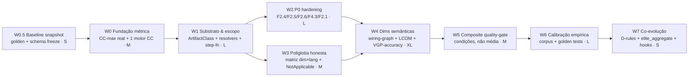

# Touring 50-Dim Quality Harness — Reforma Estrutural (Pln2)

> **Level**: L4 | **Authored**: 2026-07-02 | **Operator**: TACO-wt
> **Alvo**: `crates/touring-quality/` (50 verifiers, 18.036 LOC) + `crates/touring-analysis/src/quality/` (engines)
> **Método do diagnóstico**: 5 auditorias por subagent (F1.1-6 code-quality, F1.7-12+F2.13 arquitetura, F3.8-13+F3.1-4 docs/testing, F2.1-12 security/perf, F4.1-12+F3.5-7 best-practices) + 3 baterias empíricas (score em arquivos reais contrastantes Rust/Python file+dir; 6 gates BLOCK em alvos reais; resolução de contradição via VP-Scout).

---

## 0. Sumário Executivo (a impressão do Gabriel, confirmada)

A impressão — "o harness não está bem calibrado nem projetado para avaliar as melhores práticas, especialmente em qualidade/funcionalidade/arquitetura/documentação, e não é poliglota" — está **confirmada com evidência FACT [1.0]**. O problema é mais profundo que calibração: é de **fundação, substrato e agregação**, em três camadas que falham independentemente.

**A demonstração de uma linha**: um diretório 100% Python **sem README, sem CHANGELOG, sem nenhum ADR** recebe **Diamond 0.9959**; um arquivo com cognitive complexity 67 e MI 15 recebe **F1.1 = 1.000**; um workspace inteiro sem CI recebe **F4.7 ≈ Diamond por construção**.

**Nuance honesta (o que NÃO está quebrado)**: os 4 gates de segurança P0 (F2.1/F2.4/F2.5/F2.6) são **substancialmente melhores** que o resto — não usam a fórmula de densidade, são **size-independent** (1 secret num arquivo de 500 linhas → BLOCK) e usam engines reais (RustSec advisory DB, entropia de Shannon + provider markers, 10 detectores CWE regex). F4.5 pkg-mgmt é o **modelo de projeto correto** (parseia Cargo.toml/lock via crate `toml`, auto-resolve do artefato). `code_regions.rs` (lexer per-linguagem) é infraestrutura genuinamente sólida. A reforma **preserva e generaliza** esses acertos.

---

## 1. Ground Truth — as três camadas de falha

### Camada L1 — ENGINES (mecanismo de medição): espectro de qualidade

Os verifiers em `touring-quality` são wrappers finos; a lógica real está nos engines de `touring-analysis/src/quality/`. Esses engines vão de proxy-fraco a genuíno:

| Qualidade do engine | Dims | Evidência |
|---|---|---|
| **Genuíno (preservar)** | F2.4 (multi-sinal + entropia Shannon), F2.5 (RustSec DB in-process, `dep_health` toml-parse), F2.1 (10-CWE regex real via `SecurityAnalyzer`/`cwe_patterns.rs`), F4.5 (`DepHealthAnalyzer` parse real), F1.3 (clone Type-1 real), F1.8 (Kosaraju/petgraph), F3.1 (parser LCOV real), `code_regions.rs` (lexer per-lang), engines cicd/perf_tests (bem testados isoladamente) | ver relatórios |
| **Proxy substring sem AST** | F1.1 (memmem `if `/`=>`/`fn ` **sem masking**), F1.9/F1.10/F1.11/F1.12/F2.13, F2.2/F2.3, F2.7-F2.12, F4.1/F4.2/F4.4, todas as F3.8-F3.13 | `complexity.rs:219-220`, `1−density·6.0` |
| **Métrica mal rotulada** | F1.1 `max_complexity = total_branches ÷ function_count` = **média, não máximo** (`complexity.rs:68`) — dilui a função-monstro; propaga para F1.2 (MI) | diverge 8,5× do TDG (CC 2 vs 17 no mesmo arquivo) |
| **Não mede o que o nome diz** | F1.4 (não mede nenhum princípio SOLID — proxy `semantic_complexity`+`unsafe`), F3.12 (doc "accuracy" mede doctest-fence+TODO, não acurácia doc↔código), F4.3 (conta `#[allow(deprecated)]`, não uso de API deprecada) | `f1_4:76-80`, `doc_accuracy.rs`, `f4_3:83-92` |

### Camada L2 — SUBSTRATO / PIPELINE (a falha dominante): "motor certo, artefato errado"

Esta é a descoberta central da rodada 2. As dims de **artefato de repositório** (CI, IaC, config, manifests, README, CHANGELOG, ADR, runbooks) têm engines corretos que **nunca recebem o artefato**:

- **`SOURCE_EXTS` exclui os artefatos** (`verifications/mod.rs:72-75`): não contém `.md`/`.yml`/`.yaml`/`.toml`/`.tf`/`Dockerfile`/`.json`. Logo `enumerate_source_files` (`mod.rs:140-171`) nunca os enumera e o **`.github/` é pulado como dot-dir** (`mod.rs:153-156`).
- **ScopeNative alimenta blob de código** (`scope_report.rs:91-101`): cada F4.6-4.12 faz `read_target_source(root)` que **concatena os `.rs`** (cap 2 MiB, `mod.rs:110-126`), e `lang_from_ext(dir)` cai no default por-dim (`"yaml"`/`"tf"`/`"md"`) — o motor de CI escaneia **código Rust como se fosse YAML**.
- **Detectores de ausência acham needles no próprio blob** (T3): `cicd.rs:76-82` dispara na ausência da string `"clippy"`/`"cargo test"` — mas `#![allow(clippy::...)]` no código faz a string "existir" → gate reportado presente. F4.11 embute `RUNBOOK.md`/`SEV-1` como const (`incident.rs:56-71`) e busca por **substring**, nunca `Path::exists()` (`incident.rs:77-140`).
- **Consequência prática**: `elite_aggregate.py` / workspace-score reporta F4.6/4.7/4.8/4.9/4.11 ≈ Diamond **por construção**. Só valem se apontados diretamente ao arquivo exato (`touring-quality score .github/workflows/ci.yml --dims F4.7`), o que o harness nunca faz.
- **`.md` fora de SOURCE_EXTS** aplica o mesmo a F3.10/F3.11/F3.13: em scope de diretório, README/CHANGELOG/ADR reais **nunca são lidos**; as dims procuram `## Status`, `[Unreleased]` **dentro de arquivos `.rs`**.

**F4.5 é a exceção-modelo**: resolve o próprio manifesto via walk-up em disco (`dep_health:466-490`), não via `read_target_source`. É o padrão que TODAS as dims de artefato devem seguir.

### Camada L3 — SCORE / AGREGAÇÃO

- **Densidade dilui** (`score_utils.rs:44`): 9 dims de docs/testing colapsam na mesma reta `score = 1 − (weighted_total / max(lines,20)) · 6.0` com `SCALE = 6.0` mágico compartilhado. 10 gaps num arquivo de 600 linhas → density 0,017 → score ~0,90.
- **Denominador anti-monotônico**: quanto **maior** o repo, **menor** a punição pela mesma ausência de artefato.
- **`ScopeNative` mal atribuído**: F1.12/F2.13/F4.7-4.12 marcadas `ScopeNative` em `aggregate.rs` mas documentam `WeightedLoc` nas docstrings (drift T6) — em scope de dir rodam sobre o blob concatenado.
- **Allowlist global de `/tests/`+`/benches/`** (`is_detector_own_source`): F2.4 e F3.5 ficam **cegos exatamente onde os smells vivem** (secret real em fixture passa; smells de teste de integração passam).
- **Fail-open não-Rust**: F2.5 tem 3 saídas `return 1.0` (sem Cargo.lock, DB offline, non-manifest — `f2_5:113/129/104`); F4.5 dá 1.0 a repo npm/pip puro (T7). CI/máquina sem `~/.cargo/advisory-db` → gate P0 de CVE passa tudo silenciosamente.
- **Composite média-linear** (`composite.rs:32-45`): pesos 2.0/1.5/1.0 sobre ~44 dims presas em 0.85-1.0 → uma dim a 0.0 move ~1,5% → **Diamond estrutural** (o "Diamond ILLUSORY" de 21/06 persistindo na camada de score).

### Poliglotia — matriz de aplicabilidade real (FACT [1.0])

| Dim | Rust | Python | TS/JS | Go | Java | C/C++ | Comportamento fora do coberto |
|---|---|---|---|---|---|---|---|
| F1.1 complexity | ✅ | ✅ | ✅ | ✅ | ✅ | ✅ | ext desconhecida → régua Rust |
| F1.5 tech-debt | ✅ | ⚠ markers univ. | ⚠ | ⚠ | ⚠ | ⚠ | `todo!/allow` Rust-only → pass silencioso |
| F1.6 error-handling | ✅ | ❌ (unwrap/panic Rust) | ❌ | ❌ | ❌ | ❌ | floor 0.850 constante non-Rust |
| F1.7 boundaries | ✅ | ❌ | ❌ | ❌ | ❌ | ❌ | non-Rust → 1.0 vacuoso |
| F1.8 dep-cycles | ✅ Cargo | ❌ | ❌ | ❌ | ❌ | ❌ | non-Cargo → 1.0 |
| F2.5 dep-CVEs | ✅ | ❌ | ❌ | ❌ | ❌ | ❌ | non-Cargo → 1.0 (fail-open) |
| F2.8 memory | ✅ | ✅ | ❌ | ❌ | — | ✅ | Go/TS → 1.0 |
| F2.10 io | ✅ | ❌ | ✅ | ❌ | — | — | Python/Go → 1.0 (irônico) |
| F4.5 pkg-mgmt | ✅ | ❌ default | ❌ default | ❌ | — | — | npm/pip só em `--no-default-features` |
| F4.3 deprecated | ✅ | ❌ | ❌ | ❌ | — | — | non-Rust → 1.0 |

Padrão perigoso: quando não há detector, a dim retorna **Pass 1.0, não skip** — invisível no composite.

---

## 2. Princípios da Reforma (as 7 invariantes de projeto)

| # | Princípio | O que muda |
|---|---|---|
| **P1** | **Engine-first, threshold-later** | Não recalibrar proxies — religar aos motores nativos do Touring: `touring-code` (tree-sitter/syn/ast-grep), wiring graph (`analyze_wiring`, cycles, impact), `cargo_metadata`, TDG. A calibração vem depois, sobre um sinal correto. |
| **P2** | **Substrato-certo (modelo F4.5)** | Toda dim de artefato resolve seu próprio artefato em disco por glob (`.github/**`, `Dockerfile`, `*.tf`, `README*`, `CHANGELOG*`, manifests) — nunca `read_target_source` do blob de código. |
| **P3** | **`NotApplicable` explícito ≠ pass silencioso** | Novo `DimStatus::NotApplicable` sai do **denominador** do composite. `Lang::Other`, non-Cargo, artefato-ausente-por-linguagem nunca pontuam 1.0. |
| **P4** | **Artefato-ausente = step-function** | Ausência de README/CI/lockfile/ADR = **cap duro** (ex. 0.3), não densidade diluída. Presente-mas-incompleto usa densidade. |
| **P5** | **Per-language sempre (abolir blob)** | Score-per-file com `Lang` real → agregação por linguagem. Nenhum verifier vê concatenação multi-linguagem rotulada `"rust"`. |
| **P6** | **Fail-closed nos 6 BLOCK** | Erro de leitura/parse/DB-offline nos P0 → `Fail`, não `Pass`. Allowlists mínimas e auditáveis (pragma explícito para fixtures, não path-glob global). |
| **P7** | **Calibração com corpus** | Testes de **valor absoluto** contra fixtures conhecidas boas/ruins por dim×linguagem + cross-check com TDG/clippy/e2e. Hoje só há testes de **ordering**. |

---

## 3. Waves (W0.5 → W7)

### DAG



**Caminho crítico**: W0.5(1) + W0(3) + W1(6) + W2(6) + W4(9) + W5(3) + W6(5) + W7(1) = **34 dias worst-case**; W3 corre em paralelo a W2; best-case ~22 dias.

---

### W0.5 — Baseline Snapshot (P7 preparatório) — **[S]** — sem dependências

**Por quê primeiro**: a reforma vai mudar scores de consumers que hoje dependem do harness (`elite_aggregate.py`, `harness_gate.py`, os 6 hooks BLOCK em `settings.json`, `touring-elite`). Sem baseline, não há como distinguir "correção" de "regressão".

**Subtasks**:
- **W0.5.1** — Congelar `schema_version` (hoje `1`, visto em JSON output) e bumpar para `2` ao fim; documentar o contrato JSON (`value`/`status`/`evidence`/`composite`/`tier`).
- **W0.5.2** — Rodar `touring-quality score` sobre um conjunto fixo de alvos (10 arquivos + 3 dirs, Rust+Python+TS) e salvar os scores atuais como `docs/plans/.../baseline-scores.json` (golden de regressão-consciente, não de correção).
- **W0.5.3** — Inventariar consumers: `grep -rl "touring-quality\|touring_quality" ~/.claude/` → lista de quem quebra ao mudar semântica.

**Gate**: baseline-scores.json existe; lista de consumers documentada. `cargo check -p touring-quality` exit 0.

---

### W0 — Fundação Métrica (P1) — **[M]** — depende: W0.5

**Alvo**: o erro que envenena F1.1 e F1.2.

**Subtasks**:
- **W0.1** — Substituir `max_complexity = branches ÷ fns` (`complexity.rs:68`) por **máximo real de CC por função** via AST de `touring-code` (tree-sitter/syn já disponíveis no workspace). `max_complexity` deve ser o max, `avg_complexity` um campo separado.
- **W0.2** — **Unificar num único motor de CC**: `estimate_complexity` (substring) e o motor TDG divergem 8,5×. Eleger o AST-based como fonte única; `touring-quality` e `touring ast tdg` consomem o mesmo. Elimina a dissonância evidence↔score.
- **W0.3** — Mascarar comentários/strings no contador (reusar `code_regions.rs`, que já existe e é sólido) para F1.1 antes de contar branches.
- **W0.4** — Cognitive complexity real (incrementos por aninhamento + sequências booleanas + recursão, à la SonarQube) em vez de `depth/3`; ligar ao score de F1.1 (hoje o cognitive aparece na evidence mas não pesa).

**Gate**: arquivo candle_bge.rs (CC real 17) deixa de pontuar F1.1=1.000; golden test de valor absoluto (CC conhecido → score esperado). `cargo test -p touring-analysis -p touring-quality` 0 falhas.
**Símbolos a verificar (VGP pré-wave)**: `estimate_complexity`, `ComplexityMetrics`, `code_regions::non_executable_regions`, o motor de CC do TDG (`touring ast tdg` backend).
**Risco**: R3 (custo AST em workspace-score) — mitigar com cache blake3 per-file.

---

### W1 — Substrato & Escopo (P2, P4, P5) — **[L]** — depende: W0

**Alvo**: a falha dominante — dims de artefato nunca veem o artefato.

**Subtasks**:
- **W1.1** — Introduzir `enum ArtifactClass { SourceCode, CiWorkflow, Dockerfile, Iac, Manifest, Doc, Runbook }` e um resolvedor `resolve_artifacts(scope, class) -> Vec<PathBuf>` que faz **glob em disco** (`.github/**/*.yml`, `**/Dockerfile`, `**/*.tf`, `README*`, `CHANGELOG*`, `docs/**/adr/*`, `Cargo.toml`/`package.json`/`pyproject.toml`) — modelo copiado de `dep_health::resolve_manifest`.
- **W1.2** — Cada dim de artefato (F3.10, F3.11, F3.13, F4.6, F4.7, F4.8, F4.9, F4.11) passa a consumir `resolve_artifacts` em vez de `read_target_source`. Incluir `.github/` na travessia (hoje pulado como dot-dir — exceção explícita para `.github`).
- **W1.3** — **Abolir o blob multi-linguagem**: `read_target_source` de diretório deixa de concatenar; toda dim roda per-file via `enumerate_source_files` com `Lang` real (P5). Remover o cap de 2 MiB silencioso.
- **W1.4** — **Step-function para artefato-ausente** (P4): `resolve_artifacts` vazio → score = cap duro (0.3) com evidence "artefato X ausente no repositório", não densidade≈1.0.
- **W1.5** — Corrigir o drift `AGG_TABLE` ↔ docstrings: reclassificar F1.12/F2.13 (`ScopeNative`→`WeightedLoc`, pois são per-file) e confirmar F4.7-4.12 como artefato-resolvido (não blob).

**Gate**: dir Python sem README → F3.11 ≤ 0.3 (não 0.985); workspace sem `.github/` → F4.7 ≤ 0.3; `score .github/workflows/ci.yml --dims F4.7` continua funcionando. Golden tests de presença/ausência.
**Símbolos VGP**: `read_target_source`, `enumerate_source_files`, `SOURCE_EXTS`, `Scope::resolve`, `score_scope_native`, `resolve_manifest` (modelo).

---

### W2 — P0 Hardening (P6) — **[L]** — depende: W1 — ‖ com W3

**Alvo**: fechar os FN dos 6 gates fail-closed sem quebrar o que já funciona.

**Subtasks**:
- **W2.1 (F2.4 secrets)** — Estreitar `is_detector_own_source` (`f2_4:565`): remover o allowlist global de `/tests/` e `/benches/`; substituir por **pragma explícito** de fixture (ex. comentário `// touring-quality:allow-secret fixture`) na linha. Secret real em teste volta a ser detectado. (Foi o motivo do allowlist de 25/06 — mitigar FP-cascade com o pragma, não com path-glob.)
- **W2.2 (F2.5 dep-CVEs)** — Fechar as 3 saídas fail-open (`f2_5:113/129/104`): DB offline → `Fail` com evidence "advisory-db indisponível — não foi possível verificar" (não Pass); non-Cargo → `NotApplicable` (P3), não 1.0. Adicionar backend OSV para npm/pip/go **ou** `NotApplicable` honesto.
- **W2.3 (F2.6 config)** — (a) escanear arquivos de config reais (via W1 `ArtifactClass::Iac`/config-files: yaml/toml/env/Dockerfile); (b) expandir catálogo (0.0.0.0-bind, default-creds, headers ausentes, HSTS, k8s-privileged, USER root); (c) recalibrar para misconfigs graves bloquearem **sozinhas** (Flask `debug=True` = RCE Werkzeug hoje é só WARN).
- **W2.4 (F4.3 deprecated)** — Trocar "conta `#[allow(deprecated)]`" por detecção real de **uso de API deprecada** via diagnostics do rustc/clippy (ou cargo-deny). Parar de penalizar `#[allow]` legítimo de migração.
- **W2.5 (F2.1 OWASP)** — Adicionar taint-lite para injection interpolada sem literal de payload (`execute(f"...{uid}")`, `format!("SELECT...{}", x)`) — o FN confirmado. (`shell=True` já é corretamente detectado; o Pass 1.000 que observei era comentário, region-suppression correta.)

**Gate**: secret em fixture volta a BLOCK; F2.5 offline → Fail; Flask debug=True sozinho → BLOCK; uso de API deprecada sem `#[allow]` → detectado. Nenhum FP novo nos 6 hooks BLOCK do settings.json (validar contra W0.5 baseline).
**Símbolos VGP**: `is_detector_own_source`, `SecurityDb`, `ConfigSecurityAnalyzer`, `cwe_patterns`, `DimStatus`.
**Risco**: R2 (FP-cascade ao estreitar F2.4) — prob HIGH, impacto MEDIUM; mitigar com o pragma de fixture + rodar o auto-scan antes/depois.

---

### W3 — Poliglotia Honesta (P3, P5) — **[M]** — depende: W1 — ‖ com W2

**Subtasks**:
- **W3.1** — Declarar em código a **matriz de aplicabilidade** `dim × language` (uma tabela `const` — quais linguagens cada dim realmente mede). Fonte única de verdade para P3.
- **W3.2** — Semântica `DimStatus::NotApplicable`: dim não-aplicável à linguagem sai do **denominador** do composite (`composite.rs`). `Lang::Other` e ext desconhecida → `NotApplicable`, nunca régua-Rust nem 1.0.
- **W3.3** — Detectores per-lang faltantes de alto valor: F1.6 error-handling para Python (`except: pass`, bare except, `.ok()` engolido), JS (`catch {}` vazio), Go (`err` ignorado); F2.8 memory para Go/TS; F2.10 io para Python (blocking em async).
- **W3.4** — `evidence` passa a declarar a linguagem-real detectada e "N/A para <lang>" quando aplicável — fim do rótulo `(rust)` em arquivo Python.

**Gate**: dir Python não recebe mais dims Rust-only como Pass 1.0 — recebe `NotApplicable` (fora do composite); `except: pass` em Python → F1.6 penaliza. Composite de projeto poliglota reflete só dims aplicáveis.
**Símbolos VGP**: `DimStatus`, `Enforcement`, `Lang`, `lang_from_ext`, `compute_composite`.

---

### W4 — Dims Semânticas (P1) — **[XL]** — depende: W2, W3

**Alvo**: religar as dims que **fingem escopo global** à inteligência de grafo nativa. Sub-waves independentes por dim (mitigação R4).

**Subtasks**:
- **W4.1 (F1.7 boundaries + F1.12 arch-consistency)** — Consumir o **wiring graph** (`analyze_wiring`, `wiring impact/chains`) e `cargo_metadata` para medir acoplamento/coesão reais e **política de camadas declarada** (à la dependency-cruiser `forbidden` / ArchUnit) — não heurística textual intra-arquivo.
- **W4.2 (F1.8 dep-cycles)** — Estender além do top-level: detectar ciclos entre submódulos e via `use super::`; opcionalmente consumir `touring wiring cycles` (Tarjan já existe no daemon) em vez do Kosaraju hermético limitado.
- **W4.3 (F1.3 duplication)** — Duplicação **cross-file** (a dominante) via token-hashing entre arquivos, não só intra-arquivo; considerar Type-2 (identificadores normalizados).
- **W4.4 (F1.4 SOLID)** — Métricas reais: LCOM (falta de coesão), fan-in/fan-out (do wiring graph, já disponível), profundidade de herança/trait — em vez de proxy `semantic_complexity`+`unsafe`.
- **W4.5 (F3.12 doc-accuracy)** — Acurácia real: extrair símbolos citados nos doc-comments e verificá-los contra o índice via `touring index find` (VGP — o Touring TEM isso). Doc que cita símbolo inexistente → penalizar.
- **W4.6 (F3.1 coverage)** — Opção de **rodar** `cargo llvm-cov` (ou consumir artifact) em vez de só proxy test_fns/pub_fns; branch/region coverage além de line.
- **W4.7 (F3.6 sec-tests, F3.7 perf-tests, F3.3 test-pyramid)** — Matching **cross-file** produção↔teste (arquivo `src/auth.rs` ↔ `tests/auth_test.rs`) em vez de assumir teste inline; parar de penalizar lib crate por não ter Playwright/criterion inline (FP estrutural confirmado).

**Gate**: F1.7/F1.12 detectam violação de camada real num fixture; F1.3 pega helper copiado em 5 arquivos; F3.12 pega doc com símbolo fantasma; F3.6/3.7 não penalizam mais lib crate com testes em `tests/`. Golden tests por sub-wave.
**Símbolos VGP**: `analyze_wiring`, `analyze_duplication`, `RustSemanticReport`, `SecurityAnalyzer`, `touring index find` API, `analyze_arch_consistency`.
**Risco**: R4 (escopo XL) — prob HIGH, impacto MEDIUM; mitigar com sub-waves independentes e shippáveis isoladamente.

---

### W5 — Composite Quality-Gate (P6) — **[M]** — depende: W4

**Alvo**: o tier-badge estrutural.

**Subtasks**:
- **W5.1** — Substituir a média linear (`composite.rs:32-45`) por **quality-gate condicional** estilo SonarQube: BLOCK = worst-of das 6 dims P0 (qualquer Fail → tier degradado, não diluído); WARN dims = mediana/pior-k; tier exige **condições** (ex. "0 BLOCK falhos AND mediana WARN ≥ 0.8"), não média ≥ threshold.
- **W5.2** — `NotApplicable` (de W3) fora do denominador em todo o cálculo.
- **W5.3** — Tier por-dim opcional (uma dim crítica pode exigir Diamond enquanto advisory exige Gold).

**Gate**: arquivo com 1 BLOCK Fail não pode ser Diamond; dir sem docs não pode ser Diamond; composite discrimina (distribuição de scores num corpus deixa de estar comprimida em 0.85-1.0). Comparar histograma pré/pós contra W0.5.

---

### W6 — Calibração Empírica (P7) — **[L]** — depende: W5

**Subtasks**:
- **W6.1** — Corpus de fixtures `dirty`/`clean` por dim × linguagem (arquivos sabidamente bons e ruins) em `crates/touring-quality/tests/corpus/`.
- **W6.2** — **Golden absolute-value tests**: cada fixture tem score esperado com tolerância (hoje só há testes de ordering `good>bad`).
- **W6.3** — Cross-check: rodar clippy/ruff/TDG/e2e sobre o corpus e correlacionar com os scores do harness (detectar divergências como a de 8,5× no CC).
- **W6.4** — Recalibrar `SCALE`, pesos e thresholds contra o corpus (agora sobre sinal correto, per P1) — só aqui a "calibração de threshold" faz sentido.
- **W6.5** — Histograma de scores do workspace inteiro pré/pós — validar que o composite voltou a discriminar.

**Gate**: correlação harness↔clippy/TDG acima de limiar definido; golden tests passam; histograma mostra distribuição espalhada (não comprimida no topo).

---

### W7 — Co-evolução (docs + consumers) — **[S]** — depende: W6

**Subtasks**:
- **W7.1** — Atualizar as 50 D-rules (`~/.claude/skills/touring-elite/references/quality/D01..D52.md`) para descrever o mecanismo real reformado.
- **W7.2** — Atualizar `elite_aggregate.py` + `harness_gate.py` para o novo schema/semântica (schema_version 2).
- **W7.3** — Revisar os 6 hooks BLOCK em `settings.json` (agora fail-closed corretos).
- **W7.4** — Atualizar `~/.claude/rules/elite-50-quality.md` (keystone) + `SKILL.md` do Touring.
- **W7.5** — Memory lesson + RL reward + checkpoint .toon de fechamento.

**Gate**: `python3 docs/elite_aggregate.py --check` funciona com schema 2; D-rules sem comando alucinado; drift docs↔código = 0.

---

## 4. Riscos & Mitigações

| # | Risco | Prob | Impacto | Mitigação |
|---|---|---|---|---|
| **R1** | Regressão de consumers (elite_aggregate/harness_gate/hooks) por mudança de semântica | MEDIUM | HIGH | W0.5 golden baseline + schema_version bump + W7 atualiza consumers em lockstep |
| **R2** | FP-cascade ao estreitar allowlist F2.4 (motivo do allowlist de 25/06) | HIGH | MEDIUM | Pragma de fixture explícito em vez de path-glob; rodar auto-scan antes/depois |
| **R3** | Custo de AST em workspace-score (W0/W4) | MEDIUM | MEDIUM | Cache blake3 per-file (padrão já usado no `ast_grep_signal`); reusar índice do daemon |
| **R4** | W4 escopo XL estoura | HIGH | MEDIUM | Sub-waves W4.1-W4.7 independentes e shippáveis isoladamente |
| **R5** | Novos backends poliglotas (OSV, npm/pip) trazem deps pesadas | LOW | MEDIUM | Preferir `NotApplicable` honesto onde o backend não existir; backend atrás de feature-flag |
| **R6** | Divergência CC ao unificar 2 motores quebra TDG consumers | MEDIUM | MEDIUM | W0 unifica com golden test; validar `touring ast tdg` contra baseline |

---

## 5. Verificação (gate universal por wave)

```bash
cd ~/.claude/rust
# saúde
touring doctor -j | jq '.[] | select(.status!="ok")'          # vazio
# build + testes do escopo
cargo check -p touring-quality -p touring-analysis             # exit 0
cargo test -p touring-quality -p touring-analysis              # 0 falhas
cargo clippy -p touring-quality -p touring-analysis -- -D warnings  # 0
# regressão-consciente (contra W0.5 baseline)
touring-quality score <alvos-baseline> --format json > /tmp/post.json
python3 diff-scores.py baseline-scores.json /tmp/post.json     # só mudanças esperadas
# golden absolute-value (W6)
cargo test -p touring-quality --test corpus_golden             # 0 falhas
# persistência
touring memory store --tier semantic "wave:harness-reform-<W>:complete" "<summary>"
touring learning reward orchestrate 1.0 "harness-reform-<W>-complete"
```

---

## 6. Out of Scope (explícito)

- Reescrever o crate do zero (a arquitetura de trait `Verification` + dispatch table + scope layer é sólida; a reforma é cirúrgica).
- Adicionar novas dimensões além das 50 (F5+).
- Substituir engines de terceiros (clippy/ruff) — o harness os complementa, não os reimplementa.
- Mudar a taxonomia F1-F4 ou os pesos de enforcement Block/Warn/Advisory (só a **agregação** muda em W5).

---

## 7. Symbol Verification Table (plan-level, REGRA #15)

| Símbolo | Categoria | Evidência | Arquivo:linha |
|---|---|---|---|
| `estimate_complexity` | `verified_existing` | grep + leitura | `touring-analysis/src/quality/complexity.rs:25` |
| `max_complexity` (campo) | `verified_existing` | `= branches/fns` | `complexity.rs:68` |
| `read_target_source` | `verified_existing` | blob concat 2 MiB | `touring-quality/src/verifications/mod.rs:110` |
| `enumerate_source_files` | `verified_existing` | per-file, sem cap | `mod.rs:140` |
| `SOURCE_EXTS` | `verified_existing` | sem md/yml/toml/tf | `mod.rs:72` |
| `AGG_TABLE` / `AggKind` | `verified_existing` | ScopeNative/WeightedLoc/etc | `aggregate.rs:52` |
| `score_scope_native` | `verified_existing` | run 1× no root | `scope_report.rs:88` |
| `compute_composite` | `verified_existing` | média linear | `composite.rs:32` |
| `is_detector_own_source` | `verified_existing` | allowlist /tests/ | `f2_4:565`, `f3_5:107` |
| `DepHealthAnalyzer` / `resolve_manifest` | `verified_existing` | modelo P2 | `dep_health.rs:466` |
| `SecurityDb` (RustSec) | `verified_existing` | 3 saídas fail-open | `f2_5:113/129/104` |
| `code_regions::non_executable_regions` | `verified_existing` | lexer per-lang | `code_regions.rs` |
| `DimStatus::NotApplicable` | `to_be_created` | novo variant (W3) | — |
| `ArtifactClass` / `resolve_artifacts` | `to_be_created` | novo enum+fn (W1) | — |

---

## 8. Operating Handoff (TACO-wt)

```bash
# DAG já criado: task_1782963794901399014 (9 waves W0.5-W7)
touring decompose status task_1782963794901399014 -j
# Executar wave por wave via TACO-wt / touring-engineer (mode=acceptEdits), gate por wave.
# Cross-audit final: /TACO-cross-audit sobre crates/touring-quality + touring-analysis/src/quality.
```

**Diagnóstico-fonte** (memória): `audit:touring-quality-calibration-diagnosis:2026-07-02` + este plano.
**Relatórios das 5 auditorias**: sessão 59f9e30c, 2026-07-02 (F1.1-6, F1.7-12+F2.13, F3.8-13+F3.1-4, F2.1-12, F4.1-12+F3.5-7).

---

## 9. 9-Dimensões (Pln1 → Pln2)

| Dim | Pln2 | Justificativa |
|---|---:|---|
| precisão | 9.0 | cada achado com file:line verificado; 5 auditorias + 3 baterias empíricas |
| escalabilidade | 8.5 | waves independentes; W4 sub-waves shippáveis |
| performance | 8.0 | R3 mitigado com cache blake3; benchmark em W6 |
| funcionalidade | 9.0 | religa aos engines reais; gates fail-closed corretos |
| qualidade | 9.0 | golden tests de valor absoluto (P7) |
| detalhe | 9.5 | 3 camadas L1/L2/L3 + matriz poliglota + 40+ subtasks |
| integração | 9.0 | consome wiring graph/cargo_metadata/index nativos |
| dependências | 8.5 | DAG acíclico W0.5→W7; deps explícitas |
| potenciação | 9.0 | REGRA #0 — usa a inteligência nativa do Touring (a cura está dentro) |

**Composite Pln2**: ~8.8.
