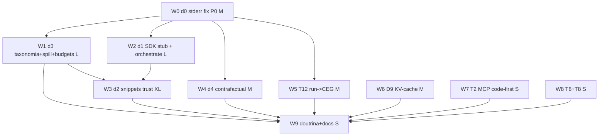

# Code Mode Máximo (Pln2)

> **Level**: L4 (architecture, multi-crate) | **Baseline**: e2e 0.8584 · orphans 2516 · doctor 7/7 ok · touring 30.4.13 | **Scope**: 9 waves, 4 crates Rust + adw.py + hooks Python + rules
> **Estratégia-mãe**: [strategy-2026-08-23-code-mode-best-practices.md](/strategy-2026-08-23-code-mode-best-practices.md) (25 práticas P1–P25; oportunidades T1–T15 ≡ diretivas D0–D9 decididas por Gabriel 23/08 ~22:23)
> **Backlog canônico**: DAG `task_1787534694944647530` (projeto analise) — este plano DETALHA a execução do lado touring (d0–d4 + T2/T6/T8/T12/D9) e adiciona as fases de doutrina.

## 1. Ground Truth Summary

- **Saúde** [FACT]: `touring e2e --depth standard` = **0.8584 pass** · `touring doctor` 7/7 ok · orphans workspace = **2516** (baseline registrada no gate) · `ground_truth.json` no bundle `/data/`.
- **Bug d0 reproduzido em primeira mão nesta sessão** [FACT]: `touring run --lang python --code 'print("stdout-ok"); print("stderr-marker", file=sys.stderr); sys.exit(3)'` → `{stdout:"stdout-ok\n", stderr:"", stderr_truncated:false, exit_code:3}`; bash `>&2` idem (`exit_code:5`, `stderr:""`).
- **Contadores** [FACT, gate-metrics]: `ceg_captured_count=38`, `ceg_sandboxed_count=0`, `sandbox_tee_persisted_count=0`, `pillar_induction_{emitted,followed}=0/0`.
- **Terreno VGP** [FACT — scout dedicado, leitura direta, file:line]:
  - `RunCli`/`run`/`emit_output`/`resolve_code`/`maybe_inject_sdk` — `crates/touring-server/src/cli/run.rs:105/160/197/221/242`; registro `command_table.rs:131`.
  - `ctx_execute_impl` — `crates/touring-server/src/tools/ctx_execute_tools.rs:176`; `CtxExecuteOutput{stdout,stderr,exit_code,duration_ms,forbidden_calls,stdout_truncated,stderr_truncated}` — `:88`; **stderr hardcoded `String::new()` no caminho de sucesso — `:258`**; caps divergentes `MAX_STDOUT=8*1024`/`MAX_STDERR=4*1024` — `:262-263` (vs `max_output_bytes:1_000_000` em `:213-217`).
  - `spawn_and_capture` — `crates/touring-ceg/src/gateway/sandbox_executor.rs:328`; **stderr pipeado em `:342` e NUNCA lido (só `child.stdout.take()` em `:348`)**; `SandboxResult` (`:56`) **sem campo stderr**; risco de deadlock com pipe cheio (64 KiB); `timeout_outcome` exit `-2` — `:423`; tee `store_tee`/`read_tee` (`:767`/`:799`) só quando `exit_code != 0`.
  - CEG: `run_gateway` — `crates/touring-ceg/src/gateway/pre_exec.rs:208` (X1→X7, X3/X5 inskipáveis); `BuiltinProfile{ReadOnly,StagedWrite,Trusted,Sandboxed}` — `capability/builtins.rs:27-33`; `CapabilityProfile` — `capability/profile.rs:48`. **⚠ `touring run` NÃO passa pelo CEG** (chama `ctx_execute_impl` direto, `run.rs:175`); só a família `touring exec` (11 comandos, `command_table.rs:715-816`) exerce o gateway.
  - `--orchestrate` [FACT]: `TOURING_PY_SDK` — `run.rs:32-92` (Python-only, recusa outras langs em `:246-251`); 6 bindings via socket Unix (`touring.query/index_find/ast_blast/ast_overview/wiring_status/search`); **⚠ sem allowlist server-side de hooks read-only** (follow-up declarado em `run.rs:28-31`).
  - Suggester: `render` — `crates/touring-cli/src/cli_suggester.rs:2010`; `code_mode_command` `:2157`; `master_cli_nudge` `:2692`; `pillar_induction_armed` `:2537`; contabilidade STR `record_emission` `:2939`.
  - Memória/snippets: `Facet` (7) — `crates/touring-intelligence/src/rl/memory/tags.rs:189`; `RichMemoryEntry{…, outcome_reward:Option<f64>, …}` — `rlm.rs:156`; codetag harvest `sync_codetag_anchors` ← `post_edit.rs:137`/`post_write.rs:229`; portfolio `CapabilityEntry{purpose,…}` — `crates/touring-foundation/src/portfolio/mod.rs:188`. **⚠ NÃO existe `executions`/`success_rate` em memória/snippet/portfolio** (grep zero; só `outcome_reward` e `tier_access_counts`).
  - `cli_learning_reward` — `crates/touring-hook-runtime/src/ceg_impls.rs:16` (clamp [−1,1] → `ImmediateReward`; `latency_ms/cila_level/file_type` hardcoded).
  - MCP: `CURATED_TOOLS` (23) — `crates/touring-server/src/server/mod.rs:74-104`; 159 `#[tool]` registradas; `touring_ctx_execute` — `server/tools_ctx_execute.rs:24-27` chama a MESMA `ctx_execute_impl`.
  - ADW: runner é `adw.py` (3068 L, live `~/.claude/skills/Touring/scripts/`, espelho `client/`); `_claude_cmd` — `adw.py:1499` (`tier` → `--model` via `tier_models()`; **⚠ sem campo `effort`**); `_agent_claude` — `:1530`.
  - Hooks com injeção VARIÁVEL por prompt (D9) [FACT]: `session_startup_intelligence.py` (timestamps "há Xmin" `:177-181`, composite 4 casas `:334-336`, ~10 contadores vivos `:388-430`, `({count}×)` `:455-456`); `session_hooks.rs:283-287` (contadores vivos); `cli_suggester.rs` (`conf`, `sig=`, lições, "(cached 300s)"); `prompt_enhance.rs:346-427`; `loop_outer_arm.py:205-216`.
  - Testes: `ctx_execute_e2e.rs` (padrão `#[test]`+`block_on`, skip gracioso; **⚠ nenhum teste assere `stderr` no sucesso** — `test_error_propagation:205-225` só olha stdout/exit); `sandbox_executor.rs:832+` (36 testes inline); **⚠ touring-ceg e touring-cli sem dir `tests/`** (cobertura inline).
- **Lições aplicadas** [memory]: `strategy:code-mode-best-practices-2026-08-23` · `gotcha:touring-run-stderr-engolido-2026-08-23` · `feedback_real_exit_codes` · REGRA #21/#0.

## 2. 9-Dimension Scores (current → target)

| Dim | Cur | Tgt | Amplificação aplicada |
|---|---|---|---|
| a Precision | 9 | 9 | todo símbolo citado tem file:line + assinatura do scout VGP |
| b Scalability | 8 | 8 | taxonomia/spill/stats como tipos extensíveis (enums + serde default), não one-offs |
| c Performance | 7 | 8 | budgets duplos com cgroup v2 (enforcement já ativo); caps unificados; latências-alvo por wave |
| d Functionality | 8 | 9 | potencializa tee/orchestrate/portfolio EXISTENTES (REGRA #0) em vez de criar paralelos |
| e Quality | 8 | 9 | todo S-N tem teste NOMEADO; regressão stderr fail-closed |
| f Detail | 8 | 9 | schemas de entrada/saída em todo contrato novo; edge cases enumerados |
| g Integration | 8 | 9 | W5 liga run→CEG (a maior costura); W3 liga snippets→reward→portfolio→suggester |
| h Dependencies | 8 | 8 | zero deps novas (tokio/serde/rusqlite já presentes); adw.py stdlib |
| i Potentiation | 8 | 9 | matriz §6; cada wave destrava a seguinte |

## 3. Phases (W0…W8 + W9 doutrina)

> Convenção: **[Sev]** P0-P3 · **[T-shirt]** S/M/L/XL · confidence FACT salvo marcação. Todos os subtasks ganham ticket `--kind implementation --fog clear` exceto onde marcado (`hazy` = decisão embutida).

### Phase 0 — W0: d0: stderr real no sandbox [P0] [M] — pré-requisito de tudo

- **S-0.1 Drenar stderr concorrentemente** — `crates/touring-ceg/src/gateway/sandbox_executor.rs:328-421` [FACT 1.0]
  - Source truth: `:342` pipeia stderr; `:348` só `child.stdout.take()`; leitura única em `read_fut` (`:352-370`).
  - Change: `let stderr_handle = child.stderr.take();` + segundo futuro de leitura; `tokio::join!` dos dois pipes ANTES do `wait()` (elimina o deadlock de pipe cheio); `SandboxResult` ganha `stderr_bytes: u64` + `stderr_content: Option<String>` (cap próprio, serde default — aditivo, não quebra consumidores).
  - Blast: `SandboxResult` tem consumidores em `ctx_execute_tools.rs`, `exec.rs`, testes inline (36) — verificar com `touring wiring impact SandboxResult --depth 2` na execução.
  - Test: `sandbox_captures_stderr_alongside_stdout`, `sandbox_stderr_full_pipe_does_not_deadlock` (escrever >64KiB em stderr; deve terminar sem timeout).
- **S-0.2 Materializar stderr no adaptador** — `crates/touring-server/src/tools/ctx_execute_tools.rs:250-261` [FACT 1.0]
  - Source truth: `:258` `(stdout_str, String::new(), r.exit_code)`.
  - Change: propagar `r.stderr_content`; compor com o prefixo `[CEG WARNING]` existente (`:266-276`); `stderr_truncated` honesto (cap real aplicado).
  - Test: `ctx_execute_returns_python_traceback_in_stderr`, `ctx_execute_returns_bash_stderr_marker` (as duas sondas desta sessão viram testes).
- **S-0.3 Timeout rotulado** — `sandbox_executor.rs:423` + `ctx_execute_tools.rs` [FACT 1.0]
  - Change: `timeout_outcome` inclui marcador de causa; adaptador emite `stderr: "timeout after {ms}ms (wall clock); partial stdout retained"` — mensagem-que-ensina (P9/P15 mínimo; taxonomia completa em W1).
  - Test: `ctx_execute_timeout_labels_cause`.
- **S-0.4 Tee inclui stderr** — `sandbox_executor.rs:767-799` [FACT 1.0]
  - Change: `store_tee` persiste os DOIS canais (arquivo `.stderr` irmão) quando exit ≠ 0.
  - Test: `tee_persists_stderr_on_failure`.
- **Enables**: W1 (taxonomia precisa do canal), self-healing (P6), action-outcome learning com sinal real, provável desbloqueio de `ceg_sandboxed_count`.

### Phase 1 — W1: d3: taxonomia de falha + spill com locator + budget duplo [P1] [L] (depende W0)

- **S-1.1 Taxonomia ortogonal** — `ctx_execute_tools.rs:88` (struct) + `sandbox_executor.rs` [FACT 1.0]
  - Change: `CtxExecuteOutput` ganha `failure: Option<RunFailure>` com `RunFailure{kind: RunFailureKind, phase: RunPhase, message: String}`; `enum RunFailureKind {Exception, Timeout, Abort, ProcExit, InvalidOutput, OutputLimit}` (dsh, 6 kinds — "budget expiry is not an exception"); `enum RunPhase {Parse, Spawn, Execute}`; toda `message` redigida para autocorreção do modelo (P9/P15). Campos aditivos (serde default).
  - Test: `failure_kind_timeout_is_not_exception`, `failure_message_names_next_action`.
- **S-1.2 Output-limit explícito + spill com locator** — `ctx_execute_tools.rs:262-263` + `sandbox_executor.rs:767` [FACT 1.0]
  - Source truth: caps 8KB/4KB divergem do 1MB do sandbox; tee existe mas só em falha e `sandbox_tee_persisted_count=0`.
  - Change: estouro do cap → `kind: OutputLimit` + spill SEMPRE (sucesso incluído): `stored_path` + preview head/tail + `retrieval_hint: "Read <path> --offset N --limit M | grep <pattern> <path>"` (P19; a resposta ao gap do TanStack). Caps configuráveis (`TOURING_RUN_MAX_STDOUT_BYTES`), default alinhado.
  - Test: `output_limit_is_named_failure_with_locator`, `spill_preview_head_tail_within_cap`.
- **S-1.3 Budget duplo (busy + wall)** — `sandbox_executor.rs:328+` [INFERENCE 0.8: cgroup v2 disponível — o log de enforcement declara "cgroup v2: group-level capping available"]
  - Change: `compute_ms` medido via `cpu.stat` do cgroup do child (usage_usec) com polling 25ms; fallback `/proc/<pid>/stat` (utime+stime); wall clock mantido. Estouro de busy → `kind: Timeout, phase: Execute, message` distinguindo busy de wall. `SandboxConfig` ganha `compute_ms: Option<u64>` (default 60_000).
  - Test: `busy_budget_expires_on_hot_loop_despite_io_wait`, `io_wait_does_not_consume_busy_budget`.
- **Enables**: self-healing completo (o modelo escolhe a correção certa por kind), W3 (stats de sucesso confiáveis), KPI honesto de sandbox.

### Phase 2 — W2: d1: SDK stub tipado + orchestrate potencializado [P1] [L] (depende W0; paraleliza com W1)

- **S-2.1 Allowlist server-side de hooks read-only** — `run.rs:28-31` (follow-up declarado) + daemon dispatch [FACT 1.0]
  - Change: allowlist explícita dos hooks aceitos via socket do orchestrate (`cli-index-find`, `cli-ast-blast`, `cli-ast-overview`, `cli-wiring-status`, `cli-search-docs`, + os novos de S-2.2); hook fora da lista → erro que ensina ("hook X is not in the read-only allowlist; available: […]"). Fecha o débito de segurança ANTES de ampliar a superfície.
  - Test: `orchestrate_socket_rejects_non_allowlisted_hook`.
- **S-2.2 Ampliar bindings read-only** — `run.rs:32-92` [FACT 1.0]
  - Change: `touring.memory_recall(q)`, `touring.tantivy_search(q)`, `touring.wiring_impact(symbol, depth)`, `touring.portfolio(intent)` — 4 novos métodos no `_TouringClient` (hooks já existentes no registry). 1 execução passa a fazer descoberta+análise+síntese completa (P1).
  - Test: `orchestrate_new_bindings_roundtrip` (e2e com daemon).
- **S-2.3 Stub .pyi determinístico (KV-cache-estável)** — novo `crates/touring-server/src/cli/run_sdk_stub.rs` [hazy → ticket decision: stub no nudge vs flag `--sdk-stub`] [INFERENCE 0.8]
  - Change: gerador do stub tipado do SDK (blueprint dsh `py-types.ts`: TypedDict por payload + `class Tools(Protocol)` + docstring DENTRO do método + parágrafo STATIC STUB "exactly two names are bound: touring, TouringError"); ordenação lexicográfica, texto byte-idêntico (P3/P21). Exposto por `touring run --sdk-stub` (imprime) e consumido pelo suggester (S-2.4).
  - Test: `sdk_stub_is_byte_identical_across_runs`, `sdk_stub_lists_every_binding`.
- **S-2.4 Nudge com assinatura, não prosa** — `cli_suggester.rs:2157-2217` (`code_mode_command`/`bash_code_mode_command`) [FACT 1.0]
  - Change: quando a família `code-mode-loop` dispara com `--orchestrate` aplicável, o nudge inclui as 1-linha-assinaturas dos bindings (do stub S-2.3), cumprindo a injection-density invariant (T4). Cap de tamanho preservado.
  - Test: `code_mode_nudge_carries_binding_signatures`.
- **Enables**: W3 (snippet_* entra no mesmo SDK), adoção medível do orchestrate (pillar induction com evidência).

### Phase 3 — W3: d2: snippets com trust GATEANDO + harvest + composição [P1] [XL] (depende W1+W2)

- **S-3.1 Stats de execução por snippet** — novo módulo `crates/touring-intelligence/src/rl/memory/snippet_stats.rs` [FACT: hoje não existe — evidência negativa do scout]
  - Change: tabela `snippet_stats(key TEXT PK, executions INT, successes INT, trust_level TEXT, sig_hash TEXT, last_failure_window TEXT, updated_at)` no memory.db; API `record_execution(key, success)`, `trust_of(key)`, `invalidate_if_sig_changed(key, current_sig)`. Alimentada por `cli_learning_reward` quando `tool_name` tem prefixo `snippet:` (ponte com o loop existente — `ceg_impls.rs:16`).
  - Test: `snippet_stats_progression_untrusted_to_provisional_to_trusted` (10/90%, 100/95%), `trusted_demotes_on_failure_window` (fecha o buraco TanStack), `sig_change_invalidates_trust`.
- **S-3.2 Trust GATEIA execução e sugestão** — `cli_suggester.rs` + portfolio ranking [FACT 1.0]
  - Change: suggester só oferece snippet ≥ provisional, com badge ✓/◐/○ VISÍVEL (P5 + achado "badge ao modelo"); portfolio ranqueia trusted acima; snippet `untrusted` só roda com flag explícita (`--allow-untrusted-snippet`) — trust deixa de ser decorativo (anti-buraco TanStack).
  - Test: `suggester_omits_untrusted_snippets`, `portfolio_ranks_trusted_first`.
- **S-3.3 Harvest pós-execução** — `run.rs` + nudge [FACT 1.0]
  - Change: execução bem-sucedida em `touring run` com código ≥ N linhas e padrão generalizável → o resultado inclui `harvest_hint` com o comando pronto `touring memory store <slug> <code> --tag "#kind:snippet" …` (schemas in/out inferidos do runtime); codetag anchor gerado. NUNCA automático silencioso — oferta derivada (injection-density) [hazy → ticket decision: threshold do hint].
  - Test: `successful_run_emits_harvest_hint_with_real_values`.
- **S-3.4 Snippets como bindings `snippet_*` com detecção de ciclo** — SDK do orchestrate (W2) [FACT 1.0]
  - Change: snippets trusted viram funções `snippet_<name>` no SDK Python; grafo de dependência com detecção de ciclo ANTES de injetar (R2 — a composição do TanStack quebra em ReferenceError; a nossa nasce com ciclo detectado e erro-que-ensina); gate de segredos nos inputSchemas (P12, `warnIfBindingsExposeSecrets`-equivalente).
  - Test: `snippet_binding_cycle_is_rejected_with_teaching_error`, `snippet_binding_secret_param_warns`.
- **Enables**: compounding capability entre sessões (o feromônio ACO executável); biblioteca viva por projeto.

### Phase 4 — W4: d4: contrafactual + observabilidade total [P2] [M] (depende W0; paraleliza com W2/W3)

- **S-4.1 Journal por execução** — `sandbox_executor.rs` tee + novo counter [FACT 1.0]
  - Change: tee SEMPRE (sucesso incluído — spill do W1 já exige); journal `{run_id, code_hash, bindings_called[], duration, failure?}` por execução; `sandbox_tee_persisted_count` sai de 0.
  - Test: `every_run_persists_journal_entry`.
- **S-4.2 Contrafactual medido** — gateway metrics (`crates/touring-ceg/src/gateway/metrics.rs:140` região) [FACT 1.0]
  - Change: cada sub-chamada de binding registrada; reconstrução das tool-parts equivalentes (o que N tool calls teriam custado em tokens: args+result serializados + overhead por rodada) → counters `code_mode_counterfactual_tokens_saved`, `code_mode_subcalls_count`; exposto em `touring gate-metrics -j` e KPI (P22 — economia MEDIDA, nunca estimada; alimenta pillar induction com evidência).
  - Test: `counterfactual_counts_subcalls_and_bytes`.
- **Enables**: D4 fecha o "no unconditional-savings claim" com número próprio; base do F7 promote/demote.

### Phase 5 — W5: T12: `touring run` atravessa o CEG [P1] [M] (depende W0)

- **S-5.1 Rotear run pelo gateway** — `run.rs:175` + `pre_exec.rs:208` [FACT 1.0]
  - Source truth [FACT]: `touring run` chama `ctx_execute_impl` direto; só `touring exec` exerce X0..X7.
  - Change: `run` monta `RawInvocation` e passa por `run_gateway` (perfil `Sandboxed` default; `Trusted` sob `--allow-forbidden`); o outcome do gateway decide; `ceg_captured/sandboxed_count` passam a contar o caminho real. Fail-open preservado (invariante CEG).
  - Test: `run_routes_through_gateway_x0_x7`, `run_gateway_denial_teaches_route`.
- **S-5.2 Sub-chamadas de binding com identidade** — socket handler do orchestrate [FACT 1.0]
  - Change: cada `touring.query(hook,…)` de dentro do sandbox carrega `parent_run_id` e identidade `<run_id>:code:<n>` no log do daemon (P16 — pipeline completo para sub-chamadas, allowlist do W2 é o capability_gate delas).
  - Test: `subcall_identity_is_deterministic_and_logged`.
- **Enables**: observabilidade e política uniformes; "sem atalho por estar dentro do código" vira estrutural.

### Phase 6 — W6: D9/T15: KV-cache hygiene dos hooks [P1] [M] (independente — pode começar já)

- **S-6.1 Auditoria instrumentada** — novo script `scripts/kv_cache_audit.py` (workspace touring) [FACT 1.0]
  - Change: captura as injeções de 2 prompts consecutivos idênticos e diffa byte a byte; relatório dos hooks cujo texto variou (os mapeados [FACT]: `session_startup_intelligence.py` timestamps/contadores; `session_hooks.rs:283-287`; `cli_suggester` `conf`/`sig`/lições; `prompt_enhance`; `loop_outer_arm` marker path).
  - Test: `audit_detects_variable_injection` (fixture com timestamp).
- **S-6.2 Estabilizar os injetores** — cada hook mapeado [FACT 1.0]
  - Change: (a) timestamps de alta resolução saem do texto ou vão para o FIM da injeção (P21 — postmortem dsh: variável no fim como user-msg); (b) contadores bucketizados (ordem de grandeza: `~40`, `1.2k`) — mudam raramente; (c) `composite` com 2 casas → 1 casa ou faixa; (d) ordenação determinística de listas; (e) `sig=`/`(cached 300s)` movidos para a última linha. Meta: prefixo byte-idêntico entre prompts consecutivos sem mudança de estado real.
  - Test: `startup_injection_is_stable_across_consecutive_sessions_without_state_change` + o audit de S-6.1 como gate de CI.
- **Enables**: custo por turno cai em TODA sessão; compõe com o SDK byte-idêntico (S-2.3).

### Phase 7 — W7: T2: modo code-first do MCP [P2] [S] (independente)

- **S-7.1** — `crates/touring-server/src/server/mod.rs:74-115` [FACT 1.0]
  - Source truth [FACT]: 23 curated de 159; `touring_search` + `touring_ctx_execute` JÁ existem e o segundo usa a mesma engine do run.
  - Change: `TOURING_MCP_CODE_MODE=1` → `apply_curation` expõe só `{touring_search, touring_ctx_execute, touring_memory_recall}` (3 tools — o par search+execute da Cloudflare + memória); demais seguem invocáveis por nome (comportamento atual preservado). Docs do server explicam o modo.
  - Test: `code_mode_curation_exposes_three_tools` (ajustar guarda `18..=26` para aceitar o modo).
- **Enables**: handshake mínimo para consumidores externos; a fachada P2 sem quebrar nada.

### Phase 8 — W8: T6+T8: erros agent-first + roteamento de modelo no ADW [P2] [S] (independente)

- **S-8.1 Auditoria de erros do CLI** — script `scripts/error_message_audit.py` varrendo `anyhow!`/`bail!` dos crates CLI: erro sem "próximo passo" → lista para correção (P9). Corrigir top-20 por frequência de uso. [FACT 1.0]
  - Test: `top_cli_errors_name_next_action` (amostral).
- **S-8.2 Tier barato para nós de codegen no ADW** — `adw.py:1499` (`_claude_cmd`) [FACT 1.0]
  - Source truth [FACT]: `tier` → `--model` via `tier_models()`; **effort não existe** e `claude -p` não documenta flag de effort [INFERENCE 0.7 — verificar na implementação; se existir, adicionar].
  - Change: specs da adw-library com nós de geração mecânica de código anotados com tier barato (haiku) por default (P8 — TanStack roda code mode inteiro em Haiku); doc no spec de cada fluxo; lint avisa nó de codegen sem tier explícito.
  - Test: `test_adw_codegen_nodes_declare_cheap_tier` (lint).
- **Enables**: custo por fluxo cai; factory/RL pode promover/demover tier com evidência.

### Phase 9 — W9: Doutrina D5+D8 + docs [P2] [S] (fecha o plano)

- **S-9.1 D5**: consolidar o reflexo "agregado, não dump" em `~/.claude/rules/touring-4-pillars.md` com a evidência externa (dsh SDK_INSTRUCTIONS: "extract just what you need"; números TanStack) — Gabriel já autorizou registro em estratégia; aplicar ao rule é o passo aqui [hazy → ticket decision: redação final passa por Gabriel]. [INFERENCE 0.8]
- **S-9.2 D8**: nota constitucional "enforcement mora no executor, não no anúncio" (postmortem dsh "schema omission enforced nothing" como evidência externa independente da nossa tese affordance>persuasão). [FACT 1.0]
- **S-9.3 Docs**: `docs/code-mode.md` no workspace (manual do usuário: run/orchestrate/snippets/budgets/failure kinds) + atualização da skill Touring + `client/` sync. Co-evolução code→docs→skill (lei). [FACT 1.0]
- **Enables**: institucionalização; onboarding de qualquer sessão futura.

### Fora deste workspace (coordenação)
- **d6/d7** (receita→script nas 58 skills; projeção executar do catálogo harvest) — projeto `analise`, DAG canônico de lá. Este plano NÃO os duplica.

## 4. DAG



- **Paralelismo**: {W1,W2,W4,W5} após W0; {W6,W7,W8} a qualquer momento. Política de falha por wave: `all` (uma subtask falhada bloqueia a wave — REGRA #21).
- **when_not_to_use**: W3 não inicia sem W1+W2 verdes (stats sem taxonomia = sinal sujo; bindings sem allowlist = superfície insegura). W9 é o último (docs de código não entregue = drift).

## 5. Verification Protocol

Por wave (REGRA #21 — 0 falhas; exit codes REAIS, nunca `|tail` sem `$PIPESTATUS`):

```bash
# Rust (waves W0,W1,W2,W3,W4,W5,W7)
cargo check -p touring-ceg -p touring-server -p touring-cli -p touring-intelligence
cargo clippy -p <crates tocados> -- -D warnings
cargo test -p touring-ceg -p touring-server   # inclui os testes NOMEADOS de cada S-N
# Sondas de aceitação do W0 (as desta sessão, agora como contrato):
touring run --lang python --code 'import sys; print("o"); print("e", file=sys.stderr); sys.exit(3)' \
  | jq -e '.stderr | contains("e")'
touring run --lang bash --code 'echo o; echo e >&2; exit 5' | jq -e '.stderr | contains("e")'
# ADW/Python (W8) e hooks (W6)
python3 -m pytest ~/.claude/skills/Touring/scripts/ -k adw -q   # suíte existente do runner
python3 scripts/kv_cache_audit.py --assert-stable               # gate do W6
# 50-dim elite (6 BLOCK P0 + Gold floor) em cada arquivo tocado
touring-quality check --gate F2.1 --target <FILE>   # + F2.4 F2.5 F2.6 F4.3 F4.5
touring-quality score crates/touring-ceg --workspace --fail-below 0.80
touring-quality score crates/touring-server --workspace --fail-below 0.80
# Saúde composta + REGRA #0
touring e2e --depth standard -j        # ≥ baseline 0.8584
touring wiring orphans -j              # ≤ 2516 (baseline)
# Deploy (nunca cargo build standalone — REGRA de workspace)
update-touring && touring doctor -j
# Convergência final (Lei L2)
python3 ~/.claude/skills/loop-engineering/scripts/loop_converged.py --task <impl_task> --scope ~/projects/touring --rust-full
```

## 6. Potentiation Matrix

| Mudança | Destrava (REGRA #0) |
|---|---|
| W0 stderr real | self-healing; action-outcome learning com sinal verdadeiro; `ceg_sandboxed_count` deixa de mentir por ausência |
| W1 taxonomia+spill | stats confiáveis p/ trust (W3); `--brief` vira digest com locator; base do runbook de erros |
| W1 budget duplo | sandbox à prova de hot-loop; caminho para perfis de custo por linguagem |
| W2 allowlist+bindings | orchestrate seguro por construção → pode ser default em nudges; SDK vira produto (per-project) |
| W2 stub byte-idêntico | compõe com W6 → prompt caching de provedor efetivo em TODA sessão |
| W3 trust+harvest | compounding capability (feromônio ACO executável); biblioteca por projeto; snippets → ADW nodes futuros |
| W4 contrafactual | KPI de economia REAL alimenta F7 promote/demote e a tese affordance |
| W5 run→CEG | política uniforme; X-pipeline vê 100% das execuções; per-project capability profiles |
| W6 KV-cache | custo por turno cai em toda sessão de todo projeto |
| W7 MCP 3-tools | integração externa mínima (ex.: outros harnesses consumindo Touring como code mode) |
| W8 tier barato | custo por fluxo ADW cai; factory aprende roteamento |

## 7. Riscos e mitigação

| Risco | Prob | Impacto | Mitigação |
|---|---|---|---|
| Drenagem de stderr muda timing e quebra teste flaky | MED | MED | testes de W0 rodam 50× em CI local antes do merge; `ENV_LOCK` pattern já usado |
| cgroup v2 indisponível em algum ambiente (busy budget) | LOW | LOW | fallback `/proc/<pid>/stat`; wall-only como último recurso (declarado no output) |
| Campos novos em `CtxExecuteOutput` quebram consumidor MCP | LOW | MED | aditivo com serde default; `touring_ctx_execute` compartilha a struct — teste de contrato no server |
| Allowlist do orchestrate quebra scripts existentes | LOW | LOW | allowlist inicial = superset dos 6 hooks atuais; telemetria de negados por 1 semana antes de apertar |
| Trust gate frustra uso legítimo de snippet novo | MED | LOW | `--allow-untrusted-snippet` + relaxed strategy por env (dev) |
| W6 estabilização remover sinal útil do contexto | MED | MED | bucketização preserva a informação de ordem de grandeza; auditoria A/B da qualidade dos nudges |
| REGRA #4 do workspace: grafo release-TEST do touring-server quebrado | FACT | MED | testes em debug (harness E2E já roda assim); não tocar no débito conhecido |

---
_Pln2 v1.0 — 2026-08-23 | Autoria: taco-planning (ground truth + VGP scout dedicado + 4 gates do toolkit) | Executor previsto: INNER loop (TACO-wt/ADW) por wave_
