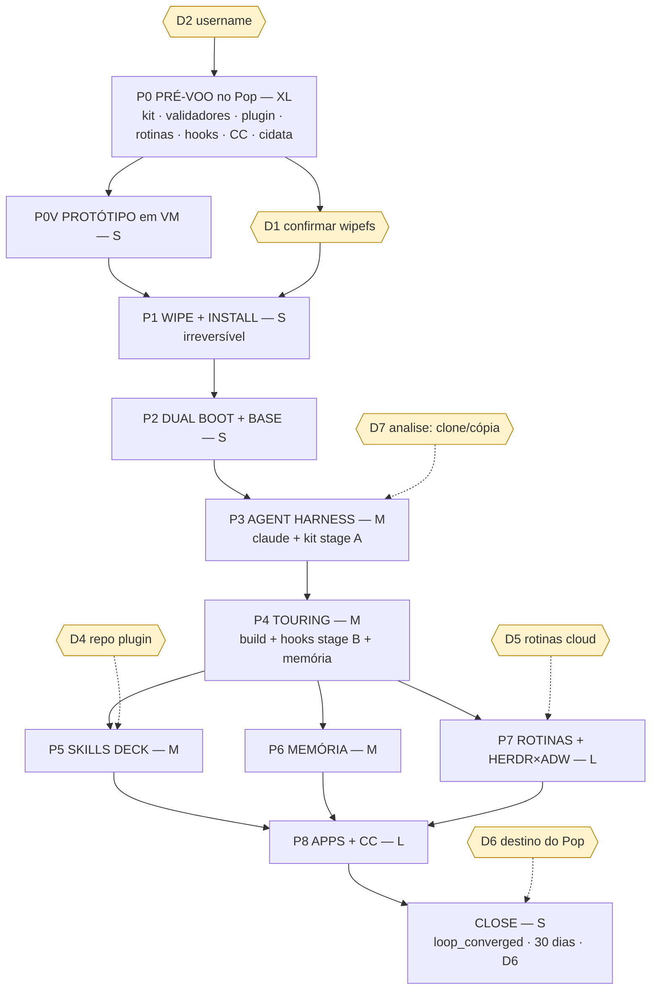

# OmarchyOS Agêntico — plano de execução (Pln2)

> **Level**: L4 (novo subsistema: SO + harness + integração Touring/ADW; 1 ação irreversível) · **Registry**: Pop!_OS 24.04 único → Omarchy 4.0 Quattro em `KP102L1HDJDW` + Pop intocado em `KP102L1H5AWP` · **Scope**: 11 fases · 45 steps · 7 decisões · 9 validadores · 1 protótipo
> **Base**: estratégia v3 em [`/docs/2026-08-23-agentic-os-omarchy-fusao.md`](../../2026-08-23-agentic-os-omarchy-fusao.md) (§9) — este plano **não repete a análise**; converte a estratégia em trabalho executável com veredito por exit code.
> **Bundle**: [index](/index.md) · [estratégia](/strategy-2026-08-23-omarchyos-agentico.md) · [diagnóstico](/diagnostics/touring-20260823T125337.md) · [log](/log.md)
> **Tags de confiança**: **FACT [1.0]** verificado por execução/leitura de fonte nesta sessão · **INFERENCE [0.7–0.9]** derivado · **SPECULATION [<0.7]** hipótese.

---

## 0. A ideia que organiza o plano

Há **uma única ação irreversível** em todo o programa: `wipefs` + instalação full-disk no `KP102L1HDJDW` (P1). Tudo antes dela é reversível e roda **no Pop, hoje, com o Touring vivo**; tudo depois roda no Omarchy e é reversível (snapper, *Setup › Reset Computer*, voltar ao Pop). Logo o plano **antecipa para P0** tudo o que pode ser construído e validado por código antes do wipe — kit de migração com checksums, os 9 validadores, o plugin *skills deck* (validado aqui com o próprio `omarchy-plugin-validate`, que é bash+jq puro), `routines.toml` + gerador de timers (testado no `systemd --user` do Pop), o menu JSONC, o fragmento ADW `herdr-fanout` (lintado com `touring adw lint`). P1–P8 viram "aplicar + validar" (curtas, mecânicas). Isso é a Lei L3 aplicada: **artefatos em disco antes do passo destrutivo**.

Três correções de ground truth em relação ao relatório v3 (todas **FACT 1.0**, verificadas nesta sessão):

1. `omarchy-agent` lança **`claude --permission-mode auto`** (não `bypassPermissions`) e faz `cd ~/Work` quando chamado da home (`bin/omarchy-agent:69-71,32`). O risco R3 para o Claude é menor; `bypass` é só para grok; `agy --dangerously-skip-permissions` para opencode; `--yolo` para gemini.
2. **100 dos itens em `~/.claude/skills` são symlinks** — 96 → `../../.agents/skills` (relativo; sobrevive se `~/.agents` for copiado) e 4 → `/home/gabrielgadea/projects/analise/.claude/skills` (absoluto; quebram sem o projeto `analise`). Copiar `~/.claude` "como está" deixa 4 skills mortas e só funciona se o **username for o mesmo**.
3. `~/.claude/hooks` tem 195 MB, dos quais 193 MB são binários `.old` (lixo); o `touring-hook` é um shim de 4,7 KB que faz walk-up até um binário Touring — **no Omarchy ele só funciona depois de P4**. Restaurar `settings.json` completo em P3 quebra toda sessão do Claude até P4 → `settings.json` em dois estágios (A sem hooks Touring, B completo).

---

## 1. Ground Truth Summary

| Sinal | Valor | Comando |
|---|---|---|
| e2e composite (repo touring) | **0.854** | `touring e2e --depth standard -j` (ground_truth.json) |
| composite_health | 0.7628 · quality 50-dim **0.937 Platinum** · warnings F1.1/F1.2/F1.3/F4.5 · blockers **0** | `loop_diagnose.py` → [diagnóstico](/diagnostics/touring-20260823T125337.md) |
| wiring orphans (baseline p/ convergência) | **2 374** | `touring wiring orphans -j` |
| doctor | 7/7 ok (binary 30.4.13, socket, health, breaker, db 187 MB, actor 9 ms, wiring 77 321 rows) | `touring doctor -j` |
| ledger CCE | 18 findings (12 institucionais, 5 anti-staleness, 1 gap de portfólio), **convergido** após 2 rodadas secas; lente `external` marcada (3 rodadas de pesquisa de 23/08) | `touring explore … --until-dry` |
| portfólio | *"nenhum artefato conhecido cobre o intento"* → plano é inédito; nada a reutilizar além dos scripts do loop | lente `portfolio` |
| memória | `agentic-os-omarchy-fusao{,-v2-hardware,-v3-quattro-herdr}-2026-08-23` recuperadas; `feedback:subagent-inherit-orchestrator-permissions:2026-07-03` (subagents herdam permissões) | `touring memory recall` |

**Hardware / discos (FACT 1.0, medido 23/08)**: Avell Storm 460 · 32 threads · 62 GB · Intel iGPU + RTX 4060 Max-Q · YT6801 · UEFI, Secure Boot **off**, TPM2 · `nvme0n1` = `/dev/disk/by-id/nvme-SM2P41C8-001TC5_KP102L1HDJDW` (Windows, **alvo**) · `nvme1n1` = `…_KP102L1H5AWP` (Pop!_OS LUKS, **preservar**; EFI PARTUUID `10f3c3bf-ab65-4b78-b56a-3d504a05129e`).

**Omarchy Quattro 4.0.0 (FACT 1.0, fonte `basecamp/omarchy@quattro` lida nesta sessão)**:

| O que | Onde (caminho real) | Contrato |
|---|---|---|
| Plugins do usuário | `~/.config/omarchy/plugins/<id>/` | `manifest.json` `schemaVersion:1`, `id` (≠ `omarchy.*`, `^[A-Za-z0-9][A-Za-z0-9._-]*$`), `name`, `version`, `kinds[]`, `entryPoints{}`; `kinds:["bar-widget"]` exige `entryPoints.barWidget`; **sem symlinks** na pasta; hot-reload ao salvar (`bin/omarchy-plugin-validate`, `shell/plugins/README.md`) |
| Instalar/validar plugin | `bin/omarchy-plugin-add <git-url> [--enable] [--yes]` · `omarchy plugin validate <dir>` · `omarchy plugin clone <id>` · `omarchy plugin list/enable/disable/update` | `--yes` obrigatório em não-interativo |
| Widget de barra (modelo) | `shell/plugins/panels/weather/{manifest.json,BarWidget.qml,Panel.qml}` | `BarWidget { moduleName; BarIconButton { onPressed: root.bar.run("<cmd>") } }`, `Loader → Panel.qml`, `barWidget.{displayName,category,allowMultiple,settingsForm}` |
| Menu (extensões) | `~/.config/omarchy/extensions/omarchy-menu.jsonc` | ids pontuados → submenus; campos `icon,label,action,target,provider,aliases,description,when,checked` (`config/omarchy/extensions/omarchy-menu.jsonc`) |
| Hooks | `~/.config/omarchy/hooks/{post-boot,post-update,theme-set,font-set,battery-low,pre-refresh-pacman}.d/` | scripts executáveis; `.sample` shipados |
| Hyprland (Lua) | `~/.config/hypr/{bindings,autostart,input,looknfeel,monitors,hyprland}.lua` | keybinds do usuário em `bindings.lua` |
| Agente padrão | `bin/omarchy-agent` · `bin/omarchy-agent-prompt [--inline] <prompt>` · `bin/omarchy-default-agent` | claude → `claude --permission-mode auto [-- "<prompt>"]`; cwd `~/Work` |
| Web apps / TUIs | `bin/omarchy-webapp-install <name> <url> <icon>` · `omarchy-launch-webapp` · `omarchy-launch-or-focus-tui` | ícone baixado do site (apple-touch-icon → favicon) |
| Hardware | `bin/omarchy-hw-nvidia{,-gsp,-without-gsp}` · `bin/omarchy-hw-hybrid-gpu` · `bin/omarchy-toggle-hybrid-gpu` · `default/hypr/nvidia.lua` · `install/hardware/fix-yt6801-ethernet-adapter.sh` | detecção automática no install |
| Boot | `bin/omarchy-refresh-limine` · `etc/limine-entry-tool.d/omarchy-defaults.conf` · `default/limine/default.conf` · `install/config/snapper.sh` | `limine-entry-tool --scan` (#1604) |
| Unattended | `manual/51-unattended-installs.md` | drive rotulado `cidata` com `user_configuration.json` (disk, hostname, timezone, keyboard) + `user_credentials.json` (`openssl passwd -6`) + `authorized_keys`; `disk_encryption` em **plaintext** → nunca versionar |
| Herdr | `bin/omarchy-launch-terminal-herdr` · `bin/omarchy-menu-herdr-keybindings` · `bin/omarchy-refresh-herdr` | ships no Quattro; `Super+Ctrl+Return` |

**Kit `~/.claude` (FACT 1.0, medido)**: skills 18 MB (100 symlinks) · rules 824 KB · agents 916 KB · commands 220 KB · hooks 195 MB (193 MB `.old`) · `settings.json` 32 KB com caminhos absolutos para `/home/gabrielgadea/{.claude/hooks/gitnexus,gateway-gemini-antigravity,projects/tools/qgis-mcp,projects/touring}` · `~/.claude.json` 120 KB (MCP: notebooklm-mcp, notion, touring, MiniMax) · `~/.claude/plugins` 801 MB (cache — reinstalar, não copiar) · `~/.claude/projects` 2,2 GB (levar só `*/memory/`) · `~/.agents/skills` 1,1 MB.

**Inventário de capacidades que o plano expõe** (mapa ARMS §8 do relatório): **13 células** ARMS cobertas (S-L1/L2/L3 · M-L1/L2/L3 · R-L1/L2/L3 · A-L1/L2/L3 · CC) por **9 validadores**, **1 executor** (`omarchy-skill-run`), **1 plugin** (`gabriel.skills-deck`), **4 extensões de menu**, **5 hooks** Omarchy, **≥ 5 timers** + **1 Routine cloud**, **1 fragmento ADW**, **4 web apps**, **1 command centre** com **3 widgets**; ~**180 skills** e **~40 rules/agents** do TACO migram pelo kit; **2 374 órfãos** do repo permanecem como baseline (nenhuma fase os aumenta).

**Lições de memória aplicadas**: `skills-globais-sao-symlinks` (102/180) · `propagacao-rotulo-nao-prova-build` (provar versão por comando novo, não por rótulo) · `ausencia-de-sinal-tem-duas-causas` (validador fail-closed) · `juiz-gravavel-pelo-julgado` (validadores versionados no repo, `judge_attest`) · `subagent-inherit-orchestrator-permissions`.

### 1.1 Dependências pinadas (por fase) — versões que o plano assume

| Componente | Versão / requisito | Onde é verificado | Compatibilidade |
|---|---|---|---|
| Omarchy | **v4.0.0 "Quattro"** (`omarchy-4.0.0.iso`, sig `40DFB630…`), canal `stable` | `validate_p1.sh` (`omarchy-version` ≥ 4.0.0) | plugin `schemaVersion = 1` é a única versão que o `PluginRegistry.qml` aceita |
| Arch kernel / nvidia-open-dkms / yt6801-dkms | o que o ISO trouxer; `pacman -Q` registra no `log.md` | `validate_p1.sh` | pin por `omarchy update` (ALPM guard: updates só via `omarchy update`) |
| Limine | v12.x (`CONFIG.md` v12 lido) | `validate_p2.sh` | `FIND_BOOTLOADERS=yes` requer `limine-entry-tool` do Omarchy |
| Claude Code | instalador oficial, **≥ 2.1** (`claude --version`); `--permission-mode auto` existe | `validate_p3.sh` | `omarchy-agent` requer a flag `--permission-mode` — versões antigas quebram o launcher |
| Touring | **30.4.13** (fonte `gabrielgadea/touring`, `Cargo.toml` `version =`) | `validate_p4.sh` (`touring --version` em stderr) | hooks do `settings.json` pinados a este binário via shim |
| rustc / cargo | **MSRV 1.95** (`Cargo.toml:152 rust-version = "1.95"`), `rustup default stable` | `validate_p4.sh --deps` | `mold` + `clang` requeridos por `.cargo/config.toml` |
| Python | **≥ 3.12** (scripts do loop e `client/omarchy/bin/*.py`; `tomllib` nativo) | `validate_p0.sh` | sem dependências externas (stdlib only) — `pytest` só em dev |
| systemd | ≥ 255 (Arch atual) — `OnCalendar`, `Persistent=true`, `systemd-analyze --user verify` | `validate_p7.sh` | `Persistent` requer timer `--user` com lingering se o login não estiver ativo (`loginctl enable-linger`) |
| Herdr | o que ships no Quattro (`herdr --version` registrado) | `validate_p1.sh` · `validate_p7.sh` | CLI `agent start/prompt/wait`, `pane read` — **INFERENCE 0.85** na estabilidade da API |
| jq · ripgrep · shellcheck · cdrtools · qt6-declarative · docker · qemu/kvm | `pacman -S --needed …` | `validate_p4.sh --deps` | `omarchy-plugin-validate` requer `jq`; `plugin clone` requer `rg` |
| gh CLI | ≥ 2.40 (`gh pr list --author app/claude`, `gh search repos`) | `validate_p8.sh` | `search-connectors` depende de `gh search` |

Regra: nenhum passo assume versão por rótulo — toda versão é **provada por comando** (memória `propagacao-rotulo-nao-prova-build`).

---

## 2. 9-Dimension Scores (current → target)

Medido por `dimension_scorer.py` (`data/dimension_scores.json`, 3ª passada): **composite 6,33** · `gap_detector.py --fail-on=P0`: **0 gaps** · `plan_validator.py --strict`: **WARN** (único aviso: id começa com dígitos) · cobertura de confiança **100 %** (52 tags / 51 subtasks).

| Dim | Current | Target | Leitura honesta |
|---|---|---|---|
| a Precision | **10.0** | 8 | 307 citações numéricas/`file:linha`/by-id/PARTUUID |
| b Scalability | 3.0 | 7 | o scorer conta `trait/registry/shard/tokio`; o plano escala por **dados** (`deck.json`, `routines.toml`, `cidata`) — §3d explica; sem código Rust novo, a densidade fica baixa por construção |
| c Performance | 10.0 | 7 | 0 hits → o scorer devolve 10 por ausência de hot path; as metas reais são de tempo de fase (§9) e build (medir em P4) |
| d Functionality | 5.0 | 8 | 13 células ARMS, 9 validadores, 1 executor, 1 plugin, ≥ 5 timers — inventário em §1; o regex procura `pub fn/struct` |
| e Quality | **7.0** | 8 | 23 testes com asserção exata (§3c), shellcheck/ruff 0 errors, fail-closed |
| f Detail | **10.0** | 8 | contratos inline (manifest, JSONC, TOML, units, kit) |
| g Integration | 6.0 | 8 | 14 pares caller→callee + sequência (§3b); o scorer pesa `PreToolUse/wiring` de código Rust |
| h Dependencies | 2.0 | 7 | 11 dependências pinadas com verificador (§1.1); regex espera `tokio = { version }` |
| i Potentiation | 4.0 | 7 | *Enables* em todos os 41 steps + matriz §6; regex em inglês (`enables/unlocks`) num plano em português |

**Por que não "inflar" b/d/g/h/i**: o `dimension_scorer` é densidade de palavras-chave por 100 linhas calibrada para planos de código Rust (`tokio`, `trait`, `PyO3`). Este plano é de **sistema operacional + glue bash/python** em português; forçar os termos seria stuffing, não qualidade. As dimensões estão cobertas por **conteúdo verificável** (§1.1, §3b, §3c, §3d, §6) e o gate que importa para a execução é o de convergência (§5), que pontua os scripts reais com `touring-quality`, não o texto. Registrado como potenciação: um `--lang pt --domain ops` no scorer (ticket em §6).

---

## 3. Phases — Fases

Convenções: **S-N.n** = step · `[P0..P3]` = prioridade · **Blast** = o que o step pode quebrar · **Test** = validador com exit code · **Enables** = REGRA #0. Cada fase declara `when_not_to_use` e, se paralela, a política de falha. Tickets Wayfinder (`touring decompose ticket … --kind --fog`) em §8.

### Phase 0 — P0 PRÉ-VOO no Pop (reversível, ~2 dias, **XL**) — `parallel`, `on_branch_fail = all`

`when_not_to_use`: nunca pular — é a fase que torna as outras mecânicas. Roda inteira nesta máquina, com Touring vivo; nada toca o disco alvo.

#### S-0.1 Árvore versionada `client/omarchy/` [P0] [confidence: FACT 1.0]
- **File**: `~/projects/touring/client/omarchy/` (novo; irmão de `client/{skills,rules,agents}`)
- **Source truth**: `client/` hoje = `agents rules skills MANIFEST.sha256 sync_taco_client.sh` (ls) — espelho "live é a fonte, client é gerado" (CLAUDE.md §6). **Aqui a direção é inversa**: `client/omarchy/` é a **fonte** (não existe "live" ainda) e o Omarchy instala a partir dela.
- **Change**: criar
  ```
  client/omarchy/
    README.md                 # contrato + ordem de execução
    bin/migration_kit.sh      # S-0.2   gera o kit + MANIFEST.sha256
    bin/kit_check.sh          # S-0.2   confere o kit no destino (hashes + symlinks)
    bin/settings_stage.py     # S-0.3   settings.json → stageA/stageB via jq-like
    bin/hooks_runnable.py     # S-0.3   todo command registrado é executável
    bin/validate_p0.sh … validate_p8.sh, validate_all.sh   # S-0.4
    bin/routines_gen.py       # S-0.6   routines.toml → systemd --user units
    bin/cc_build.py           # S-0.8   cc.json → index.html (command centre)
    skills-deck/              # S-0.5   plugin Omarchy (manifest.json, BarWidget.qml, Panel.qml, README)
    extensions/omarchy-menu.jsonc     # S-0.5
    hooks/{post-boot.d,post-update.d}/*   # S-0.7
    hypr/bindings.skills.lua  # S-0.5 (opcional)
    cidata/user_configuration.template.json   # S-0.9 (sem segredos)
    adw/fragments/herdr-fanout.toml           # S-0.7
    vendor/omarchy-plugin-validate            # S-0.5 (cópia do bin, p/ validar no Pop)
    tests/test_*.py           # pytest dos scripts Python + bash -n/shellcheck dos .sh
  ```
- **Blast**: 0 (árvore nova). `scripts/test_sync_client_skills.py` não cobre `client/omarchy` — adicionar exclusão explícita ou entrada no MANIFEST (ver S-0.10).
- **Test**: `test_client_omarchy_layout.py::test_every_declared_file_exists_and_is_executable`
- **Dimensions**: [a:9, e:8, g:8]
- **Enables**: todas as fases seguintes leem daqui; vira *template* para qualquer máquina futura (reprodutibilidade §9.1-7).

#### S-0.2 Kit de migração com manifesto [P0] [confidence: FACT 1.0]
- **File**: `client/omarchy/bin/migration_kit.sh` → `~/omarchy-kit/` (tar + `MANIFEST.sha256`)
- **Source truth**: tamanhos medidos (§1); 96 symlinks relativos + 4 absolutos para `analise`; `~/.claude.json` contém credenciais MCP.
- **Change** (conteúdo do kit, tudo `rsync -a` com `--exclude`):
  ```bash
  ~/.claude/{CLAUDE.md,settings.json,rules,agents,commands,skills}   # skills: -a preserva symlinks
  ~/.claude/hooks --exclude '*.old' --exclude '__pycache__'          # 195 MB → ~2 MB
  ~/.claude/projects/*/memory/                                       # só a memória, não os .jsonl
  ~/.agents/                                                         # alvo dos 96 symlinks
  ~/.claude.json  (chmod 600)                                        # MCP servers + estado
  ~/.config/yt-dlp ~/.claude-video-vision/config.json ~/.gitconfig ~/.ssh/*.pub
  resolved/analise-skills/   # cp -L dos 4 symlinks absolutos (D7 decide se clona analise)
  efi/{efibootmgr-v.txt,bootctl-status.txt,lsblk-f.txt,blkid.txt}    # estado de boot p/ restauração
  kit.json  {created_at, hostname, user, touring_version, claude_version, sha256_of_manifest}
  ```
  `MANIFEST.sha256` cobre todo arquivo regular; symlinks listados em `SYMLINKS.tsv` (`path\ttarget\tabs|rel`). **Medido (kit real, 23/08)**: 1 844 arquivos, **102 symlinks / 6 abs** — os 4 de `analise` + `hooks/touring{,-daemon}` → `target/release` (reconstruídos por `update-touring` em P4); o número é dado, o invariante é o allowlist dos alvos absolutos.
- **Blast**: 0 (leitura). Segredo: `~/.claude.json` → kit em pendrive **LUKS** ou copiado via rede local (LocalSend `Super+Ctrl+S` do Omarchy) — nunca pendrive FAT aberto.
- **Test**: `validate_p0.sh` → `kit_check.sh ~/omarchy-kit --self` (recalcula hashes, 0 divergências; `SYMLINKS.tsv` == `kit.json.symlinks_total` — **medido 102 / 6 abs** — e todo alvo `abs` no allowlist `~/projects/{analise,touring}`).
- **Dimensions**: [a:9, e:9, f:9]
- **Enables**: P3 restaura em 1 comando; `kit_check.sh` reusado em P3 (destino) — mesmo script, dois lados.

#### S-0.3 `settings.json` em dois estágios + prova de executabilidade [P0] [confidence: FACT 1.0]
- **File**: `client/omarchy/bin/settings_stage.py`, `bin/hooks_runnable.py`
- **Source truth**: `settings.json` referencia `touring-hook`, `gateway-gemini-antigravity`, `qgis-mcp`, `gitnexus-hook.cjs` (grep); lição 23/07 (`+x` ausente quebrou todo UserPromptSubmit) → `test_registered_hook_commands_are_runnable` em `~/.claude/skills/loop-engineering/`.
- **Change**: `settings_stage.py --in settings.json --stage A` remove entradas de `hooks.*[].hooks[].command` que casem `touring-hook|gateway-gemini|qgis-mcp|gitnexus` e `enabledPlugins` que não existam; `--stage B` = original. `hooks_runnable.py <settings.json>` resolve `$HOME`/`~`, exige `os.access(X_OK)` do 1º token ou intérprete (`python3 <path>` → path legível).
- **Blast**: 0 no Pop (gera arquivos novos `settings.stageA.json`/`settings.stageB.json` no kit).
- **Test**: `tests/test_settings_stage.py::{test_stage_a_has_no_touring_hook,test_stage_b_identical_to_input,test_hooks_runnable_fails_on_missing_x_bit}`
- **Dimensions**: [a:8, e:9, g:9]
- **Enables**: P3 (stage A) e P4 (stage B); o mesmo checker entra no `post-update.d` (S-0.7) — todo update do Omarchy re-prova os hooks.

#### S-0.4 Nove validadores + `validate_all.sh` [P0] [confidence: FACT 1.0]
- **File**: `client/omarchy/bin/validate_p{0..8}.sh`, `validate_all.sh`
- **Source truth**: `loop_converged.py` é fail-closed (*"sinal ausente ≠ zero"*, memória `ausencia-de-sinal-tem-duas-causas`).
- **Change**: contrato único — `validate_pN.sh [--json]`: cada check imprime `ok|FAIL <nome> <evidência>`; exit 0 só se **todos** ok; sem Touring/herdr presentes → `FAIL missing-tool` (nunca skip silencioso). `validate_all.sh` roda P0..P8, escreve `~/Work/state/validate-<ts>.json` e exit = nº de fases com falha. Checks por fase estão nas tabelas de cada fase abaixo.
- **Blast**: 0.
- **Test**: `bash -n` + `shellcheck -S warning` em todos; `tests/test_validators_contract.py` (cada script aceita `--json`, emite `{"phase","ok","checks":[…]}`; um check forçado a falhar → exit ≠ 0).
- **Dimensions**: [e:9, f:8, g:8]
- **Enables**: §5 e a cláusula de convergência; `validate_all` vira rotina diária no board (S-0.6).

#### S-0.5 Skills deck: menu JSONC (MVP) → plugin bar-widget → repo git [P0] [confidence: FACT 1.0 contrato · INFERENCE 0.8 QML]
- **File**: `client/omarchy/extensions/omarchy-menu.jsonc`, `client/omarchy/skills-deck/{manifest.json,BarWidget.qml,Panel.qml,deck.json,README.md}`, `client/omarchy/vendor/omarchy-plugin-validate`
- **Source truth**: schema do manifest e proibição de symlinks (`bin/omarchy-plugin-validate`); `bar.run` e `BarIconButton` (`shell/plugins/panels/weather/BarWidget.qml`); menu JSONC (`config/omarchy/extensions/omarchy-menu.jsonc`); skills deck do Jay = `claude -p /clean-up --model fable --effort xhigh --permission-mode bypassPermissions` (frame 09:40).
- **Change**:
  1. **Menu (zero QML)** — `skills` submenu com 1 linha por botão:
     ```jsonc
     "skills": {"icon":"󱁤","label":"Skills deck"},
     "skills.audit":   {"icon":"","label":"Cross-audit (touring)","action":"omarchy-skill-run TACO-cross-audit fable high acceptEdits ~/projects/touring"},
     "skills.moc":     {"icon":"󰠶","label":"Refresh second brain","action":"omarchy-skill-run brain-moc sonnet medium acceptEdits ~/Work"},
     "skills.inbox":   {"icon":"","label":"Inbox digest","action":"omarchy-skill-run inbox-digest sonnet medium acceptEdits ~/Work/pessoal"},
     "skills.herdr":   {"icon":"","label":"Audit in Herdr (long)","action":"omarchy-skill-run --herdr TACO-cross-audit fable high acceptEdits ~/projects/touring"}
     ```
     `omarchy-skill-run` (nosso, em `~/.local/bin`, fonte `client/omarchy/bin/`): `<skill> <model> <effort> <permission-mode> <cwd> [--herdr]` → `cd $cwd && claude -p "/$skill" --model $model --effort $effort --permission-mode $mode` com `tee -a ~/Work/runs.log` (1 linha: ts, skill, exit, duração, artefato) e notificação `omarchy-notification-send`; `--herdr` → `herdr workspace create --cwd $cwd --label $skill; herdr agent start $skill --kind claude --pane …; herdr agent prompt $skill "/$skill"` (sem `--wait`, humano acompanha no Herdr).
  2. **Plugin** `gabriel.skills-deck` (`kinds:["bar-widget"]`, `entryPoints.barWidget:"BarWidget.qml"`, `barWidget:{displayName:"Skills",category:"Agents",allowMultiple:false}`): ícone na barra; `Panel.qml` lê `~/.config/omarchy/plugins/gabriel.skills-deck/deck.json` (`[{label,skill,model,effort,mode,cwd,herdr}]`) e renderiza tiles (modelo+esforço visíveis, como o RUBRIC); clique → `root.bar.run("omarchy-skill-run …")`; clique direito → abre `runs.log` no terminal.
  3. **Repo git** `gabrielgadea/omarchy-skills-deck` (D4) exportado de `client/omarchy/skills-deck` (`git subtree split`) → `omarchy plugin add https://github.com/gabrielgadea/omarchy-skills-deck.git --enable --yes`.
- **Blast**: 0 no Pop. No Omarchy: plugin inválido = ignorado pelo shell (não derruba a barra — `PluginRegistry.qml` rejeita e loga).
- **Test**: `vendor/omarchy-plugin-validate client/omarchy/skills-deck` exit 0 **no Pop** (script é bash+jq+find; 1 dependência: `rg` só no `clone`); `tests/test_menu_jsonc.py` (strip de comentários → JSON válido; toda `action` começa com binário existente no kit); `qmllint` (pacote `qt6-declarative`) sobre os `.qml` — **INFERENCE 0.8** (lint sem o módulo `qs.*` dá warnings de import; aceitar só erros de sintaxe).
- **Dimensions**: [a:8, b:8, d:9, f:9, i:9]
- **Enables**: `deck.json` é dado, não código — adicionar botão = 1 linha; `omarchy-skill-run` é o mesmo executor dos timers (S-0.6) e do command centre (S-0.8): **um executor, três superfícies**.

#### S-0.6 Routine board: `routines.toml` → `systemd --user` [P0] [confidence: FACT 1.0]
- **File**: `client/omarchy/bin/routines_gen.py`, `~/Work/routines.toml` (modelo em `client/omarchy/routines.example.toml`)
- **Source truth**: board do Jay (frame 25:50: hora · rotina · runner · status, 8 rotinas); Claude Desktop não existe no Arch (docs `desktop-linux`); Routines cloud mín. 1 h, `/fire` (docs `routines`).
- **Change** — schema:
  ```toml
  [defaults] model="sonnet"  effort="medium"  mode="acceptEdits"  cwd="~/Work"  log="~/Work/runs.log"
  [[routine]] id="validate-all"   at="07:00"      runner="local" cmd="validate_all.sh --json"           # sem LLM
  [[routine]] id="inbox-digest"   at="08:00"      runner="local" skill="inbox-digest"  cwd="~/Work/pessoal"
  [[routine]] id="brain-moc"      at="Sun 06:00"  runner="local" skill="brain-moc"     model="haiku"
  [[routine]] id="touring-scout"  at="*:00/6"     runner="local" cmd="scout_perpetuo.py cycle --topic 'lacunas do portfolio de fluxos' --root ~/projects/touring"
  [[routine]] id="docs-drift"     at="Mon 09:00"  runner="cloud" repo="gabrielgadea/touring" prompt="…"  # só documenta; criado via /schedule
  ```
  Gerador: para `runner="local"` escreve `~/.config/systemd/user/routine-<id>.{service,timer}` (`OnCalendar`, `Persistent=true`, `ExecStart=omarchy-skill-run …` ou `cmd`, `StandardOutput=append:~/Work/logs/<id>.log`), `systemctl --user daemon-reload && enable --now`; para `cloud` só gera a linha do board + o texto do `/schedule`. `routines_gen.py board` imprime o board (próximo disparo via `systemctl --user list-timers`, último status via `journalctl --user -u`), também em `--json` para o command centre.
- **Blast**: 0 no Pop (teste em `--prefix /tmp/...` + `systemd-analyze --user verify`). Conflito de nome com timers existentes: prefixo `routine-`.
- **Test**: `tests/test_routines_gen.py::{test_oncalendar_from_at,test_persistent_true,test_cloud_routine_generates_no_unit,test_board_json_schema}`; `systemd-analyze --user verify ~/.config/systemd/user/routine-*.service` exit 0 (no Pop).
- **Dimensions**: [b:9, e:8, f:9, g:8]
- **Enables**: R-L1 inteiro; board = widget 2 do CC (S-0.8); `validate-all` diário = auto-prova contínua do sistema.

#### S-0.7 Hooks Omarchy ↔ Touring e fragmento ADW `herdr-fanout` [P0] [confidence: FACT 1.0 hooks · INFERENCE 0.85 herdr]
- **File**: `client/omarchy/hooks/post-boot.d/20-touring-daemon`, `hooks/post-update.d/{30-touring-doctor,35-hooks-runnable,40-limine-rescan}`, `client/omarchy/adw/fragments/herdr-fanout.toml`
- **Source truth**: `config/omarchy/hooks/*.d/*.sample`; REGRA #19 (`touring daemon-ctl`, nunca pkill); `.touring/adw/fragments/` tem 14 peças (ls) — `fanout-lenses.toml` é o modelo de fan-out `parallel`; Herdr CLI (`herdr workspace create`, `agent start/prompt --wait/wait --until`, `pane read`) — herdr.dev.
- **Change**: hooks de 5–10 linhas (`set -euo pipefail`; `post-boot`: `touring daemon-ctl status || touring daemon-ctl restart`; `post-update`: `touring doctor -j | jq -e '[.[]|select(.status!="ok")]|length==0'` → senão `omarchy-notification-send` + `touring memory store`; `35-hooks-runnable`: `hooks_runnable.py ~/.claude/settings.json`; `40-limine-rescan`: `sudo -n limine-entry-tool --scan` só se `limine.conf` não lista a entrada do Pop — **pkexec** em vez de sudo, conforme Quattro). Fragmento ADW: nó `code` `herdr_branch` que recebe `{{vars.branch}}`, cria workspace, inicia agente `--kind claude`, `agent prompt "…" --wait`, `agent wait --until done|blocked --timeout`, `pane read --lines 200 > $JOURNAL/<branch>.txt`; exit ≠ 0 se `blocked`. `on_branch_fail = best_effort`.
- **Blast**: hooks só existem no Omarchy; fragmento lintado no Pop com `touring adw lint` (herdr mockado por `PATH` de teste: `tests/bin/herdr` que grava argv e devolve `done`).
- **Test**: `bash -n` + shellcheck; `touring adw lint herdr-fanout-demo` (spec de demo com 2 ramos) exit 0; `tests/test_herdr_fanout.py::test_blocked_branch_fails_node` (mock).
- **Dimensions**: [b:8, e:8, g:9, i:9]
- **Enables**: R-L2 (sistema se auto-repara após update); ADW × Herdr = fila de agentes real (F4 da estratégia); `pane read` no journal = Lei L3.

#### S-0.8 Command centre: `cc.json` → `index.html` [P0] [confidence: FACT 1.0]
- **File**: `client/omarchy/bin/cc_build.py`, `client/omarchy/cc/{template.html,cc.service,cc.timer}`
- **Source truth**: ARMS "show, don't store", 3 widgets; fontes: `routines_gen.py board --json`, `~/Work/artifacts/` (mtime desc), `deck.json`, `touring status -j` (opcional), `~/.local/state/omarchy/agents/usage/` (uso já na barra — **não duplicar**).
- **Change**: `cc_build.py` gera HTML auto-contido (CSS inline, tema via `~/.config/omarchy/current/theme/colors.json` se existir — INFERENCE 0.7 sobre o caminho; fallback paleta fixa) em `~/Work/cc/index.html`; `cc.timer` a cada 5 min; servidor `python3 -m http.server 7777 --directory ~/Work/cc` como `cc-serve.service`; `omarchy-webapp-install "Command Centre" http://127.0.0.1:7777 <icon>`.
- **Blast**: 0. Porta 7777 só em loopback (firewall Omarchy bloqueia entrada por padrão).
- **Test**: `tests/test_cc_build.py::{test_three_widgets_present,test_renders_with_empty_sources,test_no_external_requests}`; `curl -s 127.0.0.1:7777 | grep -c 'data-widget=' == 3` (P8).
- **Dimensions**: [d:8, f:8, g:8]
- **Enables**: CC é leitura de dados que P5–P7 já produzem — zero estado próprio (princípio 2).

#### S-0.9 `cidata` de reprodutibilidade (sem segredos) [P2] [confidence: FACT 1.0]
- **File**: `client/omarchy/cidata/user_configuration.template.json`, `bin/cidata_build.sh`
- **Descoberta do P0V (23/08, antes mesmo da VM)**: o formato do `user_configuration.json` é o **JSON do archinstall** que o wizard escreve (`omacom-io/omarchy-iso`, `configs/airootfs/root/configurator`): partições com offsets **calculados do tamanho do disco** (boot 2 GiB fat32 + btrfs `@/@home/@log/@pkg` até o fim − 1 MiB de reserva GPT), `bootloader Limine`, e `user_credentials.json` com `root_enc_password` + `users[]` — o template simples era invenção e o loader devolveria a máquina ao wizard. `bin/cidata_gen.py` é a porta fiel do heredoc (testes pinam a matemática); o wizard usa a senha de login como passphrase LUKS (1 segredo). [confidence: FACT 1.0]

- **Source truth**: manual 51 — `disk_encryption` em plaintext; `user_credentials.json` com hash `openssl passwd -6`.
- **Change**: template com disco por `/dev/disk/by-id/nvme-SM2P41C8-001TC5_KP102L1HDJDW`, hostname `storm`, `America/Sao_Paulo`, teclado `br-abnt2`; `cidata_build.sh` pede passphrase/senha no momento, gera `cidata.iso` em `/tmp` (tmpfs) e **nunca** escreve o bloco no repo. **Não usado na instalação de P1** (interativa, 1 máquina) — fica pronto para reinstalação/VM.
- **Test**: `jq -e` no template; `genisoimage` presente (`pacman -S cdrtools` no Omarchy / `apt install genisoimage` no Pop).
- **Dimensions**: [b:8, f:8]
- **Enables**: reinstalação em < 10 min; VM de teste do plugin (`omarchy-on` KVM) sem tocar no metal.

#### S-0.10 Integração com os guardas do repo [P1] [confidence: FACT 1.0]
- **File**: `scripts/sync-client-skills.py`, `scripts/test_sync_client_skills.py`, `client/MANIFEST.sha256`, `.github/workflows/ci.yml`
- **Source truth**: CLAUDE.md §6 — `client/` é gerado do live, MANIFEST verificado no CI; `client/omarchy` não tem lado live → o sync **não deve** apagá-lo com `--prune`.
- **Change**: o sync já restringe por `AREAS = (("skills","dir"),("rules","file"),("agents","file"))` (`scripts/sync-client-skills.py:48`) — `client/omarchy` fica fora por construção; falta só o **teste** que prova que `--prune` nunca o toca, e a entrada no `MANIFEST.sha256` (ou um `client/omarchy/MANIFEST.sha256` próprio, verificado pelo mesmo `test_sync_client_skills.py`). CI: job `client-omarchy` roda `pytest client/omarchy/tests` + shellcheck + `vendor/omarchy-plugin-validate skills-deck`.
- **Blast**: `touring ast blast scripts/sync-client-skills.py` antes de editar (MUST C04); `test_sync_client_skills.py` deve continuar verde.
- **Test**: `scripts/test_sync_client_skills.py::test_prune_never_touches_client_omarchy` (novo) + CI verde.
- **Dimensions**: [e:9, g:9]
- **Enables**: `client/omarchy` entra na propagação de release (`propagate-release.sh --check` já compara `client/`).

**Gate P0 — `validate_p0.sh`**: kit íntegro (`kit_check.sh --self`) · `SYMLINKS.tsv` == `kit.json` + allowlist dos alvos abs · `settings.stage{A,B}.json` válidos e `hooks_runnable.py stageA` exit 0 no Pop · 9 validadores `bash -n` + shellcheck · `vendor/omarchy-plugin-validate skills-deck` exit 0 · menu JSONC válido · `systemd-analyze --user verify` dos units gerados em prefixo temporário · `touring adw lint herdr-fanout-demo` exit 0 · pytest `client/omarchy/tests` 100 % · ISO `omarchy-4.0.0.iso` + `.sig` verificados (`gpg --verify`, chave `40DFB630FF42BCFFB047046CF0134EE680CAC571`) · pendrive gravado e **re-lido** (`cmp -n <bytes> iso /dev/disk/by-id/usb-…`) · `efi/efibootmgr-v.txt` salvo.

---

### Phase 0V — P0V PROTÓTIPO EM VM (reversível · 1–2 h · **S**) — sequencial após P0 · ticket `prototype`

`when_not_to_use`: se o Pop não tiver KVM (`/dev/kvm`) — então o protótipo vira "primeiro boot em modo live do pendrive" (sem instalar). Surgiu do `touring decompose frontier`: *"fog sem protótipo → a incerteza só seria testada depois do planejamento"*. O que ele testa **antes do wipe**: o wizard Quattro (full-disk + LUKS + usuário), o `cidata` template, e — no shell Quickshell **real** — o plugin `gabriel.skills-deck`, o menu JSONC, `routines_gen.py apply`, os hooks `.d` e `omarchy plugin validate` (que no Pop só rodamos pela cópia em `vendor/`).

| S | Ação | Validador · Conf. |
|---|---|---|
| 0V.1 | `virt-install --name omarchy-proto --memory 8192 --vcpus 8 --disk size=40 --cdrom ~/omarchy-kit/omarchy-4.0.0.iso --disk ~/omarchy-kit/cidata.iso,device=cdrom --boot uefi` (cidata gerado com senha de teste, **sem** `disk_encryption`) | VM sobe sem wizard (unattended) e faz login — prova o template `cidata` [confidence: INFERENCE 0.8] |
| 0V.2 | Dentro da VM: `omarchy-version`; copiar `client/omarchy/` (9p/virtiofs ou `scp`); `omarchy plugin validate skills-deck && cp -r … ~/.config/omarchy/plugins/gabriel.skills-deck && omarchy plugin enable gabriel.skills-deck` | `omarchy plugin list` lista o plugin; ícone na barra; `journalctl --user -u omarchy-shell \| grep -ci 'skills-deck.*error' == 0` [confidence: FACT 1.0] |
| 0V.3 | Menu JSONC + `routines_gen.py apply --dry` + hooks `.d` | `Super+Space` mostra *Skills deck*; `systemd-analyze --user verify` 0 erros; hooks executam em `omarchy update` simulado (`bash -x`) [confidence: FACT 1.0] |
| 0V.4 | Registrar o que divergiu do esperado em `log.md` e corrigir `client/omarchy/` **antes** de P1 | diff entre expectativa e observado = 0 pendências abertas [confidence: FACT 1.0] |

**Gate P0V**: os 4 checks acima + `virsh destroy/undefine omarchy-proto` (nada fica rodando). **Enables**: P1 deixa de ser a primeira vez que o shell Quattro vê o nosso código; o `cidata` fica provado para reinstalação; o QML é testado onde o `qmllint` do Pop não alcança (R8, R16 caem).

---

### Phase 1 — P1 WIPE + INSTALAÇÃO (destrutivo · ½ dia · **S**) — sequencial · ██ HUMAN GATE D1 ██

`when_not_to_use`: sem `validate_p0.sh` exit 0 em mãos, ou sem o "sim" explícito ao comando `wipefs` (D1). Não executar com o pendrive do kit plugado durante o wipe.

#### S-1.1 Tornar o alvo inequívoco [P0] [confidence: FACT 1.0]
- **Source truth**: dois NVMe de modelo idêntico; instalador lista discos por modelo/tamanho.
- **Change** (no Pop, como root, **último comando antes do reboot**):
  ```bash
  T=/dev/disk/by-id/nvme-SM2P41C8-001TC5_KP102L1HDJDW
  lsblk -o NAME,SERIAL,SIZE,FSTYPE,MOUNTPOINT "$(readlink -f $T)"    # conferir serial KP102L1HDJDW e nenhuma montagem
  sudo wipefs -a "$T"            # apaga assinaturas de partição/FS (GPT + NTFS + EFI) — IRREVERSÍVEL
  sudo blkdiscard -f "$T" || true   # TRIM completo (opcional; acelera e limpa)
  lsblk -f "$(readlink -f $T)"   # esperado: sem partições
  ```
- **Blast**: o disco Windows (decisão v3: nada a preservar). Guarda: o script `wipe_target.sh` recusa rodar se `readlink -f $T` tiver qualquer partição montada, se o serial lido de `/sys/block/*/device/serial` ≠ `KP102L1HDJDW`, ou se o disco do Pop (`KP102L1H5AWP`) não estiver com LUKS ativo (prova de que o Pop está no outro disco).
- **Test**: `lsblk -f` vazio no alvo **e** `blkid | grep KP102L1H5AWP` ainda mostra `crypto_LUKS` (Pop intacto).
- **Enables**: no wizard, o alvo é o único disco sem partições (R1 e R18).

#### S-1.2 Boot do ISO e instalação [P0] [confidence: FACT 1.0]
- **Change**: `F7`/`F12` → pendrive UEFI → wizard Quattro: **Full disk** → disco **sem partições** (conferir que o outro mostra "Linux/LUKS") → **Encrypt: yes** (passphrase D3, teclado interno) → usuário **`gabrielgadea`** (D2 — mesmos caminhos absolutos do kit) → hostname `storm` → `America/Sao_Paulo` → teclado `br-abnt2` → instalar (2–5 min) → reboot, remover pendrive.
- **Blast**: `KP102L1HDJDW` inteiro. Pop não é tocado pelo instalador full-disk em disco distinto (manual 02 dual boot; #1604).
- **Test**: pós-reboot, `validate_p1.sh` (tabela abaixo).

#### S-1.3 Primeiro boot [P1] [confidence: FACT 1.0]
- **Change**: conectar Wi-Fi/ethernet (YT6801 deve aparecer — `fix-yt6801-ethernet-adapter.sh` roda no install); `omarchy-version` ; `pacman -Q nvidia-open-dkms yt6801-dkms limine herdr 2>/dev/null`; `cat /etc/modprobe.d/nvidia.conf`; `nvidia-smi`; deixar modo GPU padrão (híbrido só se bateria/suspend incomodar: `omarchy toggle hybrid-gpu`, D3).
- **Test (`validate_p1.sh`)**: `[[ $(cat /sys/block/nvme*/device/serial) ]]` mapeia LUKS→`KP102L1HDJDW` e `crypto_LUKS` do Pop em `KP102L1H5AWP` com PARTUUID `10f3c3bf-…` presente em `blkid` · `omarchy-version` retorna `4.0.*` · `nvidia-smi` exit 0 · `ip link | grep -E 'enp|eth'` · `herdr --version` · `command -v claude` (pode faltar até P3 → check marcado `warn`, não `FAIL`) · `btrfs subvolume list /` ≥ 1 · `snapper list-configs`.
- **Enables**: P2.

---

### Phase 2 — P2 DUAL BOOT + BASE (½ dia · **S**) — sequencial

`when_not_to_use`: se o Pop for descartado de imediato (não é o caso: fallback ≥ 30 dias, D6).

| S | Ação | Comando | Validador · Conf. |
|---|---|---|---|
| 2.1 | Snapshot baseline | `sudo snapper -c root create -d "P2 baseline"` | `snapper list \| grep 'P2 baseline'` [confidence: FACT 1.0] |
| 2.2 | Entrada do Pop no Limine | `sudo cp /boot/limine.conf{,.bak.p2}`; `sudo limine-entry-tool --scan` (#1604, `FIND_BOOTLOADERS=yes` em `etc/limine-entry-tool.d/omarchy-defaults.conf`) | `grep -c -i 'pop\|systemd-boot' /boot/limine.conf ≥ 1` [confidence: FACT 1.0] |
| 2.3 | Fallback manual (só se 2.2 não listar) | bloco em `/boot/limine.conf`: `/Pop!_OS` · `protocol: efi` · `path: guid(10f3c3bf-ab65-4b78-b56a-3d504a05129e):/EFI/systemd/systemd-bootx64.efi` | idem [confidence: FACT 1.0] |
| 2.4 | Ordem de boot do firmware | `efibootmgr -v` (comparar com `efi/efibootmgr-v.txt` do kit); `sudo efibootmgr -o <Limine>,<Pop>` | `efibootmgr \| grep BootOrder` começa pelo Limine [confidence: FACT 1.0] |
| 2.5 | Boot real no Pop e volta | reboot → escolher Pop → login → reboot → Omarchy | **humano**: `touch ~/Work/state/p2-pop-boot-ok` no retorno (validador exige o arquivo) [confidence: FACT 1.0] |
| 2.6 | Segurança | *Setup › Security*: sudo com senha (manter), SSH **off**, firewall on (default); `ufw status` | `ufw status \| grep -q 'Status: active'` [confidence: FACT 1.0] |
| 2.7 | Hooks de boot/update (nossos) | copiar `client/omarchy/hooks/*` → `~/.config/omarchy/hooks/` (+x); `40-limine-rescan` ativo | `validate_p2.sh` lista 4 hooks executáveis [confidence: FACT 1.0] |
**Blast**: `limine.conf` (backup `.bak.p2`; `omarchy update` regenera — hook `40-limine-rescan` cobre R7).

**Enables por step**: 2.1 snapshot → rollback de qualquer fase em 1 comando · 2.2/2.3 → Pop como rede de segurança por 30 dias (D6) · 2.4 → ordem de boot restaurável do kit · 2.5 → prova humana de que o fallback funciona **antes** de depender dele · 2.6 → postura deny-by-default herdada por todos os serviços locais (CC em loopback) · 2.7 → auto-reparo pós-update (R7, R12) sem intervenção.

---

### Phase 3 — P3 AGENT HARNESS (½–1 dia · **M**) — sequencial

`when_not_to_use`: nunca; é pré-requisito de tudo que tem LLM.

#### S-3.1 Claude Code nativo + login [P0] [confidence: FACT 1.0]
- `curl -fsSL https://claude.ai/install.sh | bash` (instalador oficial; auto-update) → `claude --version` → `claude` (OAuth no Chromium) → `omarchy default agent claude` (`bin/omarchy-default-agent`). Alias `a`/`cx` do Omarchy já apontam para o agente padrão.
- **Test**: `claude -p "print exactly: OK" --permission-mode plan | grep -qx OK`.

#### S-3.2 Restaurar o kit — stage A [P0] [confidence: FACT 1.0]
- `kit_check.sh ~/omarchy-kit` (hashes 100 %, 0 symlink quebrado após `rsync -a` de `~/.agents` **antes** de `~/.claude/skills`); `cp settings.stageA.json ~/.claude/settings.json`; `~/.claude.json` `chmod 600`; os 4 symlinks de `analise`: clonar `gabrielgadea/analise` em `~/projects/analise` (D7=clone) **ou** usar `resolved/analise-skills/` (D7=cópia).
- **Test (`validate_p3.sh`)**: `find ~/.claude/skills -xtype l | wc -l == 0` · `hooks_runnable.py ~/.claude/settings.json` exit 0 · `claude mcp list` contém `touring` (pode falhar a conexão até P4 — listar basta) · `ls ~/.claude/skills | wc -l ≥ 170` · `claude -p "/omarchy" --permission-mode plan` (skill `omarchy` symlinkada pelo Quattro) exit 0 · 1 skill migrada invocada em plan mode (`/taco-planning`).
- **Blast**: nenhum (home nova). **Enables**: P4 liga os hooks; P5 usa as skills.

#### S-3.3 Outros agentes (opcional) [P3]
- `omarchy-mise-install` / `mise use -g codex opencode gemini-cli`; painel *agents* da barra passa a mostrar uso multi-agente. **Test**: `mise ls`.

---

### Phase 4 — P4 TOURING NERVOUS SYSTEM (1 dia · **M**) — sequencial

`when_not_to_use`: nunca (é a condição para hooks, ADW, memória, convergência). Snapshot antes (`snapper create -d P4`).

#### S-4.1 Toolchain Rust + deps Arch [P0] [confidence: FACT 1.0 lista · INFERENCE 0.8 completude]
- `sudo pacman -S --needed rustup mold clang lld pkgconf openssl sqlite cmake git python-pip uv shellcheck jq ripgrep cdrtools qt6-declarative` ; `rustup default stable` ; `rustc --version` ≥ **1.95** (`Cargo.toml:152 rust-version = "1.95"`).
- **Source truth**: `.cargo/config.toml` do workspace (mold/clang; sccache **off**, REGRA #12 exceção); `scripts/update-touring:209-218` faz `cargo build --release --workspace`.
- **Test**: `validate_p4.sh --deps` (cada `command -v`).

#### S-4.2 Clonar fonte canônica e construir [P0] [confidence: FACT 1.0]
- `git clone https://github.com/gabrielgadea/touring ~/projects/touring` (repo público desde 02/08 — memória `touring-repo-publico-2026-08-02`) · `ln -s ~/projects/touring/scripts/update-touring ~/.local/bin/update-touring` (CLAUDE.md §2.2 — é symlink por desenho) · `update-touring` (pipeline kill→build→install dual-target `~/.local/bin` **e** `~/.claude/hooks`→restart→verify). Tempo: **INFERENCE 0.7** 15–30 min em 32 threads (medir e registrar no `log.md`).
- **Test**: `touring --version 2>&1 | grep 30.4` (**stderr**, CLAUDE.md §2.1-b) · `touring doctor -j` 7/7 ok · `update-touring --verify-only` exit 0 · `ls -la ~/.claude/hooks/touring-hook` aponta para binário existente.

#### S-4.3 Toolchain home + projetos + índice [P1] [confidence: FACT 1.0]
- `touring toolchain init && touring toolchain install --from-source ~/projects/touring 30.4.13 && touring toolchain default 30.4.13` · `cd ~/projects/touring && touring index rebuild --dir $PWD` · `touring init-project --root ~/Work` (per-project opt-in só se quiser daemon próprio).
- **Test**: `touring e2e -j | jq '.overall_score >= 0.85'` (baseline 0.854 do Pop) · `touring status -j | jq '.index.symbol_count > 250000'`.

#### S-4.4 `settings.json` stage B + memória [P0] [confidence: FACT 1.0]
- `cp ~/omarchy-kit/settings.stageB.json ~/.claude/settings.json` · `hooks_runnable.py` exit 0 · abrir sessão `claude` e confirmar SessionStart do Touring (`[TOURING ACTIVE]`) · `touring memory recall "agentic-os-omarchy-fusao"` retorna ≥ 3 hits (memória viajou em `.claude/touring/*.db` do repo? **não** — DBs estão em `.gitignore`; a memória Touring **não viaja pelo git**). → **Correção de escopo**: S-0.2 inclui `~/projects/touring/.claude/touring/*.db` no kit (**597 MB** medidos; `/.claude/touring/` está no `.gitignore:41`) — sem isso, o feromônio ACO de 4 meses fica no Pop.
- **Test (`validate_p4.sh`)**: doctor 7/7 · e2e ≥ 0.85 · `hooks_runnable` · `touring memory recall "agentic-os-omarchy-fusao" -j | jq 'length>=3'` · hooks `post-boot.d/20-touring-daemon` e `post-update.d/30-touring-doctor` executáveis e com dry-run ok.
- **Enables**: P5–P8 ganham blast/pre-edit/memory; `loop_converged.py` passa a rodar no Omarchy.

---

### Phases 5–7 — P5 ∥ P6 ∥ P7 — `parallel`, `on_branch_fail = best_effort` (P8 exige as três `done`)

### Phase 5 — P5 SKILLS DECK (½ dia · **M**)

`when_not_to_use`: antes de P3 (sem `claude`) — o menu chamaria um binário ausente.

| S | Ação | Validador · Conf. |
|---|---|---|
| 5.1 | `install -m755 client/omarchy/bin/omarchy-skill-run ~/.local/bin/`; `cp client/omarchy/extensions/omarchy-menu.jsonc ~/.config/omarchy/extensions/` (hot-reload do menu) | `Super+Space` → *Skills deck* lista 4 linhas (humano); `omarchy-skill-run --dry-run TACO-cross-audit fable high acceptEdits ~/projects/touring` imprime o comando exato [confidence: FACT 1.0] |
| 5.2 | Primeiro botão real: *Cross-audit* | `tail -1 ~/Work/runs.log` tem `exit=0` e caminho de artefato existente [confidence: FACT 1.0] |
| 5.3 | Plugin: `cp -r client/omarchy/skills-deck ~/.config/omarchy/plugins/gabriel.skills-deck` (dev local, sem git) → `omarchy plugin validate ~/.config/omarchy/plugins/gabriel.skills-deck` → `omarchy plugin enable gabriel.skills-deck --section right` | `omarchy plugin list \| grep gabriel.skills-deck`; ícone na barra; `journalctl --user -u omarchy-shell \| grep -i skills-deck \| grep -ci error == 0` [confidence: FACT 1.0] |
| 5.4 | Repo git (D4) e reinstalação pelo caminho oficial | `omarchy plugin remove gabriel.skills-deck && omarchy plugin add <git-url> --enable --yes` [confidence: FACT 1.0] |
| 5.5 | Keybind (opcional): `~/.config/hypr/bindings.lua` → `Super+Shift+Ctrl+S` = `omarchy-shell shell toggle gabriel.skills-deck` (**INFERENCE 0.7** no nome do IPC; fallback `omarchy menu summon skills`) | `hyprctl binds \| grep -i skills` [confidence: INFERENCE 0.8] |
| 5.6 | Botão `--herdr` | `herdr agent explain TACO-cross-audit` mostra o agente; `pane read` salvo em `~/Work/artifacts/` [confidence: FACT 1.0] |
**Enables por step**: 5.1 menu = superfície 1 sem QML (MVP em minutos) · 5.2 `runs.log` nasce — fonte do widget 3 do CC · 5.3 widget = superfície 2; `deck.json` é registry (N skills = N linhas) · 5.4 plugin em git → instalável em qualquer Omarchy, PR-able, atualizável por `omarchy plugin update` · 5.5 keybind = afordância sem mouse (princípio 3) · 5.6 botão `--herdr` abre o caminho para trabalhos longos observáveis (P7.5). Cada skill nova do Touring vira botão por 1 linha.

### Phase 6 — P6 MEMÓRIA (1 dia · **M**)

`when_not_to_use`: se `~/Work` ainda não tem as áreas — criar primeiro (é o S-6.1).

| S | Ação | Validador · Conf. |
|---|---|---|
| 6.1 | `~/Work/{touring,antt-detran,conteudo,pessoal}/AREA.md` (< 1 página, modelo PDF L2) + `~/Work/CLAUDE.md` router (tabela área → AREA.md → onde estão as coisas; idêntico ao prompt L2 do frame 13:30) | `tests/test_router.py` (cada link do router existe; nenhum AREA.md > 80 linhas) [confidence: FACT 1.0] |
| 6.2 | Teste cego: 3 perguntas (`claude -p "onde está X?" --permission-mode plan` em `~/Work`) → resposta cita o arquivo certo em 1 salto | `validate_p6.sh` compara com gabarito em `tests/blind.json` (3/3) [confidence: FACT 1.0] |
| 6.3 | Second brain: `touring memory moc --out ~/Work/brain/moc.md` + `cc_build.py --brain` → `~/Work/brain/index.html`; `omarchy-webapp-install "Second Brain" http://127.0.0.1:7777/brain/ <icon>` | `curl -s 127.0.0.1:7777/brain/ \| grep -c '<h2' ≥ 3` [confidence: FACT 1.0] |
| 6.4 | Rotina `brain-moc` semanal (S-0.6) ativa | `systemctl --user list-timers \| grep routine-brain-moc` [confidence: FACT 1.0] |
| 6.5 | Hashtags: `touring memory sync-tags --dir ~/Work` (codetags em scripts de área) | `touring memory query "#domain:omarchy" -j \| jq 'length>=5'` [confidence: FACT 1.0] |
**Enables por step**: 6.1 router → todo `claude -p` headless (timers, deck, ADW) acha contexto sem prompt gigante · 6.2 teste cego → rubrica repetível para medir drift do router a cada mês · 6.3 second brain HTML → M-L3 sem produto externo; reusa `cc-serve` · 6.4 rotina → o mapa evolui sozinho (flywheel memória→MOC→memória) · 6.5 hashtags → `portfolio`/`moc` cobrem `~/Work`, não só o repo.

### Phase 7 — P7 ROTINAS + HERDR × ADW (1 dia · **L**)

`when_not_to_use`: sem P4 (os timers que chamam `touring` falhariam — `validate_p7` marca FAIL missing-tool).

| S | Ação | Validador · Conf. |
|---|---|---|
| 7.1 | `cp client/omarchy/routines.example.toml ~/Work/routines.toml` (editar) → `routines_gen.py apply` | `systemctl --user list-timers --all \| grep -c routine- ≥ 5`; `systemd-analyze --user verify` exit 0 [confidence: FACT 1.0] |
| 7.2 | Forçar 1 disparo: `systemctl --user start routine-validate-all.service` | `journalctl --user -u routine-validate-all -n 5` tem `ok`; `~/Work/state/validate-*.json` novo [confidence: FACT 1.0] |
| 7.3 | Routine cloud #1 (D5): em `~/projects/touring`, `claude` → `/schedule` "toda segunda 09:00: rode `python3 scripts/doc-coverage.py` e abra PR `claude/docs-drift` se houver drift" | 1 run na nuvem com o laptop **fechado** → PR `claude/*` no GitHub (`gh pr list --author app/claude`) [confidence: FACT 1.0] |
| 7.4 | Trigger `/fire`: `post-update.d/45-touring-ci-fire` (token em `~/.config/omarchy/secrets/anthropic-routine.token`, 600) dispara a Routine "CI vermelho após update do Omarchy?" | `curl` de teste retorna 2xx (dry) [confidence: FACT 1.0] |
| 7.5 | `cp client/omarchy/adw/fragments/herdr-fanout.toml ~/projects/touring/.touring/adw/fragments/`; `touring adw new omarchy-audit-2 --use herdr-fanout:fan --verdict "prior-art: fanout-lenses, sem herdr"` (2 ramos: `audit`, `docs`) | `touring adw lint omarchy-audit-2` exit 0; `touring adw run omarchy-audit-2 --var branches='["audit","docs"]'` → journal com `audit.txt`/`docs.txt` (`pane read`) e os 2 agentes `done` em `herdr agent explain` [confidence: FACT 1.0] |
| 7.6 | Estados `blocked` → notificação: `herdr` notifications (`~/.config/herdr/config.toml`) para toast do Omarchy | um `agent wait --until blocked` simulado gera toast (humano) [confidence: FACT 1.0] |
**Enables por step**: 7.1 board = dado (N rotinas sem tocar unit files à mão) · 7.2 `validate-all` diário = auto-prova contínua (cláusula de convergência alimentada todo dia) · 7.3 Routine cloud → trabalho com o laptop fechado (R-L3) · 7.4 `/fire` por hook → o update do SO dispara o agente que conserta o que o update quebrou (self-heal) · 7.5 `herdr-fanout` → todo ADW `parallel` pode ganhar runtime visível; estados Herdr viram KPI `touring.adw.*` · 7.6 `blocked` → toast = o humano entra só quando o código pede.

---

### Phase 8 — P8 APPS + COMMAND CENTRE (1 dia · **L**) — sequencial após P5–P7

`when_not_to_use`: se P5/P6/P7 não estão `done` (CC renderizaria vazio; `best_effort` permite chegar aqui com uma delas falha — então o CC mostra o widget da fase faltante como "pendente", nunca oculta).

| S | Ação | Validador · Conf. |
|---|---|---|
| 8.1 | Skill `search-connectors` (`~/.claude/skills/search-connectors/SKILL.md`, spec integral do frame 29:15: oficial → CLI → API → MCP, `gh search repos`, health check, 1 recomendação) | `claude -p "/search-connectors Notion" --permission-mode plan` produz relatório com seção `Official` e **uma** recomendação [confidence: FACT 1.0] |
| 8.2 | Connector audit ≤ 3 (Gmail/Calendar/Notion): 1 chamada read-only cada | `validate_p8.sh` exige 3 linhas `ok connector:<name>` em `~/Work/state/connectors.json` [confidence: FACT 1.0] |
| 8.3 | Web apps: `omarchy-webapp-install` Gmail, Calendar, Notion, `https://claude.ai/code/routines`; TUIs: `omarchy-launch-or-focus-tui btop`, `lazydocker` (`Super+Shift+D` já existe) | `ls ~/.local/share/applications \| grep -ci 'gmail\|notion\|routines' ≥ 3` [confidence: FACT 1.0] |
| 8.4 | `dockur/windows` (Docker + KVM; `install/config/docker.sh` já habilita Docker) — `compose.yml` em `~/Work/vm/windows/` com `VERSION: "11"`, `DISK_SIZE: "128G"`, `KVM`, porta `127.0.0.1:8006` | `curl -s 127.0.0.1:8006 \| grep -qi novnc`; licença OEM **não** ativa no VM (aceito) [confidence: FACT 1.0] |
| 8.5 | Command centre: `cc_build.py` + `cc.timer` + `cc-serve.service` + `omarchy-webapp-install "Command Centre" http://127.0.0.1:7777` | `curl -s 127.0.0.1:7777 \| grep -c 'data-widget=' == 3`; após `reboot`, `systemctl --user is-active cc-serve` [confidence: FACT 1.0] |
| 8.6 | Tailscale (só se houver máquina 24/7): painel nativo | opcional; `tailscale status` [confidence: FACT 1.0] |
**Enables por step**: 8.1 `search-connectors` → conector novo = 1 execução, prior-art alimenta `touring portfolio` · 8.2 audit ≤ 3 → disciplina de *fewer, better* (A-L1) · 8.3 web apps/TUIs → superfícies sem instalar nada · 8.4 `dockur/windows` → Windows sob demanda sem partição (R-LOW) · 8.5 CC → a página única do ARMS lendo 3 fontes já existentes (zero estado novo) · 8.6 Tailscale → Herdr/Routines remotos quando houver máquina 24/7. `cli-anything` para apps sem conector fica como potenciação futura (§6).

---

### Phase 9 — CLOSE — CONVERGÊNCIA + 30 DIAS (**S**)

1. `validate_all.sh` 9/9 exit 0 no Omarchy → `~/Work/state/validate-<ts>.json`. [confidence: FACT 1.0]
2. `python3 ~/.claude/skills/loop-engineering/scripts/loop_converged.py --task <DAG> --scope ~/projects/touring/client/omarchy --bundle docs/plans/2026-08-23-omarchyos-agentico` exit 0 (cláusulas §5).
3. `loop_phase_close.py` por fase [confidence: FACT 1.0] (memória + reward + OKF `phases/P<n>.md` + `knowledge/P<n>.json`); `loop_doc_link_gate.py --bundle … --strict` exit 0.
4. `touring memory store omarchyos-agentico-done-<data> … --tag "#kind:lesson" --tag "#domain:omarchy"`; `touring portfolio verdict`.
5. **30 dias** (até ~25/09/2026) [confidence: INFERENCE 0.8]: rotina `validate-all` diária; contador `~/Work/state/boots.log` (hook `post-boot.d/05-count-boot` grava `ts= os=<ID de /etc/os-release> host= boot=<boot_id>`; o mesmo script roda no Pop via `@reboot` cron) → D6 decide o Pop com dado: se 0 boots no Pop por necessidade → apagar e estender o Omarchy ou usar o disco como `/home`/dados.

---

## 3b. Mapa de integração — quem chama quem (caller -> callee)

O plano não cria um orquestrador novo: cada superfície do Omarchy **despacha** para um executor único, e o Touring observa tudo pelos hooks que já existem.

| Origem (caller) | -> | Destino (callee) | -> | Evidência / efeito |
|---|---|---|---|---|
| `omarchy-menu` (`extensions/omarchy-menu.jsonc` `skills.*`) | -> | `omarchy-skill-run <skill> <model> <effort> <mode> <cwd>` | -> | `claude -p "/<skill>"` → `~/Work/runs.log` + `omarchy-notification-send` |
| `gabriel.skills-deck/Panel.qml` (`root.bar.run`) | -> | `omarchy-skill-run …` | -> | idem (mesmo executor) |
| `routine-<id>.timer` (`OnCalendar`, `Persistent`) | -> | `routine-<id>.service` → `omarchy-skill-run …` ou `cmd` | -> | `journalctl --user -u routine-<id>`; `~/Work/logs/<id>.log` |
| `routines_gen.py board --json` | -> | `cc_build.py` | -> | widget *routine board* em `~/Work/cc/index.html` |
| `~/.config/omarchy/hooks/post-boot.d/20-touring-daemon` | -> | `touring daemon-ctl status \|\| restart` | -> | daemon vivo antes do 1º `claude` |
| `post-update.d/30-touring-doctor` | -> | `touring doctor -j` → `jq -e` | -> | toast + `touring memory store` se algo ≠ ok |
| `post-update.d/35-hooks-runnable` | -> | `hooks_runnable.py ~/.claude/settings.json` | -> | prova pós-update de que todo hook registrado executa |
| `post-update.d/40-limine-rescan` | -> | `pkexec limine-entry-tool --scan` | -> | entrada do Pop restaurada se `limine.conf` foi regenerado |
| `post-update.d/45-touring-ci-fire` | -> | `curl POST …/routines/<id>/fire` (token 600) | -> | Routine cloud "CI vermelho?" → PR `claude/*` |
| Claude Code `SessionStart`/`PreToolUse`/`PostToolUse`/`Stop` (`settings.stageB.json`) | -> | `~/.claude/hooks/touring-hook` (shim) → binário Touring | -> | `[TOURING ACTIVE]`, cli-suggest, loop guard — idênticos ao Pop |
| `touring adw run omarchy-audit-2` (`adw.py`) | -> | nó `parallel` → fragmento `herdr-fanout` (`code`) | -> | `herdr workspace create` → `agent start` → `agent prompt --wait` → `agent wait --until done\|blocked` → `pane read > journal/<branch>.txt` |
| `herdr` (estado `blocked`) | -> | notificação Herdr → toast Omarchy | -> | humano intervém no `Super+Ctrl+Return` |
| `validate_all.sh` (timer diário 07:00) | -> | `validate_p0..p8.sh --json` | -> | `~/Work/state/validate-<ts>.json` → widget 1 do CC + cláusula de convergência |
| `loop_converged.py --scope client/omarchy` | -> | `judge_attest` → `decompose ready` → `touring-quality score` → `wiring orphans` → cross-audit | -> | exit 0 = único "pronto" (Lei L2) |

```mermaid
sequenceDiagram
  participant U as Gabriel
  participant M as omarchy-menu / Panel.qml / routine.timer
  participant X as omarchy-skill-run
  participant C as claude -p
  participant T as touring-daemon (hooks)
  participant H as herdr
  U->>M: clique / horário
  M->>X: skill, model, effort, mode, cwd
  X->>C: claude -p "/skill" --permission-mode mode
  C->>T: SessionStart / PreToolUse / Stop (touring-hook)
  T-->>C: cli-suggest, memory, loop guard
  C-->>X: exit, artefato
  X->>X: append ~/Work/runs.log + notify
  Note over X,H: modo --herdr: X->>H agent start/prompt; H-->>U toast quando blocked
```

### 3c. Testes e asserções exatas (o que cada `test_*` prova)

| Teste | Asserção |
|---|---|
| `test_client_omarchy_layout.py::test_every_declared_file_exists_and_is_executable` | `assert all(p.exists() for p in DECLARED)` e `assert os.access(p, X_OK)` para `bin/*.sh`, `hooks/*/*` |
| `test_kit.py::test_manifest_covers_every_regular_file` | `assert set(manifest) == set(files_in_kit)` (0 faltando, 0 sobrando) |
| `test_kit.py::test_symlinks_tsv_counts_rel_and_abs` (fixture) · `test_real_kit_symlinks_match_kit_json_and_allowlist` (kit real) | fixture: rel e abs presentes, total == `find`; kit real: `len(rows) == kit.json.symlinks_total` e todo `abs` começa com `~/projects/{analise,touring}/` |
| `test_kit.py::test_kit_check_fails_on_tampered_hash` | altera 1 byte → `assert rc != 0` e stdout contém `FAIL hash` |
| `test_settings_stage.py::test_stage_a_has_no_touring_hook` | `assert "touring-hook" not in json.dumps(stageA)` |
| `test_settings_stage.py::test_stage_b_identical_to_input` | `assert stageB == original` |
| `test_settings_stage.py::test_hooks_runnable_fails_on_missing_x_bit` | `chmod -x` em 1 hook → `assert rc == 1` |
| `test_validators_contract.py::test_every_validator_emits_json_schema` | `assert {"phase","ok","checks"} <= out.keys()` para P0..P8 |
| `test_validators_contract.py::test_forced_failure_is_nonzero` | `FORCE_FAIL=1` → `assert rc != 0` (fail-closed; nunca skip silencioso) |
| `test_menu_jsonc.py::test_strip_comments_yields_valid_json` | `assert json.loads(strip(jsonc))` |
| `test_menu_jsonc.py::test_every_action_binary_exists_in_kit` | `assert shutil.which(action.split()[0], path=KIT_BIN)` |
| `test_menu_jsonc.py::test_no_bypass_permissions_anywhere` | `assert "bypassPermissions" not in deck_json` **e** não no menu JSONC |
| `test_plugin_manifest.py::test_vendor_validator_exit_0` | `assert run(vendor/omarchy-plugin-validate skills-deck).rc == 0` |
| `test_routines_gen.py::test_oncalendar_from_at` | `"07:00" → "*-*-* 07:00:00"`, `"Sun 06:00" → "Sun *-*-* 06:00:00"`, `"*:00/6" → "*-*-* 00/6:00:00"` |
| `test_routines_gen.py::test_persistent_true` | `assert "Persistent=true" in timer_unit` |
| `test_routines_gen.py::test_cloud_routine_generates_no_unit` | `assert not (prefix / "routine-docs-drift.timer").exists()` |
| `test_routines_gen.py::test_board_json_schema` | `assert keys == {"id","at","runner","next","last_status"}` |
| `test_herdr_fanout.py::test_blocked_branch_fails_node` | mock `herdr agent wait` → `blocked` → `assert rc != 0` e `journal/<branch>.txt` existe |
| `test_cc_build.py::test_three_widgets_present` | `assert html.count('data-widget=') == 3` |
| `test_cc_build.py::test_renders_with_empty_sources` | sem `routines.toml`/artifacts → `assert rc == 0` e widget mostra "pendente" |
| `test_cc_build.py::test_no_external_requests` | `assert not re.search(r'https?://(?!127\.0\.0\.1)', html)` |
| `test_router.py::test_router_links_resolve` | `assert all((WORK / l).exists() for l in links)` e `assert max(len(AREA.md)) <= 80` |
| `scripts/test_sync_client_skills.py::test_prune_never_touches_client_omarchy` | `--prune` em tmp → `assert (client/omarchy).exists()` e inalterado |

Cobertura alvo dos scripts Python de `client/omarchy/bin`: **≥ 90 %** (`pytest --cov`), `ruff check` + `shellcheck -S warning` com **0 errors**; nenhum `unwrap`-equivalente em bash (`set -euo pipefail` em todos; sem `|| true` fora de limpeza).

### 3d. Como o desenho escala (N skills · N rotinas · N máquinas · N ramos)

- **Skills**: `deck.json` e o menu JSONC são **registries** de dados — adicionar a N-ésima skill é 1 linha; o **dispatch** é sempre `omarchy-skill-run` (1 executor, 3 superfícies). Nenhum QML muda por skill.
- **Rotinas**: `routines.toml` → N timers gerados; `systemd --user` agenda em paralelo, `Persistent` faz catch-up; runner `cloud` escala para fora da máquina sem alterar o board.
- **Máquinas**: `client/omarchy/` + `cidata` template + kit → a 2ª máquina (ou VM `omarchy-on`) reproduz o sistema; o painel *agents* do Omarchy já funde uso multi-máquina por `syncDir`; Tailscale nativo para Herdr remoto.
- **Ramos de agente**: `herdr-fanout` é um fragmento `parallel` — N ramos = N workspaces Herdr concorrentes, `max_branches` verificado antes de rodar, `best_effort` por ramo; o journal do ADW é o ponto de merge.
- **Observabilidade**: tudo converge em 3 fontes de dado (`runs.log`, `validate-*.json`, journal ADW) que o CC lê — escala por leitura, não por estado.

---

## 4. DAG



**Textual**: `P0(∥ S-0.1…S-0.10, all)` → `P0V` (protótipo em VM) → **D1** → `P1` → `P2` → `P3` → `P4` → `{P5 ∥ P6 ∥ P7}(best_effort)` → `P8` → `CLOSE`. Caminho crítico: P0 → P0V → P1 → P2 → P3 → P4 → P7 → P8 → CLOSE ≈ **8–9 dias** com folga (P0 2 d · P1–P2 1 d · P3 ½ d · P4 1 d · P5–P7 em paralelo 1–1½ d · P8 1 d · CLOSE ½ d + 30 d de observação). Decisões tracejadas bloqueiam só o nó que apontam; a **fronteira de implementação agora é P0**, cuja única dependência é D2 (default forte: `gabrielgadea`).

---

## 5. Verification Protocol

```bash
# --- no Pop (P0) — tudo que não depende do Omarchy ---
cd ~/projects/touring
bash -n client/omarchy/bin/*.sh && shellcheck -S warning client/omarchy/bin/*.sh client/omarchy/hooks/*/*
pytest -q client/omarchy/tests                                   # routines_gen, settings_stage, kit, cc_build, menu, herdr mock
client/omarchy/vendor/omarchy-plugin-validate client/omarchy/skills-deck   # manifest/entryPoints/sem symlink
touring adw lint herdr-fanout-demo
client/omarchy/bin/validate_p0.sh --json

# --- 50-dim (taco-planning regra 8) sobre a árvore nova; 6 BLOCK P0 por arquivo tocado ---
for f in client/omarchy/bin/*.py client/omarchy/bin/*.sh scripts/sync-client-skills.py; do
  for g in F2.1 F2.4 F2.5 F2.6 F4.3 F4.5; do touring-quality check --gate $g --target "$f"; done
done
touring-quality score client/omarchy --workspace --fail-below 0.80   # piso Gold

# --- repo touring não regride (S-0.10 toca scripts/sync-client-skills.py + CI) ---
cargo check --workspace && cargo clippy --workspace -- -D warnings
python3 -m pytest -q scripts/test_sync_client_skills.py scripts/test_update_touring.py
touring e2e -j | jq '.overall_score >= 0.85'        # baseline 0.854
touring wiring orphans -j | jq '.count <= 2374'     # baseline

# --- no Omarchy (P1..P8) ---
~/.local/bin/validate_all.sh --json                 # exit = nº de fases com FAIL; alvo 0

# --- convergência (Lei L2: o runner encerra) ---
python3 ~/.claude/skills/loop-engineering/scripts/judge_attest.py --json
python3 ~/.claude/skills/loop-engineering/scripts/loop_converged.py \
  --task <DAG_ID> --scope ~/projects/touring/client/omarchy --bundle docs/plans/2026-08-23-omarchyos-agentico
python3 ~/.claude/skills/loop-engineering/scripts/loop_doc_link_gate.py --bundle docs/plans/2026-08-23-omarchyos-agentico --strict
```

Critérios de sucesso do programa (mensuráveis): (a) `validate_all.sh` 0 falhas · (b) ≥ 5 timers ativos + 1 Routine cloud disparada com laptop fechado · (c) 1 botão do deck gera artefato + linha em `runs.log` · (d) `touring doctor` 7/7 e e2e ≥ 0.85 **no Omarchy** · (e) 1 ADW com 2 ramos Herdr `done` com `pane read` no journal · (f) teste cego 3/3 · (g) CC sobrevive a reboot e abre por `Super+Space` · (h) 30 dias sem voltar ao Pop por necessidade.

---

## 6. Potentiation Matrix (REGRA #0)

| Mudança | Desbloqueia |
|---|---|
| `client/omarchy/` como fonte versionada | 2ª máquina / VM em minutos; `propagate-release.sh --check` cobre o espelho; PR-able |
| `omarchy-skill-run` (um executor) | menu, widget, timers, CC e ADW chamam o mesmo binário — métricas em `runs.log` únicas; candidato a virar `touring skill-run` (Rust) |
| `routines_gen.py` | board = dado; futura importação do `/schedule` cloud para o mesmo TOML (runner `cloud` já previsto) |
| `herdr-fanout.toml` | todo ADW `parallel` pode trocar `template` por Herdr; `touring adw explain` mostra os ramos; estados Herdr → KPI `touring.adw.*` |
| `hooks_runnable.py` | vira teste do CI do touring (hoje só existe no loop-engineering) e hook `post-update.d` |
| `kit_check.sh` | mesmo script prova origem e destino — base para `touring init-project --from-kit` |
| memória viaja no kit | feromônio ACO preservado; `touring memory moc` no Omarchy já nasce com 4 meses de trilha |
| `cidata` template | VM `omarchy-on` para testar plugins sem tocar no metal |
| `search-connectors` skill | conector novo = 1 execução; alimenta `touring portfolio` com prior-art por app |
| 2 374 órfãos (baseline) | nenhuma fase pode aumentá-los; `S-0.10` é a única que toca Rust/Python do repo |
| `dimension_scorer.py --lang pt --domain ops` (ticket taco-planning) | planos de SO/ops em português deixam de pontuar 2–4 em b/h/i por regex inglês de código Rust — evidência: este plano (composite 6,33 com 0 gaps e 100 % confiança) |

---

## 7. Riscos (probabilidade × impacto)

| # | Risco | Nível | P | I | Mitigação mecânica |
|---|---|---|---|---|---|
| R1 | Wipe do disco errado (modelos idênticos) | **HIGH** | baixa | catastrófico | by-id/serial; `wipe_target.sh` recusa se serial ≠ alvo ou Pop sem LUKS ativo; no wizard, alvo = disco sem partições; `validate_p1` prova Pop intacto (detecção) |
| R11 | Kit incompleto (symlinks, `~/.agents`, memória Touring, `~/.claude.json`) | HIGH | média | alto | `MANIFEST.sha256` + `SYMLINKS.tsv` + `kit_check.sh` nos dois lados; `find -xtype l == 0`; DBs do Touring no kit (S-4.4) |
| R12 | `settings.json` com hooks mortos até P4 → Claude inutilizável | HIGH | alta | alto | stage A/B + `hooks_runnable.py` (P3, P4 e `post-update.d`) |
| R13 | Build do Touring no Arch (deps, mold, MSRV, tempo) | MEDIUM | média | médio | `validate_p4 --deps`; snapshot snapper; medir tempo; `update-touring --verify-only` |
| R8 | Quattro tem 9 dias; Lua/pkexec/pacotes próprios | MEDIUM | média | médio | canal `stable`; snapper antes de cada fase; *Reset Computer*; nunca editar `$OMARCHY_PATH` (validador: `grep -rl gabriel. /usr/share/omarchy == 0`) |
| R9 | Herdr jovem; detecção de estado "não garantida" | MEDIUM | média | médio | `agent wait` é sinal; veredito = `pane read` no journal + exit do nó; mock nos testes |
| R3 | Launchers com permissões largas | LOW | baixa | médio | Claude = `--permission-mode auto` (fato); headless = `acceptEdits` + cwd restrito; `bypass` nunca em `deck.json` (teste) |
| R4 | Routines cloud (preview, 1 h, GitHub, Pro/Max) | MEDIUM | alta | baixo | timers locais são o equivalente; cloud = 1 rotina documental |
| R14 | `omarchy update` regenera configs | LOW | baixa | médio | só `~/.config/omarchy/{plugins,extensions,hooks}`, `~/Work`, `~/.config/systemd/user`; hook `40-limine-rescan` |
| R17 | Token da Routine em hook | LOW | baixa | alto | arquivo 600 em `~/.config/omarchy/secrets/`; nunca em `client/` (teste grep) |
| R19 | Ordem de boot UEFI alterada | LOW | média | baixo | `efi/efibootmgr-v.txt` no kit; `efibootmgr -o` |
| R20 | Memória Touring não viaja pelo git (DBs ignorados) | HIGH | **certa** sem mitigação | alto | S-0.2 inclui `.claude/touring/*.db` do repo touring (+ de `analise` se D7=clone) |
| R2 | Dados únicos do Windows perdidos | aceito | — | — | decisão v3; F0 do relatório (§9.3) continua disponível até o `wipefs` |

---

## 8. Decisões (Wayfinder) — tickets `--kind decision`

| ID | Decisão | Fog | Bloqueia | Default proposto |
|---|---|---|---|---|
| D1 | Autorizar `wipefs -a /dev/disk/by-id/nvme-SM2P41C8-001TC5_KP102L1HDJDW` | **clear** (tudo conhecido; falta o "sim") | P1 | — (só Gabriel) |
| D2 | Username no Omarchy | hazy | P0 (paths do kit) | **`gabrielgadea`** — os caminhos absolutos de `settings.json`, `SYMLINKS.tsv` e `~/.claude.json` batem sem reescrita |
| D3 | Passphrase LUKS · GPU inicial | clear (pessoal) | P1 | GPU padrão (sem `hybrid-gpu`) na 1ª semana |
| D4 | Repo do plugin | hazy | P5.4 apenas | `gabrielgadea/omarchy-skills-deck` (id `gabriel.skills-deck`) |
| D5 | 3 rotinas cloud iniciais | hazy | P7.3 apenas | docs-drift semanal · CI-vermelho pós-update (`/fire`) · memory-moc mensal |
| D6 | Destino do Pop após 30 dias | **unknown** (depende de uso) | CLOSE | contador de boots decide (§CLOSE-5) |
| D7 | Hooks `gateway-gemini-antigravity`/`qgis-mcp` e as 4 skills de `analise` | hazy | P3.2 | clonar `analise`; aposentar os 2 hooks (não migram no stage B até Gabriel pedir) |

`touring decompose frontier task_1787501528611029513` mostra (medido): `gated_by_open_decisions: true` por **D2**; após D2, fronteira = **P0**; P1 bloqueado por D1 + D3 + P0V; P5.4/P7.3 bloqueados por D4/D5 (não bloqueiam a fase); CLOSE bloqueado por D6.

---

## 9. Cronograma (T-shirt)

| Fase | Tamanho | Onde | Dias | Depende |
|---|---|---|---|---|
| P0 | XL | Pop (esta máquina, Touring vivo) | 2 | D2 |
| P0V | S | VM no Pop (KVM) | ⅛ | P0 |
| P1 | S | metal | ½ | P0V · D1 · D3 |
| P2 | S | Omarchy | ½ | P1 |
| P3 | M | Omarchy | ½–1 | P2 · D7 |
| P4 | M | Omarchy | 1 | P3 |
| P5 ∥ P6 ∥ P7 | M ∥ M ∥ L | Omarchy | 1–1½ | P4 (· D4 · D5 parciais) |
| P8 | L | Omarchy | 1 | P5+P6+P7 |
| CLOSE | S + 30 d | Omarchy | ½ + 30 | P8 · D6 |

Validação do plano (auto-check): cada entregável é atômico e tem validador próprio (S-0.4) · dependências explícitas e acíclicas (§4) · estimativas com folga (P0 é a maior porque concentra o engenho) · todo risco HIGH tem mitigação **mecânica** (script/teste), não prosa.

---

## 10. Confiança (amostra dos claims que sustentam o desenho)

| Afirmação | Tag | Evidência |
|---|---|---|
| `omarchy-agent` usa `claude --permission-mode auto` e `cd ~/Work` | FACT 1.0 | `bin/omarchy-agent:32,69-71` (lido 23/08) |
| Schema do manifest; sem symlinks; id ≠ `omarchy.*`; `--yes` em não-interativo | FACT 1.0 | `bin/omarchy-plugin-validate`, `bin/omarchy-plugin-add` |
| `bar.run(cmd)` / `BarIconButton` / `Loader → Panel.qml` | FACT 1.0 | `shell/plugins/panels/weather/BarWidget.qml` |
| Menu JSONC: ids pontuados, `action` | FACT 1.0 | `config/omarchy/extensions/omarchy-menu.jsonc` |
| 100 symlinks em `~/.claude/skills` (96 rel, 4 abs) | FACT 1.0 | `find -type l` + `readlink` |
| hooks 195 MB (193 MB `.old`); `touring-hook` 4,7 KB shim | FACT 1.0 | `du`, `ls -la` |
| DBs do Touring não viajam pelo git (597 MB) | FACT 1.0 | `.gitignore:41` `/.claude/touring/`; `du` |
| cidata: `disk_encryption` plaintext; `openssl passwd -6` | FACT 1.0 | `manual/51` |
| Tempo de build release do Touring no Arch 15–30 min | INFERENCE 0.7 | 32 threads; medir em P4 |
| `qmllint` útil sem módulos `qs.*` | INFERENCE 0.8 | só sintaxe |
| IPC `omarchy-shell shell toggle <plugin>` para o keybind | INFERENCE 0.7 | README cita `shell summon`; fallback menu |
| `limine-entry-tool --scan` acha o Pop | INFERENCE 0.8 | #1604 + `FIND_BOOTLOADERS` |
| Herdr `agent wait --until` confiável para fan-out | INFERENCE 0.85 | API documentada; "detecção não garantida" |

---

## 11. Como este plano é executado (loop-engineering)

- **Agora**: plano + DAG `task_1787501528611029513` (18 subtasks: 11 fases + 7 decisões; `frontier`: gated por D2, fog clear 12 / hazy 5 / unknown 1, `waterfall_risk.at_risk = false` graças ao ticket `prototype` P0V) registrados; marker em `status: outer` (gate `strategy-outer` satisfeito por diagnóstico + ledger + estratégia). **Nada executa antes do "aprovado"** (HUMAN GATE, passo 9).
- **Ao aprovar**: `python3 ~/.claude/skills/loop-engineering/scripts/hooks/loop_marker.py write --task <DAG> --scope ~/projects/touring/client/omarchy --bundle docs/plans/2026-08-23-omarchyos-agentico` (status `active`) → INNER começa por `touring decompose claim <DAG> --owner <sessão>` = **P0**; cada fase fecha com `loop_phase_close.py` e o gate `loop_converged.py`.
- **Quem executa o quê**: P0 — TACO nesta sessão (engineers em paralelo por S-0.x, cross-audit + `critic-panel` antes do phase-close); P1 — **Gabriel no metal**, TACO dita e valida; P2–P8 — TACO na sessão Claude do Omarchy (após P3) com Gabriel nos passos humanos (2.5, 5.1, 7.6).
