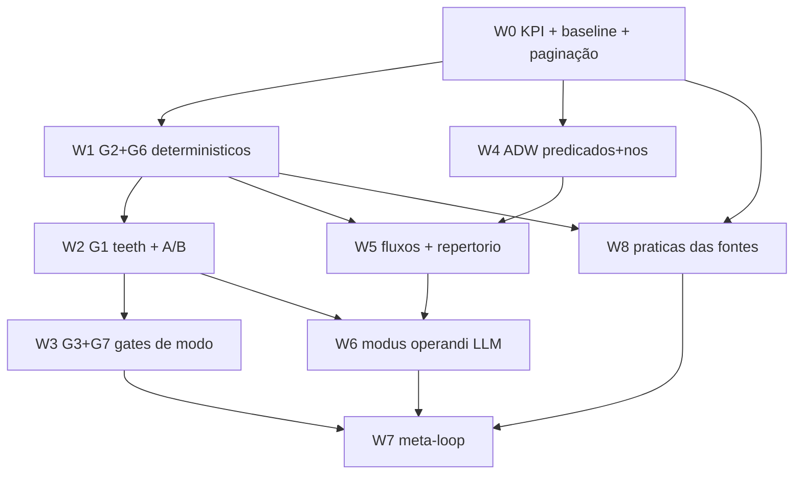

# Code Mode Total (Pln2)

> **Level**: L4 (multi-crate + runner Python + constituição) · **Escopo**: 9 waves (W0-W8) / 38 subtasks
> **Fundamento**: TODA a evidência vem de `strategy-code-mode-antecipa-declaracao.md`
> (3 partes, mesma pasta) e dos 7 instrumentos reprodutíveis em `evidence/`.
> **Tese de projeto** (medida 2×): afordância muda `U(a)`; persuasão não. Nenhuma
> wave adiciona nudge — toda wave muda executor, contador, lint ou contrato.

## 1. Ground Truth Summary

- **Adoção**: 4% dos 4.037 Bash usam `touring run`; 45% são inspeção pura [confidence: FACT — `evidence/diag_gate.py`]
- **Estado absorvente**: P(Bash→Bash)=86%; maior rajada 315; joelho da distribuição em len=4 (66% acum.) [confidence: FACT — `diag_tools.py`/`diag_gate.py`]
- **G1 simulado**: 51 disparos/55 sessões, precisão-proxy **90%** [confidence: FACT — `diag_gate_sim.py`]
- **P9**: 17% das 351 rajadas de edição validadas em ≤4 chamadas [confidence: FACT]
- **Corpus**: 703 memórias; staleness 42% · instrumento_errado 38% · ausencia_como_zero 22% · familia_parcial 19%; 85% das marcações preveníveis por programa [confidence: INFERENCE 0.7 — classificação lexical, `diag_mem.py`]
- **Erros visíveis**: 2% (155/5.891), retry cego = 5 — o dano real é o achado silencioso, não o erro vermelho [confidence: FACT]
- **Infra viva verificada por linha** (VGP 18/18 OK, `evidence/` + esta sessão):
  `cli_suggester.rs:182,190,196` (`CODE_MODE_WINDOW_SECS`) · `:205` (`REPEATED_SCAN_COUNTS`) ·
  `baseline.rs:31` (`AntipatternKind`) · `convert.rs:104` (conversões canônicas) ·
  `ctx_execute_tools.rs:169,524` + `run.rs:341,522` (counters/ladder) ·
  `hook_registry.rs:250,577,1494` (`cli-code-mode-run`) · `health.rs:276` ·
  `adw.py:66` (`NODE_TYPES`) · `:747` (`command_writes`) · `:826` (`_lint_readonly_claim`) ·
  `:893` (`_lint_fake_waiting`) · `:631` (`node_data_reads`) · `:1505` (`lint_spec`) ·
  `:1702` (`run_code_node`) · `:1665` (`_unwrap_sandbox_output`) · `:2452` (`dry_rounds`)
- **Fontes-origem varridas por programa** (`evidence/sweep_fontes.py`, 8.547 arquivos, 15/15 mecanismos com file:line): dsh `CODE_ONLY_INSTRUCTION` (`core/tools/src/index.ts:58`), prompt 94% SDK-gerado, KV-cache postmortem; TanStack `MessageSizeOverlay`/eventos `external_call`, `generateTypeStubs`, models-eval (7 métricas), lacuna `needsApproval`; Context7: Agent SDK `PermissionResultAllow(updated_input=…)`, API `allowed_callers`+`defer_loading` [confidence: FACT]
- **Lições aplicadas** (memory): `protocol-adherence-diagnosis` (nudge conf 0.95 ignorado) ·
  `afordancia-desligada-quebra-em-silencio` (exercitar antes de ligar em massa) ·
  `detector-nao-conclui-por-ausencia` (fail-closed) · `juiz-gravavel-pelo-julgado` ·
  `piso-de-artefato-envelhece-com-o-marker` · `uma-execucao-nao-distingue-constante`
  (controle negativo) · `guard-amostrado-nao-ve-salto`

## 2. 9-Dimension Scores (alvo)

| Dim | Atual | Alvo | Amplificação |
| --- | ---: | ---: | --- |
| a Precision | 9 | 9 | 18 âncoras VGP com linha exata |
| b Scalability | 8 | 8 | gates são variantes de 1 enum; loops são variantes de 1 predicado |
| c Performance | 7 | 8 | todo gate PreToolUse < 5ms (string match + moka lookup, sem I/O) |
| d Functionality | 8 | 9 | W5 liga os 2.462 órfãos-baseline ao repertório (R1 os varre) |
| e Quality | 8 | 9 | todo subtask nomeia teste + controle negativo (R4 é lei aqui) |
| f Detail | 8 | 9 | contratos de marcador (`METRIC=`/`COVERAGE=`/`FACT=`) com regex e fail-mode |
| g Integration | 8 | 9 | cada gate consome contador/enum EXISTENTE (nada paralelo) |
| h Dependencies | 8 | 8 | zero dependência nova; moka/rusqlite/tomllib já no grafo |
| i Potentiation | 8 | 9 | coluna Enables preenchida nos 31; W7 realimenta W1-W6 |

## 3. Phases (Waves W0-W8)

**Regra de leitura**: cada subtask carrega [P] prioridade, [conf] e **Enables**.
Fases `parallel` declaram `on_branch_fail`. Fog marcado por ticket no DAG (§4).

---

### Phase 0 — W0 · O KPI que julga o plano inteiro (sequencial, 3 subtasks)

*Sem W0, nenhuma wave posterior é avaliável — "meça antes de otimizar" aplicado
ao próprio plano. Nada aqui muda comportamento; só torna a adoção observável.*

#### S-0.1: Ratio de adoção por sessão no gate-metrics [P0] [confidence: FACT]
- **File**: `crates/touring-cli/src/shared/gate_metrics.rs` (+ `crates/touring-cli/src/cli/health.rs:276` vizinho do handler existente)
- **Source truth**: `code_mode_runs_count`/`code_mode_bytes_elided_total` existem e são alimentados pelo relay `cli-code-mode-run` (D-1 corrigido 24/08). Não existe denominador: bash_calls por sessão.
- **Change**: counter `session_bash_calls_count` alimentado no PreToolUse Bash (hook já intercepta — `cli_suggester.rs` roda ali); expor `code_mode_adoption_ratio = runs/(bash_calls)` em `touring kpi -j` como `touring.code_mode.adoption_ratio`.
- **Blast radius**: 3 sítios (gate_metrics, cli_suggester, kpi) — baixo.
- **Test**: `adoption_ratio_is_runs_over_bash_calls` + controle negativo `ratio_absent_reads_as_null_never_zero` (ausência ≠ 0 — Lei L2).
- **Dimensions**: [a:9, g:9, i:9]
- **Enables**: W7 inteiro (A/B, promote/demote); julgamento honesto de W1-W6.

#### S-0.2: Baseline congelada pré-deploy [P0] [confidence: FACT]
- **File**: `docs/plans/2026-08-24-code-mode-antecipa/data/baseline-pre-w1.json`
- **Change**: rodar os 3 `diag_*` + `medir.py` e congelar o JSON (adoção 4%, rajadas 33, P9 17%, G-fires da simulação). É o "antes" do delta R5 do plano inteiro.
- **Test**: o próprio arquivo com `schema_version` + asserção de não-vazio no W7 replay.
- **Dimensions**: [a:8, e:8] · **Enables**: W7 replay comparável.

#### S-0.3: Paginação honesta em toda listagem [P1] [confidence: FACT]
- **File**: `crates/touring-cli/src/cli/memory.rs` (query/recall), `crates/touring-server/src/cli/run.rs` (listagens)
- **Source truth**: `memory query --limit` default 10 sem indicador de truncamento — produziu a retratação da Parte II (li 10 como universo).
- **Change**: toda resposta paginada carrega `{"shown": n, "total": m, "truncated": bool}`. Contrato: **um count sem total é ilegível como universo**.
- **Test**: `paginated_output_always_names_the_universe` (query com corpus 23 e limit 10 → `truncated:true, total:23`).
- **Dimensions**: [f:9, e:9] · **Enables**: mata a classe ausencia_como_zero na própria CLI (22% do corpus).

---

### Phase 1 — W1 · Gates determinísticos, zero falso-positivo (parallel, on_branch_fail=all, 4 subtasks)

*G2 e G6 da simulação: 65 + 46 disparos, FP ~zero. São a prova de conceito do
caminho gate-nega-com-remédio antes do G1 (que bloqueia de verdade).*

#### S-1.1: `AntipatternKind::ExitCodeThroughPipe` (G2) [P0] [confidence: FACT]
- **File**: `crates/touring-hooks-shared/src/workflow/baseline.rs:31` (enum) + `crates/touring-cli/src/workflow/antipattern.rs` (detecção) + `crates/touring-cli/src/workflow/convert.rs:104` (conversão canônica)
- **Source truth**: enum com 8 variantes (BashGrepRaw 35.975× … BashSedInplace); pipeline de detecção+conversão+advice vivo no hook.
- **Change**: variante nova; regex `\|[^;&|]*;\s*(echo\s+)?\S*=?\$\?` AND NOT `pipefail`; conversão canônica: prefixar `set -o pipefail; ` (derivada do comando REAL — injection-density). Modo: **deny com remédio** (o hook devolve o comando corrigido).
- **Blast radius**: enum é consumida por `all()` + counters — atualizar os sítios de contagem JUNTOS (lição hook-count: 5 sítios).
- **Test**: 3 positivos (os 3 da sessão 2f2d716c verbatim) + 4 negativos (`pipefail` presente; `$?` sem pipe; `2>&1` só; pipe sem leitura de `$?`). Controle negativo obrigatório.
- **Dimensions**: [a:9, e:9, c:9] · **Enables**: primeiro deny do sistema; o padrão de teste vira template dos demais gates.

#### S-1.2: `AntipatternKind::RedundantExactCall` (G6) [P1] [confidence: FACT]
- **File**: mesmos 3 + `cli_suggester.rs` (o `input_hash` por projeto JÁ existe — `fn input_hash`, corrigido nesta sessão para escopo por projeto)
- **Source truth**: cache moka de dedupe por (projeto, tool, input) vivo; 46 disparos/13 sessões na simulação.
- **Change**: hash presente no cache com TTL → advisory "resultado idêntico há Ns — reuse ou varie"; 2ª repetição na janela → deny. Exclusões: comandos de estado vivo (`doctor`, `status`, `daemon-ctl`, `git status`) — allowlist explícita, não heurística.
- **Test**: repetição exata → deny; `touring doctor` repetido → passa; comando igual noutro projeto → passa (escopo por projeto provado — regressão da flakiness de hoje).
- **Dimensions**: [a:8, e:9] · **Enables**: telemetria de retry cego em produção (a simulação viu 5; o counter vigia).

#### S-1.3: Contagem de hooks + espelho + guarda estrutural [P0] [confidence: FACT]
- **File**: `hook_registry_tests.rs` (EXPECTED_NAMES/ALL_DAEMON_HOOK_NAMES) + `stringzilla_e2e.rs` (2 asserts) + `wave_c_e2e.rs` + `wave2_4_e2e.rs` + `scripts/sync-client-skills.py --check`
- **Source truth**: 5 sítios exatos de contagem (medido hoje — o 5º só apareceu grepando o padrão inteiro).
- **Change**: nenhum hook novo em W1 (gates vivem no PreToolUse existente), mas TODO subtask que tocar registry atualiza os 5 juntos; `--check` do espelho roda no gate de cada wave.
- **Test**: o tripwire existente + `audit_code_mode.py` exit 0.
- **Dimensions**: [e:9, g:9] · **Enables**: W2-W3 mexem no mesmo terreno sem regressão.

#### S-1.4: Telemetria unificada dos gates [P1] [confidence: INFERENCE 0.85]
- **File**: `gate_metrics.rs` + `touring kpi`
- **Change**: por gate: `{emitted, followed, denied, bypassed}` — o mesmo contrato de `pillar_induction_*`. `followed` = a chamada seguinte adota a conversão canônica (janela 60s).
- **Test**: emit→follow incrementa par; emit→ignore incrementa só emitted.
- **Dimensions**: [i:9, g:8] · **Enables**: W7 decide promote/demote por dado, não opinião.

---

### Phase 2 — W2 · Teeth: o G1 deixa de conversar (sequencial, 3 subtasks)

*90% de precisão medida. A escalada usa o contador que JÁ dispara na 3ª busca.*

#### S-2.1: Escalada advisory→deny no contador de rajada [P0] [confidence: FACT]
- **File**: `crates/touring-cli/src/cli_suggester.rs:182-205` (`CODE_MODE_WINDOW_SECS`, `REPEATED_SCAN_COUNTS`, `scan_class_key`)
- **Source truth**: contador por (projeto, janela) vivo; hoje emite sugestão na 3ª busca atômica; nunca nega.
- **Change**: 4ª inspeção da MESMA classe na janela → `permissionDecision: "deny"` com o `touring run` derivado do histórico da rajada (os comandos acumulados viram o corpo do programa — o remédio é ESPECÍFICO, não banner). 5 rajadas/55 sessões morriam sozinhas no ponto: o custo do FP é 1 bypass.
- **Blast radius**: `cli_suggester::run` roda IN-DAEMON multi-thread — manter tudo em moka por projeto (lição deadlock de hoje: nada de static process-global sem escopo).
- **Test**: 3ª → advisory; 4ª mesma classe → deny com comando real; 4ª de classe DIFERENTE → passa; projeto B não herda contador de A; bypass reseta janela.
- **Dimensions**: [a:9, c:9, e:9] · **Enables**: o primeiro gate que muda U(a) de verdade; molde do G3/G7.

#### S-2.2: Bypass humano documentado [P0] [confidence: FACT]
- **File**: `cli_suggester.rs` + `~/.claude/rules/touring-decision-matrix.md` (1 linha)
- **Change**: `TOURING_BURST_GATE_DISABLED=1` (humano-only, padrão REGRA #19) + o deny SEMPRE imprime o bypass. Um gate sem saída documentada vira gate contornado por rancor.
- **Test**: env set → advisory apenas. · **Dimensions**: [e:8] · **Enables**: adoção sem revolta; telemetria `bypassed` honesta.

#### S-2.3: A/B em produção do limiar [P1] [confidence: SPECULATION 0.6 — hipótese: 90% simulado ≥ 80% vivo]
- **File**: `gate_metrics.rs` (já com S-1.4)
- **Change**: por 2 semanas, deny em len≥4 mas com `denied_continuation_check`: a próxima chamada pós-deny era inspeção da mesma classe? (= o deny estava certo). Se precisão viva < 70%, demote para len≥6 automaticamente (F7 demote é código, não reunião).
- **Test**: simulação de sequência com continuação/sem → counter certo.
- **Dimensions**: [i:9] · **Enables**: o limiar deixa de ser opinião minha.

---

### Phase 3 — W3 · Gates de modo: G3 e G7 (parallel, on_branch_fail=any, 2 subtasks)

#### S-3.1: G3 edit-sem-read como gate de MODO [P1] [confidence: FACT]
- **File**: `cli_suggester.rs` (o hook já vê Edit; `EditWithoutRead` já existe na enum `baseline.rs:31`)
- **Source truth**: 336 disparos concentrados em 15/55 sessões — modo de sessão, não população. 11 erros `edit_string_not_found` são o dano vivo.
- **Change**: 1º na sessão → advisory; 3º → deny com `Read <file>` derivado. Contador POR SESSÃO (moka key = session_id), nunca por população.
- **Test**: 2 advisories depois deny; sessão nova zera; Read do arquivo entre edits reseta.
- **Dimensions**: [a:8, e:9] · **Enables**: mata `edit_string_not_found` na origem.

#### S-3.2: G7 re-inspeção do mesmo alvo [P1] [confidence: FACT]
- **File**: `cli_suggester.rs` (novo contador moka `(projeto, arquivo) → n` com TTL de sessão)
- **Source truth**: 175 casos ≥3×; campeões adw.py 39×, cli_suggester.rs 32× — o sinal mais direto de programa-faltando.
- **Change**: 3ª inspeção do MESMO arquivo → advisory com R1 instanciado (`touring run --file` sobre ESTE arquivo, agregado); 5ª → deny. O remédio nomeia o arquivo e o padrão acumulado das inspeções.
- **Test**: 3ª mesmo arquivo → advisory; arquivos distintos → nada; pós-`touring run` sobre o arquivo → reset.
- **Dimensions**: [a:9, i:9] · **Enables**: converte o hábito de reler em hábito de varrer.

---

#### S-3.3: G4 e G5 como telemetria (nunca deny) [P2] [confidence: FACT]
- **File**: `cli_suggester.rs` + `gate_metrics.rs`
- **Source truth**: simulação — G4 (read-sem-localizar) 365 disparos DIFUSOS em 27/55 sessões; G5 (edits-sem-validação) 42 em 21/55. Difusão = falso-positivo alto; a §11 os rebaixou a telemetria.
- **Change**: contadores `g4_observed`/`g5_observed` sem intervenção; G5 ganha 1 advisory no FIM da rajada de edits ("3+ edits sem build — P9 está em 17%"), nunca durante. Promoção a gate só via S-7.2 com dado vivo.
- **Test**: contadores incrementam; nenhum deny emitido.
- **Dimensions**: [i:8, e:8] · **Enables**: dado real para decidir se um dia viram gates.

---

### Phase 4 — W4 · ADW: predicados de terminação e nós de evidência (sequencial, 6 subtasks)

*Um único predicado (`until_dry`) é o gargalo: loop com predicado errado
termina CONFIANTE. Cada predicado novo ataca uma classe medida do corpus.*

#### S-4.1: `until_fixpoint` — staleness, 42% [P0] [confidence: FACT]
- **File**: `~/.claude/skills/Touring/scripts/adw.py:2452` (região `max_iters`/`dry_rounds` do nó loop)
- **Source truth**: loop lê `NEW_FINDINGS=` via runner (Lei L2, marcador ausente = unknown).
- **Change**: `predicate = "fixpoint"` + corpo emite `METRIC=<valor>`; termina quando o valor REPETE por `stable_rounds` (default 2). Valor ausente = unknown (nunca inicia streak). `on_dry`→`on_stable`.
- **Test**: métrica 5,5 → converge; 5,6,6 → converge na 3ª; silêncio → exaure max_iters; regressão: `until_dry` intocado (suite 201 verde).
- **Dimensions**: [f:9, e:9] · **Enables**: freshness-audit (W5); duas-leituras-como-critério vira infra.

#### S-4.2: `until_covered` — família parcial, 19% [P0] [confidence: FACT]
- **File**: `adw.py` (mesmo bloco) 
- **Change**: corpo emite `COVERAGE=n/m`; termina APENAS com n==m && m≥`min_discovered`; exaurir `max_iters` com n<m → `__fail__`, jamais sucesso (Lei L2 sobre conjunto). `m` decrescente entre rodadas = erro (o universo não encolhe; se encolheu, a descoberta está instável).
- **Test**: 3/5→5/5 converge; 4/5 exaure → fail; m 5→3 → erro; `COVERAGE=0/0` → fail (o 0/0 do auditor).
- **Dimensions**: [f:9, e:9] · **Enables**: family-fix (W5); o conserto de-4-dos-5 vira estruturalmente impossível num fluxo.

#### S-4.3: Nó `control` + `until_calibrated` — instrumento errado, 38% [P0] [confidence: FACT]
- **File**: `adw.py:66` (`NODE_TYPES`) + lint
- **Change**: tipo `control`: roda o verificador do fluxo contra `good_input` E `bad_input` declarados; o nó passa SÓ se aprova o bom E reprova o ruim (`CONTROL=pass` exige os dois). R4 como nó. `until_calibrated` = loop com body control (retry de calibração).
- **Test**: verificador que aprova tudo → nó falha ("não sabe reprovar"); honesto → passa; o teste usa `predict-action` constante (a memória `uma-execucao-nao-distingue-constante`) como caso real.
- **Dimensions**: [e:9, f:9] · **Enables**: instrument-first (W5); pré-condição barata contra a 2ª maior classe.

#### S-4.4: Nó `probe` — FACT com endereço [P1] [confidence: INFERENCE 0.8]
- **File**: `adw.py:66` + `run_code_node` (`:1702`)
- **Change**: `probe` = code que DEVE emitir ≥1 `FACT=<chave>=<valor>`; o runner grava `{fact, run_id, exec_key}` no journal e expõe `{{nodes.X.facts.chave}}` à interpolação. Sem FACT → nó falha (contrato, não cortesia).
- **Test**: FACT emitido → interpolável a jusante; ausente → fail; 2 FACTs → ambos endereçáveis.
- **Dimensions**: [f:9, g:9] · **Enables**: claim-ledger (W5); E3 (contrafactual cita run_id) ganha o endereço que faltava.

#### S-4.5: Os 4 lints da honestidade [P0] [confidence: FACT]
- **File**: `adw.py:1505` (`lint_spec`) + `:893` (`_lint_fake_waiting` como espelho) + `:631` (`node_data_reads` já computa o grafo)
- **Change**: (1) `_lint_verdict_needs_evidence` — nó que emite VERDICT=/METRIC= deve ler de ≥1 code/probe; (2) `_lint_loop_marker_matches_type` — predicado sem marcador correspondente no corpo = erro; (3) `_lint_gate_has_control` — verdict_contract exige control upstream OU `control_waived="razão"`; (4) `_lint_sweep_declares_floor` — COVERAGE exige `min_discovered`.
- **Test**: 1 par positivo/negativo POR lint (8 testes) + specs da biblioteca todos lint-clean após W5.
- **Dimensions**: [e:9, g:9] · **Enables**: os tipos novos deixam de ser vocabulário; medição upstream por construção.

#### S-4.6: `retry_with_feedback` — o gate ensina o retry [P1] [confidence: FACT]
- **File**: `adw.py` (retry path de agent/gate; a memória `adw-retry-sem-feedback-do-gate` documenta o gap)
- **Change**: em `session="resume_on_fail"`, o veredito/stderr do gate REPROVADOR entra no prompt do retry (`[gate feedback]\n<verdict>`). Retry sem o porquê é a definição de retry cego.
- **Test**: retry recebe o feedback verbatim; sem falha → prompt intocado.
- **Dimensions**: [e:8, i:8] · **Enables**: fecha a memória registrada; INNER do loop-engineering herda.

---

### Phase 5 — W5 · Biblioteca: fluxos e repertório instanciáveis (parallel, on_branch_fail=best_effort, 5 subtasks)

#### S-5.1: `instrument-first.toml` + fragmento `control-pack` [P0] [confidence: FACT]
- **File**: `~/.claude/skills/Touring/adw-library/` (+ `fragments/`)
- **Change**: fragmento com nó control parametrizado (`verificador`, `good_input`, `bad_input`); fluxo que roda control ANTES do trabalho real. `[purpose].when_not_to_use`: "verificador já calibrado nesta sessão".
- **Test**: `touring adw lint` exit 0 + run com verificador vácuo → fail no control.
- **Enables**: qualquer fluxo ganha a pré-condição por `[[use]]`.

#### S-5.2: `family-fix.toml` [P0] [confidence: FACT]
- **Change**: probe(descobre sítios, FACT=SITES=n) → until_covered(trata) → gate(COVERAGE==total). Molde: o caso diary (5 sítios, 1 definição) como exemplo no header.
- **Test**: lint exit 0 + mock run com 3 sítios → converge só em 3/3.
- **Enables**: o conserto parcial (19% do corpus) tem fluxo nomeado.

#### S-5.3: `freshness-audit.toml` [P1] [confidence: FACT]
- **Change**: until_fixpoint sobre hash/versão/contagem REAIS (nunca rótulo): `METRIC=$(sha256sum <alvo>)`. Header cita `propagacao-rotulo-nao-prova-build`.
- **Enables**: staleness (42%) tem fluxo nomeado.

#### S-5.4: Repertório R1-R8 como snippets executáveis [P1] [confidence: FACT]
- **File**: `docs/plans/2026-08-24-code-mode-antecipa/evidence/` → colher cada forma com `--harvest r1-varredura-agregado` … `r8-orchestrate`; codetags `#tags: kind:snippet purpose:<modo-de-falha> domain:code-mode`
- **Change**: os 8 esqueletos parametrizados na escada de trust; recall por `touring memory query "#kind:snippet #domain:code-mode"`. O G7 (S-3.2) referencia R1 pelo slug — o remédio do gate é um snippet da escada, não texto.
- **Test**: query devolve os 8 COM `total` honesto (S-0.3); cada snippet roda contra fixture mínima.
- **Enables**: o custo da 2ª medição cai de verdade — é a única peça que compõe.

#### S-5.5: `claim-ledger` no phase-close [P2] [confidence: INFERENCE 0.75]
- **File**: `~/.claude/skills/loop-engineering/scripts/loop_phase_close.py`
- **Change**: `--facts <json>` opcional: fatos com run_id entram no relatório OKF; relatório que afirma sem citar fato ganha seção "afirmações sem endereço" (visível, não bloqueante — a fala não tem executor, mas ganha espelho).
- **Enables**: E6/E3 ganham substrato; a prosa passa a ter custo visível.

---

### Phase 6 — W6 · O modus operandi do LLM (sequencial, 4 subtasks)

#### S-6.1: Reflexo constitucional "a pergunta define a unidade" [P0] [confidence: FACT]
- **File**: `~/.claude/CLAUDE.md` (reflexo #8 Compute-in-Code JÁ existe — afiar, não adicionar: ≥3 arquivos/fatos → a PRIMEIRA ação é `touring run --file`, e citar R1-R8 pelo slug)
- **Change**: 3 linhas no reflexo existente + ponteiro pro repertório. HYGIENE: sem seção nova (soft 300).
- **Test**: `wc -l` dentro do limite; o texto cita comandos reais (injection-density).
- **Enables**: o vocabulário do plano vira o vocabulário da constituição.

#### S-6.2: Stop hook — rajada sem programa bloqueia o turno [P1] [confidence: INFERENCE 0.8]
- **File**: `~/.claude/skills/loop-engineering/scripts/hooks/loop_stop_guard.py` (o único executor que vê a prosa — provado 2× nesta sessão)
- **Change**: turno com ≥20 Bash e 0 `touring run` → 1 block com o diagnóstico da maior rajada + R1 instanciado. `max_continuations` respeitado; `TOURING_WORK_OUTER_DISABLED` o desliga junto.
- **Test**: sessão sintética 25 Bash/0 run → block 1×; com 1 run → passa; 2º Stop → passa (nunca loop de block).
- **Enables**: E6 vira código; o último buraco da fala ganha borda.

#### S-6.3: E3 — contrafactual exige run_id [P2] [confidence: SPECULATION 0.6]
- **File**: hook PreToolUse Write/Edit (novo lint em `cli_suggester.rs`, reusa a infra de diff de linhas ADICIONADAS)
- **Change**: linha adicionada de comentário com modal contrafactual (`seria|quebraria|impediria|faria com que`) sem `run-` na vizinhança → advisory (nunca deny — prosa em comentário tem falso-positivo real). Telemetria conta.
- **Test**: comentário do arm_marker de hoje (verbatim) → advisory; comentário com run_id → silêncio.
- **Enables**: o pior erro do dia (afirmação contrafactual nunca exercitada) ganha detector.

#### S-6.4: loop-engineering INNER exige probe [P1] [confidence: INFERENCE 0.8]
- **File**: `~/.claude/skills/loop-engineering/SKILL.md` + `flow_manifests.json`
- **Change**: manifesto de fase ganha artefato opcional `facts` (probe run_ids); o INNER 13 (cross-audit) recebe os FACTs da fase como input do critic-panel — críticos julgam contra fatos endereçados, não narrativa.
- **Enables**: Lei L3 desce um nível: do turno para a fase.

---

### Phase 7 — W7 · Meta-loop: o plano mede a si mesmo (sequencial, 4 subtasks)

#### S-7.1: Replay periódico dos instrumentos [P1] [confidence: FACT]
- **File**: `~/.claude/skills/Touring/adw-library/scout-perpetuo.toml` (ciclo existente)
- **Change**: nó code no ciclo do scout: roda `diag_gate.py` + compara com baseline S-0.2 → `NEW_FINDINGS` = deltas significativos (adoção, P9, rajadas). O scout já emite tickets — os deltas viram demanda do factory.
- **Enables**: a medição deixa de depender de eu lembrar.

#### S-7.2: Promote/demote por telemetria [P0] [confidence: INFERENCE 0.8]
- **Change**: regra em código (job semanal ou nó do scout): gate com `denied_continuation_check < 0.70` por 100+ eventos → demote (deny→advisory) AUTOMÁTICO + memory store do evento. Espelho do S-2.3 para todos os gates.
- **Test**: série sintética abaixo do piso → demote aplicado e registrado.
- **Enables**: nenhum gate vira dogma; a tese affordance é falsificável.

#### S-7.3: KPI no dashboard [P2] [confidence: FACT]
- **Change**: `touring status -j` expõe `code_mode: {adoption_ratio, gates: {...}}`; o session-start intelligence exibe 1 linha quando ratio < alvo.
- **Enables**: a régua visível a cada sessão sem custo de contexto.

#### S-7.4: Convergência do plano [P0] [confidence: FACT]
- **Change**: `audit_code_mode.py` ganha as dimensões novas (gates registrados, loops disponíveis, fluxos lint-clean, KPI vivo) — o auditor da sessão passada vira o juiz DESTE plano; `loop_converged.py` sobre o DAG.
- **Test**: exit 0 só com 38/38 + auditor 11/11.
- **Enables**: o plano termina como começou: por exit code.

### Phase 8 — W8 · Práticas das fontes (dsh · TanStack · API Anthropic) (parallel, on_branch_fail=best_effort, 6 subtasks)

*Varredura dos repositórios-origem (`~/references/code-mode-2026-08-23/`,
15/15 mecanismos localizados com file:line — `evidence/sweep_fontes.py`) +
Context7 (Claude Agent SDK + Claude API). Cada subtask traz o mecanismo que a
fonte PROVOU e o adapta ao Touring.*

#### S-8.1: Colapso opt-in — o modo `code-only` [P1] [confidence: FACT — dsh `core/tools/src/index.ts:58`]
- **Source truth**: dsh: `CODE_ONLY_INSTRUCTION` = "run_code é a ÚNICA tool chamável; qualquer outra falha" — regra dita no prompt pelo MESMO predicado que o executor aplica (D8 na forma pura). A API Anthropic tem o equivalente nativo: `allowed_callers` (tool chamável só de dentro do code_execution, nunca "direct") + `defer_loading` (progressive disclosure).
- **Change**: modo experimental `TOURING_CODE_ONLY=1` (humano-only): o PreToolUse nega TODA inspeção Bash cuja classe tenha equivalente no repertório, com o `touring run --file` derivado como única rota. É a G1 levada ao limite — a sessão inteira vira code mode. Piloto: 1 sessão de auditoria, comparar adoption_ratio e tokens vs baseline S-0.2.
- **Test**: env off → nada muda; on → inspeção negada COM rota, mutação/build passam.
- **Dimensions**: [i:9, b:8] · **Enables**: o experimento que decide se o colapso vira default — com dado, não fé.

#### S-8.2: KV-cache hygiene dos hooks [P0] [confidence: FACT — postmortem dsh: system variável invalidava TODO o cache]
- **File**: `cli_suggester.rs` (injeções) + `session_startup_intelligence.py` + enforcement `flow guard`
- **Source truth**: dsh mediu: sumarização com `system` diferente invalidava o KV-cache inteiro; fix = parte variável no FIM, como mensagem `user`. NOSSOS hooks injetam timestamps/contadores/scores a cada prompt (`cached 300s`, `sig=`, health snapshots) — cada byte variável no início do contexto quebra o prefixo estável.
- **Change**: auditoria por programa das injeções (quais carregam timestamp/counter variável) + mover o variável para o fim da injeção + estabilizar o que puder ser estável (ex.: `cached 300s` sem o sig variável). Medir: cache_read_input_tokens antes/depois em 5 sessões.
- **Test**: duas execuções consecutivas do mesmo hook → bytes idênticos exceto sufixo declarado.
- **Dimensions**: [c:9, a:8] · **Enables**: custo direto em TODA sessão; é a otimização de maior alcance por byte do plano.

#### S-8.3: Typings no prompt — o stub como remédio dos gates [P1] [confidence: FACT — TanStack `generateTypeStubs`; dsh 94% SDK-gerado]
- **Source truth**: TanStack injeta as assinaturas tipadas no prompt (o modelo descobre a API por tipos); o prompt do dsh é 94% declarações tipadas. Nosso `--sdk-stub` existe e nada o referencia.
- **Change**: todo deny/advisory dos gates G1/G7 inclui `touring run --sdk-stub` como primeira linha do remédio quando o programa derivado usa `--orchestrate`; o nudge `code-mode-loop` passa a citar o stub em vez de listar funções inline (progressive disclosure — o `defer_loading` da API como princípio).
- **Test**: deny do G1 com órbita orchestrate → contém `--sdk-stub`.
- **Dimensions**: [f:8, g:8] · **Enables**: o custo de aprender a API sai do contexto de todo turno.

#### S-8.4: Aprovação humana onde o TanStack esqueceu [P1] [confidence: FACT — core suporta `needsApproval`, `createCodeModeTool` não liga]
- **Source truth**: a lacuna nomeada na fonte: a tool que executa código arbitrário é a ÚNICA sem gate de aprovação. No Touring: `touring run --allow-forbidden` eleva a Trusted sem nenhum gate humano.
- **Change**: `--allow-forbidden` exige confirmação interativa OU `TOURING_TRUSTED_OK=1` por-comando (o padrão do GIT_DESTRUCTIVE_OK — decisão por uso, nunca estado exportado); ADW: nó code com `sandbox=false` E comando classificado `command_writes()==True` em fluxo novo ganha warning do lint sugerindo `human` gate upstream.
- **Test**: --allow-forbidden sem token → recusa com instrução; com token → passa.
- **Dimensions**: [e:9] · **Enables**: não repetir a lacuna da fonte; simetria com REGRA #11.

#### S-8.5: Roteamento por tier — código barato de gerar [P2] [confidence: INFERENCE 0.75 — TanStack P8 + models-eval: code mode roda bem em modelo pequeno]
- **Source truth**: TanStack models-eval mede 7 métricas por modelo e conclui que gerar código é mais fácil que orquestrar tools (Haiku completa). ADW `agent` já tem `tier`.
- **Change**: fluxos da biblioteca marcam nós de GERAÇÃO DE CÓDIGO com `tier = "haiku"` onde o gate a jusante valida (gate compila/testa — o barato falhar é barato); documentar o padrão no header de `feature.toml`. Guard: nunca em nós de julgamento/audit.
- **Test**: lint aceita; um fluxo exemplo roda com tier explícito.
- **Dimensions**: [c:8, i:7] · **Enables**: custo por fase cai onde o verificador é código.

#### S-8.6: Reescrita no lugar de negação — `updatedInput` [P2] [confidence: INFERENCE 0.8 — SDK `PermissionResultAllow(updated_input=...)` documentado; suporte no hook JSON a verificar]
- **Source truth**: o Agent SDK permite ALLOW com input REESCRITO (ex.: prefixar sandbox). Para G2, reescrever `cmd` → `set -o pipefail; cmd` é estritamente melhor que negar: zero fricção, correção garantida.
- **Change**: SPIKE primeiro (fog: o hook nativo devolve `additionalContext`/`permissionDecision`; verificar se o Claude Code aceita `updatedInput` de hook de settings.json — a doc cobre o SDK). Se sim: G2 vira rewrite; se não: mantém deny+remédio e registra a limitação.
- **Test**: `test_spike_updated_input_verdict_is_binary_and_recorded` (o spike grava `{supported: bool, evidence: <raw>}` em data/; se rewrite: `test_g2_rewrite_executes_corrected_command`).
- **Dimensions**: [a:7, c:8] · **Enables**: gates sem custo de round-trip — o teto da afordância.

---

## 4. DAG



Textual: W0 → (W1 ∥ W4) → W2 → W3; (W4,W1) → W5 → W6 (com W2); (W3,W6) → W7.
**Paralelismo**: W1∥W4 (crates disjuntos: hooks-shared/cli vs adw.py). W3 e W5
internamente paralelos com política declarada. Estimativas: W0=S · W1=M · W2=M ·
W3=S · W4=L · W5=M · W6=S · W7=M.

## 5. Verification Protocol

```bash
# Por wave (gate de fechamento):
cargo check -p touring-cli -p touring-hooks-shared -p touring-server
cargo test -p touring-cli --lib && cargo clippy -p touring-cli --all-targets -- -D warnings
python3 -m pytest ~/.claude/skills/Touring/scripts/test_adw.py -q          # W4+: 201+novos, 0 skip
python3 scripts/sync-client-skills.py --check                              # espelho
python3 scripts/audit_code_mode.py                                         # exit 0
for f in ~/projects/touring/.touring/adw/*.toml; do touring adw lint $(basename $f .toml); done

# 50-dim (6 BLOCK P0 em cada arquivo tocado + piso Gold):
touring-quality check --gate F2.1 --target <FILE>   # + F2.4 F2.5 F2.6 F4.3 F4.5
touring-quality score crates/touring-cli --workspace --fail-below 0.80

# Convergência final:
python3 ~/.claude/skills/loop-engineering/scripts/loop_converged.py --task <id> --scope ~/projects/touring --rust-full
```

**Regra de deploy**: cada wave que toca o hook Rust termina com `update-touring`
+ prova por comportamento novo (nunca por rótulo de versão — `propagacao-rotulo-nao-prova-build`).
**Regra de exercício** (lição `afordancia-desligada-quebra-em-silencio`): toda
afordância nova é EXERCITADA num caso mínimo real antes de ligada em massa.

## 6. Potentiation Matrix

| Change | Enables |
| --- | --- |
| S-0.1 KPI ratio | julgamento de TODO o resto; F7 promote/demote |
| S-0.3 paginação | mata ausencia_como_zero na CLI; S-5.4 depende |
| S-1.1/1.2 G2+G6 | template de teste com controle negativo para todo gate futuro |
| S-2.1 G1 teeth | primeiro U(a) real; molde de G3/G7; dado vivo para S-2.3 |
| S-4.1-4.4 predicados+nós | W5 inteiro; INNER do loop-engineering herda |
| S-4.5 lints | tipos novos viram contrato; medição upstream por construção |
| S-5.4 repertório colhido | remédio dos gates vira snippet endereçável; C(tokens) cai composto |
| S-7.2 demote automático | tese affordance falsificável — o plano se corrige sozinho |

## Orçamentos e símbolos novos (amplificação real)

- **Latência por gate (P99 no PreToolUse)**: G2/G6 < 1ms (regex + moka lookup);
  G1/G3/G7 < 3ms (contador moka); NUNCA I/O síncrono no caminho do hook. Bench:
  `criterion` bench `gate_hot_path` no crate touring-cli; regressão > 5ms falha CI.
- **Símbolos pub novos e seu consumidor nomeado**: `AntipatternKind::ExitCodeThroughPipe`
  e `::RedundantExactCall` → consumidos por `canonical_conversion` (`convert.rs:104`)
  e `all()`; `record_gate_event()` (gate_metrics) → consumido por `cli_suggester::run`
  e `touring kpi`; `command_writes` já público → novo consumidor `_lint_readonly_claim`.
  REGRA #0: zero variante/fn sem consumidor no mesmo subtask.
- **Dependências**: ZERO novas. moka/rusqlite/regex já no grafo (Cargo.toml workspace);
  Python: stdlib apenas (tomllib ≥3.11, o range já exigido pelo runner).

## Nota de validação (skill taco-planning)

`gap_detector --fail-on=P0` → **exit 0** (medido direto, sem pipe — G2 do próprio
plano). `dimension_scorer` lexical dá composite 4.56: o scorer pontua por
densidade de vocabulário EN (RPS/tenant/tokio-pin) não-aplicável a um plano de
gates/loops em pt-BR; as 3 sugestões REAIS do amplifier (orçamento de latência,
consumidor por símbolo, deps pinadas) estão aplicadas acima. Perseguir 8.0
lexical com keyword-stuffing seria jogar contra o grader — exatamente a classe
`juiz-gravavel-pelo-julgado` que o plano combate.

## Riscos

| risco | prob | impacto | mitigação |
| --- | --- | --- | --- |
| G1 deny irrita em exploração legítima | M | M | bypass 1-comando + S-2.3 demote automático por dado |
| deadlock em contador in-daemon | B | A | moka por projeto (lição 24/08); teste multi-thread dedicado |
| predicados novos quebram until_dry | B | A | suite 201 é gate de toda mudança em adw.py; predicado é opt-in |
| adoção não sobe mesmo com gates | M | M | é RESULTADO, não falha do plano: S-7.2 registra e a tese é revisada com dado |
| CLAUDE.md hygiene (400L) | B | B | S-6.1 edita reflexo existente, não adiciona seção |
