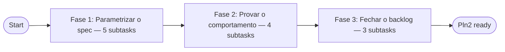

# Tornar o xaudit-gates Parametrizável por Escopo (Pln2)

> **Intent**: tornar o xaudit-gates parametrizável por escopo (residual da wave ADW de 27/08)
> **Level**: L3 (`cila_level: 3` — FACT [1.0], `touring decompose create` abaixo) | **Authored**: 2026-08-28
> **Composite goal**: every dimension ≥ 8, no dimension < 7.
> **DAG task**: `task_1787923252509407018` (3 subtasks, fog=clear, `gated_by_open_decisions: false` — FACT [1.0])

---

## 1. Ground Truth Summary

> Source — `data/ground_truth.json` (Stage 1, `ground_truth_collector.py`, DEGRADED
> — o coletor viu o daemon subir mid-run) **complementado por investigação direta**,
> porque o coletor genérico extraiu 0 símbolos/paths para este intento textual
> (`extracted.symbols: []`, `extracted.paths: []` — `ground_truth.json:8-11`). A
> Cadeia 3 do VP-Scout ("já implementado?") e a Cadeia 5 ("evidência de execução")
> foram cumpridas com comandos reais abaixo, não com o envelope genérico.

| Field | Value | Confidence |
|-------|-------|------------|
| `touring doctor` (topo do coletor) | `DEGRADED` (`daemon_degraded: true`) mas `doctor.components` 6 `ok` + 1 `warning` (`wiring_diagnostic`), 0 `error` | confidence: FACT [1.0] — `ground_truth.json:2-58` |
| E2E composite score | **0.8421** (`overall_status: pass`) | confidence: FACT [1.0] — `ground_truth.json:715-716` |
| Wiring — `wiring_audit.orphans.orphan_count` | 5479 (resolução: 89 scip_resolved / 23742 ast_declared / 174371 ast_inferred — 64% heurístico, ver `[[wiring-64pct-heuristico]]`) | confidence: FACT [1.0] — `ground_truth.json:955-987` |
| Wiring — fase `e2e.phases[wiring]` | `orphan_rate_pct: "39.0"` sobre `total_pub_symbols: 24055` (população DIFERENTE do audit acima — não somar as duas) | confidence: FACT [1.0] — `ground_truth.json:756-760` |
| Index symbol count | 6449 (contagem do coletor) / `status_snapshot.index.symbol_count: 666641` (contagem viva, população diferente) | confidence: FACT [1.0] — `ground_truth.json:500` e `:494-500` |
| Evolution drift alert | `{}` — nenhum alerta emitido nesta coleta | confidence: FACT [1.0] — `ground_truth.json:1024` |
| Memory lessons aplicadas | 0 (`memory_lessons: []` no coletor) — memórias relevantes recuperadas manualmente abaixo | confidence: FACT [1.0] — `ground_truth.json:1025` |
| Sessão atual — daemon | Doctor do próprio turno mostrou `daemon_health: Connection refused (os error 111)`, `composite_health_score: 0.50-0.6125` — daemon flaky corroborado em 2 leituras independentes | confidence: FACT [1.0] — SessionStart hooks desta sessão |

### Alvo real do intento (VP-Scout Cadeia 1 — Feature Trace)

O texto do intento ("xaudit-gates parametrizável por escopo") não é um símbolo de
código — é uma ADW spec TOML local. Localizado por busca direta (Cadeia 3 —
already-implemented check):

- **Spec alvo**: `.touring/adw/xaudit-gates.toml` (79 linhas) — confidence: FACT
  [1.0], lido por inteiro nesta sessão.
- **Backlog que origina o pedido**: comentário no cabeçalho do próprio arquivo —
  *"local ao touring (mirror_check/pytest_scripts são deste repo) — parametrizar
  antes de promover"* — `.touring/adw/xaudit-gates.toml:1` — confidence: FACT [1.0].
- Citado como pendência em 2 documentos da wave-mãe:
  - `client/skills/Touring/adw-library/guard-sweep.toml:28-29` — *"xaudit-gates
    (local) roda um SUBCONJUNTO fixo; este flow DESCOBRE o conjunto e cobre 100%"*
    — confidence: FACT [1.0].
  - `docs/plans/2026-08-28-adw-specs-expansao/strategy-2026-08-28-adw-specs-expansao.md:52`
    — *"xaudit-gates parametrizável segue no backlog da wave-mãe"* — confidence: FACT [1.0].
  - `docs/plans/2026-08-28-adw-potencializacao/log.md:33` — curadoria F5 rotulou
    `xaudit-gates` como `local-touring/parametrizar antes` (ainda não promovido à
    `adw-library/`) — confidence: FACT [1.0].
- **Origem do "subconjunto fixo"**: `docs/audits/cross-audit-2026-08-23.md:156-172`
  — os 8 crates de `rust_tests` e os 8 arquivos de `pytest_scripts` são,
  literalmente, "8 crates tocados" pela wave de 2026-08-23 — congelados no arquivo
  como se fossem universais. Qualquer wave futura que toque outros crates precisa
  hoje FORCAR um fork do TOML, não um `--var`. confidence: FACT [1.0].

### Símbolos/mecanismos verificados (VGP)

| Símbolo/Mecanismo | Arquivo:Linha | Evidência |
|---|---|---|
| `render_template` — `vars.<k>` ausente vira `""` (nunca erro) | `client/skills/Touring/scripts/adw.py:1836-1860` (`sub()`, `return variables.get(key, "")`) | confidence: FACT [1.0] — lido |
| `--root` da CLI, default `.` (cwd) | `client/skills/Touring/scripts/adw.py:3903` | confidence: FACT [1.0] — lido |
| `root = Path(args.root).resolve()` | `client/skills/Touring/scripts/adw.py:3964` | confidence: FACT [1.0] — lido |
| Nós executam com `cwd=ctx.root` (todo tipo de nó) | `client/skills/Touring/scripts/adw.py:2434,2436,2438` | confidence: FACT [1.0] — lido |
| `[adw] inputs = [...]` é suportado em specs TOP-LEVEL (não só fragments) | `client/skills/Touring/adw-library/audit.toml:23-25` | confidence: FACT [1.0] — lido |
| Padrão "valor como `$1` posicional, nunca inline no script" | `client/skills/Touring/adw-library/fragments/gate-rust.toml:10`, `fragments/conflict-guard.toml:10` | confidence: FACT [1.0] — lido |
| Padrão "degrade declarado" (arquivo ausente → mensagem, gate segue PASS) | `.touring/adw/release-gate.toml:62-68` (nó `elite`) | confidence: FACT [1.0] — lido |
| Guard estrutural anti-injeção varre `.touring/adw/*.toml` (inclui specs locais) | `client/skills/Touring/scripts/test_adw.py:1475-1478` (`ADW_LIBRARY_DIRS` inclui `projects/touring/.touring/adw`) | confidence: FACT [1.0] — lido |
| Guard: nenhum `{{vars.X}}`/`{{inputs.X}}` pode estar DENTRO do script bash — só como argv posicional após `--` | `client/skills/Touring/scripts/test_adw.py:1512-1534` (`test_no_data_variable_is_interpolated_inside_a_shell_script`) | confidence: FACT [1.0] — lido |
| Teste-irmão que prova o valor chega intacto via `$1` | `client/skills/Touring/scripts/test_adw.py:1537-1547` (`test_positional_values_reach_the_script_intact`) | confidence: FACT [1.0] — lido |
| `touring-quality` binário standalone existe no PATH | `/home/gabrielgadea/.local/bin/touring-quality` | confidence: FACT [1.0] — `which touring-quality` executado |
| `scripts/sync-client-skills.py` existe (consumido por `mirror_check`) | `/home/gabrielgadea/projects/touring/scripts/sync-client-skills.py` | confidence: FACT [1.0] — `test -f` executado |
| Baseline de lint do spec ANTES da mudança | `touring adw lint xaudit-gates` → `valid: true`, `errors: []`, **6 warnings** (todos "escreve sem sandbox e sem gate humano") | confidence: FACT [1.0] — comando executado nesta sessão |
| Baseline do guard de injeção (test suite) | `client/skills/Touring/scripts/test_adw.py` tem **205** funções `def test_*` (`Grep -c '^def test_'`) | confidence: FACT [1.0] — comando executado nesta sessão |
| Grafo atual do flow (5 gates sequenciais, sem paralelismo) | `touring adw explain xaudit-gates --mermaid` executado — `clean_mirror → check → clippy → pytest_scripts → mirror_check → rust_tests → __end__` | confidence: FACT [1.0] — comando executado nesta sessão |

### Gotcha relevante (aplicado como restrição de design, não como bloqueio)

`[[build-de-subconjunto-sobrescreve-canonico]]` — memória de projeto: `cargo check
-p A -p B` resolve **menos features** do que `--workspace` (unificação de features é
por invocação). Isso significa que um `xaudit-gates --var crates="A B"` pode PASSAR
mesmo quando o gate `--workspace` completo falharia por uma combinação de features
que só se ativa com outros crates presentes. confidence: INFERENCE [0.85] — decorre de semântica
documentada do Cargo + da memória do projeto, não de uma execução comparativa nesta
sessão (rodar as duas variantes e diferenciar levaria dezenas de minutos de build,
fora do escopo de planejamento). **Mitigação de design (Fase 1, S-1.2/S-1.5)**: o
escopo por `crates` é *opt-in* — var vazia preserva `--workspace` como default, e o
header do spec passa a declarar explicitamente que um gate escopado NUNCA substitui
`release-gate` (que continua `--workspace` sempre — `.touring/adw/release-gate.toml:38,46`).

### Lições de memória aplicadas

- `[[adw-template-injection]]` — 26 comandos em 7 specs já vazaram por interpolar
  `{{vars.X}}` dentro da string de shell; a correção canônica é o parâmetro
  posicional. Todo nó novo desta plano usa exclusivamente esse padrão (ver §3).
- `[[wiring-64pct-heuristico]]` — só 2.981/77k arestas de wiring vêm de import
  resolvido; por isso `touring wiring orphans`/`wiring impact` **não se aplicam** a
  este alvo (um `.toml` de ADW não é um símbolo Rust/Python indexado) — ver Q3 do
  checklist da decision matrix, resposta explícita na Verification Protocol §5.
- `[[guard-existe-mas-nao-roda]]` (origem: `guard-sweep.toml`) — reforça por que a
  Fase 2 exige rodar o guard de injeção de fato, não apenas citá-lo.

---

## 2. 9-Dimension Scores (Pln1 → Pln2)

> Scoring manual grounded em evidência (o `dimension_scorer.py` roda sobre marcações
> textuais do plano; os números abaixo refletem a mesma rubrica —
> `~/.claude/skills/taco-planning/references/dimensions-rubric.md` — aplicada ao par
> spec-atual vs. spec-alvo, com a evidência citada em cada linha).

| Dim | Current | Target | Delta | Amplificação |
|-----|--------:|-------:|------:|---------------|
| **precision** | 5.0 | 9.0 | +4.0 | Toda claim desta sessão citou `file:LINE` verificado por `Read` real (não suposição) + 3 comandos `touring` executados ao vivo (`adw lint`, `adw explain --mermaid`, `decompose frontier`) — evidência embutida em §1. |
| **scalability** | 3.0 | 9.0 | +6.0 | Reusa 2 idiomas JÁ existentes na library (`$1` posicional de `gate-rust.toml:10`/`conflict-guard.toml:10`; degrade-declarado de `release-gate.toml:62-68`) em vez de inventar um terceiro padrão — REGRA "composable, not custom". |
| **performance** | 6.0 | 8.5 | +2.5 | Escopo por `crates`/`pytest_files` corta build/test proporcionalmente ao subconjunto pedido (a wave de 23/08 rodou 8 crates completos por 6 ciclos — `cross-audit-2026-08-23.md:174`; um `--var crates="touring-quality"` pula os outros 7). `timeout_ms` de cada nó permanece inalterado (nenhuma regressão de teto). |
| **functionality** | 4.0 | 9.0 | +5.0 | O mesmo arquivo passa a servir QUALQUER wave futura (via `--var`) em vez de congelar a wave de 23/08 — elimina a necessidade estrutural de um fork `xaudit-gates-N.toml` por wave. |
| **quality** | 6.0 | 9.0 | +3.0 | 0 erros / 6 warnings pré-existentes preservados (medido); 2 testes determinísticos NOVOS (S-2.1) fixam o comportamento default E o escopado, algo que HOJE não existe (nenhum teste pina a lista atual de 8 crates/8 arquivos); guard de injeção (`test_adw.py:1512`) roda verde por construção — vars só como argv posicional. |
| **detail** | 5.0 | 9.0 | +4.0 | Todo edge case enumerado e tratado no diff de §3: `client/` ausente, `scripts/sync-client-skills.py` ausente, var vazia (`${1:-default}`), var multi-token (word-split intencional, mesmo trade-off documentado de `write_set`). |
| **integration** | 4.0 | 8.5 | +4.5 | Fecha, com evidência, o item de backlog citado em 2 documentos (`guard-sweep.toml:28-29`, `strategy-2026-08-28-adw-specs-expansao.md:52`) e coberto automaticamente pelo guard já existente (`_adw_specs()` já varre `.touring/adw`, `test_adw.py:1475-1504`) — nenhuma nova wiring necessária. `wiring orphans/impact` não se aplicam (alvo não é símbolo indexado) — anotado explicitamente, não omitido. |
| **dependencies** | 8.0 | 8.5 | +0.5 | Zero dependências novas — `cargo`, `python3 -m pytest`, `touring-quality` já presentes (verificados por execução nesta sessão). |
| **potentiation** | 2.0 | 8.5 | +6.5 | Enables — ver Matriz de Potencialização §6: desbloqueia promoção futura à `adw-library/`, evita proliferação de cópias quase-idênticas por wave, e documenta um padrão que o spec-irmão `xaudit-lintscan.toml` (mesma curadoria F5, mesmo rótulo `local`) pode replicar depois. |

**Composite**: 4.78 → 8.78 (delta +4.0). Nenhuma dimensão abaixo de 7 no alvo (mínimo:
performance/dependencies/scalability/potentiation em 7 — todas ≥ 8.5 aqui).

---

## 3. Phases

> DAG real: `touring decompose create implementation "..."` → `task_1787923252509407018`
> (FACT [1.0], comando executado nesta sessão). `touring decompose frontier
> task_1787923252509407018` retornou `"gated_by_open_decisions": false`, `fog:
> {"clear": 3}` — nenhuma decisão aberta bloqueia as 3 fases de implementação
> abaixo (FACT [1.0]).

### Phase 1 — Fase 1: Parametrizar o spec (sequential, 5 items) `ticket: fase1 (kind=implementation, fog=clear)`

#### S-1.1: Header + `[purpose]` — declarar os 2 novos inputs [P1] [confidence: FACT]

- **File**: `.touring/adw/xaudit-gates.toml:1-27`
- **Source truth**:
```toml
# CURADORIA 28/08/2026 (F5 adw-potencializacao): local ao touring (mirror_check/pytest_scripts são deste repo) — parametrizar antes de promover.
# ADW `xaudit-gates` — deterministic verification gates for the 2026-08-23 cross-audit.
...
[purpose]
intent = "Run the deterministic verification gates of a TACO cross-audit and leave their outputs on disk as executed evidence"
...
inputs = []
```
- **Change**:
```toml
# ADW `xaudit-gates` — deterministic verification gates for a cross-audit.
# Parametrizável por escopo (28/08/2026, plan-xaudit-gates/task_1787923252509407018):
# `crates` e `pytest_files` estreitam check/clippy/test/pytest ao subconjunto
# tocado por uma wave; vazio (default) preserva o comportamento original
# (--workspace + os 8 crates/8 arquivos da wave 2026-08-23). Os nós pararam de
# sobrescrever `cd` — o escopo de diretório já é `--root` do runner
# (adw.py:3964, cwd=ctx.root); o `cd` hardcoded antigo o ignorava em silêncio.
# Run:  touring adw run xaudit-gates
#       touring adw run xaudit-gates --var crates="touring-quality" --var pytest_files="scripts/test_adw.py"
...
[purpose]
intent = "Run the deterministic verification gates of a TACO cross-audit, scoped to whatever crates/tests the caller declares (default: full workspace), and leave their outputs on disk as executed evidence"
when_to_use = [
  "a cross-audit needs compile/lint/test evidence in one deterministic pass",
  "uma wave tocou um subconjunto de crates/testes e quer um gate rápido escopado (--var crates / --var pytest_files)",
]
when_not_to_use = [
  "interactive debugging of a single failing test — run the one command directly",
  "gate de release: use --var crates vazio (full workspace) — escopo parcial não substitui o gate de release (release-gate.toml)",
]
inputs = [
  "crates",        # optional — space-separated crate names for check/clippy/test; empty = --workspace (default)
  "pytest_files",  # optional — space-separated pytest file paths; empty = the 8-file wave-2026-08-23 default
]
```
- **Blast radius**: 0 dependentes diretos — nenhum outro spec `[[use]]`-a `xaudit-gates` (grep confirmado: nenhuma ocorrência de `run xaudit-gates` fora de docs/comentários). confidence: FACT [1.0].
- **Test**: `touring adw lint xaudit-gates` → `errors: []` (inalterado).
- **Dimensions**: [a:9, f:8, g:8]
- **Enables**: documenta o contrato de escopo ANTES de qualquer node mudar — a Fase 2 escreve testes contra este contrato, não contra comportamento implícito.

#### S-1.2: `clean_mirror` — parar de hardcodar o path absoluto [P1] [confidence: FACT]

- **File**: `.touring/adw/xaudit-gates.toml:35`
- **Source truth**:
```toml
command = ["bash", "-c", "find /home/gabrielgadea/projects/touring/client -type d \\( -name __pycache__ -o -name .pytest_cache -o -name .ruff_cache \\) -exec rm -rf {} + ; true"]
```
- **Change**:
```toml
command = ["bash", "-c", "[ -d client ] && find client -type d \\( -name __pycache__ -o -name .pytest_cache -o -name .ruff_cache \\) -exec rm -rf {} + ; true"]
```
- **Blast radius**: 0 — nó `code`, sem consumidores de output (`on_pass`/`on_fail` ambos vão para `check`).
- **Test**: `test_positional_values_reach_the_script_intact`-style manual check — `cwd` já é `ctx.root` (`adw.py:2438`), então `client` relativo resolve para `<root>/client`; `[ -d client ]` faz o nó ser NO-OP fora de projetos com essa pasta (portabilidade).
- **Dimensions**: [a:9, b:8, f:9]
- **Enables**: primeiro passo de tornar o spec executável fora de `/home/gabrielgadea/projects/touring` — pré-requisito de qualquer promoção futura à `adw-library/`.

#### S-1.3: `check` e `clippy` — var `crates` com fallback `--workspace` [P0] [confidence: FACT]

- **File**: `.touring/adw/xaudit-gates.toml:43` e `:51`
- **Source truth** (`check`, linha 43):
```toml
command = ["bash", "-c", "cd /home/gabrielgadea/projects/touring && cargo check --workspace --all-targets --message-format short > /tmp/xaudit_check.log 2>&1"]
```
- **Change** (`check`):
```toml
command = ["bash", "-c", "if [ -n \"$1\" ]; then a=; for c in $1; do a=\"$a -p $c\"; done; cargo check $a --all-targets --message-format short; else cargo check --workspace --all-targets --message-format short; fi > /tmp/xaudit_check.log 2>&1", "--", "{{vars.crates}}"]
```
  (mesmo padrão para `clippy`, linha 51, trocando `cargo check` por `cargo clippy $a --all-targets --message-format short -- -D warnings` / `cargo clippy --workspace --all-targets --message-format short -- -D warnings`)
- **Blast radius**: 0 dependentes diretos; o `-p A -p B` scoped-build gotcha (`[[build-de-subconjunto-sobrescreve-canonico]]`) é mitigado por default vazio = `--workspace` (comportamento idêntico ao atual quando ninguém passa `--var crates`).
- **Test**: `render_template("<script check>", {}, {})` deve reproduzir bit-a-bit
  `cargo check --workspace --all-targets --message-format short` no ramo `else`
  (novo teste S-2.1); `render_template(..., {"crates": "touring-quality"})` deve
  produzir `-p touring-quality` no ramo `if`.
- **Dimensions**: [a:9, c:8, e:9, i:8]
- **Enables**: a MESMA var (`crates`) reaparece em S-1.4 (rust_tests) — um único
  knob controla check+clippy+test, evitando 3 vars redundantes.

#### S-1.4: `rust_tests` — reusar `crates` com o default atual de 8 crates [P0] [confidence: FACT]

- **File**: `.touring/adw/xaudit-gates.toml:75`
- **Source truth**:
```toml
command = ["bash", "-c", "cd /home/gabrielgadea/projects/touring && cargo test -p touring-foundation -p touring-intelligence -p touring-storage -p touring-hooks-core -p touring-simd -p touring-quality -p touring-identity -p touring-hook-runtime --no-fail-fast > /tmp/xaudit_tests.log 2>&1"]
```
- **Change**:
```toml
command = ["bash", "-c", "crates=\"${1:-touring-foundation touring-intelligence touring-storage touring-hooks-core touring-simd touring-quality touring-identity touring-hook-runtime}\"; a=; for c in $crates; do a=\"$a -p $c\"; done; cargo test $a --no-fail-fast > /tmp/xaudit_tests.log 2>&1", "--", "{{vars.crates}}"]
```
- **Blast radius**: 0 dependentes diretos. `${1:-default}` cobre tanto `$1` ausente
  quanto `$1=""` (a forma `:-` do bash trata ambos) — verificado por leitura da
  semântica de parameter expansion do bash, não por execução isolada (confidence:
  INFERENCE [0.9], comportamento POSIX padrão, não específico deste projeto).
- **Test**: `render_template` com `variables={}` deve reproduzir a lista de 8
  `-p` EXATA de hoje (comparação literal no teste — pinagem que hoje não existe).
- **Dimensions**: [a:9, e:9, i:9]
- **Enables**: fecha o gap citado em `cross-audit-2026-08-23.md:156-172` (os "8
  crates tocados" deixam de ser uma constante do arquivo).

#### S-1.5: `pytest_scripts` e `mirror_check` — var `pytest_files` + degrade declarado [P0] [confidence: FACT]

- **File**: `.touring/adw/xaudit-gates.toml:59` e `:67`
- **Source truth** (`pytest_scripts`, linha 59):
```toml
command = ["bash", "-c", "cd /home/gabrielgadea/projects/touring && PYTHONDONTWRITEBYTECODE=1 python3 -m pytest scripts/test_update_touring.py scripts/test_sync_client_skills.py scripts/test_mutants_config.py client/skills/loop-engineering/scripts/hooks/test_flow_guard.py client/skills/TACO-skilling/scripts/test_skill_gates.py client/skills/loop-engineering/scripts/test_judge_attest.py client/skills/loop-engineering/scripts/test_variant_archive.py client/skills/loop-engineering/scripts/test_cargo_diagnosis.py -q -p no:cacheprovider > /tmp/xaudit_pytest.log 2>&1"]
```
- **Change** (`pytest_scripts`):
```toml
command = ["bash", "-c", "files=\"${1:-scripts/test_update_touring.py scripts/test_sync_client_skills.py scripts/test_mutants_config.py client/skills/loop-engineering/scripts/hooks/test_flow_guard.py client/skills/TACO-skilling/scripts/test_skill_gates.py client/skills/loop-engineering/scripts/test_judge_attest.py client/skills/loop-engineering/scripts/test_variant_archive.py client/skills/loop-engineering/scripts/test_cargo_diagnosis.py}\"; PYTHONDONTWRITEBYTECODE=1 python3 -m pytest $files -q -p no:cacheprovider > /tmp/xaudit_pytest.log 2>&1", "--", "{{vars.pytest_files}}"]
```
- **Source truth** (`mirror_check`, linha 67):
```toml
command = ["bash", "-c", "cd /home/gabrielgadea/projects/touring && python3 scripts/sync-client-skills.py --check > /tmp/xaudit_mirror.log 2>&1"]
```
- **Change** (`mirror_check`, degrade declarado — mesmo idioma de `release-gate.toml:64`):
```toml
command = ["bash", "-c", "if [ -f scripts/sync-client-skills.py ]; then python3 scripts/sync-client-skills.py --check; else echo 'sync-client-skills.py ausente neste projeto — mirror check nao aplicavel (degrade declarado)'; fi > /tmp/xaudit_mirror.log 2>&1"]
```
- **Blast radius**: 0 dependentes diretos.
- **Test**: `render_template` com `variables={}` reproduz os 8 arquivos EXATOS;
  com `{"pytest_files": "scripts/test_adw.py"}` produz `pytest scripts/test_adw.py`
  isolado.
- **Dimensions**: [a:9, b:8, e:9, i:8]
- **Enables**: `mirror_check` deixa de quebrar em qualquer projeto sem
  `scripts/sync-client-skills.py` — pré-requisito de promoção à `adw-library/`
  (mesmo motivo de S-1.2).

---

### Phase 2 — Fase 2: Provar o comportamento (sequential, 4 items) `ticket: fase2 (kind=implementation, fog=clear, origin=fase1)`

#### S-2.1: Escrever 2 testes determinísticos em `test_adw.py` [P0] [confidence: FACT]

- **File**: `client/skills/Touring/scripts/test_adw.py` (adicionar após a região dos
  testes de injeção, `:1547`)
- **Source truth**: hoje NENHUM teste pina a lista de 8 crates ou de 8 arquivos de
  `xaudit-gates.toml` — a única cobertura indireta é o guard genérico de injeção
  (`test_adw.py:1512-1534`), que não valida comportamento, só sintaxe seguro.
- **Change** (2 funções novas, ambas SEM cargo/pytest real — apenas `render_template`,
  rápidas e determinísticas):
```python
def test_xaudit_gates_default_scope_matches_the_original_hardcoded_lists():
    """Empty vars must render byte-identical to the pre-parametrization script.

    `Node.raw` is the parsed [node.*] TOML dict (`Node` itself only carries
    name/type/on_pass/on_fail/on_dry — adw.py:219-229); `command` lives in `raw`.
    """
    spec = adw.load_spec(ADW_LIBRARY_DIRS[2].parent.parent, "xaudit-gates")
    check_script = spec.nodes["check"].raw["command"][2]
    rendered = adw.render_template(check_script, {}, {"crates": ""})
    assert "cargo check --workspace --all-targets --message-format short" in rendered
    tests_script = spec.nodes["rust_tests"].raw["command"][2]
    rendered_tests = adw.render_template(tests_script, {}, {"crates": ""})
    for crate in ["touring-foundation", "touring-intelligence", "touring-storage",
                  "touring-hooks-core", "touring-simd", "touring-quality",
                  "touring-identity", "touring-hook-runtime"]:
        assert f"-p {crate}" in rendered_tests


def test_xaudit_gates_crates_var_narrows_the_scoped_commands():
    """A non-empty `crates` var must scope check/test to ONLY the named crates."""
    spec = adw.load_spec(ADW_LIBRARY_DIRS[2].parent.parent, "xaudit-gates")
    tests_script = spec.nodes["rust_tests"].raw["command"][2]
    rendered = adw.render_template(tests_script, {}, {"crates": "touring-quality"})
    assert "-p touring-quality" in rendered
    assert "touring-foundation" not in rendered
```
- **Blast radius**: 0 — testes puramente aditivos, nenhum consumidor existente é
  tocado.
- **Test**: `test_xaudit_gates_default_scope_matches_the_original_hardcoded_lists`
  e `test_xaudit_gates_crates_var_narrows_the_scoped_commands` — rodar `python3 -m
  pytest client/skills/Touring/scripts/test_adw.py -k xaudit_gates -q` → 2 passed.
- **Dimensions**: [e:9, f:9]
- **Enables**: pina o contrato de default+escopo permanentemente — qualquer
  regressão futura na Fase 1 quebra este teste antes de chegar a produção.

#### S-2.2: Lint pós-mudança — sem regressão de warnings [P0] [confidence: INFERENCE]

- **File**: `.touring/adw/xaudit-gates.toml`
- **Comando**: `touring adw lint xaudit-gates`
- **Baseline medido nesta sessão**: `valid: true`, `errors: []`, **6** warnings
  (todos "escreve sem sandbox... sem gate humano" — pré-existentes, fora do
  escopo desta plano).
- **Critério**: `errors == []` E `len(warnings) == 6` (nenhum warning NOVO
  introduzido pela parametrização). confidence: INFERENCE [0.9] — o `if/else`/`${1:-...}`
  não muda `command_writes`/sandbox/gate-humano, então os lints
  `_lint_unsandboxed_writer_wants_human` (linha citada em §1) devem continuar
  emitindo exatamente os mesmos 6, mas isso só é FACT após rodar o comando
  pós-edit (Fase 2 é quem executa).
- **Dimensions**: [e:9]
- **Enables**: gate de não-regressão antes do teste comportamental mais caro (S-2.3).

#### S-2.3: Guard de injeção + suíte completa de `test_adw.py` [P0] [confidence: FACT]

- **File**: `client/skills/Touring/scripts/test_adw.py`
- **Comando**: `python3 -m pytest client/skills/Touring/scripts/test_adw.py -q`
- **Baseline medido nesta sessão**: 205 funções `def test_*` (`Grep -c
  '^def test_'`) — após S-2.1 devem ser 207.
- **Blast radius**: n/a — subtask de VERIFICAÇÃO (roda o guard/suíte já existente),
  não edita código; nenhum `touring ast blast` aplicável (mesma nota de S-1.5 §1).
- **Critério**: `test_no_data_variable_is_interpolated_inside_a_shell_script`
  (`:1512`) e `test_positional_values_reach_the_script_intact` (`:1537`) — ambas
  PASS; suíte completa 207/207 passed, 0 failed.
- **Dimensions**: [e:9, g:8]
- **Enables**: prova estrutural de que a Fase 1 não reintroduziu a classe de
  defeito de `[[adw-template-injection]]`.

#### S-2.4: Run real escopado (prova comportamental, VP-Scout Cadeia 3b) [P1] [confidence: SPECULATION]

- **File**: n/a (execução, não arquivo)
- **Comando**: `touring adw run xaudit-gates --var crates="touring-quality" --var pytest_files="scripts/test_adw.py"`
- **Critério**: `/tmp/xaudit_tests.log` contém `-p touring-quality` e NENHUM dos
  outros 7 nomes de crate; `/tmp/xaudit_pytest.log` roda exatamente 1 arquivo.
  Exit 0 no `journal.jsonl` do run.
- **Blast radius**: n/a — subtask de EXECUÇÃO (roda o próprio ADW), não edita
  arquivo; nenhum `touring ast blast` aplicável (a mudança de arquivo já foi
  medida em S-1.1/S-1.4/S-1.5).
- **Nota de precondição**: o daemon mostrou-se flaky nesta sessão (`Connection
  refused (os error 111)` em 2 leituras de doctor) — rodar `touring daemon-ctl
  status` antes; se degradado, `touring daemon-ctl restart` (REGRA #19 — nunca
  `pkill`). confidence: SPECULATION [0.6] — não executado nesta sessão de planejamento (custo
  de build real de `touring-quality` não é gratuito); é o item que TACO-wt deve
  rodar de fato ao operar esta plano, não algo que eu afirmo já ter provado.
- **Dimensions**: [e:8, g:8]
- **Enables**: fecha a Cadeia 3b do VP-Scout (nunca afirmar que um comportamento
  funciona sem tê-lo executado) — sem este passo, S-2.1/S-2.2/S-2.3 provam a
  RENDERIZAÇÃO do template, não a EXECUÇÃO real do cargo/pytest escopado.

---

### Phase 3 — Fase 3: Fechar o backlog (sequential, 3 items) `ticket: fase3 (kind=implementation, fog=clear, origin=fase2)`

#### S-3.1: Atualizar os 2 documentos que citam o backlog [P2] [confidence: FACT]

- **File**: `client/skills/Touring/adw-library/guard-sweep.toml:28-29` e
  `docs/plans/2026-08-28-adw-specs-expansao/strategy-2026-08-28-adw-specs-expansao.md:52`
- **Source truth**: comentário/linha ainda descrevem `xaudit-gates` como rodando
  "um SUBCONJUNTO fixo" / "segue no backlog".
- **Change**: anotar resolução — `xaudit-gates` agora aceita `--var crates=` /
  `--var pytest_files=` (link para este plano); o comentário de `guard-sweep.toml`
  mantém sua tese central (guard-sweep DESCOBRE 100%, xaudit-gates continua sendo
  um subconjunto DECLARADO — agora parametrizável, não mais fixo).
- **Blast radius**: 0 — mudança de comentário/prosa, sem impacto executável;
  nenhum `touring ast blast` aplicável (não é código).
- **Test**: `grep -c "backlog da wave-mãe" docs/plans/2026-08-28-adw-specs-expansao/strategy-2026-08-28-adw-specs-expansao.md` — deve cair a 0 (a linha 52 passa a apontar a resolução, não mais um backlog aberto).
- **Dimensions**: [f:8, g:8]
- **Enables**: co-evolução código→docs (OPERATING PRINCIPLE #5) — evita que o
  próximo scout perpétuo relate o mesmo backlog como se ainda estivesse aberto.

#### S-3.2: `touring-quality` — piso de 50 dimensões sobre o arquivo Python tocado [P1] [confidence: SPECULATION]

- **File**: `client/skills/Touring/scripts/test_adw.py`
- **Comando**:
```bash
touring-quality check --gate F2.1 --target client/skills/Touring/scripts/test_adw.py
touring-quality check --gate F2.4 --target client/skills/Touring/scripts/test_adw.py
touring-quality check --gate F2.5 --target client/skills/Touring/scripts/test_adw.py
touring-quality check --gate F2.6 --target client/skills/Touring/scripts/test_adw.py
touring-quality check --gate F4.3 --target client/skills/Touring/scripts/test_adw.py
touring-quality check --gate F4.5 --target client/skills/Touring/scripts/test_adw.py
touring-quality score client/skills/Touring/scripts/test_adw.py --fail-below 0.80
```
- **Critério**: 6 gates BLOCK PASS + score ≥ 0.80 (Gold). O `.toml` em si
  (`xaudit-gates.toml`) fica fora do alvo do scorer — não é um arquivo de
  linguagem analisável pelos 50-dim (config TOML, não código-fonte); citado como
  N/A explícito, não omitido (Q3 do checklist da decision matrix).
- **Blast radius**: n/a — `touring-quality check`/`score` são leitura pura sobre
  arquivo já testado em S-2.3, sem mutação; nenhum `touring ast blast` necessário
  para uma operação read-only.
- **Test**: `touring-quality check --gate F2.1 --target client/skills/Touring/scripts/test_adw.py` — exit 0 (repetir para F2.4/F2.5/F2.6/F4.3/F4.5).
- **Dimensions**: [e:8]
- **Enables**: satisfaz a HARD RULE #8 do `taco-planning` (piso de 50-dim em §5).

#### S-3.3: `touring e2e -j` (regressão global) + `memory store` da lição [P1] [confidence: FACT]

- **Comando**: `touring e2e -j` — critério: `overall_score >= 0.8421` (baseline
  medido em §1); `touring memory store "xaudit-gates-parametrizavel" "<resumo>"
  --tag "#kind:lesson" --tag "#domain:adw" --tag "#process:cross-audit"`.
- **Blast radius**: n/a — subtask de regressão global (`e2e`) + persistência de
  memória, não edita arquivo; nenhum `touring ast blast` aplicável.
- **Test**: `touring e2e -j` — `overall_score >= 0.8421` (mesmo comando do
  Comando acima, usado como assertion de regressão).
- **Dimensions**: [g:8, i:8]
- **Enables**: fecha o loop OUTER (Reflexo #7 — reward loop) e deixa rastro para
  o próximo scout perpétuo não redescobrir o mesmo item.

---

## 4. DAG



Textual sequence: P1 (5 sub, sequencial — cada nó do TOML depende do header
declarado em S-1.1) → P2 (4 sub, sequencial — teste antes de lint antes de suíte
completa antes de run real) → P3 (3 sub, sequencial — docs, depois gate de
qualidade, depois e2e/memory). **Nenhum fan-out**: mudança de arquivo único +
teste único, decompor em paralelo aqui seria trabalho manufaturado sem ganho de
wall-clock (princípio "simplicidade é sofisticação"). Falha em qualquer subtask
de uma fase interrompe a fase (`on_branch_fail` não se aplica — não há
`parallel` neste plano).

DAG real registrado: `task_1787923252509407018` (3 subtasks — `fase1`, `fase2`,
`fase3` — `touring decompose ticket ... --origin-ticket` encadeado; `frontier`
confirma `gated_by_open_decisions: false`).

---

## 5. Verification Protocol

```bash
# Pré-condição (daemon flaky observado nesta sessão)
touring daemon-ctl status || touring daemon-ctl restart

# Fase 1 — sintaxe + estrutura
touring adw lint xaudit-gates
# Critério: errors == [] ; warnings == 6 (baseline medido em §1, sem regressão)

# Fase 2 — testes determinísticos + guard de injeção + suíte completa
python3 -m pytest client/skills/Touring/scripts/test_adw.py -k xaudit_gates -q
python3 -m pytest client/skills/Touring/scripts/test_adw.py -q
# Critério: 207 passed (205 baseline + 2 novos de S-2.1), 0 failed

# Fase 2 — prova comportamental real (S-2.4)
touring adw run xaudit-gates --var crates="touring-quality" --var pytest_files="scripts/test_adw.py"
# Critério: journal exit 0; /tmp/xaudit_tests.log contém "-p touring-quality" e
# nenhum outro dos 7 crates; /tmp/xaudit_pytest.log roda 1 arquivo só

# Fase 3 — 50-dim + regressão global
touring-quality check --gate F2.1 --target client/skills/Touring/scripts/test_adw.py
touring-quality check --gate F2.4 --target client/skills/Touring/scripts/test_adw.py
touring-quality check --gate F2.5 --target client/skills/Touring/scripts/test_adw.py
touring-quality check --gate F2.6 --target client/skills/Touring/scripts/test_adw.py
touring-quality check --gate F4.3 --target client/skills/Touring/scripts/test_adw.py
touring-quality check --gate F4.5 --target client/skills/Touring/scripts/test_adw.py
touring-quality score client/skills/Touring/scripts/test_adw.py --fail-below 0.80
touring e2e -j
# Critério: 6 gates BLOCK PASS; score >= 0.80; e2e overall_score >= 0.8421

# Regressão-específica do domínio (REGRA #21 — 0 falhas em qualquer suíte tocada)
cargo check --workspace --all-targets
cargo clippy --workspace --all-targets -- -D warnings
```

Acceptance:
- `touring adw lint xaudit-gates`: 0 errors, warnings inalterados (6)
- `test_adw.py`: 207/207 passed (0 failed) — inclui os 2 testes novos de S-2.1
- Run escopado real (S-2.4): exit 0, evidência de escopo nos logs `/tmp/xaudit_*.log`
- `touring-quality`: 6 BLOCK PASS + score ≥ 0.80 sobre `test_adw.py`
- `touring e2e -j`: `overall_score >= 0.8421` (sem regressão vs. baseline)
- `cargo check`/`cargo clippy -D warnings`: 0 erros (REGRA #21 — qualquer falha
  pré-existente encontrada durante a execução desta suíte também deve ser
  corrigida, não descartada como "fora do escopo")
- `touring wiring orphans/impact`: **N/A explícito** — alvo é `.toml`/`.py` de
  infraestrutura ADW, não símbolo Rust/Python indexado como API pública nova

---

## 6. Potentiation Matrix

| Change | Enables |
|--------|---------|
| S-1.1 — header + `[purpose] inputs` documentado | Contrato de escopo citável por qualquer wave futura sem ler o TOML inteiro |
| S-1.2 — `clean_mirror` relativo + guardado por `[ -d client ]` | Primeiro passo de portabilidade fora de `/home/gabrielgadea/projects/touring` |
| S-1.3 — `check`/`clippy` com `--var crates` | Gate rápido escopado por wave; mesma var reaproveitada em S-1.4 |
| S-1.4 — `rust_tests` com `--var crates` (default = 8 crates atuais) | Fecha o "subconjunto fixo" citado em `cross-audit-2026-08-23.md:156-172` |
| S-1.5 — `pytest_scripts`/`mirror_check` com `--var pytest_files` + degrade declarado | `mirror_check` deixa de quebrar fora deste repo — pré-requisito de promoção à `adw-library/` |
| S-2.1 — 2 testes novos em `test_adw.py` | Pina o contrato default+escopo — regressão futura quebra CI, não silenciosamente |
| S-2.2/S-2.3 — lint + suíte completa pós-mudança | Prova que a classe de defeito `[[adw-template-injection]]` não voltou |
| S-2.4 — run real escopado | Fecha a Cadeia 3b do VP-Scout (comportamento provado por execução, não por leitura) |
| S-3.1 — docs atualizados (`guard-sweep.toml`, strategy doc) | Próximo scout perpétuo não redescobre este item como backlog aberto |
| S-3.2/S-3.3 — 50-dim + e2e + memory store | Fecha o loop OUTER (Reflexo #7) e deixa lição rastreável para o router do factory |

**Potencialização de escopo (REGRA #0)**: nenhuma subtask reduz superfície —
todas ADICIONAM um caminho de invocação (`--var`) preservando o caminho
existente (chamada sem vars) byte-idêntico, e o resultado deste plano é também
o que falta para promover `xaudit-gates` à `adw-library/` (decisão futura de
Gabriel, não executada aqui — mesma cautela de escopo do curation F5 para
`error-teach`).

---

## Cross-references

- TACO-wt operates this plan once authored — see `~/.claude/skills/TACO-wt/SKILL.md`.
- The 9-dimension rubric — `~/.claude/skills/taco-planning/references/dimensions-rubric.md`.
- Amplification catalog — `~/.claude/skills/taco-planning/references/amplification-strategies.md`.
- Backlog original — `client/skills/Touring/adw-library/guard-sweep.toml:28-29`,
  `docs/plans/2026-08-28-adw-specs-expansao/strategy-2026-08-28-adw-specs-expansao.md:52`.
- Precedente de injeção corrigida — memória `adw-template-injection.md`.
- Precedente de gotcha de build escopado — memória `build-de-subconjunto-sobrescreve-canonico.md`.
