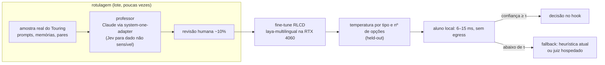

# Jev (System One, TypeSafe AI) — pesquisa, boas práticas e uso no Touring

Parte do [bundle](/index.md). **Versão 2** (rodada 2, tarde de 22/09/2026).

Fontes da rodada 1: a documentação oficial inteira (`docs.typesafe.ai/llms-full.txt`,
110 páginas), o post de lançamento de 15/09/2026, quatro consultas ao Context7 e o
código do Touring. Os resumos estão em
[research/digest-cookbooks.md](/research/digest-cookbooks.md) e
[research/digest-ecossistema.md](/research/digest-ecossistema.md).

Fontes da rodada 2:
- o `laya-mlx` e o Laya original (Convai Innovations, Apache-2.0), com o resumo em
  [research/digest-laya-local.md](/research/digest-laya-local.md);
- as lacunas do Jev em [research/digest-jev-r2.md](/research/digest-jev-r2.md);
- um **experimento local na RTX 4060** com dados do Touring, em
  [experiments/laya-local/report.md](/experiments/laya-local/report.md);
- uma varredura dos pontos de decisão do Touring, com o volume real de cada um.

Convenção de confiança: **[F]** fato lido na fonte citada; **[I]** inferência minha
(0,7–0,9); **[E]** estimativa numérica derivada dos preços publicados.

---

## 1. Veredito em uma tela

- **O que é.** Uma *função de decisão* hospedada: você manda um `state` (texto ou JSON)
  e perguntas tipadas; recebe respostas tipadas com probabilidades. Três primitivas:
  **Choice** (1 de até 255 opções), **Score** (posição numa escala de 2 a 10 níveis
  descritos) e **Noul** (probabilidade de "sim"). Não gera texto, não conversa, não
  escreve código. [F]
- **Por que importa.** Latência típica de ~100 ms, preço só de entrada
  (US$ 0,042 por milhão de tokens; saída grátis), todas as perguntas de uma chamada
  avaliadas em paralelo e isoladas, e probabilidades treinadas para calibração
  (RLCD). [F]
- **Onde cabe no Touring (revisado na rodada 2).** Decisões tipadas valem onde há
  volume e erro medido. Em ordem:
  1. o intent de todo prompt, que define o nível CILA;
  2. o filtro de relevância das memórias antes de injetar;
  3. as tags facetadas;
  4. a deduplicação.

  O roteador do factory tem bom desenho, mas passou por só 9 tickets no total, então
  espera volume. Antes de qualquer modelo, um filtro determinístico deve impedir que o
  `prompt-enhance` classifique notificações automáticas. [F medido + I, 0,8]
- **Jev hospedado × Laya local.** Os dois não competem: ocupam papéis diferentes.
  - O Jev é forte sem ajuste, tem 32k de contexto e até 255 opções. Daqui, porém, só o
    TCP até a AWS us-west-2 já leva 209–231 ms, e o dado sai do país.
  - O Laya roda aqui a 6–15 ms por decisão, sem custo e sem o dado sair da máquina, mas
    sem ajuste é fraco nos dados do Touring (experimento abaixo).
  - O desenho é **professor → aluno**: um modelo forte rotula uma amostra, e o Laya
    ajustado atende os caminhos quentes. [F medido + I]
- **O que os números dizem.** Nos evals da própria TypeSafe (4 workflows, rótulos de
  referência = média de GPT-6 Astra e Fable 5.1), o Jev faz 67,8% por US$ 0,0004 e
  0,4 s por caso: empata com sonnet 5 (67,8%) e terra (67,9%), fica abaixo de sol
  (74,1%) e opus 5 (73,1%), e bem acima do haiku 4.5 (53,6%) — o modelo que o factory do
  Touring usa hoje. Avaliações independentes confirmam custo, latência e zero erros de
  tipo, mas mostram calibração irregular fora da distribuição e classificadores pequenos
  treinados vencendo quando o rótulo está visível nas palavras. [F — evals.raw
  conferido; terceiros em [digest-ecossistema](/research/digest-ecossistema.md)]
- **Onde não cabe.** Gates de segurança e do CEG, wiring/imports, o juiz de
  convergência, contagem/datas/números, hooks síncronos de ~1 ms e qualquer geração de
  texto. [F para os limites do modelo; I para o mapeamento no Touring]
- **Bloqueios antes de qualquer código.** Não há chave (`TYPESAFE_API_KEY` não está
  definida nesta máquina, verificado em 22/09); a acurácia em pt-BR é declaradamente
  menor; o produto está em *early access*, com rate limits dinâmicos e duas mudanças
  incompatíveis no SDK Python em sete dias. A decisão certa é um **spike de medição
  comparativo** com dados do próprio Touring, não uma adoção. [F + I]

---

## 1b. O que a rodada 2 mudou

**1. Volume real de cada decisão (medido em 22/09).**

| Ponto de decisão | Volume | Como decide hoje |
|---|---|---|
| Intent do prompt → nível CILA (`prompt_enhance.rs:253`) | todo prompt: 667 sessões, ~2.553 prompts humanos, 5.276 mensagens de usuário ao todo | palavras-chave, 8 intents |
| Recall e injeção de memórias | todo prompt e muitas tool calls | BM25 + embeddings + RRF |
| Tags facetadas (`tags.rs::derive_tags`) | 17.084 memórias + fluxo contínuo | 93% auto/backfill por heurística |
| Roteador do factory (`factory.py`) | **9 tickets no total** (touring 5, analise 4), 1 desfecho | 6 regex em inglês + `claude -p --model haiku` |

A rodada 1 pôs o factory em primeiro lugar pelo ganho por decisão (120 s → 0,1 s).
Com volume de 9, esse ganho não paga a integração agora, e o spike F1 como escrito não
tinha gabarito (1 desfecho). A chamada de LLM com JSON forçado, porém, existe só nesse
ponto em todo o Touring: a varredura de `crates/`, `scripts/` e das skills achou um
único `Reply ONLY with JSON`.

**2. O classificador de intent erra nos dois extremos.** Os dois prompts de pesquisa
profunda desta sessão ("faça uma exploração exaustiva… análise completa") saíram como
**GENERAL**, com o nível CILA mais baixo. Na direção oposta, o hook injetou "TEST MODE",
"CODE MODE" e "DEBUG MODE" em notificações automáticas de agentes durante a própria
sessão.

**3. Existe um modelo aberto com a mesma interface.** O **Laya** (Convai Innovations,
Apache-2.0 em pesos e código) tem os mesmos Choice/Score/Noul, treino RLCD próprio e
três checkpoints:
- inglês: ModernBERT-large 421M, contexto de 512 tokens;
- multilíngue: mmBERT 322M, contexto de 1024 tokens;
- `typed-decisions`: ajustado nos 4 workflows da TypeSafe.

O `laya-mlx` é um port para Apple Silicon e não roda em Linux (o `pyproject` só instala
o MLX em darwin/arm64). Na RTX 4060 a rota é o pacote `laya` em PyTorch. [F]

**4. Medido nesta máquina** ([relatório](/experiments/laya-local/report.md)).

Latência e memória:

| Checkpoint | 1 pergunta | 50 perguntas | Pico de VRAM |
|---|---|---|---|
| multilíngue | 6,4 ms | 57 ms | 3,2 GB |
| inglês | 14,4 ms | 129 ms | 3,6 GB |

Acurácia sem fine-tuning, contra o que o Touring usa hoje:

| Prova | Laya | Hoje no Touring | Referência |
|---|---|---|---|
| Tipo de memória | 0,50 (0,76 em 27% dos itens com confiança ≥ 0,8) | tag derivada: 0,067 | acaso 0,20 |
| Roteamento de tasks | 0,36 | regex: 0,10 | classe majoritária 0,58 |
| Relevância no recall | 0 de 2 no topo | — | — |
| Intent, conjunto dourado | 88% (16/16 com confiança ≥ 0,8) | keyword: 100% (por construção) | — |
| Intent, textos reais | 42% | keyword: 83% | — |

Isso confirma o próprio autor: "a fast base to specialise, not a zero-shot decision
engine".

**5. Terceiros com itens idênticos.** O Jev vence quase tudo: triagem 0,894 × 0,800,
moderação 0,989 × 0,833, seleção de catálogo 92 × 23–30 em 100. A exceção é o AG News
(Laya 0,939 × 0,886).

O Banking77 citado pelo Laya (Jev 0,870) usa outro protocolo: 72 rótulos com descrição,
n = 100. Com os 77 rótulos originais os estudos convergem em 0,76–0,80. Diferença de
protocolo muda o vencedor, o que reforça medir nos nossos dados. [F de terceiros]

**6. Português é a lacuna dos dois lados.**
- **Laya:** só há medição em pt-PT (MASSIVE, 20 intents), com 0,45–0,49 contra
  0,78–0,82 em inglês. pt-BR nunca foi medido.
- **Laya, calibração:** o multilíngue sai sem temperaturas ajustadas. Refazê-las com 150
  exemplos leva o ECE de 0,34 para 0,11.
- **Jev:** declara acurácia menor fora do inglês e também não tem medição em pt-BR.
  [F de terceiros]

---

## 2. O que o Jev é

### 2.1 Conceito

"System One" vem de Kahneman (*Thinking, Fast and Slow*): julgamentos rápidos e
intuitivos, em oposição ao raciocínio deliberado. A TypeSafe chama de System One
models "a new class of frontier models built to make fast, structured decisions that
software can use directly", e o Jev é o primeiro. [F — blog, `concepts/system-one`]

A tese de produto: automação em larga escala será ~99% máquina-a-máquina, então a
interface que importa é a da máquina ("Machine Native Intelligence": estrutura,
confiabilidade, observabilidade, testabilidade, velocidade, consistência, custo
baixo). Slogan: *"Building prod, not God"*. [F — `introduction/machine-learning-primer`]

### 2.2 Treinamento: RLCD

A doc posiciona três pós-treinos: RLHF (preferência humana → chatbots), RLVR
(recompensas verificáveis → modelos de raciocínio) e **RLCD** (*Reinforcement Learning
for Calibrated Decisions*): o modelo não gera texto, devolve decisões e probabilidades,
e "higher probability should correspond to a greater chance that the answer is
correct". A crítica ao RLHF: recompensa sicofancia e alucinação confiante, e causa
*mode dropping*. O cofundador Diogo Almeida é apresentado como coinventor do RLHF usado
no InstructGPT/ChatGPT. Arquitetura, dados e pesos não são publicados; não há paper.
[F — primer, blog]

Ressalva que a própria doc faz: calibração é propriedade de **grupos** de predições,
não garantia sobre uma resposta individual. [F — `concepts/system-one`, `confidence`]

### 2.3 Ficha técnica (jev-1.13.0, revisada em 17/09/2026)

| Item | Valor | Fonte |
|---|---|---|
| Endpoint | `POST https://api.typesafe.ai/v1/systemone` (Bearer) | `api` |
| Modelo atual | `jev-1.13.0`; aliases `jev-latest` e `jev-preview` (ambos → 1.13.0) | `models` |
| Preço | US$ 42 por bilhão / US$ 0,042 por milhão de tokens de **entrada**; saída grátis | `models` |
| Rate limit | 250.000 tokens/s e 1.200 req/min — "adjusting dynamically", podem mudar sem aviso | `models` |
| Contexto | 64k tokens por requisição; 32k para `state` + a maior pergunta | `models` |
| Entrada | Só texto: string, objeto JSON ou array; sem imagem/áudio/vídeo | `models`, `state` |
| Língua | Inglês é a principal; outras (inclusive CJK) com acurácia menor | `models` |
| Latência | "Most queries complete in about 100 ms"; blog: 70–500 ms | `how-to-build`, blog |
| Customização | Nenhuma: sem fine-tuning/LoRA; mesmos pesos para todos; adapta-se só pelo request | `models` |
| Dados | Não treina com requests/respostas; DPA; ZDR só para enterprise | `models`, `legal` |
| Erros HTTP | 401, 422, 429 (rate limit), 529 (overloaded) | `api` |
| Gateways | OpenRouter (`~typesafe/jev-latest`) e Vercel AI Gateway (`typesafe-ai/jev`) | `sdk/python/usage` |

### 2.4 As três primitivas

| Primitiva | Pergunta | Resposta | Limites |
|---|---|---|---|
| **Choice** | Qual destas opções? | `choice`, `probabilities` (somam 1), `confidence` | até 255 opções; cada opção custa poucos tokens |
| **Score** | Em que nível? | `score` (média ponderada pelos níveis, pode cair entre dois), `legend`, `probabilities`, `confidence` | 2 a 10 níveis descritos |
| **Noul** | Isto é verdade? | `noul` = P(sim) ∈ [0, 1]; sem `confidence` separada | `criteria` opcional com `true`/`false` |

Propriedades que tornam as respostas componíveis [F — `primitives`]:

1. toda resposta fica dentro das opções fornecidas — nunca há valor fora do schema;
2. perguntas da mesma chamada são **independentes**: a resposta de uma não vira
   contexto de outra; acrescentar ou remover perguntas não altera as demais;
3. o ID da pergunta **não** é enviado ao modelo (a pergunta inteira vai em
   `instructions`).

`confidence` é uma estatística derivada do formato de `probabilities` (distribuição
concentrada → alta; espalhada → baixa). A doc recomenda usá-la como segundo eixo de
decisão, mas deixa claro que você pode calcular a sua própria medida a partir das
probabilidades. [F — `confidence`]

### 2.5 Exemplo mínimo (Python, SDK oficial)

```python
from typesafe_sdk import Choice, Noul, Score, TypeSafeClient  # pip install typesafe-sdk (Python ≥ 3.10)

with TypeSafeClient() as client:                  # lê TYPESAFE_API_KEY; modelo default jev-latest
    r = client.system_one(
        state={"ticket": "My card was charged twice. Please refund the duplicate."},
        questions={
            "team": Choice(instructions="Which team should handle `ticket`?",
                           criteria={"billing": "Charges, invoices, refunds",
                                     "technical": "Bugs, outages, integrations",
                                     "other": "None of the above"}),
            "frustration": Score(instructions="How frustrated is the customer in `ticket`?",
                                 criteria=["Calm, just stating facts", "Frustrated but civil",
                                           "Very angry, strong language"]),
            "refund": Noul(instructions="Does `ticket` explicitly request a refund?"),
        },
    )
print(r.answers["team"].choice, r.answers["team"].confidence, r.answers["refund"].noul)
```

SDKs oficiais: Python `typesafe-sdk` (sync e async, `RetryPolicy`, `response_model`
pydantic, `extra_body` para campos novos, log que redige cabeçalhos secretos mas **não**
redige corpos) e JavaScript `@typesafe-ai/sdk`. Comunitários indexados no Context7:
.NET (`/saibimajdi/typesafe-dotnet-sdk`) e Ruby (`/maful/jev` "Jevrb" e
`/qew7/jev-feels`). Não há SDK Rust. [F]

Histórico do SDK Python: v0.5.7 (14/09, primeira pública) → v0.6.0 (15/09, **breaking**:
`Score.criteria` passou de dict para sequência) → v0.7.0 (18/09, **breaking**: msgspec →
pydantic) → v0.7.1 (21/09, valida a chave cedo e a tira das exceções). [F — changelog]

---

## 3. Limites declarados (jaggedness do jev-1.13)

A própria TypeSafe publica os "jagged edges" do modelo. São nove, cada um com o
remédio que a doc recomenda [F — `model-jaggedness/jev-1.13`]:

| # | Modo de falha | Remédio |
|---|---|---|
| 1 | **Leitura literal**: responde o que foi escrito, não o que se quis dizer | escrever a condição exata; casos de fronteira nos critérios |
| 2 | **Matemática e números**: não conta; hex/RGB pior que nomes; Score não interpola magnitudes | aritmética e contagem em código; uma pergunta por item e somar em código |
| 3 | **Datas**: lê datas como texto | extrair componentes com Choice (dia/mês/ano + "not stated"); comparar em código |
| 4 | **Indireção**: duplas negações, propriedade de propriedade | perguntas diretas; apontar o campo do state pelo caminho |
| 5 | **State grande e irrelevante** ("context rot") | filtrar antes em código; Noul de relevância |
| 6 | **Conteúdo adversarial**: não trata o state como hostil | critérios explícitos; testar casos de borda |
| 7 | **Instruções e critérios contraditórios** | critérios como extensão da instrução |
| 8 | **Invariantes estruturais não garantidos**: P(noul) ≠ 1 − P(negação); Noul ≠ Choice sim/não | perguntar cada decisão de um jeito só; não transportar threshold entre primitivas |
| 9 | **Geração** | usar um modelo generativo; extrair candidatos por regex/LLM e deixar o Jev escolher |

O exemplo do item 8 é instrutivo: "Is the customer asking for a refund?" rendeu
`noul = 0,22` como Noul e `P(yes) = 0,01` como Choice sim/não; a pergunta e sua
negação somaram 1,19. Thresholds não são portáveis entre formulações.

---

## 4. Boas práticas consolidadas (docs oficiais + Context7)

### 4.1 Desenho das perguntas

1. **Uma decisão atômica por pergunta** — "um julgamento que um especialista faria em
   um segundo". "Analise e decida o melhor curso de ação" é System Two: decompor.
   A doc chama isto de "probably the most important concept". [F — `how-to-build`]
2. **Escolher a primitiva pela forma da resposta**: Choice mapeia para N caminhos de
   código, Score para um threshold numa escala, Noul para um `if`. Noul 0,5 significa
   "incerto", não "médio" — para grau, use Score. [F — `primitives`]
3. **Níveis de Score descrevem situações, não graus** ("workaround exists", não
   "moderately severe"); o modelo não vê o número do nível nem os vizinhos. Níveis só
   numéricos (`["0","1","2"]`) espalharam a probabilidade (confidence 0,33) onde níveis
   descritos deram 1,0. [F — `primitives/score`]
4. **Critérios contrastivos** quando duas opções se confundem: objeto com
   `what` / `not_for` / `examples`, mesmos nomes de campo em todas as opções. Os nomes
   não são reservados — o modelo lê chave e valor. [F — `choice`, Context7
   `/websites/typesafe_ai`]
5. **Sempre um `other` / `none of the above`** quando a lista pode não cobrir a
   entrada; e dar a lista **completa** (até 255) em vez de uma shortlist. [F]
6. **Frase orientada a "sim alto"**: "Contém dados pessoais?" e não "Está livre de
   dados pessoais?". [F — `noul`]
7. **Apontar o campo do state com caminho entre crases** (`` `ticket.messages[0].text` ``)
   e usar `instructions` estruturadas quando a pergunta leva dados do código (o registro
   vai num campo nomeado, a pergunta o referencia). [F — `primitives`, `advanced`]
8. **Exemplos só ajudam quando parecem as entradas reais**: com exemplo pertinente o
   Score do caso Safari foi de confidence 0,35 para 0,96; com exemplo não relacionado,
   nada mudou. Confidence maior não prova resposta certa — validar com casos de
   resposta conhecida. [F — `score`]
9. **Perguntas independentes nomeiam a própria premissa**: como uma pergunta não lê a
   resposta de outra, a pergunta de alvo do `jev-ultrafast` diz explicitamente qual
   operação está assumindo. [F — Context7 `/browser-use/jev-ultrafast`, `docs/design.md`]

### 4.2 Custo e latência

10. **Tudo numa chamada** (speculative fan-out): perguntas extras custam só os seus
    tokens e quase não mudam a latência; o código ignora as irrelevantes. Medido no
    cookbook: 13 perguntas numa chamada = **11,5× mais barato e 9,6× mais rápido** que
    13 chamadas (US$ 0,001207 / 0,31 s contra US$ 0,013861 / 2,95 s), sem mudar as
    respostas. [F — Context7, `primitives`] O índice dos cookbooks cita outra rodada do
    mesmo experimento: 12,2× e 10,0×. Itens *diferentes* não se agrupam numa chamada
    (cada chamada tem um state), então o custo cresce com o número de itens, não com o
    de perguntas. [F — `cookbooks/parallel_questions`, digest]
11. **Segunda chamada só quando há dependência real**: quando o código precisa da
    primeira resposta para montar o state, as opções ou buscar dados. [F — `primitives`]
12. **State enxuto**: filtrar em código antes; conteúdo irrelevante custa acurácia. [F]
13. **Cache por hash** do (state, perguntas, modelo): o Jev é "extremely consistent" e
    os cookbooks usam `@json_cache`. [F + I]

### 4.3 Usar a resposta

14. **Três faixas de confidence** (agir / confirmar / não agir) e **thresholds que
    escalam com o risco** da ação: no exemplo bancário, piso 0,6 para tudo, 0,85 para
    aprovar transferência. [F — `confidence`, `patterns/confidence-routing`]
15. **Banda de incerteza tri-estado para Noul**: o `jev-feels` expõe `at_least: 0.8`,
    que devolve `nil` quando 0,2 < p < 0,8, e trata `nil` como falha de validação.
    [F — Context7 `/qew7/jev-feels`]
16. **Se só importa a melhor opção, pegue o `choice`** — confidence threshold em todo
    lugar é antipadrão; para algoritmo estatístico, use `probabilities`. [F — `agent-skill`]
17. **Composição em código**: normalizar cada Score por `len(criteria) − 1` antes de
    ponderar; pesos vivem no código e mudam sem reescrever prompt. [F — `score`]
18. **Calibrar em dados próprios**: plotar confidence × acurácia; começar conservador;
    **pinar a versão** (`jev-1.13.0`) quando houver threshold calibrado, porque o alias
    move sozinho. [F — `how-to-build`, `models`]

### 4.4 Engenharia do cliente

19. Perguntas e thresholds **num único arquivo** revisável (a revisão humana deve focar
    neles). [F — `agent-skill`]
20. `RetryPolicy` com orçamento total (`timeout`), respeitando `retry-after`; o SDK
    valida a chave antes de qualquer request. [F — `retries`, changelog]
21. Logar o `model` versionado e o `x-typesafe-request-id` de cada resposta. [F]
22. Log em nível `debug` grava corpos **sem redação** — cuidado com dados sensíveis. [F]
23. **Validar a resposta mesmo sendo tipada**: o `jev-ultrafast` confere que a escolha
    pertence aos IDs, que as probabilidades cobrem exatamente as opções, somam ≈ 1
    (±0,02) e que a escolha é o argmax; e corta a lista em 250 opções, abaixo do teto de
    255. [F — digest-ecossistema §4.3]
24. **Saída do modelo nunca vira código executável** ("Model output never becomes
    selectors, coordinates, shell commands, or executable JavaScript"; "Page text is
    untrusted data, never instructions") — o mesmo princípio do D8/CEG do Touring. [F]
25. **Testes com gravação e replay**: o `jev-feels` grava fitas casadas por
    (state + perguntas), sem guardar chaves; os testes nunca chamam a API real. [F]
26. **Calibrar por pergunta, não por modelo**: um estudo independente achou o campo
    `confidence` pior que a probabilidade máxima para threshold, Noul subconfiante e
    Score com 44,7% de acurácia a 0,74 de confiança quando a política necessária não
    estava no texto. [F de terceiro — `scienthoon/jev-ood-calibration`, não reproduzido]

---

## 5. Cookbooks e ecossistema

Ver [research/digest-cookbooks.md](/research/digest-cookbooks.md) (19 cookbooks, com
desenho de perguntas, thresholds e números exatos) e
[research/digest-ecossistema.md](/research/digest-ecossistema.md) (texto verificado do
blog, evals, repositórios, clientes comunitários e recepção externa). A síntese dos dois
está na §9.

---

## 6. Como usar no Touring

### 6.1 Predicado de encaixe

Um ponto do Touring é candidato somente se cumprir as cinco cláusulas:

1. **espaço de resposta fechado** (ou fechável por código: regex, candidatos, lista);
2. **julgamento semântico** sobre texto não estruturado — nunca algo que o código ou o
   compilador calcula exatamente;
3. **custo real hoje**: LLM lento/caro, heurística frágil com erro conhecido, ou decisão
   ausente;
4. **erro tolerável ou gateável** por confidence, com rota de escalonamento;
5. **o conteúdo pode sair da máquina** e **a latência de rede cabe no orçamento** do
   ponto.

### 6.2 Candidatos — ordem revisada na rodada 2

Valor = volume × custo do erro × ganho por decisão, com o volume medido em 22/09.

| # | Ponto | Volume | Backend indicado | Por quê |
|---|---|---|---|---|
| P1 | Filtro de payload não humano no `prompt-enhance` | todo turno automático | **código, sem modelo** | Hoje notificações de agentes recebem "modos" (visto 4× nesta sessão); prefixos resolvem |
| P2 | Intent do prompt → nível CILA | ~2.553 prompts humanos | aluno Laya ajustado, com fallback para o keyword | Todo prompt; 6–15 ms cabem no hook; pesquisa profunda hoje sai como GENERAL |
| P3 | Relevância das memórias antes de injetar | todo prompt | juiz hospedado em lote (Jev ou Claude) até um aluno passar no gate | Estado longo (32k) e zero-shot local falhou (0/2) |
| P4 | Tags facetadas (backfill + fluxo) | 17.084 memórias | lote hospedado (≈US$ 0,7 no Jev) ou professor; depois o aluno | Heurística atual acerta 0,067 nas 5 classes testadas |
| P5 | Dedupe de tickets e memórias | médio | hospedado em lote | Sinal, não verdade; conteúdo decide |
| P6 | Roteador do factory (C1) | **9 tickets no total** | cascata com Jev quando houver volume | Desenho pronto (critérios `intent`/`when_not_to_use`); ganho por decisão alto, volume ínfimo |
| P7 | Sugestão de skill | todo prompt | experimento | Cookbook: cargas erradas 16,8% → 7,3% |

O detalhe dos candidatos da rodada 1 segue abaixo. Onde ele conflita com a tabela,
vale a tabela.

**C1 — Roteador do factory (`~/.claude/skills/Touring/scripts/factory.py`).** [I, 0,9 no desenho; rebaixado por volume]

Estado atual, lido no código em 22/09:

- `deterministic_route` (linha 77) percorre 6 regras regex **em inglês**, na ordem, e a
  primeira que casa vence — "fix the readme typo" vai para `bugfix` porque `fix` vem
  antes de `chore`; um ticket em pt-BR ("corrija", "auditoria") não casa nada;
- `llm_route` (linha 85) chama `claude -p … --model haiku` com timeout de 120 s e um
  prompt "Reply ONLY with JSON"; qualquer exceção cai calada em `explore-plan`;
- as regras cobrem 6 fluxos, enquanto `.touring/adw/` tem **23 specs**, 22 delas com
  `intent` e `when_not_to_use` declarados.

Com o Jev, os campos `[purpose]` das specs viram critérios contrastivos de um Choice
com as 23 opções — exatamente o padrão `what`/`not_for` da doc:

```python
# esboço — não implementado
questions = {
    "adw": Choice(
        instructions={"question": "Which workflow should handle `ticket`?",
                      "focus": "Match the work the ticket asks for, not the words it uses."},
        criteria={name: {"what": p["intent"], "use_when": p.get("when_to_use"),
                         "not_for": p.get("when_not_to_use")}
                  for name, p in purposes.items()} | {"other": "No listed workflow fits"},
    ),
    "is_incident": Noul(instructions="Does `ticket` describe a production outage or emergency?"),
    "names_files": Noul(instructions="Does `ticket` name the files or symbols to change?"),
}
r = client.system_one(state={"ticket": ticket}, questions=questions, model="jev-1.13.0")
adw = r.answers["adw"]
route = adw.choice if adw.confidence >= TAU_AUTO and adw.choice != "other" else llm_route(ticket)
```

Cascata: regra determinística (se casar) → Jev (se confidence ≥ τ) → haiku (hoje) →
`explore-plan`. Ganhos esperados: latência de até 120 s para ~0,1 s, uma confiança que
hoje não existe, cobertura das 23 specs e as `probabilities` como feature para o RL do
roteador (`reward_outcome` já fecha o laço). Custo [E]: ~2,1k tokens por ticket ≈
US$ 0,00009.

**C2 — Filtro de relevância antes de injetar memórias (recall / portfolio).** [I, 0,8]

Evidência desta própria sessão: o ledger CCE deste tema registrou 10 memórias
"institucionais" trazidas pelo recall — todas sem relação com o Jev
(`warning_cleanup_27`, `thiserror_consolidation`, `prettyplease-corruption`…), porque o
BM25/RRF casa palavras soltas num tema inédito. É o caso que o cookbook
*Classifying RAG passages* resolve: um Noul por passagem, e o código decide o que entra.

Desenho que evita o *context rot*: state pequeno (`{"query": …, "task": …}`) e cada
memória candidata dentro das `instructions` da sua própria pergunta (padrão
`potential_duplicate` da doc), já que cada pergunta é avaliada isolada:

```python
questions = {
    f"m{i}": Noul(instructions={"candidate": mem.text,
                                "question": "Does `candidate` contain information that helps with `task`?"})
    for i, mem in enumerate(shortlist[:30])
}
```

Corte por P(sim) e ordenação pelo próprio valor (o cookbook de re-ranking ordena por
`noul`, sem threshold). Isso ataca o invariante de densidade de injeção — o que não é
relevante não entra — e o teto de injeção por chamada do CILA. Custo [E]: ~5–9k tokens
por recall ≈ US$ 0,0002–0,0004. Requer filtro de redação antes do envio (memórias podem
conter caminhos, chaves, dados de processos).

**C3 — Tags facetadas (`crates/touring-intelligence/src/rl/memory/tags.rs`).** [I, 0,75]

`derive_tags` usa `entry_type`, caminho e busca de substrings (`domains_in`). As facetas
têm vocabulário controlado (`kind`, `purpose`, `domain`, `process`, `artifact`,
`status`; `lang` segue determinístico pelo caminho), então cada faceta é um Choice e
todas vão numa chamada. Gravar só com confidence alta e com `derived_by = jev-1.13.0`
para reverter. Backfill [E]: ~11,5k memórias × ~1,5k tokens ≈ US$ 0,73. Em background,
fora de qualquer caminho crítico.

**C4 — Deduplicação de tickets do scout e de memórias quase duplicadas.** [I, 0,7]

O CLAUDE.md registra que o scout perpétuo "se alimentava do próprio rastro". O padrão
da doc é um Noul por candidato ("Is the resume for the same person as
`potential_duplicate`?") mais o cookbook de *entity alignment* (um Score e três Nouls
que mostram quais campos divergem). Cuidado com a lição "duplicação inferida, não
medida": o Jev dá um sinal, o conteúdo decide.

**C5 — Sugestão de skill no UserPromptSubmit.** [I, 0,65]

O cookbook *Skill suggestion* é o caso mais parecido com o ambiente do Gabriel: um
Choice sobre as 182 skills do catálogo Hermes, mais três Nouls de "gate" que decidem se
alguma skill se aplica (média < 0,30 → silêncio), e uma segunda chamada que rejulga o
top 3 com o texto completo. Resultado publicado: cargas de skill erradas caíram de
16,8% para 7,3% e cargas desnecessárias de 9,8% para 4,0%. [F — digest] O Touring tem
~180 skills globais, e a memória registra que 75% dos gatilhos estavam fora da
`description` e que skills do `analise` competiam globalmente. Um hook que sugere **no
máximo uma** skill, com gate de silêncio, é um experimento de valor alto. Custo: +0,1 a
0,5 s por prompt e prompts em pt-BR.

**C6 — Experimentos, não adoções.** [I, 0,5–0,6]

- `loop_outer_arm.is_default_work` (linha 117): regex de verbo imperativo +
  `MIN_WORK_WORDS`. Um Noul "o prompt pede uma mudança substantiva de engenharia?"
  daria probabilidade calibrada, mas os prompts são pt-BR e o hook já erra de propósito
  para o lado de não armar.
- `gotcha match`: Choice sobre gotchas conhecidos + `other` para um erro de comando.
- Rotulagem de transcripts para o RL (o cookbook de *autoresearch* transforma texto em
  features para um regressor): medir adoção de pilares por semântica do turno, não só
  por canal.
- Lint semântico advisory em CI (convenções de mensagens de erro que "ensinam", A5).

### 6.3 Onde não usar

| Ponto | Por quê |
|---|---|
| CEG, `bash_ast_validator`, gates de code mode | conteúdo adversarial move a resposta (falha 6); enforcement tem de ser determinístico (D8, M3) |
| Wiring, imports, órfãos | é computável pelo AST/compilador — antipadrão declarado ("asking the model something code can compute exactly") |
| `loop_converged` / `judge_attest` | veredito precisa ser reproduzível; um alias que muda sozinho quebraria o juiz de record; no máximo sinal advisory |
| KPIs, contagens, datas | falhas 2 e 3 |
| `cli_suggester`, `pre-bash` (orçamento ~1 ms) | 70–500 ms + rede + rate limit dinâmico |
| diary, resumos, commits | não gera texto |
| Substituir o modelo do Claude Code | a doc diz explicitamente que não é drop-in |

### 6.4 Arquitetura de integração

#### Professor → aluno (rodada 2)



- **Quem ensina.** Para dados sensíveis (transcripts, processos do `analise`), o
  professor é o Claude via `system-one-adapter` (mesmo schema Choice/Score/Noul; MIT).
  Esses prompts já passaram pela Anthropic nas sessões originais, então rotulá-los não
  cria uma transferência nova. O Jev entra como professor só para dados não sensíveis:
  processa tudo nos EUA e o DPA não cobre a LGPD (§7).
- **Quem atende.** O laya-multilingual ajustado, pinado por hash de revisão, com
  temperatura refeita por nós, `lang="pt"` explícito para pt-BR, critérios curtos,
  até ~10 opções por Choice e sem Score até a issue #131 fechar.
- **Quando o aluno não serve.** Estado longo e alta cardinalidade ficam com um juiz
  hospedado em lote (Jev pelo Vercel/OpenRouter com ZDR, contexto de 32k) ou com o
  professor.
- **Se o Laya decepcionar mesmo ajustado.** O `kev` (Qwen3.5, Apache-2.0) é drop-in do
  SDK oficial — mais lento, mas no mesmo contrato.

#### Camadas (rodada 1, mantidas)

- **Fora do sandbox.** A11: segredos nunca entram no `touring run` (env_clear). A chave
  vive no ambiente do host; as chamadas saem dos scripts Python das skills (ex.:
  `factory.py`) ou, se o uso chegar ao daemon, de um crate Rust fino (serde para
  Question/Answer, `reqwest` com timeout curto — o workspace já tem clientes HTTP, ex.
  `touring-storage/src/embedding/client.rs`).
- **Um adaptador nosso** isola a API (o SDK mudou de forma duas vezes em 7 dias):
  perguntas e thresholds num único módulo versionado, modelo pinado, SDK pinado.
- **Cache** por hash de (state, perguntas, modelo).
- **Journal** por chamada: `request_id`, modelo, decisão, `probabilities`,
  `confidence`, latência, tokens e rota tomada; contadores em `gate-metrics`/`kpi`.
- **Laço de aprendizado**: o outcome posterior vai para `learning reward`, e a curva
  confidence × acurácia é recalculada com dados do Touring.
- **Degradação**: sem chave, 429/529 ou timeout → rota atual, nunca bloqueio
  (fail-open, como todo hook do Touring).
- **Flag default-OFF**, no molde do `TOURING_PILLAR_INDUCTION_ARMED`.
- **Contrato, não fornecedor.** O SDK aceita `base_url`/`TYPESAFE_BASE_URL` e o
  ecossistema já tem servidores compatíveis com `/v1/systemone` sobre modelos abertos
  (`jev-local`, `LitJev`; modelos como Laya 421M, Apache-2.0; o OpenJev relata Qwen3.5
  4B com 84,5% contra 88,3% do Jev num subconjunto público de 102 casos). Escrever o
  adaptador contra o contrato permite servir projetos privados (ex.: `analise`) com um
  modelo local na RTX 4060, sem mudar o código chamador. Qualidade desses clones não
  verificada. [F de terceiros + I]

---

## 7. Riscos e incógnitas

| # | Risco | Mitigação |
|---|---|---|
| R1 | Acurácia em pt-BR (declaradamente menor) | instruções e critérios em inglês (são nossos); state em pt-BR; medir num conjunto rotulado pt-BR |
| R2 | Dados saem da máquina | touring é repo público (risco baixo); `analise` (processos ANTT) é decisão do Gabriel; redação antes do envio; ZDR só enterprise |
| R3 | Maturidade / lock-in | early access, rate limits dinâmicos, SDK instável → adaptador próprio, pins, fallback sempre presente |
| R4 | Calibração é de grupo | thresholds calibrados em dados nossos, nunca confiança individual |
| R5 | Números de marketing sem avaliação independente | tratar 193,6×/444,6× como hipótese; medir contra haiku e contra reranker local |
| R6 | Sem chave nesta máquina | ação externa do Gabriel (conta no console) |
| R7 | Conteúdo adversarial em tickets/memórias | nunca usar em decisão de segurança; critérios explícitos |
| R8 | Calibração irregular por pergunta e por tipo (Banking77 ECE 0,094 sobreconfiante; Score OOD 44,7% a 0,74 de confiança) | calibrar cada pergunta; comparar `confidence` com max-prob; nunca Score quando a regra não está no state |
| R9 | Opacidade: sem paper, arquitetura "close to the chest", sem clientes nomeados; rodada de US$ 40M/DCVC só em fontes secundárias | decisões reversíveis; nada crítico depende só do fornecedor |
| R10 | **Contrato e LGPD (Jev).** Os 6 subprocessadores ficam nos EUA; o DPA (24/04/2026) cobre UE, Reino Unido e Suíça, não LGPD/ANPD; retenção "as long as necessary", sem prazo; a MCA de 19/09 dá licença **perpétua** sobre dados do cliente para gerar Telemetry, fraude e compliance (conferido no texto atual), arbitragem JAMS em São Francisco, teto de responsabilidade = maior entre 12 meses pagos e US$ 50, "AS IS", sem SLA | nada sensível no Jev sem aditivo com cláusulas-padrão da ANPD; ZDR via Vercel ou OpenRouter (contexto cai a 32k); não é parecer jurídico |
| R11 | **Confiabilidade (Jev).** 99,839% em 90 dias; incidentes em 20–21/09, logo após abrir o acesso (waitlist acabou em 20/09) | fallback obrigatório em toda integração |
| R12 | **Supply chain.** `typesafe-client` no PyPI é placeholder de terceiro (dependency confusion) | fixar `typesafe-sdk==0.7.1` com hash |
| R13 | **Maturidade do Laya.** Projeto de 4 dias; issues abertas: #131 (multilíngue nunca escolhe o 1º nível de Score), #126 (duas definições de `confidence`), #156 (Noul com critérios true/false tende ao "não"); sensível à ordem das opções; números do fine-tune com arquivo nunca commitado (#134, #170) | pinar revisão; recalibrar; testar ordem das opções; medir nós mesmos |
| R14 | **Português no Laya.** Só pt-PT medido (MASSIVE, ~0,45–0,49 vs 0,78–0,82 em inglês); multilíngue sem temperaturas e sem API para ajustá-las (PR #19) | fine-tune com dados pt-BR do Touring; temperatura em held-out |
| R15 | **Fine-tune em 8 GB.** Não há relato de treino numa GPU única de 8 GB; o notebook usa 2×T4 e há tempos divergentes (4–6 min × 4–5 h) | tentar localmente com gradient checkpointing; Kaggle 2×T4 como plano B |

Alternativas que o spike deve comparar: a rota atual (regex + haiku), um cross-encoder
ou reranker local na RTX 4060 (o Touring já roda arctic-embed via ORT/CUDA) e
embeddings + classificador leve. Comparar só contra "nada" inflaria o resultado.

---

## 8. Plano proposto (cada fase fecha por artefato medido)

### 8.1 Plano v2 (rodada 2) — substitui o F0–F4

**Estado em 22/09/2026, 21h50:** G0 **entregue e vivo** (versão 30.4.64 propagada aos três
projetos); G1 **entregue**, aguardando a revisão humana que fecha o gate. Detalhes em
[experiments/g1-corpus/report.md](/experiments/g1-corpus/report.md).

| Gate | O quê | Saída medida |
|---|---|---|
| **G0** ✅ — já, sem modelo nem chave | Filtro determinístico no `prompt-enhance` (`crates/touring-hook-runtime/src/prompt_enhance.rs`): payloads que começam com `<task-notification>`, `Stop hook feedback`, `[SYSTEM NOTIFICATION`, `<command-` não recebem "modo" nem nível CILA; teste com os textos reais desta sessão | 0 injeções em payload automático no teste; golden set intacto (25/25) |
| **G1** ✅ (revisão pendente) — corpus e rótulos | Amostra estratificada: ~800 prompts humanos (dos ~2.553), ~600 memórias (tipo), ~300 pares consulta → memória. Rótulos do professor Claude via `system-one-adapter`; ~10% revisados à mão; split congelado treino/validação/teste | concordância professor × humano ≥ 0,85 na amostra revisada |
| **G2** — linhas de base | No conjunto de teste: keyword atual, Laya zero-shot, professor; Jev só nos dados não sensíveis, se houver chave | tabela de acurácia, ECE e p99 por decisão |
| **G3** — aluno | Fine-tune RLCD do laya-multilingual (RTX 4060 com gradient checkpointing, ou Kaggle 2×T4); temperatura por (tipo, nº de opções) no held-out | aluno ≥ keyword e ≥ 0,85 × professor; ECE ≤ 0,10; p99 < 30 ms |
| **G4** — integração atrás de flag default-OFF | Intent → CILA com gate de confiança e fallback para o keyword; tags em backfill gravando só acima do limiar, com `derived_by` | taxa de fallback, acurácia amostrada em produção, zero regressão nos testes do hook |
| **G5** — hospedado onde o aluno não serve | Relevância no recall com juiz em lote (Jev via ZDR ou professor); factory quando houver volume | `curated_recall_share` ↑; reward do roteador ≥ baseline |

Nenhum gate exige chave da TypeSafe até o G2, e nenhum dado sensível sai do provedor
que já o processou.

### 8.2 Plano v1 (rodada 1, substituído)

| Fase | O quê | Gate de saída |
|---|---|---|
| **F0** (Gabriel) | Criar conta e chave no console; decidir a política de dados por projeto | chave no ambiente do host, fora do sandbox |
| **F1** Spike de medição (1–2 dias, sem tocar produção) | Montar datasets do próprio histórico: tickets do factory com o ADW que pagou; pares query→memória útil (`access_count`, `curated_recall_share`); memórias com tags revisadas. Rodar **as mesmas perguntas** no Jev e, via `system-one-adapter` (drop-in do `TypeSafeClient` sobre OpenAI/Anthropic, MIT), no haiku/sonnet — comparação maçã com maçã —, mais a regra atual e um reranker local | Jev ≥ haiku em acurácia de roteamento, com ≥ 90% dos casos acima do threshold de automação; curva de calibração pt-BR aceitável; p99 < 1 s |
| **F2** Roteador do factory | Cascata regra → Jev → haiku atrás de flag default-OFF; journal; `reward_outcome` | taxa de reroteamento e reward médio ≥ baseline por N tickets |
| **F3** Filtro de relevância no recall | Estágio opcional no fim do recall (top-30 → Noul → corte CILA) | `curated_recall_share` ↑ e memórias injetadas efetivamente usadas ↑ |
| **F4** Tags e dedupe em background | Batch com cache; grava só com confidence alta; `derived_by` | amostra auditada à mão com precisão ≥ alvo |

Cada fase termina com `touring memory store` + `touring learning reward` e é revertida
desligando a flag.

---

## 9. Síntese dos cookbooks e do ecossistema

### 9.1 O que os 18 cookbooks ensinam

Fonte: [research/digest-cookbooks.md](/research/digest-cookbooks.md). Os números
abaixo foram conferidos no texto-fonte.

**Padrões recorrentes**

1. **Evidência no modelo, decisão no código.** Nenhuma pergunta pede a decisão ("None
   of the four asks whether to include the passage"); mudar a política é mudar uma
   constante.
2. **Fatos estreitos.** O `sde_cascade` usa 7 perguntas por campo; nos guardrails,
   "'Out of bounds' is not one question"; no `autoformat`, trocar "same paragraph" por
   "mid-sentence" mudou o resultado de 12 para 17 blocos.
3. **O state é o objeto julgado**, em geral um par JSON (`{query, passage}`,
   `{entity_a, entity_b}`, `{claim, section}`); as perguntas ficam fixas.
4. **IDs como opções**: linhas prefixadas (`L052|`) e opções = IDs com
   `criteria=None`, ou opções = spans achados por regex — o modelo não inventa valor.
5. **Válvulas de escape**: opção `none`/`out_of_range`; um Noul de existência ao lado do
   Choice, porque as probabilidades do Choice sempre somam 1.
6. **Progressive disclosure em dois estágios**: 182 skills → top 3 com texto completo;
   janela de linhas quando passa de 255 opções.
7. **Pré-filtro determinístico** (regex, BM25, aritmética) antes de chamar o modelo.

**Confidence vs. probabilidade**

- `confidence` quando importa a concentração: 0,9 para reportar o grupo em vez da
  divisão (SEC, 75 grupos), 0,8 para aceitar sozinho no `citation_check`, o mínimo das
  partes no `date_extraction` e no `function_calling` ("not the product").
- Probabilidade do rótulo vencedor quando a política é agir ou se abster
  (`consistency_choice`: 0,60, "not the API's separate confidence field").
- Noul como P(sim) absoluta, com bandas explícitas (0,30/0,70; review 0,35 e ação
  0,70–0,85 nos guardrails; nos flags do SDE, escalar se **qualquer** um passar de 0,7,
  nunca tirar média).
- Todos os thresholds são declarados ilustrativos: calibrar em dados rotulados e pelo
  custo do erro.

**Limites práticos**

- Choice "works reliably up to roughly 240 options" (o limite da API é 255).
- Score com 11 níveis "comes back as a server error".
- Concorrência: um cookbook (com `jev-1.12`) usa 6 workers porque "the public endpoint
  rate-limits above roughly eight".
- Latência observada: 0,09–0,51 s por chamada.
- Greedy em hierarquias perde: beam K=3 acertou 4/4, greedy 2/4.

**Antipadrões**: perguntar a decisão; juiz holístico ("`__overall__::judge` deu 0,56 e
não dispararia"); tirar média de flags ou multiplicar confianças; ranking de Choice sem
teste de existência; forçar o modelo a nomear um valor que o texto não declara;
confundir repetibilidade com acurácia; tratar score de injection como fronteira de
segurança.

**Resultados publicados mais relevantes para o Touring**

| Cookbook | Resultado |
|---|---|
| Re-ranking (40 consultas CLERC, shortlist BM25 de 30) | top-1 5% → 18%; top-10 38% → 62% |
| Skill suggestion (182 skills) | cargas erradas 16,8% → 7,3%; desnecessárias 9,8% → 4,0% |
| Parallel questions (13 perguntas) | 12,2× mais barato, 10,0× mais rápido, respostas iguais |
| Hierarchical classification | beam K=3: 4/4; greedy: 2/4 |

### 9.2 Ecossistema e recepção externa

Fonte: [research/digest-ecossistema.md](/research/digest-ecossistema.md). Os dados do
site de evals foram conferidos no HTML bruto; os estudos de terceiros foram lidos pelo
agente de pesquisa e **não** foram reproduzidos aqui.

**O post e a FAQ.** O nome "Jev" vem de William Stanley Jevons (o paradoxo de Jevons:
inteligência mais barata aumenta a demanda). A FAQ diz que a TypeSafe escolheu **não**
publicar benchmarks públicos ("Put no weight on public benchmarks… Encourage users to
create their own evals"), que é "primarily a data research lab" que gera todos os
próprios dados, e que o Jev "is neither small nor an LLM". Não há paper nem arquitetura;
no HN o CEO disse "architecture is close to the chest for now". A seção "Nuance" do post
admite vieses: evals rodados de laptops na Costa Oeste, referência Astra + Fable,
possível subsídio de preço, e "193.6x faster, 444.6x cheaper" como o lado alto dos
ganhos. O site não diz contra quem são esses múltiplos; as contas que fecham são custo
contra opus 5 (US$ 0,1761 / 0,000396 ≈ 444,6) e tempo contra sonnet 5
(78,1 s / 0,403 s ≈ 193,6) — hipótese, não confirmação.

**Evals da TypeSafe (4 workflows, acurácia / custo / tempo por caso)**

| Modelo | Média (workflow) | Customer Service | Invoice Processing |
|---|---|---|---|
| **Jev** | **67,8% / US$ 0,0004 / 0,4 s** | 76,0% | 61,8% (abaixo de todos, exceto haiku) |
| sol | 74,1% / US$ 0,0836 / 23,3 s | 78,3% | 79,1% |
| opus 5 | 73,1% / US$ 0,1761 / 37,8 s | 72,4% | 78,4% |
| sonnet 5 | 67,8% / US$ 0,1174 / 78,1 s | 69,3% | 72,9% |
| haiku 4.5 | 53,6% / US$ 0,0195 / 12,5 s | 55,4% | 42,9% |

Todos os modelos ficam mais precisos, baratos e rápidos como workflow estruturado do que
com a mesma política num prompt único (haiku 4.5: 18,1% em modo prompt). Esse achado
vale para o Touring independentemente do Jev: decompor decisões em perguntas tipadas
melhora até os LLMs.

**Avaliações independentes (relatadas; não reproduzidas)**

| Fonte | Achado principal |
|---|---|
| jevbench (n=500/dataset) | AG News: Jev 84,3% vs DistilBERT fine-tuned 91,0% e Sonnet 5 89,6%; Banking77: 76,4% vs Sonnet 77,4% a ~1/77 do custo; SST-2: 95,4% ≈ Sonnet 95,6% |
| ASSAY-001 (pré-registrado) | 0 erros de tipo em 8.576; CLINC150 ECE 0,020; Banking77 ECE 0,094 ("systematically overconfident") |
| jev-ood-calibration | benchmarks públicos ECE ~0,03; tickets OOD: Choice sobreconfiante, Noul subconfiante, Score 44,7% com confiança 0,74 |
| Lindfors (norueguês, 24 docs × 11 perguntas) | 86% de concordância nos Nouls; faixas 0,7–1,0 com 97–98% — sinal positivo para língua não inglesa |
| Ikkun (japonês) | encoder de 310M treinado com 250 rótulos vence em tópico (88,8% vs 76,8%); Jev vence ou empata em julgamento |
| jev-rerank (nDCG@10) | SciFact 0,768 (Voyage 0,755, Cohere 0,745); FiQA 0,376 (Voyage 0,402); p95 0,8–1,8 s |
| jev-ultrafast (browser agent, ★17k) | mediana de 178 ms por request; tarefa do Google Flights −25% de tempo (p = 0,25, amostra pequena) |

**Recepção.** O HN deu 1.953 pontos e 509 comentários ao post. O próprio CEO concordou
que é "basically a zero-shot classifier" ("exactly right!") e admitiu que é possível ser
"confidently wrong". As críticas recorrentes: comparação de velocidade contra LLMs de
raciocínio é "apples-to-oranges"; "can't hallucinate" significa zero saídas fora do
schema, não zero decisões erradas (KDnuggets, Agentpedia); calibração sem curva
publicada; sem pesos abertos (privacidade, compliance). Em uma semana surgiram clones e
servidores abertos compatíveis com a API (lista em `yibie/awesome-jev`), e o Jev entrou
em beta no OpenRouter e nos AI gateways da Vercel (com ZDR) e da Cloudflare.

**O que isto muda na recomendação**

1. Reforça o C1: contra o haiku 4.5, a diferença nos evals do fornecedor é de 14 pontos
   a ~1/50 do custo e ~1/30 do tempo; o F1 precisa confirmar isso com tickets do Touring.
2. Pede cautela com Score: calibre por pergunta e prefira Choice/Noul quando a regra de
   decisão não está no state.
3. Para dados privados, o contrato `/v1/systemone` com servidor local é uma saída
   concreta (§6.4).
4. Onde o rótulo está visível nas palavras e há dados rotulados (ex.: `kind` de uma
   memória), um classificador pequeno local pode vencer — o F1 deve incluí-lo.

---

## Cadeia causal

1. **Se** uma decisão do Touring tem espaço de resposta fechado e é semântica, **então**
   ela pode ser expressa como Choice/Score/Noul sem gerar texto.
2. **Se** ela é expressa assim, **então** a resposta chega tipada, com probabilidades, em
   ~0,1–0,5 s e a ~US$ 0,0001 por decisão, em vez de 120 s e JSON frágil do haiku.
3. **Se** a resposta traz probabilidades, **então** o código pode rotear por confiança
   (agir / confirmar / escalar) e registrar a decisão com o valor que a justificou.
4. **Se** cada decisão é registrada com o outcome posterior, **então** o Touring mede a
   calibração nos próprios dados e ajusta thresholds por pergunta — o laço do
   feromônio (`learning reward`).
5. **Se** a calibração medida em pt-BR ficar abaixo do threshold de automação, **então** a
   cascata devolve o caso à rota atual e o custo da adoção é zero: nada piora.
6. **Se** o adaptador é escrito contra o contrato `/v1/systemone`, **então** o mesmo
   código serve o Jev hospedado ou um modelo local, e a decisão de fornecedor fica
   reversível por projeto.
7. **Portanto**, o primeiro passo racional é medir (F1) antes de ligar qualquer flag, e
   o risco de adoção fica limitado ao custo do spike.

**Rodada 2, a cadeia que decide o plano v2:**

8. **Se** uma decisão roda em todo prompt, **então** seu erro se acumula mais que o de uma
   decisão rara — por isso intent/CILA vem antes do factory (2.553 prompts × 9 tickets).
9. **Se** um payload não é humano, **então** não há intent a classificar — e isso se
   decide por código, sem modelo (G0).
10. **Se** o Laya roda a 6–15 ms mas erra sem ajuste, **então** o gargalo é o rótulo, não
    o modelo — um professor rotula uma vez e o aluno atende sempre (G1–G3).
11. **Se** o dado é sensível, **então** o professor é o provedor que já o processou
    (Claude), e o Jev fica com o que pode ir aos EUA sem aditivo de LGPD.
12. **Se** o aluno passa no gate de confiança, **então** ele decide; **senão** a heurística
    atual ou o juiz hospedado decidem — nada piora durante a transição.

## 10. Achados colaterais desta sessão

1. **Hook OUTER promete o que não disparou.** Em
   `~/.claude/skills/loop-engineering/scripts/hooks/loop_outer_arm.py:283-290`, quando o
   flow é `strategy-outer` o marcador nasce sem `bundle`; o código corretamente **não**
   dispara `spawn_outer_artifacts`, mas a mensagem injetada afirma que "o diagnóstico
   determinístico e o ledger CCE já foram DISPARADOS em background (bundle: <plan bundle
   dir>)". Texto e executor divergem (o antipadrão D8). Nesta sessão, o diagnóstico e o
   ledger só existiram depois que rodei o `strategy-loop` à mão.
2. **Recall ruidoso num tema inédito.** As 10 memórias institucionais que o recall
   trouxe para este tema não têm relação com ele — evidência direta a favor do C2.

---

### Rodada 2

3. **O `prompt-enhance` injeta "modo" em payload automático.** Visto 4× nesta sessão:
   "TEST MODE", "CODE MODE" (duas vezes) e "DEBUG MODE" em notificações de agentes. Na
   direção oposta, os dois prompts de pesquisa profunda saíram como GENERAL. Correção
   determinística proposta no G0.
4. **`touring classify-intent --help` não mostra ajuda:** classifica a string "--help"
   como prompt e devolve JSON.
5. **Contagem silenciosa no sandbox.** Um `touring run` que varreu
   `~/.claude/projects/*.jsonl` devolveu "transcripts=0"; fora do sandbox eram 667. É o
   gotcha conhecido do Landlock, que nega sem erro dentro do Python. Um zero de dentro do
   sandbox não prova ausência.
6. **A lição de método desta rodada.** A rodada 1 ranqueou pelo ganho por decisão sem
   medir o volume; o factory ficou em 1º com 9 tickets na vida. Medir o volume antes de
   priorizar entrou na memória como lição.

### Execução do G0 e G1 (22/09, noite)

7. **`update-touring` não alcança sessão nenhuma.** O shim resolve
   `<proj>/.touring/bin` → `~/.touring/toolchains/<default>/bin` → `~/.local/bin`. Com
   uma toolchain default instalada (era 30.4.62), o build novo fica inerte: o gate do G0
   passou nos testes, foi instalado, e o hook ao vivo continuou classificando
   notificações. Só a propagação (`scripts/propagate-release.sh`) muda isso.
   `TOURING_HOOK_SHIM_TRACE=1` imprime o binário escolhido.
8. **O exit code do script morreu no `echo`.** A tarefa em background reportou "exit 0"
   porque a linha era `script … ; echo "EXIT=$?"` — o status era o do `echo`. O log
   trazia `EXIT=1`: o passo 5.5 falhou. Mesma classe da lição
   `exit-code-engolido-pelo-pipe`.
9. **A falha da prova de code mode: causa encontrada e corrigida (fechada).** As 2
   asserções que reprovavam eram do gate de rajada. A causa não estava no gate: o
   **daemon herdou `TOURING_CODE_MODE=native`** do shell que o reiniciou — o meu próprio
   comando de propagação —, e como a apresentação é resolvida na env de quem decide, os
   gates ficaram desligados na máquina inteira, com `doctor` 5/5 verde. Com o daemon
   reiniciado com ambiente limpo: **40/40**.

   Duas correções de método aqui. A primeira: eu havia concluído "pré-existente, reproduz
   com o binário anterior" — as três medições rodaram sob a MESMA env poluída, então a
   conclusão era artefato. O sinal que deveria ter me parado antes era o contador
   `g1_inspect_first_passed` em **zero**: o caminho nem tinha sido percorrido. A segunda:
   a causa raiz virou código (30.4.65) — os **dois** launchers do daemon removem as
   relaxações por-comando (`PER_COMMAND_RELAXATIONS` no Rust e `env -u` no
   `update-touring`, listas cruzadas por teste), com porta deliberada
   `TOURING_DAEMON_CODE_MODE` e um guard que prova que as duas rotas limpam.
10. **A lista do G0 nasceu curta e a medição a corrigiu.** Os 8 prefixos iniciais
    deixavam passar 20% do corpus: 160 de 800 prompts eram payload de máquina, 134 deles
    mensagens de outra sessão Claude. A lista foi para 14 prefixos, com um teste por
    prefixo e um guard cruzado.

## Citations

Rodada 2:
- Laya (upstream): https://github.com/NandhaKishorM/laya · pesos: https://huggingface.co/convaiinnovations/laya
- laya-mlx: https://github.com/mizorewww/laya-mlx
- Issues citadas: https://github.com/NandhaKishorM/laya/issues/131 · /issues/126 · /issues/156
- MCA atual: https://typesafe.ai/legal/mca · DPA: https://typesafe.ai/legal/data-processing · subprocessadores: https://trust.typesafe.ai
- Detalhe e demais fontes: [digest-laya-local](/research/digest-laya-local.md) e [digest-jev-r2](/research/digest-jev-r2.md)

Rodada 1:

- Post de lançamento (15/09/2026): https://typesafe.ai/blog/introducing-system-one-models-and-jev
- Documentação completa: https://docs.typesafe.ai/llms-full.txt (índice: https://docs.typesafe.ai/llms.txt)
- Páginas citadas: `introduction`, `introduction/quickstart`, `introduction/coding-agents`,
  `introduction/machine-learning-primer`, `concepts/system-one`, `concepts/state`,
  `concepts/how-to-build-with-system-one`, `concepts/use-case-map`, `primitives`,
  `primitives/{choice,score,noul,advanced}`, `confidence`, `patterns/*`, `models`,
  `model-jaggedness/jev-1.13`, `api`, `agent-skill`, `sdk/python/{usage,changelog}`,
  `sdk/python/api/{constants,exceptions,retries}`, `legal` — todas sob https://docs.typesafe.ai/
- Context7: `/websites/typesafe_ai`, `/typesafe-ai/typesafe-sdk-python`,
  `/websites/typesafe_ai_sdk_javascript`, `/saibimajdi/typesafe-dotnet-sdk`,
  `/maful/jev`, `/qew7/jev-feels`, `/browser-use/jev-ultrafast`
- Código do Touring: `~/.claude/skills/Touring/scripts/factory.py` (linhas 77, 85, 103, 155),
  `~/.claude/skills/loop-engineering/scripts/hooks/loop_outer_arm.py` (linhas 117, 283-290),
  `crates/touring-intelligence/src/rl/memory/tags.rs` (`derive_tags`), `.touring/adw/*.toml`
